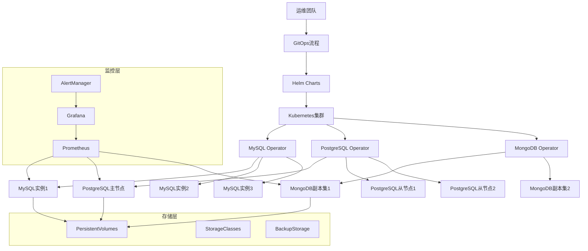

# Kubernetes数据库运维完整指南

## 🎯 概述

Kubernetes数据库运维是现代云原生数据库管理的核心技能，通过Operator模式、StatefulSet和自动化工具实现数据库的标准化、自动化运维。本指南提供从基础运维到高级管理的完整Kubernetes数据库运维解决方案。

## 📋 目录

1. [Kubernetes数据库运维基础](#1-kubernetes数据库运维基础)
2. [Operator模式实践](#2-operator模式实践)
3. [StatefulSet高级运维](#3-statefulset高级运维)
4. [自动化运维工具](#4-自动化运维工具)
5. [监控告警体系](#5-监控告警体系)
6. [备份恢复策略](#6-备份恢复策略)

---

## 1. Kubernetes数据库运维基础

### 1.1 数据库运维架构模式

#### Kubernetes数据库运维架构


#### 运维模式对比分析
```python
# Kubernetes数据库运维模式对比
class DatabaseOpsPatterns:
    def __init__(self):
        self.patterns = {
            'manual_deployment': {
                'description': '手工部署模式',
                'characteristics': {
                    'complexity': '高',
                    'automation_level': '低',
                    'maintenance_cost': '高',
                    'scaling_capability': '有限'
                },
                'use_cases': ['小型项目', '实验环境', '特殊定制需求']
            },
            
            'helm_charts': {
                'description': 'Helm Chart模式',
                'characteristics': {
                    'complexity': '中等',
                    'automation_level': '中等',
                    'maintenance_cost': '中等',
                    'scaling_capability': '良好'
                },
                'use_cases': ['标准数据库部署', '多环境部署', '版本管理']
            },
            
            'operator_pattern': {
                'description': 'Operator模式',
                'characteristics': {
                    'complexity': '较高',
                    'automation_level': '高',
                    'maintenance_cost': '较低',
                    'scaling_capability': '优秀'
                },
                'use_cases': ['生产环境', '自动化运维', '复杂集群管理']
            },
            
            'gitops_approach': {
                'description': 'GitOps模式',
                'characteristics': {
                    'complexity': '高',
                    'automation_level': '很高',
                    'maintenance_cost': '很低',
                    'scaling_capability': '极佳'
                },
                'use_cases': ['企业级部署', '多集群管理', '合规要求']
            }
        }
    
    def evaluate_ops_pattern(self, requirements):
        """评估适合的运维模式"""
        scores = {}
        
        for pattern_name, pattern_info in self.patterns.items():
            score = self._calculate_pattern_score(pattern_name, requirements)
            scores[pattern_name] = score
        
        best_pattern = max(scores, key=scores.get)
        return {
            'recommended': best_pattern,
            'score': scores[best_pattern],
            'details': self.patterns[best_pattern],
            'alternatives': sorted(scores.items(), key=lambda x: x[1], reverse=True)
        }
    
    def _calculate_pattern_score(self, pattern_name, requirements):
        """计算模式得分"""
        pattern = self.patterns[pattern_name]
        score = 0
        
        # 环境规模评分
        environment_scale = requirements.get('environment_scale', 'small')
        scale_mapping = {'small': 1, 'medium': 2, 'large': 3, 'enterprise': 4}
        
        if scale_mapping[environment_scale] <= 2 and pattern_name == 'manual_deployment':
            score += 30
        elif scale_mapping[environment_scale] <= 3 and pattern_name == 'helm_charts':
            score += 30
        elif scale_mapping[environment_scale] >= 3 and pattern_name == 'operator_pattern':
            score += 30
        elif scale_mapping[environment_scale] == 4 and pattern_name == 'gitops_approach':
            score += 30
        
        # 自动化要求评分
        automation_need = requirements.get('automation_need', 'low')
        automation_mapping = {'low': 1, 'medium': 2, 'high': 3, 'very_high': 4}
        
        if automation_mapping[automation_need] <= pattern['characteristics']['automation_level']:
            score += 25
        
        # 运维团队技能评分
        team_skill = requirements.get('team_skill_level', 'beginner')
        skill_mapping = {'beginner': 1, 'intermediate': 2, 'advanced': 3, 'expert': 4}
        
        pattern_complexity = pattern['characteristics']['complexity']
        complexity_mapping = {'低': 1, '中等': 2, '较高': 3, '高': 4}
        
        if skill_mapping[team_skill] >= complexity_mapping[pattern_complexity]:
            score += 20
        
        # 成本考虑评分
        budget_constraint = requirements.get('budget_constraint', 'medium')
        cost_mapping = {'low': 1, 'medium': 2, 'high': 3, 'very_high': 4}
        maintenance_cost = pattern['characteristics']['maintenance_cost']
        maintenance_mapping = {'低': 1, '中等': 2, '较高': 3, '高': 4}
        
        if cost_mapping[budget_constraint] >= maintenance_mapping[maintenance_cost]:
            score += 15
        
        # 合规要求评分
        compliance_need = requirements.get('compliance_need', False)
        if compliance_need and pattern_name in ['gitops_approach', 'operator_pattern']:
            score += 10
        elif not compliance_need:
            score += 5
        
        return score

# 使用示例
ops_patterns = DatabaseOpsPatterns()

requirements = {
    'environment_scale': 'large',
    'automation_need': 'high',
    'team_skill_level': 'advanced',
    'budget_constraint': 'high',
    'compliance_need': True
}

evaluation = ops_patterns.evaluate_ops_pattern(requirements)
print(f"推荐运维模式: {evaluation['recommended']}")
print(f"详细信息: {evaluation['details']}")
```

### 1.2 基础运维环境准备

#### Kubernetes环境配置
```yaml
# kubernetes-database-namespace.yaml
apiVersion: v1
kind: Namespace
metadata:
  name: database-ops
  labels:
    name: database-ops
    purpose: database-operations
---
# database-storageclass.yaml
apiVersion: storage.k8s.io/v1
kind: StorageClass
metadata:
  name: database-fast-ssd
  annotations:
    storageclass.kubernetes.io/is-default-class: "false"
provisioner: kubernetes.io/aws-ebs
parameters:
  type: gp3
  fsType: ext4
  iops: "3000"
  throughput: "125"
reclaimPolicy: Retain
allowVolumeExpansion: true
volumeBindingMode: WaitForFirstConsumer
mountOptions:
  - discard
---
# database-resource-quota.yaml
apiVersion: v1
kind: ResourceQuota
metadata:
  name: database-quota
  namespace: database-ops
spec:
  hard:
    requests.cpu: "20"
    requests.memory: 40Gi
    limits.cpu: "40"
    limits.memory: 80Gi
    persistentvolumeclaims: "50"
    requests.storage: 2Ti
---
# database-limit-range.yaml
apiVersion: v1
kind: LimitRange
metadata:
  name: database-limits
  namespace: database-ops
spec:
  limits:
  - default:
      cpu: "2"
      memory: 4Gi
    defaultRequest:
      cpu: "1"
      memory: 2Gi
    type: Container
  - max:
      storage: 500Gi
    min:
      storage: 10Gi
    type: PersistentVolumeClaim
```

## 2. Operator模式实践

### 2.1 MySQL Operator部署

#### MySQL Operator安装配置
```yaml
# mysql-operator-deployment.yaml
apiVersion: apps/v1
kind: Deployment
metadata:
  name: mysql-operator
  namespace: database-ops
spec:
  replicas: 1
  selector:
    matchLabels:
      app: mysql-operator
  template:
    metadata:
      labels:
        app: mysql-operator
    spec:
      serviceAccountName: mysql-operator
      containers:
      - name: mysql-operator
        image: mysql/mysql-operator:8.0.35-2.1.1
        imagePullPolicy: IfNotPresent
        env:
        - name: MYSQL_OPERATOR_NAMESPACE
          valueFrom:
            fieldRef:
              fieldPath: metadata.namespace
        - name: MYSQL_OPERATOR_WATCH_NAMESPACE
          value: ""
        - name: MYSQL_OPERATOR_SERVICE_ACCOUNT
          value: "mysql-operator"
        ports:
        - containerPort: 8080
          name: metrics
        livenessProbe:
          httpGet:
            path: /healthz
            port: 8080
          initialDelaySeconds: 15
          periodSeconds: 20
        readinessProbe:
          httpGet:
            path: /readyz
            port: 8080
          initialDelaySeconds: 5
          periodSeconds: 10
        resources:
          requests:
            cpu: "100m"
            memory: "128Mi"
          limits:
            cpu: "500m"
            memory: "512Mi"
---
# mysql-operator-serviceaccount.yaml
apiVersion: v1
kind: ServiceAccount
metadata:
  name: mysql-operator
  namespace: database-ops
---
# mysql-operator-rbac.yaml
apiVersion: rbac.authorization.k8s.io/v1
kind: Role
metadata:
  name: mysql-operator
  namespace: database-ops
rules:
- apiGroups:
  - apps
  resources:
  - deployments
  - statefulsets
  verbs:
  - get
  - list
  - watch
  - create
  - update
  - patch
  - delete
- apiGroups:
  - ""
  resources:
  - pods
  - services
  - configmaps
  - secrets
  - persistentvolumeclaims
  verbs:
  - get
  - list
  - watch
  - create
  - update
  - patch
  - delete
- apiGroups:
  - batch
  resources:
  - jobs
  verbs:
  - get
  - list
  - watch
  - create
  - update
  - patch
  - delete
---
apiVersion: rbac.authorization.k8s.io/v1
kind: RoleBinding
metadata:
  name: mysql-operator
  namespace: database-ops
roleRef:
  apiGroup: rbac.authorization.k8s.io
  kind: Role
  name: mysql-operator
subjects:
- kind: ServiceAccount
  name: mysql-operator
  namespace: database-ops
```

#### MySQL集群自定义资源定义
```yaml
# mysql-cluster-cr.yaml
apiVersion: mysql.oracle.com/v2
kind: InnoDBCluster
metadata:
  name: mysql-production-cluster
  namespace: database-ops
spec:
  secretName: mysql-root-password
  tlsUseSelfSigned: true
  instances: 3
  router:
    instances: 1
  datadirVolumeClaimTemplate:
    accessModes:
      - ReadWriteOnce
    storageClassName: database-fast-ssd
    resources:
      requests:
        storage: 200Gi
  podSpec:
    terminationGracePeriodSeconds: 600
    containers:
    - name: mysql
      resources:
        requests:
          memory: "2Gi"
          cpu: "1"
        limits:
          memory: "4Gi"
          cpu: "2"
    affinity:
      podAntiAffinity:
        preferredDuringSchedulingIgnoredDuringExecution:
        - weight: 100
          podAffinityTerm:
            labelSelector:
              matchExpressions:
              - key: app.kubernetes.io/name
                operator: In
                values:
                - mysql-innodbcluster
            topologyKey: kubernetes.io/hostname
  service:
    type: ClusterIP
```

### 2.2 PostgreSQL Operator实践

#### PostgreSQL Operator部署
```yaml
# postgresql-operator-deployment.yaml
apiVersion: apps/v1
kind: Deployment
metadata:
  name: postgres-operator
  namespace: database-ops
spec:
  replicas: 1
  selector:
    matchLabels:
      app: postgres-operator
  template:
    metadata:
      labels:
        app: postgres-operator
    spec:
      serviceAccountName: postgres-operator
      containers:
      - name: postgres-operator
        image: registry.opensource.zalan.do/acid/postgres-operator:v1.8.2
        imagePullPolicy: IfNotPresent
        env:
        - name: POD_NAME
          valueFrom:
            fieldRef:
              fieldPath: metadata.name
        - name: POD_NAMESPACE
          valueFrom:
            fieldRef:
              fieldPath: metadata.namespace
        - name: CONFIG_MAP_NAME
          value: postgres-operator
        ports:
        - containerPort: 8080
          name: metrics
        livenessProbe:
          httpGet:
            path: /healthz
            port: 8080
          initialDelaySeconds: 30
          periodSeconds: 10
        readinessProbe:
          httpGet:
            path: /readyz
            port: 8080
          initialDelaySeconds: 10
          periodSeconds: 5
        resources:
          requests:
            cpu: "100m"
            memory: "256Mi"
          limits:
            cpu: "500m"
            memory: "512Mi"
---
# postgresql-operator-config.yaml
apiVersion: v1
kind: ConfigMap
metadata:
  name: postgres-operator
  namespace: database-ops
data:
  # Operator配置
  docker_image: registry.opensource.zalan.do/acid/spilo-14:2.1-p7
  enable_master_load_balancer: "false"
  enable_replica_load_balancer: "false"
  enable_replica_connection_pooler: "true"
  
  # 资源配置
  resources:
    requests:
      cpu: "100m"
      memory: "256Mi"
    limits:
      cpu: "1"
      memory: "512Mi"
  
  # 存储配置
  storage_resize_mode: "pvc"
  enable_shm_volume: "true"
  enable_lazy_spilo_upgrade: "false"
  
  # 备份配置
  enable_logical_backup: "true"
  logical_backup_schedule: "0 2 * * *"
  logical_backup_docker_image: "registry.opensource.zalan.do/acid/logical-backup:v1.8.2"
```

#### PostgreSQL集群定义
```yaml
# postgresql-cluster-cr.yaml
apiVersion: acid.zalan.do/v1
kind: postgresql
metadata:
  name: postgres-production-cluster
  namespace: database-ops
spec:
  teamId: "production"
  volume:
    size: 200Gi
    storageClass: database-fast-ssd
  numberOfInstances: 3
  users:
    appuser:
    - superuser
    - createdb
  databases:
    myapp: appuser
  postgresql:
    version: "14"
  resources:
    requests:
      cpu: "1"
      memory: "2Gi"
    limits:
      cpu: "2"
      memory: "4Gi"
  patroni:
    initdb:
      encoding: "UTF8"
      locale: "en_US.UTF-8"
      data-checksums: "true"
    pg_hba:
    - hostssl all all 0.0.0.0/0 md5
    - host    all all 0.0.0.0/0 md5
  tls:
    secretName: postgres-tls-secret
  clone:
    cluster: "postgres-source-cluster"
    timestamp: "2024-01-01T00:00:00+00:00"
    s3_wal_path: "s3://postgres-backups/wal/"
  standby:
    s3_wal_path: "s3://postgres-backups/wal/"
```

## 3. StatefulSet高级运维

### 3.1 StatefulSet运维最佳实践

#### 高级StatefulSet配置模板
```yaml
# advanced-statefulset-template.yaml
apiVersion: apps/v1
kind: StatefulSet
metadata:
  name: database-cluster
  namespace: database-ops
spec:
  serviceName: database-cluster
  replicas: 3
  selector:
    matchLabels:
      app: database-cluster
  template:
    metadata:
      labels:
        app: database-cluster
        version: v1.0.0
    spec:
      # 初始化容器
      initContainers:
      - name: init-permissions
        image: busybox:1.35
        command:
        - sh
        - -c
        - |
          echo "Setting up permissions..."
          chown -R 1001:1001 /bitnami/mysql
          chmod 755 /bitnami/mysql
        volumeMounts:
        - name: data
          mountPath: /bitnami/mysql
        securityContext:
          runAsUser: 0
      
      - name: init-config
        image: mysql:8.0.35
        command:
        - sh
        - -c
        - |
          echo "Initializing configuration..."
          # 配置验证和初始化逻辑
        envFrom:
        - secretRef:
            name: database-secret
        volumeMounts:
        - name: config
          mountPath: /etc/mysql/conf.d
      
      # 主容器
      containers:
      - name: database
        image: mysql:8.0.35
        ports:
        - containerPort: 3306
          name: mysql
        env:
        - name: MYSQL_ROOT_PASSWORD
          valueFrom:
            secretKeyRef:
              name: database-secret
              key: root-password
        - name: MYSQL_DATABASE
          value: "production_db"
        - name: MYSQL_USER
          value: "appuser"
        - name: MYSQL_PASSWORD
          valueFrom:
            secretKeyRef:
              name: database-secret
              key: user-password
        volumeMounts:
        - name: data
          mountPath: /var/lib/mysql
        - name: config
          mountPath: /etc/mysql/conf.d
        - name: logs
          mountPath: /var/log/mysql
        resources:
          requests:
            cpu: "1"
            memory: "2Gi"
          limits:
            cpu: "2"
            memory: "4Gi"
        
        # 健康检查
        livenessProbe:
          exec:
            command:
            - mysqladmin
            - ping
            - -h
            - localhost
            - -u
            - root
            - -p$(MYSQL_ROOT_PASSWORD)
          initialDelaySeconds: 300
          periodSeconds: 10
          timeoutSeconds: 5
          failureThreshold: 3
        
        readinessProbe:
          exec:
            command:
            - mysql
            - -h
            - localhost
            - -u
            - root
            - -p$(MYSQL_ROOT_PASSWORD)
            - -e
            - SELECT 1
          initialDelaySeconds: 60
          periodSeconds: 5
          timeoutSeconds: 3
          failureThreshold: 3
        
        startupProbe:
          exec:
            command:
            - mysql
            - -h
            - localhost
            - -u
            - root
            - -p$(MYSQL_ROOT_PASSWORD)
            - -e
            - SELECT 1
          initialDelaySeconds: 30
          periodSeconds: 10
          timeoutSeconds: 5
          failureThreshold: 30
        
        # 安全上下文
        securityContext:
          runAsUser: 1001
          runAsGroup: 1001
          fsGroup: 1001
          allowPrivilegeEscalation: false
          readOnlyRootFilesystem: false
      
      # 卷配置
      volumes:
      - name: config
        configMap:
          name: database-config
      - name: logs
        emptyDir: {}
      
      # 节点亲和性
      affinity:
        nodeAffinity:
          requiredDuringSchedulingIgnoredDuringExecution:
            nodeSelectorTerms:
            - matchExpressions:
              - key: database-node
                operator: In
                values:
                - "true"
        podAntiAffinity:
          requiredDuringSchedulingIgnoredDuringExecution:
          - labelSelector:
              matchExpressions:
              - key: app
                operator: In
                values:
                - database-cluster
            topologyKey: kubernetes.io/hostname
      
      # 容忍度
      tolerations:
      - key: "dedicated"
        operator: "Equal"
        value: "database"
        effect: "NoSchedule"
      
      # 优先级类
      priorityClassName: database-priority
      
      # 服务账户
      serviceAccountName: database-sa
  
  # 持久化卷声明模板
  volumeClaimTemplates:
  - metadata:
      name: data
      annotations:
        volume.beta.kubernetes.io/storage-class: database-fast-ssd
    spec:
      accessModes: ["ReadWriteOnce"]
      storageClassName: database-fast-ssd
      resources:
        requests:
          storage: 200Gi
```

### 3.2 滚动更新策略

#### 数据库滚动更新配置
```yaml
# rolling-update-strategy.yaml
apiVersion: apps/v1
kind: StatefulSet
metadata:
  name: mysql-rolling-update
  namespace: database-ops
spec:
  # 更新策略
  updateStrategy:
    type: RollingUpdate
    rollingUpdate:
      partition: 0  # 从序号0开始更新
  
  # Pod管理策略
  podManagementPolicy: OrderedReady
  
  template:
    spec:
      # 优雅终止配置
      terminationGracePeriodSeconds: 300
      
      containers:
      - name: mysql
        image: mysql:8.0.35
        lifecycle:
          preStop:
            exec:
              command:
              - sh
              - -c
              - |
                echo "Preparing for graceful shutdown..."
                mysqladmin -u root -p$MYSQL_ROOT_PASSWORD shutdown
          
          postStart:
            exec:
              command:
              - sh
              - -c
              - |
                echo "Post-start initialization..."
                # 数据库初始化逻辑
        
        # 启动探针确保服务完全就绪
        startupProbe:
          exec:
            command:
            - mysql
            - -h
            - localhost
            - -u
            - root
            - -p$(MYSQL_ROOT_PASSWORD)
            - -e
            - "SELECT 1"
          initialDelaySeconds: 60
          periodSeconds: 10
          timeoutSeconds: 5
          failureThreshold: 30
        
        # 就绪探针确保流量切换安全
        readinessProbe:
          exec:
            command:
            - mysql
            - -h
            - localhost
            - -u
            - root
            - -p$(MYSQL_ROOT_PASSWORD)
            - -e
            - "SELECT 1"
          initialDelaySeconds: 30
          periodSeconds: 5
          timeoutSeconds: 3
          failureThreshold: 3

# 滚动更新脚本
#!/bin/bash
# rolling-update.sh

NAMESPACE="database-ops"
STATEFULSET="mysql-rolling-update"

# 检查当前状态
check_status() {
    echo "检查StatefulSet状态..."
    kubectl get statefulset $STATEFULSET -n $NAMESPACE
    kubectl get pods -l app=mysql-rolling-update -n $NAMESPACE
}

# 执行滚动更新
perform_rolling_update() {
    local new_image=$1
    local partition=${2:-0}
    
    echo "开始滚动更新到镜像: $new_image"
    echo "更新分区: $partition"
    
    # 更新镜像
    kubectl patch statefulset $STATEFULSET -n $NAMESPACE -p \
        "{\"spec\":{\"template\":{\"spec\":{\"containers\":[{\"name\":\"mysql\",\"image\":\"$new_image\"}]}}}}"
    
    # 按序号逐个更新
    local replicas=$(kubectl get statefulset $STATEFULSET -n $NAMESPACE -o jsonpath='{.spec.replicas}')
    
    for ((i=partition; i<replicas; i++)); do
        echo "更新Pod: $STATEFULSET-$i"
        
        # 设置分区
        kubectl patch statefulset $STATEFULSET -n $NAMESPACE -p \
            "{\"spec\":{\"updateStrategy\":{\"rollingUpdate\":{\"partition\":$i}}}}"
        
        # 等待Pod更新完成
        kubectl rollout status statefulset/$STATEFULSET -n $NAMESPACE --timeout=300s
        
        # 验证Pod健康
        if ! kubectl wait --for=condition=ready pod/$STATEFULSET-$i -n $NAMESPACE --timeout=120s; then
            echo "警告: Pod $STATEFULSET-$i 健康检查失败"
            # 可以选择回滚或继续
        fi
        
        echo "Pod $STATEFULSET-$i 更新完成"
        sleep 30  # 等待稳定
    done
    
    # 重置分区为0
    kubectl patch statefulset $STATEFULSET -n $NAMESPACE -p \
        "{\"spec\":{\"updateStrategy\":{\"rollingUpdate\":{\"partition\":0}}}}"
}

# 回滚操作
rollback_update() {
    echo "执行回滚操作..."
    kubectl rollout undo statefulset/$STATEFULSET -n $NAMESPACE
    kubectl rollout status statefulset/$STATEFULSET -n $NAMESPACE --timeout=300s
}

# 使用示例
# check_status
# perform_rolling_update "mysql:8.0.36" 0
# rollback_update
```

## 4. 自动化运维工具

### 4.1 数据库运维自动化脚本

#### 数据库集群管理工具
```python
#!/usr/bin/env python3
# database_cluster_manager.py

import argparse
import yaml
import json
import subprocess
import time
from datetime import datetime
from typing import Dict, List, Any

class DatabaseClusterManager:
    def __init__(self, kubeconfig: str = None):
        self.kubeconfig = kubeconfig
        self.context = self._get_current_context()
    
    def _get_current_context(self) -> str:
        """获取当前Kubernetes上下文"""
        try:
            result = subprocess.run(
                ['kubectl', 'config', 'current-context'],
                capture_output=True, text=True, check=True
            )
            return result.stdout.strip()
        except subprocess.CalledProcessError:
            return "unknown"
    
    def deploy_database_cluster(self, cluster_config: Dict[str, Any]) -> bool:
        """部署数据库集群"""
        cluster_type = cluster_config['type']
        namespace = cluster_config.get('namespace', 'database-ops')
        
        print(f"开始部署{cluster_type}集群到命名空间{namespace}")
        
        try:
            # 创建命名空间
            self._create_namespace(namespace)
            
            # 部署Operator
            if cluster_config.get('use_operator', True):
                self._deploy_operator(cluster_type, namespace)
            
            # 部署集群
            self._deploy_cluster(cluster_config)
            
            # 等待集群就绪
            self._wait_for_cluster_ready(cluster_config)
            
            print(f"{cluster_type}集群部署成功")
            return True
            
        except Exception as e:
            print(f"集群部署失败: {str(e)}")
            return False
    
    def _create_namespace(self, namespace: str):
        """创建命名空间"""
        cmd = ['kubectl', 'create', 'namespace', namespace, '--dry-run=client', '-o', 'yaml']
        result = subprocess.run(cmd, capture_output=True, text=True)
        
        if result.returncode == 0:
            subprocess.run(['kubectl', 'apply', '-f', '-'], input=result.stdout, text=True, check=True)
            print(f"命名空间 {namespace} 创建完成")
    
    def _deploy_operator(self, cluster_type: str, namespace: str):
        """部署对应类型的Operator"""
        operator_manifests = {
            'mysql': 'https://raw.githubusercontent.com/mysql/mysql-operator/trunk/deploy/deployment.yaml',
            'postgresql': 'https://github.com/zalando/postgres-operator/raw/master/manifests/postgres-operator.yaml',
            'mongodb': 'https://github.com/mongodb/mongodb-kubernetes-operator/raw/master/config/manager/manager.yaml'
        }
        
        if cluster_type.lower() in operator_manifests:
            manifest_url = operator_manifests[cluster_type.lower()]
            cmd = ['kubectl', 'apply', '-f', manifest_url, '-n', namespace]
            subprocess.run(cmd, check=True)
            print(f"{cluster_type} Operator部署完成")
            
            # 等待Operator就绪
            self._wait_for_operator_ready(cluster_type, namespace)
    
    def _deploy_cluster(self, cluster_config: Dict[str, Any]):
        """部署数据库集群"""
        cluster_type = cluster_config['type']
        cluster_name = cluster_config['name']
        namespace = cluster_config.get('namespace', 'database-ops')
        
        # 生成集群配置
        cluster_manifest = self._generate_cluster_manifest(cluster_config)
        
        # 应用配置
        cmd = ['kubectl', 'apply', '-f', '-', '-n', namespace]
        subprocess.run(cmd, input=yaml.dump(cluster_manifest), text=True, check=True)
        print(f"{cluster_type}集群 {cluster_name} 配置应用完成")
    
    def _generate_cluster_manifest(self, config: Dict[str, Any]) -> Dict[str, Any]:
        """生成集群配置清单"""
        cluster_type = config['type'].lower()
        
        if cluster_type == 'mysql':
            return self._generate_mysql_manifest(config)
        elif cluster_type == 'postgresql':
            return self._generate_postgresql_manifest(config)
        elif cluster_type == 'mongodb':
            return self._generate_mongodb_manifest(config)
        else:
            raise ValueError(f"不支持的集群类型: {cluster_type}")
    
    def _generate_mysql_manifest(self, config: Dict[str, Any]) -> Dict[str, Any]:
        """生成MySQL集群配置"""
        return {
            'apiVersion': 'mysql.oracle.com/v2',
            'kind': 'InnoDBCluster',
            'metadata': {
                'name': config['name'],
                'namespace': config.get('namespace', 'database-ops')
            },
            'spec': {
                'secretName': config.get('secret_name', 'mysql-secret'),
                'instances': config.get('replicas', 3),
                'tlsUseSelfSigned': True,
                'datadirVolumeClaimTemplate': {
                    'accessModes': ['ReadWriteOnce'],
                    'storageClassName': config.get('storage_class', 'database-fast-ssd'),
                    'resources': {
                        'requests': {
                            'storage': config.get('storage_size', '100Gi')
                        }
                    }
                }
            }
        }
    
    def _generate_postgresql_manifest(self, config: Dict[str, Any]) -> Dict[str, Any]:
        """生成PostgreSQL集群配置"""
        return {
            'apiVersion': 'acid.zalan.do/v1',
            'kind': 'postgresql',
            'metadata': {
                'name': config['name'],
                'namespace': config.get('namespace', 'database-ops')
            },
            'spec': {
                'teamId': config.get('team_id', 'production'),
                'volume': {
                    'size': config.get('storage_size', '100Gi'),
                    'storageClass': config.get('storage_class', 'database-fast-ssd')
                },
                'numberOfInstances': config.get('replicas', 3),
                'users': {
                    config.get('username', 'appuser'): ['superuser', 'createdb']
                },
                'databases': {
                    config.get('database_name', 'myapp'): config.get('username', 'appuser')
                },
                'postgresql': {
                    'version': config.get('version', '14')
                }
            }
        }
    
    def _generate_mongodb_manifest(self, config: Dict[str, Any]) -> Dict[str, Any]:
        """生成MongoDB集群配置"""
        return {
            'apiVersion': 'mongodbcommunity.mongodb.com/v1',
            'kind': 'MongoDBCommunity',
            'metadata': {
                'name': config['name'],
                'namespace': config.get('namespace', 'database-ops')
            },
            'spec': {
                'members': config.get('replicas', 3),
                'type': 'ReplicaSet',
                'version': config.get('version', '6.0.5'),
                'security': {
                    'authentication': {
                        'modes': ['SCRAM']
                    }
                },
                'users': [{
                    'name': config.get('username', 'appuser'),
                    'db': 'admin',
                    'passwordSecretRef': {
                        'name': config.get('secret_name', 'mongodb-secret')
                    },
                    'roles': [{
                        'name': 'clusterAdmin',
                        'db': 'admin'
                    }]
                }],
                'statefulSet': {
                    'spec': {
                        'volumeClaimTemplates': [{
                            'metadata': {
                                'name': 'data-volume'
                            },
                            'spec': {
                                'accessModes': ['ReadWriteOnce'],
                                'storageClassName': config.get('storage_class', 'database-fast-ssd'),
                                'resources': {
                                    'requests': {
                                        'storage': config.get('storage_size', '100Gi')
                                    }
                                }
                            }
                        }]
                    }
                }
            }
        }
    
    def _wait_for_operator_ready(self, cluster_type: str, namespace: str, timeout: int = 300):
        """等待Operator就绪"""
        print(f"等待{cluster_type} Operator就绪...")
        
        deployments = {
            'mysql': 'mysql-operator',
            'postgresql': 'postgres-operator',
            'mongodb': 'mongodb-kubernetes-operator'
        }
        
        deployment_name = deployments.get(cluster_type.lower())
        if not deployment_name:
            return
        
        cmd = [
            'kubectl', 'wait', '--for=condition=available',
            f'deployment/{deployment_name}', '-n', namespace,
            f'--timeout={timeout}s'
        ]
        
        subprocess.run(cmd, check=True)
        print(f"{cluster_type} Operator已就绪")
    
    def _wait_for_cluster_ready(self, cluster_config: Dict[str, Any], timeout: int = 600):
        """等待集群就绪"""
        cluster_type = cluster_config['type'].lower()
        cluster_name = cluster_config['name']
        namespace = cluster_config.get('namespace', 'database-ops')
        
        print(f"等待{cluster_type}集群 {cluster_name} 就绪...")
        
        # 根据不同类型等待就绪
        if cluster_type == 'mysql':
            self._wait_for_mysql_cluster_ready(cluster_name, namespace, timeout)
        elif cluster_type == 'postgresql':
            self._wait_for_postgresql_cluster_ready(cluster_name, namespace, timeout)
        elif cluster_type == 'mongodb':
            self._wait_for_mongodb_cluster_ready(cluster_name, namespace, timeout)
    
    def _wait_for_mysql_cluster_ready(self, cluster_name: str, namespace: str, timeout: int):
        """等待MySQL集群就绪"""
        cmd = [
            'kubectl', 'wait', '--for=condition=Ready',
            f'innodbcluster/{cluster_name}', '-n', namespace,
            f'--timeout={timeout}s'
        ]
        subprocess.run(cmd, check=True)
    
    def _wait_for_postgresql_cluster_ready(self, cluster_name: str, namespace: str, timeout: int):
        """等待PostgreSQL集群就绪"""
        # PostgreSQL Operator使用不同的就绪条件
        start_time = time.time()
        while time.time() - start_time < timeout:
            cmd = ['kubectl', 'get', 'postgresql', cluster_name, '-n', namespace, '-o', 'jsonpath={.status.PostgresClusterStatus}']
            result = subprocess.run(cmd, capture_output=True, text=True)
            if result.returncode == 0 and result.stdout.strip() == 'Running':
                return
            time.sleep(10)
        raise TimeoutError("PostgreSQL集群启动超时")
    
    def _wait_for_mongodb_cluster_ready(self, cluster_name: str, namespace: str, timeout: int):
        """等待MongoDB集群就绪"""
        cmd = [
            'kubectl', 'wait', '--for=condition=Ready',
            f'mongodbcommunity/{cluster_name}', '-n', namespace,
            f'--timeout={timeout}s'
        ]
        subprocess.run(cmd, check=True)
    
    def backup_database(self, cluster_config: Dict[str, Any], backup_config: Dict[str, Any]) -> bool:
        """执行数据库备份"""
        try:
            cluster_type = cluster_config['type'].lower()
            cluster_name = cluster_config['name']
            namespace = cluster_config.get('namespace', 'database-ops')
            
            print(f"开始{cluster_type}集群 {cluster_name} 备份...")
            
            if cluster_type == 'mysql':
                return self._backup_mysql_cluster(cluster_name, namespace, backup_config)
            elif cluster_type == 'postgresql':
                return self._backup_postgresql_cluster(cluster_name, namespace, backup_config)
            elif cluster_type == 'mongodb':
                return self._backup_mongodb_cluster(cluster_name, namespace, backup_config)
            
        except Exception as e:
            print(f"备份失败: {str(e)}")
            return False
    
    def _backup_mysql_cluster(self, cluster_name: str, namespace: str, backup_config: Dict[str, Any]) -> bool:
        """MySQL集群备份"""
        # 使用mysqldump进行逻辑备份
        backup_name = backup_config.get('name', f'mysql-backup-{int(time.time())}')
        storage_path = backup_config.get('storage_path', '/backups')
        
        # 创建备份Job
        backup_job = {
            'apiVersion': 'batch/v1',
            'kind': 'Job',
            'metadata': {
                'name': f'{cluster_name}-backup-{int(time.time())}',
                'namespace': namespace
            },
            'spec': {
                'template': {
                    'spec': {
                        'containers': [{
                            'name': 'mysql-backup',
                            'image': 'mysql:8.0.35',
                            'command': [
                                'sh', '-c',
                                f'mysqldump -h {cluster_name}-0.{cluster_name}-instances -u root -p$MYSQL_ROOT_PASSWORD --all-databases > {storage_path}/{backup_name}.sql'
                            ],
                            'env': [{
                                'name': 'MYSQL_ROOT_PASSWORD',
                                'valueFrom': {
                                    'secretKeyRef': {
                                        'name': 'mysql-secret',
                                        'key': 'root-password'
                                    }
                                }
                            }]
                        }],
                        'restartPolicy': 'Never'
                    }
                }
            }
        }
        
        cmd = ['kubectl', 'apply', '-f', '-', '-n', namespace]
        subprocess.run(cmd, input=yaml.dump(backup_job), text=True, check=True)
        return True
    
    def get_cluster_status(self, cluster_config: Dict[str, Any]) -> Dict[str, Any]:
        """获取集群状态"""
        cluster_type = cluster_config['type'].lower()
        cluster_name = cluster_config['name']
        namespace = cluster_config.get('namespace', 'database-ops')
        
        status = {
            'cluster_name': cluster_name,
            'type': cluster_type,
            'namespace': namespace,
            'timestamp': datetime.now().isoformat()
        }
        
        try:
            if cluster_type == 'mysql':
                status.update(self._get_mysql_cluster_status(cluster_name, namespace))
            elif cluster_type == 'postgresql':
                status.update(self._get_postgresql_cluster_status(cluster_name, namespace))
            elif cluster_type == 'mongodb':
                status.update(self._get_mongodb_cluster_status(cluster_name, namespace))
        except Exception as e:
            status['error'] = str(e)
        
        return status
    
    def _get_mysql_cluster_status(self, cluster_name: str, namespace: str) -> Dict[str, Any]:
        """获取MySQL集群状态"""
        cmd = ['kubectl', 'get', 'innodbcluster', cluster_name, '-n', namespace, '-o', 'json']
        result = subprocess.run(cmd, capture_output=True, text=True, check=True)
        cluster_info = json.loads(result.stdout)
        
        return {
            'status': cluster_info.get('status', {}),
            'instances': cluster_info.get('spec', {}).get('instances', 0),
            'ready_instances': len([s for s in cluster_info.get('status', {}).get('instances', []) 
                                  if s.get('status') == 'Online'])
        }

def main():
    parser = argparse.ArgumentParser(description='数据库集群管理工具')
    parser.add_argument('action', choices=['deploy', 'backup', 'status'], help='操作类型')
    parser.add_argument('--config', required=True, help='集群配置文件路径')
    parser.add_argument('--backup-config', help='备份配置文件路径')
    
    args = parser.parse_args()
    
    # 读取配置文件
    with open(args.config, 'r') as f:
        cluster_config = yaml.safe_load(f)
    
    manager = DatabaseClusterManager()
    
    if args.action == 'deploy':
        success = manager.deploy_database_cluster(cluster_config)
        exit(0 if success else 1)
    
    elif args.action == 'backup':
        if not args.backup_config:
            print("错误: 备份操作需要指定--backup-config参数")
            exit(1)
        
        with open(args.backup_config, 'r') as f:
            backup_config = yaml.safe_load(f)
        
        success = manager.backup_database(cluster_config, backup_config)
        exit(0 if success else 1)
    
    elif args.action == 'status':
        status = manager.get_cluster_status(cluster_config)
        print(json.dumps(status, indent=2, ensure_ascii=False))

if __name__ == '__main__':
    main()
```

### 4.2 监控集成工具

#### 数据库监控配置管理器
```python
# monitoring_config_manager.py
import json
import yaml
from typing import Dict, List, Any
import subprocess

class MonitoringConfigManager:
    def __init__(self, namespace: str = "monitoring"):
        self.namespace = namespace
    
    def setup_database_monitoring(self, database_configs: List[Dict[str, Any]]) -> bool:
        """为数据库设置监控"""
        try:
            # 部署ServiceMonitor
            for db_config in database_configs:
                self._create_servicemonitor(db_config)
            
            # 部署Grafana仪表板
            self._deploy_grafana_dashboards(database_configs)
            
            # 配置告警规则
            self._configure_alerting_rules(database_configs)
            
            return True
        except Exception as e:
            print(f"监控设置失败: {str(e)}")
            return False
    
    def _create_servicemonitor(self, db_config: Dict[str, Any]):
        """创建ServiceMonitor"""
        servicemonitor = {
            'apiVersion': 'monitoring.coreos.com/v1',
            'kind': 'ServiceMonitor',
            'metadata': {
                'name': f"{db_config['name']}-monitor",
                'namespace': self.namespace,
                'labels': {
                    'app': db_config['name'],
                    'release': 'prometheus'
                }
            },
            'spec': {
                'selector': {
                    'matchLabels': {
                        'app': db_config['name']
                    }
                },
                'endpoints': [{
                    'port': 'metrics',
                    'interval': '30s',
                    'path': '/metrics'
                }],
                'namespaceSelector': {
                    'matchNames': [db_config.get('namespace', 'database-ops')]
                }
            }
        }
        
        cmd = ['kubectl', 'apply', '-f', '-', '-n', self.namespace]
        subprocess.run(cmd, input=yaml.dump(servicemonitor), text=True, check=True)
    
    def _deploy_grafana_dashboards(self, database_configs: List[Dict[str, Any]]):
        """部署Grafana仪表板"""
        for db_config in database_configs:
            dashboard = self._generate_dashboard_config(db_config)
            self._apply_dashboard(dashboard)
    
    def _generate_dashboard_config(self, db_config: Dict[str, Any]) -> Dict[str, Any]:
        """生成仪表板配置"""
        db_type = db_config['type'].lower()
        
        if db_type == 'mysql':
            return self._mysql_dashboard_template(db_config)
        elif db_type == 'postgresql':
            return self._postgresql_dashboard_template(db_config)
        elif db_type == 'mongodb':
            return self._mongodb_dashboard_template(db_config)
    
    def _mysql_dashboard_template(self, db_config: Dict[str, Any]) -> Dict[str, Any]:
        """MySQL仪表板模板"""
        return {
            'apiVersion': 'v1',
            'kind': 'ConfigMap',
            'metadata': {
                'name': f"grafana-dashboard-{db_config['name']}",
                'namespace': self.namespace,
                'labels': {
                    'grafana_dashboard': '1'
                }
            },
            'data': {
                f"{db_config['name']}-dashboard.json": json.dumps({
                    "dashboard": {
                        "title": f"MySQL {db_config['name']} 监控",
                        "panels": [
                            {
                                "title": "连接数",
                                "type": "graph",
                                "targets": [{
                                    "expr": f"mysql_global_status_threads_connected{{instance=\"{db_config['name']}-0\"}}",
                                    "legendFormat": "连接数"
                                }]
                            },
                            {
                                "title": "查询QPS",
                                "type": "graph",
                                "targets": [{
                                    "expr": f"rate(mysql_global_status_questions{{instance=\"{db_config['name']}-0\"}}[5m])",
                                    "legendFormat": "QPS"
                                }]
                            }
                        ]
                    }
                })
            }
        }
    
    def _apply_dashboard(self, dashboard_config: Dict[str, Any]):
        """应用仪表板配置"""
        cmd = ['kubectl', 'apply', '-f', '-', '-n', self.namespace]
        subprocess.run(cmd, input=yaml.dump(dashboard_config), text=True, check=True)

# 使用示例
if __name__ == "__main__":
    manager = MonitoringConfigManager()
    
    databases = [
        {
            'name': 'mysql-production',
            'type': 'mysql',
            'namespace': 'database-ops'
        },
        {
            'name': 'postgres-analytics',
            'type': 'postgresql',
            'namespace': 'database-ops'
        }
    ]
    
    manager.setup_database_monitoring(databases)
```

## 5. 监控告警体系

### 5.1 Prometheus监控配置

#### 数据库监控指标配置
```yaml
# database-prometheus-rules.yaml
apiVersion: monitoring.coreos.com/v1
kind: PrometheusRule
metadata:
  name: database-rules
  namespace: monitoring
  labels:
    app: prometheus
    release: prometheus
spec:
  groups:
  - name: mysql.rules
    rules:
    # 连接数告警
    - alert: MySQLHighConnections
      expr: mysql_global_status_threads_connected > 1000
      for: 5m
      labels:
        severity: warning
        database: mysql
      annotations:
        summary: "MySQL连接数过高"
        description: "MySQL实例 {{ $labels.instance }} 连接数达到 {{ $value }}"
    
    # 慢查询告警
    - alert: MySQLSlowQueries
      expr: rate(mysql_global_status_slow_queries[5m]) > 10
      for: 2m
      labels:
        severity: warning
        database: mysql
      annotations:
        summary: "MySQL慢查询增多"
        description: "MySQL实例 {{ $labels.instance }} 慢查询率 {{ $value }}/s"
    
    # 主从延迟告警
    - alert: MySQLReplicationLag
      expr: mysql_slave_status_seconds_behind_master > 30
      for: 3m
      labels:
        severity: critical
        database: mysql
      annotations:
        summary: "MySQL主从延迟严重"
        description: "MySQL从库 {{ $labels.instance }} 延迟 {{ $value }} 秒"
  
  - name: postgresql.rules
    rules:
    # 连接数告警
    - alert: PostgreSQLHighConnections
      expr: pg_stat_activity_count > 200
      for: 5m
      labels:
        severity: warning
        database: postgresql
      annotations:
        summary: "PostgreSQL连接数过高"
        description: "PostgreSQL实例 {{ $labels.instance }} 连接数达到 {{ $value }}"
    
    # 死锁告警
    - alert: PostgreSQLDeadlocks
      expr: rate(pg_stat_database_deadlocks[5m]) > 1
      for: 2m
      labels:
        severity: critical
        database: postgresql
      annotations:
        summary: "PostgreSQL出现死锁"
        description: "PostgreSQL实例 {{ $labels.instance }} 死锁率 {{ $value }}/s"
    
    # 复制延迟告警
    - alert: PostgreSQLReplicationLag
      expr: pg_replication_lag > 30
      for: 3m
      labels:
        severity: critical
        database: postgresql
      annotations:
        summary: "PostgreSQL复制延迟"
        description: "PostgreSQL从库 {{ $labels.instance }} 延迟 {{ $value }} 秒"
  
  - name: mongodb.rules
    rules:
    # 连接数告警
    - alert: MongoDBHighConnections
      expr: mongodb_connections_current > 10000
      for: 5m
      labels:
        severity: warning
        database: mongodb
      annotations:
        summary: "MongoDB连接数过高"
        description: "MongoDB实例 {{ $labels.instance }} 连接数达到 {{ $value }}"
    
    # 主从状态告警
    - alert: MongoDBReplicaSetNotHealthy
      expr: mongodb_replset_member_state != 1
      for: 3m
      labels:
        severity: critical
        database: mongodb
      annotations:
        summary: "MongoDB副本集不健康"
        description: "MongoDB副本集成员 {{ $labels.instance }} 状态异常"
```

### 5.2 告警通知配置

#### AlertManager配置
```yaml
# alertmanager-config.yaml
apiVersion: v1
kind: Secret
metadata:
  name: alertmanager-config
  namespace: monitoring
type: Opaque
data:
  alertmanager.yml: |-
    global:
      resolve_timeout: 5m
      smtp_smarthost: 'smtp.company.com:587'
      smtp_from: 'alert@company.com'
      smtp_auth_username: 'alert@company.com'
      smtp_auth_password: "${DB_PASSWORD}"
    
    route:
      group_by: ['alertname', 'database']
      group_wait: 30s
      group_interval: 5m
      repeat_interval: 3h
      receiver: 'default-receiver'
      
      routes:
      - match:
          severity: 'critical'
        receiver: 'critical-team'
        group_wait: 10s
        repeat_interval: 1h
      
      - match:
          severity: 'warning'
        receiver: 'ops-team'
        group_wait: 1m
        repeat_interval: 2h
    
    receivers:
    - name: 'default-receiver'
      email_configs:
      - to: 'database-ops@company.com'
        send_resolved: true
    
    - name: 'critical-team'
      email_configs:
      - to: 'critical-database@company.com'
        send_resolved: true
      webhook_configs:
      - url: 'https://pagerduty.company.com/alert'
        send_resolved: true
    
    - name: 'ops-team'
      email_configs:
      - to: '${OPS_EMAIL}'
        send_resolved: true
      slack_configs:
      - api_url: '${SLACK_WEBHOOK_URL}'
        channel: '#database-alerts'
        send_resolved: true
        title: '{{ template "slack.title" . }}'
        text: '{{ template "slack.text" . }}'
```

## 6. 备份恢复策略

### 6.1 自动化备份方案

#### 数据库备份控制器
```python
# database_backup_controller.py
import time
import subprocess
from datetime import datetime, timedelta
from typing import Dict, List, Any
import yaml
import json

class DatabaseBackupController:
    def __init__(self, namespace: str = "database-ops"):
        self.namespace = namespace
        self.backup_jobs = {}
    
    def schedule_backups(self, backup_configs: List[Dict[str, Any]]):
        """调度备份任务"""
        for config in backup_configs:
            self._create_backup_cronjob(config)
    
    def _create_backup_cronjob(self, config: Dict[str, Any]):
        """创建备份CronJob"""
        cronjob = {
            'apiVersion': 'batch/v1',
            'kind': 'CronJob',
            'metadata': {
                'name': f"{config['database_name']}-backup",
                'namespace': self.namespace
            },
            'spec': {
                'schedule': config['schedule'],
                'jobTemplate': {
                    'spec': {
                        'template': {
                            'spec': {
                                'containers': [{
                                    'name': 'backup',
                                    'image': self._get_backup_image(config['database_type']),
                                    'command': self._get_backup_command(config),
                                    'env': self._get_backup_env(config),
                                    'volumeMounts': [{
                                        'name': 'backup-storage',
                                        'mountPath': '/backups'
                                    }]
                                }],
                                'volumes': [{
                                    'name': 'backup-storage',
                                    'persistentVolumeClaim': {
                                        'claimName': config.get('pvc_name', 'backup-storage')
                                    }
                                }],
                                'restartPolicy': 'OnFailure'
                            }
                        }
                    }
                }
            }
        }
        
        cmd = ['kubectl', 'apply', '-f', '-', '-n', self.namespace]
        subprocess.run(cmd, input=yaml.dump(cronjob), text=True, check=True)
    
    def _get_backup_image(self, db_type: str) -> str:
        """获取备份镜像"""
        images = {
            'mysql': 'mysql:8.0.35',
            'postgresql': 'postgres:15.4',
            'mongodb': 'mongo:7.0.2'
        }
        return images.get(db_type.lower(), 'busybox')
    
    def _get_backup_command(self, config: Dict[str, Any]) -> List[str]:
        """获取备份命令"""
        db_type = config['database_type'].lower()
        db_name = config['database_name']
        
        if db_type == 'mysql':
            return [
                'sh', '-c',
                f'mysqldump -h {db_name}-0.{db_name} -u root -p$MYSQL_ROOT_PASSWORD --all-databases '
                f'> /backups/{db_name}-backup-$(date +%Y%m%d-%H%M%S).sql'
            ]
        elif db_type == 'postgresql':
            return [
                'sh', '-c',
                f'pg_dump -h {db_name}-0.{db_name} -U postgres -d postgres '
                f'> /backups/{db_name}-backup-$(date +%Y%m%d-%H%M%S).sql'
            ]
        elif db_type == 'mongodb':
            return [
                'sh', '-c',
                f'mongodump --host {db_name}-0.{db_name} --username root --password $MONGODB_ROOT_PASSWORD '
                f'--out /backups/{db_name}-backup-$(date +%Y%m%d-%H%M%S)'
            ]
    
    def _get_backup_env(self, config: Dict[str, Any]) -> List[Dict[str, str]]:
        """获取备份环境变量"""
        db_type = config['database_type'].lower()
        
        if db_type == 'mysql':
            return [{
                'name': 'MYSQL_ROOT_PASSWORD',
                'valueFrom': {
                    'secretKeyRef': {
                        'name': 'mysql-secret',
                        'key': 'root-password'
                    }
                }
            }]
        elif db_type == 'postgresql':
            return [{
                'name': 'PGPASSWORD',
                'valueFrom': {
                    'secretKeyRef': {
                        'name': 'postgresql-secret',
                        'key': 'password'
                    }
                }
            }]
        elif db_type == 'mongodb':
            return [{
                'name': 'MONGODB_ROOT_PASSWORD',
                'valueFrom': {
                    'secretKeyRef': {
                        'name': 'mongodb-secret',
                        'key': 'password'
                    }
                }
            }]
        return []
    
    def cleanup_old_backups(self, retention_days: int = 7):
        """清理旧备份"""
        cutoff_date = datetime.now() - timedelta(days=retention_days)
        cutoff_timestamp = int(cutoff_date.timestamp())
        
        # 查找所有备份文件
        cmd = ['kubectl', 'exec', '-n', self.namespace, 'backup-manager-pod', '--',
               'find', '/backups', '-name', '*.sql', '-o', '-name', '*', '-type', 'f']
        result = subprocess.run(cmd, capture_output=True, text=True)
        
        if result.returncode == 0:
            backup_files = result.stdout.strip().split('\n')
            for file_path in backup_files:
                # 检查文件时间并删除旧文件
                stat_cmd = ['kubectl', 'exec', '-n', self.namespace, 'backup-manager-pod', '--',
                           'stat', '-c', '%Y', file_path]
                stat_result = subprocess.run(stat_cmd, capture_output=True, text=True)
                if stat_result.returncode == 0:
                    file_timestamp = int(stat_result.stdout.strip())
                    if file_timestamp < cutoff_timestamp:
                        delete_cmd = ['kubectl', 'exec', '-n', self.namespace, 'backup-manager-pod', '--',
                                     'rm', '-f', file_path]
                        subprocess.run(delete_cmd)

# 备份配置示例
backup_configs = [
    {
        'database_name': 'mysql-production',
        'database_type': 'mysql',
        'schedule': '0 2 * * *',  # 每天凌晨2点
        'retention_days': 7
    },
    {
        'database_name': 'postgres-analytics',
        'database_type': 'postgresql',
        'schedule': '0 3 * * *',  # 每天凌晨3点
        'retention_days': 14
    }
]

controller = DatabaseBackupController()
controller.schedule_backups(backup_configs)
```

### 6.2 灾难恢复演练

#### 恢复验证脚本
```bash
#!/bin/bash
# disaster_recovery_test.sh

NAMESPACE="database-ops"
TEST_NAMESPACE="dr-test"

# 颜色定义
RED='\033[0;31m'
GREEN='\033[0;32m'
YELLOW='\033[1;33m'
BLUE='\033[0;34m'
NC='\033[0m'

log_info() {
    echo -e "${BLUE}[INFO]$(date '+%Y-%m-%d %H:%M:%S') $1${NC}"
}

log_warn() {
    echo -e "${YELLOW}[WARN]$(date '+%Y-%m-%d %H:%M:%S') $1${NC}"
}

log_error() {
    echo -e "${RED}[ERROR]$(date '+%Y-%m-%d %H:%M:%S') $1${NC}"
}

log_success() {
    echo -e "${GREEN}[SUCCESS]$(date '+%Y-%m-%d %H:%M:%S') $1${NC}"
}

# 创建测试环境
setup_test_environment() {
    log_info "创建灾难恢复测试环境"
    
    # 创建测试命名空间
    kubectl create namespace $TEST_NAMESPACE 2>/dev/null || true
    
    # 复制必要的配置
    kubectl get secret -n $NAMESPACE mysql-secret -o yaml | \
        sed 's/namespace: .*/namespace: '"$TEST_NAMESPACE"'/' | \
        kubectl apply -f -
    
    log_success "测试环境创建完成"
}

# 执行恢复测试
perform_recovery_test() {
    local backup_file=$1
    local database_name=$2
    
    log_info "开始恢复测试: $database_name 从 $backup_file"
    
    # 创建恢复Job
    cat <<EOF | kubectl apply -f -
apiVersion: batch/v1
kind: Job
metadata:
  name: ${database_name}-recovery-test
  namespace: $TEST_NAMESPACE
spec:
  template:
    spec:
      containers:
      - name: recovery-test
        image: mysql:8.0.35
        command:
        - sh
        - -c
        - |
          echo "开始恢复测试..."
          # 恢复数据
          mysql -h mysql-test-0.mysql-test -u root -p\$MYSQL_ROOT_PASSWORD < /backups/$backup_file
          
          # 验证数据完整性
          mysql -h mysql-test-0.mysql-test -u root -p\$MYSQL_ROOT_PASSWORD -e "SELECT COUNT(*) FROM information_schema.tables WHERE table_schema NOT IN ('information_schema', 'performance_schema', 'mysql', 'sys');"
          
          echo "恢复测试完成"
        env:
        - name: MYSQL_ROOT_PASSWORD
          valueFrom:
            secretKeyRef:
              name: mysql-secret
              key: root-password
        volumeMounts:
        - name: backup-storage
          mountPath: /backups
      volumes:
      - name: backup-storage
        persistentVolumeClaim:
          claimName: backup-storage
      restartPolicy: Never
EOF
    
    # 等待Job完成
    kubectl wait --for=condition=complete job/${database_name}-recovery-test -n $TEST_NAMESPACE --timeout=300s
    
    # 检查Job状态
    job_status=$(kubectl get job ${database_name}-recovery-test -n $TEST_NAMESPACE -o jsonpath='{.status.conditions[?(@.type=="Complete")].status}')
    
    if [ "$job_status" = "True" ]; then
        log_success "恢复测试成功: $database_name"
        return 0
    else
        log_error "恢复测试失败: $database_name"
        return 1
    fi
}

# 清理测试环境
cleanup_test_environment() {
    log_info "清理测试环境"
    kubectl delete namespace $TEST_NAMESPACE --timeout=300s
    log_success "测试环境清理完成"
}

# 主测试流程
main() {
    log_info "开始灾难恢复演练"
    
    setup_test_environment
    
    # 获取最新的备份文件
    latest_backup=$(kubectl exec -n $NAMESPACE backup-manager-pod -- \
        ls -t /backups/*.sql | head -1 | xargs basename)
    
    if [ -z "$latest_backup" ]; then
        log_error "未找到备份文件"
        cleanup_test_environment
        exit 1
    fi
    
    log_info "使用备份文件: $latest_backup"
    
    # 执行恢复测试
    if perform_recovery_test "$latest_backup" "mysql-dr-test"; then
        log_success "灾难恢复演练完成"
        TEST_RESULT=0
    else
        log_error "灾难恢复演练失败"
        TEST_RESULT=1
    fi
    
    # 清理环境
    cleanup_test_environment
    
    exit $TEST_RESULT
}

# 执行主流程
main "$@"
```

---

## 🔍 关键要点总结

### ✅ Kubernetes数据库运维成功要素
- **选择合适的运维模式**：根据环境规模和团队技能选择Manual/Helm/Operator/GitOps模式
- **完善的监控告警体系**：建立全面的指标监控和自动化告警机制
- **标准化的备份恢复**：制定可靠的备份策略和灾难恢复演练流程
- **自动化的运维工具**：开发和使用自动化运维脚本提升效率

### ⚠️ 常见风险提醒
- **复杂性管理**：Kubernetes数据库运维相比传统方式复杂度显著增加
- **网络和存储依赖**：高度依赖Kubernetes网络和存储基础设施的稳定性
- **技能要求提升**：需要团队具备Kubernetes、数据库和自动化运维的复合技能
- **故障排查难度**：容器化环境下的故障排查比传统环境更加复杂

### 🎯 最佳实践建议
1. **渐进式实施**：从简单场景开始，逐步扩展到复杂生产环境
2. **充分的测试验证**：在生产环境部署前进行充分的功能和性能测试
3. **完善的文档记录**：详细记录所有配置参数、变更历史和操作手册
4. **定期的能力评估**：持续评估和提升团队的Kubernetes数据库运维能力
5. **建立应急响应机制**：制定完善的故障应急响应流程和预案

通过专业的Kubernetes数据库运维实践，可以实现数据库部署、管理、监控和维护的全面自动化，大幅提升运维效率和系统可靠性。