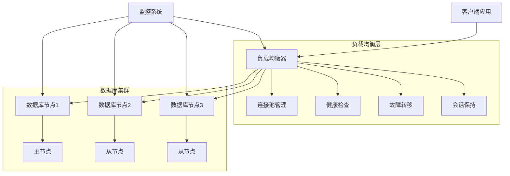

# 数据库负载均衡配置完整指南

## 🎯 概述

数据库负载均衡是提升系统性能和可用性的关键技术，通过将数据库请求分发到多个服务器实例，实现资源的合理利用和故障容错。本指南提供从基础理论到企业级实践的完整负载均衡解决方案。

## 📋 目录

1. [负载均衡基础理论](#1-负载均衡基础理论)
2. [MySQL Proxy配置](#2-mysql-proxy配置)
3. [PostgreSQL PgBouncer配置](#3-postgresql-pgbouncer配置)
4. [MongoDB负载均衡](#4-mongodb负载均衡)
5. [Redis集群负载均衡](#5-redis集群负载均衡)
6. [负载均衡策略优化](#6-负载均衡策略优化)
7. [监控与故障处理](#7-监控与故障处理)

---

## 1. 负载均衡基础理论

### 1.1 核心概念与架构

#### 负载均衡架构模式


#### 负载均衡优势分析
```yaml
load_balancing_advantages:
  performance_improvement:
    description: "性能提升"
    benefits: 
      - "请求分发到多个实例"
      - "并发处理能力增强"
      - "响应时间优化"
    metrics: "通常可提升2-5倍处理能力"
  
  high_availability:
    description: "高可用性"
    benefits:
      - "单点故障容错"
      - "自动故障转移"
      - "服务连续性保障"
    metrics: "可用性可达99.99%以上"
  
  scalability:
    description: "可扩展性"
    benefits:
      - "水平扩展支持"
      - "动态节点增减"
      - "资源弹性伸缩"
    metrics: "支持数百节点集群"
  
  resource_optimization:
    description: "资源优化"
    benefits:
      - "负载均匀分布"
      - "资源利用率提升"
      - "成本效益最大化"
    metrics: "资源利用率提升30-50%"
```

### 1.2 负载均衡算法

#### 主要负载均衡算法
```python
# 负载均衡算法实现
class LoadBalancingAlgorithms:
    def __init__(self, servers):
        self.servers = servers
        self.current_index = 0
        self.request_counts = {server: 0 for server in servers}
        self.response_times = {server: [] for server in servers}
    
    def round_robin(self):
        """轮询算法"""
        server = self.servers[self.current_index]
        self.current_index = (self.current_index + 1) % len(self.servers)
        self.request_counts[server] += 1
        return server
    
    def weighted_round_robin(self, weights):
        """加权轮询算法"""
        total_weight = sum(weights.values())
        rand_num = random.randint(1, total_weight)
        
        current_weight = 0
        for server, weight in weights.items():
            current_weight += weight
            if rand_num <= current_weight:
                self.request_counts[server] += 1
                return server
    
    def least_connections(self, current_connections):
        """最少连接算法"""
        server = min(current_connections.keys(), 
                    key=lambda s: current_connections[s])
        self.request_counts[server] += 1
        return server
    
    def weighted_least_connections(self, current_connections, weights):
        """加权最少连接算法"""
        weighted_connections = {
            server: current_connections[server] / weights[server] 
            for server in self.servers
        }
        server = min(weighted_connections.keys(), 
                    key=lambda s: weighted_connections[s])
        self.request_counts[server] += 1
        return server
    
    def response_time_based(self):
        """响应时间算法"""
        avg_response_times = {
            server: sum(times) / len(times) if times else 0 
            for server, times in self.response_times.items()
        }
        server = min(avg_response_times.keys(), 
                    key=lambda s: avg_response_times[s])
        self.request_counts[server] += 1
        return server
    
    def consistent_hashing(self, key):
        """一致性哈希算法"""
        import hashlib
        hash_value = int(hashlib.md5(key.encode()).hexdigest(), 16)
        server_index = hash_value % len(self.servers)
        server = self.servers[server_index]
        self.request_counts[server] += 1
        return server

# 使用示例
servers = ['db1.example.com', 'db2.example.com', 'db3.example.com']
lb = LoadBalancingAlgorithms(servers)

# 不同算法的应用场景
algorithms_use_cases = {
    'round_robin': '请求均匀分布的场景',
    'weighted_round_robin': '服务器配置不同的场景',
    'least_connections': '连接数差异较大的场景',
    'response_time_based': '响应时间敏感的场景',
    'consistent_hashing': '需要会话保持的场景'
}
```

## 2. MySQL Proxy配置

### 2.1 MySQL Router配置

#### 基础配置文件
```ini
# mysqlrouter.conf - MySQL Router配置
[DEFAULT]
logging_folder = /var/log/mysqlrouter
plugin_folder = /usr/lib/mysqlrouter
runtime_folder = /var/run/mysqlrouter
config_folder = /etc/mysqlrouter

[logger]
level = INFO

[metadata_cache:bootstrap]
cluster_type = gr
router_id = 1
metadata_cluster = mycluster
user = mysql_router
password = router_password
ttl = 5

[routing:bootstrap_rw]
bind_address = 0.0.0.0
bind_port = 6446
destinations = metadata-cache://mycluster/default?role=PRIMARY
routing_strategy = first-available
protocol = classic

[routing:bootstrap_ro]
bind_address = 0.0.0.0
bind_port = 6447
destinations = metadata-cache://mycluster/default?role=SECONDARY
routing_strategy = round-robin-with-fallback
protocol = classic

[routing:bootstrap_x_rw]
bind_address = 0.0.0.0
bind_port = 6448
destinations = metadata-cache://mycluster/default?role=PRIMARY
routing_strategy = first-available
protocol = x

[routing:bootstrap_x_ro]
bind_address = 0.0.0.0
bind_port = 6449
destinations = metadata-cache://mycluster/default?role=SECONDARY
routing_strategy = round-robin-with-fallback
protocol = x
```

#### 高级配置优化
```ini
# mysqlrouter_advanced.conf - 高级配置
[DEFAULT]
connect_timeout = 5
read_timeout = 30
dynamic_state = /var/lib/mysqlrouter/state.json
client_ssl_cert = /etc/ssl/certs/client-cert.pem
client_ssl_key = /etc/ssl/private/client-key.pem
client_ssl_mode = REQUIRED

[connection_pool]
max_size = 100
min_size = 10
max_idle_time = 300

[health_monitor]
monitor_interval = 2
failure_detector_threshold = 3
failure_detector_window = 10

[routing:advanced_rw]
bind_address = 0.0.0.0
bind_port = 7446
destinations = metadata-cache://mycluster/default?role=PRIMARY
routing_strategy = first-available
protocol = classic
connection_delay = 100
max_connections = 2000
client_connect_timeout = 10
server_connect_timeout = 5
```

### 2.2 ProxySQL配置

#### ProxySQL核心配置
```sql
-- proxysql_admin.sql - ProxySQL管理配置
-- 添加MySQL服务器
INSERT INTO mysql_servers(hostgroup_id, hostname, port, weight, status) 
VALUES 
(1, 'mysql-master.example.com', 3306, 1000, 'ONLINE'),
(2, 'mysql-slave1.example.com', 3306, 100, 'ONLINE'),
(2, 'mysql-slave2.example.com', 3306, 100, 'ONLINE');

-- 配置读写分离规则
INSERT INTO mysql_query_rules(rule_id, active, match_digest, destination_hostgroup, apply) 
VALUES 
(1, 1, '^SELECT.*FOR UPDATE$', 1, 1),
(2, 1, '^SELECT', 2, 1),
(3, 1, '^(INSERT|UPDATE|DELETE)', 1, 1);

-- 创建用户
INSERT INTO mysql_users(username, password, default_hostgroup, transaction_persistent) 
VALUES ('app_user', 'encrypted_password', 1, 1);

-- 配置连接池
UPDATE global_variables SET variable_value='1000' WHERE variable_name='mysql-max_connections';
UPDATE global_variables SET variable_value='50' WHERE variable_name='mysql-default_max_latency_ms';

-- 加载配置到运行时
LOAD MYSQL SERVERS TO RUNTIME;
LOAD MYSQL QUERY RULES TO RUNTIME;
LOAD MYSQL USERS TO RUNTIME;
SAVE MYSQL SERVERS TO DISK;
SAVE MYSQL QUERY RULES TO DISK;
SAVE MYSQL USERS TO DISK;
```

#### 监控和统计配置
```sql
-- proxysql_monitoring.sql - 监控配置
-- 启用监控
UPDATE global_variables SET variable_value='true' WHERE variable_name='mysql-monitor_enabled';
UPDATE global_variables SET variable_value='1000' WHERE variable_name='mysql-monitor_ping_interval';
UPDATE global_variables SET variable_value='2000' WHERE variable_name='mysql-monitor_read_only_interval';

-- 配置监控用户
INSERT INTO mysql_users(username, password, use_ssl, default_hostgroup, transaction_persistent) 
VALUES ('monitor', 'monitor_password', 0, 1, 0);

-- 查看统计信息
SELECT * FROM stats_mysql_global;
SELECT * FROM stats_mysql_connection_pool;
SELECT * FROM stats_mysql_commands_counters;
SELECT * FROM stats_mysql_query_digest ORDER BY sum_time DESC LIMIT 10;
```

## 3. PostgreSQL PgBouncer配置

### 3.1 PgBouncer基础配置

#### pgbouncer.ini配置文件
```ini
# pgbouncer.ini - PgBouncer配置
[databases]
mydb = host=pg-master.example.com port=5432 dbname=mydb pool_size=50
mydb_ro = host=pg-slave1.example.com port=5432 dbname=mydb pool_size=30

[pgbouncer]
# 网络设置
listen_addr = 0.0.0.0
listen_port = 6432
unix_socket_dir = /var/run/postgresql

# 认证设置
auth_type = md5
auth_file = /etc/pgbouncer/userlist.txt

# 连接池设置
pool_mode = transaction
default_pool_size = 20
min_pool_size = 5
reserve_pool_size = 5
reserve_pool_timeout = 3
max_client_conn = 500
max_db_connections = 100

# 超时设置
server_reset_query = DISCARD ALL
server_check_delay = 30
server_lifetime = 3600
server_idle_timeout = 600
client_idle_timeout = 0
client_login_timeout = 60
autodb_idle_timeout = 3600

# 日志设置
logfile = /var/log/pgbouncer/pgbouncer.log
pidfile = /var/run/pgbouncer/pgbouncer.pid
log_connections = 1
log_disconnections = 1
log_pooler_errors = 1

# 统计设置
stats_period = 60
```

#### 用户认证文件
```txt
# userlist.txt - 用户认证文件
"postgres" "md53175bce1d3201d16594cebf9d7eb3f9d"
"app_user" "md5a3cde912f8c4d56123456789abcdef01"
"readonly_user" "md5b4def023e9d6e7f890123456789abcdef"
```

### 3.2 高级PgBouncer配置

#### 读写分离配置
```ini
# pgbouncer_advanced.ini - 高级配置
[databases]
# 写操作路由到主库
write_db = host=pg-master.example.com port=5432 dbname=mydb pool_mode=transaction pool_size=30
# 读操作路由到从库
read_db = host=pg-slave1.example.com port=5432 dbname=mydb pool_mode=session pool_size=50

# 备用从库
read_db_backup = host=pg-slave2.example.com port=5432 dbname=mydb pool_mode=session pool_size=50

[pgbouncer]
# 智能池模式
pool_mode = statement
default_pool_size = 25
min_pool_size = 10
reserve_pool_size = 10

# 连接复用优化
server_reset_query_always = 0
ignore_startup_parameters = extra_float_digits

# 故障转移支持
server_fast_close = 1
server_check_query = select 1
server_check_delay = 10

# 性能监控
query_timeout = 300
query_wait_timeout = 120
client_idle_timeout = 300
```

#### 动态配置管理
```python
# pgbouncer_manager.py - PgBouncer管理脚本
import subprocess
import json
import time

class PgBouncerManager:
    def __init__(self, admin_console_port=6432):
        self.admin_port = admin_console_port
        self.stats_cache = {}
    
    def get_stats(self):
        """获取PgBouncer统计信息"""
        cmd = f"echo 'SHOW STATS;' | psql -p {self.admin_port} -d pgbouncer"
        result = subprocess.run(cmd, shell=True, capture_output=True, text=True)
        return result.stdout
    
    def get_pools(self):
        """获取连接池状态"""
        cmd = f"echo 'SHOW POOLS;' | psql -p {self.admin_port} -d pgbouncer"
        result = subprocess.run(cmd, shell=True, capture_output=True, text=True)
        return result.stdout
    
    def pause_pool(self, database):
        """暂停指定数据库的连接池"""
        cmd = f"echo 'PAUSE {database};' | psql -p {self.admin_port} -d pgbouncer"
        subprocess.run(cmd, shell=True)
    
    def resume_pool(self, database):
        """恢复指定数据库的连接池"""
        cmd = f"echo 'RESUME {database};' | psql -p {self.admin_port} -d pgbouncer"
        subprocess.run(cmd, shell=True)
    
    def reload_config(self):
        """重新加载配置"""
        cmd = f"echo 'RELOAD;' | psql -p {self.admin_port} -d pgbouncer"
        subprocess.run(cmd, shell=True)
    
    def enable_failover(self, failed_host, backup_host):
        """启用故障转移"""
        # 这里应该实现具体的故障转移逻辑
        print(f"切换从 {failed_host} 到 {backup_host}")
        # 更新配置文件
        # 重新加载配置
        self.reload_config()

# 使用示例
manager = PgBouncerManager()
stats = manager.get_stats()
print("当前统计:", stats)

# 监控连接池健康状态
def monitor_pools():
    while True:
        pools = manager.get_pools()
        # 解析并检查池状态
        # 如果发现异常，触发告警或自动修复
        time.sleep(60)
```

## 4. MongoDB负载均衡

### 4.1 MongoDB分片集群配置

#### 分片集群架构配置
```javascript
// mongos配置文件
sharding:
  configDB: configRepl/192.168.1.10:27019,192.168.1.11:27019,192.168.1.12:27019
  
processManagement:
  fork: true
  pidFilePath: /var/run/mongodb/mongos.pid

net:
  bindIp: 0.0.0.0
  port: 27017

security:
  keyFile: /opt/mongo/keyfile
  
setParameter:
  connPoolMaxShardedConnsPerHost: 200
  connPoolMaxConnsPerHost: 200
```

#### 分片键设计和配置
```javascript
// 分片配置脚本
// 启用分片
sh.enableSharding("myDatabase")

// 选择合适的分片键
// 基于业务查询模式选择分片键
sh.shardCollection("myDatabase.users", { "userId": 1 })
sh.shardCollection("myDatabase.orders", { "customerId": 1, "orderDate": 1 })

// 预分片以避免热点
for (var i = 0; i < 100; i++) {
    sh.splitAt("myDatabase.users", { "userId": i * 10000 })
}

// 分布分片到不同分片
sh.moveChunk("myDatabase.users", { "userId": 0 }, "shard0000")
sh.moveChunk("myDatabase.users", { "userId": 500000 }, "shard0001")

// 监控分片状态
sh.status()
db.printShardingStatus()
```

### 4.2 MongoDB驱动程序负载均衡

#### 连接字符串配置
```python
# mongodb_load_balancing.py - MongoDB负载均衡配置
from pymongo import MongoClient
from pymongo.read_preferences import ReadPreference

class MongoDBLoadBalancer:
    def __init__(self):
        # 连接字符串配置
        self.connection_string = (
            "mongodb://user:password@"
            "mongos1.example.com:27017,"
            "mongos2.example.com:27017,"
            "mongos3.example.com:27017/"
            "myDatabase?"
            "readPreference=secondaryPreferred&"
            "maxPoolSize=100&"
            "minPoolSize=10&"
            "maxIdleTimeMS=30000&"
            "waitQueueMultiple=2&"
            "retryWrites=true&"
            "retryReads=true"
        )
        
        self.client = MongoClient(self.connection_string)
        self.db = self.client.myDatabase
    
    def get_read_connection(self):
        """获取读操作连接"""
        # 使用读偏好设置
        return self.client.myDatabase.with_options(
            read_preference=ReadPreference.SECONDARY_PREFERRED
        )
    
    def get_write_connection(self):
        """获取写操作连接"""
        # 写操作总是路由到主节点
        return self.client.myDatabase.with_options(
            read_preference=ReadPreference.PRIMARY
        )
    
    def execute_balanced_query(self, collection_name, query, read_only=False):
        """执行负载均衡查询"""
        if read_only:
            collection = self.get_read_connection()[collection_name]
        else:
            collection = self.get_write_connection()[collection_name]
        
        return collection.find(query)

# 使用示例
balancer = MongoDBLoadBalancer()

# 读操作 - 自动路由到从节点
users = balancer.execute_balanced_query("users", {"status": "active"}, read_only=True)

# 写操作 - 路由到主节点
balancer.execute_balanced_query("users", {"$set": {"lastLogin": "2024-01-01"}}, read_only=False)
```

## 5. Redis集群负载均衡

### 5.1 Redis Cluster配置

#### Redis Cluster节点配置
```conf
# redis.conf - Redis集群节点配置
port 7000
bind 0.0.0.0
daemonize yes
pidfile /var/run/redis/redis-7000.pid
logfile /var/log/redis/redis-7000.log
dir /var/lib/redis/7000

# 集群配置
cluster-enabled yes
cluster-config-file nodes-7000.conf
cluster-node-timeout 15000
cluster-announce-ip 192.168.1.10
cluster-announce-port 7000
cluster-announce-bus-port 17000

# 性能优化
tcp-keepalive 300
timeout 0
tcp-backlog 511
maxclients 10000

# 内存配置
maxmemory 2gb
maxmemory-policy allkeys-lru
```

#### 集群创建脚本
```bash
#!/bin/bash
# create_redis_cluster.sh - Redis集群创建脚本

# 节点配置
NODES=(
    "192.168.1.10:7000"
    "192.168.1.11:7001" 
    "192.168.1.12:7002"
    "192.168.1.13:7003"
    "192.168.1.14:7004"
    "192.168.1.15:7005"
)

# 启动所有节点
start_nodes() {
    for node in "${NODES[@]}"; do
        host=$(echo $node | cut -d: -f1)
        port=$(echo $node | cut -d: -f2)
        
        ssh $host "redis-server /etc/redis/redis-$port.conf"
        echo "Started Redis node on $host:$port"
    done
}

# 创建集群
create_cluster() {
    echo "Creating Redis cluster..."
    echo "yes" | redis-cli --cluster create ${NODES[*]} --cluster-replicas 1
}

# 验证集群状态
verify_cluster() {
    redis-cli -c -p 7000 cluster nodes
    redis-cli -c -p 7000 cluster info
}

# 执行部署
start_nodes
sleep 10
create_cluster
verify_cluster
```

### 5.2 Redis客户端负载均衡

#### 智能客户端配置
```python
# redis_cluster_client.py - Redis集群客户端
import redis
from redis.cluster import RedisCluster
import time
import random

class RedisClusterLoadBalancer:
    def __init__(self, startup_nodes):
        self.startup_nodes = startup_nodes
        self.cluster = RedisCluster(
            startup_nodes=startup_nodes,
            decode_responses=True,
            skip_full_coverage_check=True,
            health_check_interval=30,
            max_connections=50
        )
        
        # 统计信息
        self.stats = {
            'total_requests': 0,
            'node_distribution': {},
            'latency_stats': []
        }
    
    def get_balanced_connection(self, key):
        """获取负载均衡的连接"""
        # Redis Cluster会自动处理键的分片和路由
        return self.cluster
    
    def execute_with_retry(self, operation, *args, **kwargs):
        """带重试机制的操作执行"""
        max_retries = 3
        for attempt in range(max_retries):
            try:
                result = operation(*args, **kwargs)
                self.stats['total_requests'] += 1
                return result
            except redis.RedisError as e:
                if attempt == max_retries - 1:
                    raise e
                time.sleep(0.1 * (2 ** attempt))  # 指数退避
    
    def get_cluster_stats(self):
        """获取集群统计信息"""
        info = {}
        
        # 获取各个节点信息
        for node in self.startup_nodes:
            try:
                node_client = redis.Redis(host=node['host'], port=node['port'])
                node_info = node_client.info()
                info[f"{node['host']}:{node['port']}"] = {
                    'used_memory': node_info.get('used_memory_human', 'N/A'),
                    'connected_clients': node_info.get('connected_clients', 0),
                    'ops_per_sec': node_info.get('instantaneous_ops_per_sec', 0)
                }
            except Exception as e:
                info[f"{node['host']}:{node['port']}"] = {'error': str(e)}
        
        return info

# 使用示例
startup_nodes = [
    {'host': '192.168.1.10', 'port': '7000'},
    {'host': '192.168.1.11', 'port': '7001'},
    {'host': '192.168.1.12', 'port': '7002'}
]

balancer = RedisClusterLoadBalancer(startup_nodes)

# 执行负载均衡操作
balancer.execute_with_retry(balancer.cluster.set, 'key1', 'value1')
result = balancer.execute_with_retry(balancer.cluster.get, 'key1')

# 获取集群状态
stats = balancer.get_cluster_stats()
print("集群统计:", stats)
```

## 6. 负载均衡策略优化

### 6.1 自适应负载均衡

#### 智能负载均衡算法
```python
# adaptive_load_balancer.py - 自适应负载均衡器
import time
import threading
from collections import defaultdict, deque
import statistics

class AdaptiveLoadBalancer:
    def __init__(self, servers):
        self.servers = servers
        self.server_stats = defaultdict(lambda: {
            'request_count': 0,
            'response_times': deque(maxlen=100),
            'error_count': 0,
            'health_score': 1.0
        })
        self.algorithm = 'adaptive'
        self.lock = threading.Lock()
        
        # 启动监控线程
        self.monitor_thread = threading.Thread(target=self._monitor_servers)
        self.monitor_thread.daemon = True
        self.monitor_thread.start()
    
    def _monitor_servers(self):
        """监控服务器健康状态"""
        while True:
            for server in self.servers:
                self._update_health_score(server)
            time.sleep(30)  # 每30秒更新一次
    
    def _update_health_score(self, server):
        """更新服务器健康评分"""
        stats = self.server_stats[server]
        
        # 基于多个因素计算健康评分
        response_time_score = self._calculate_response_time_score(stats['response_times'])
        error_rate_score = self._calculate_error_rate_score(stats['error_count'], stats['request_count'])
        load_balance_score = self._calculate_load_balance_score(server)
        
        # 综合评分 (权重可以根据业务调整)
        health_score = (
            response_time_score * 0.5 +
            error_rate_score * 0.3 +
            load_balance_score * 0.2
        )
        
        with self.lock:
            stats['health_score'] = max(0.1, min(1.0, health_score))
    
    def _calculate_response_time_score(self, response_times):
        """基于响应时间计算评分"""
        if not response_times:
            return 1.0
        
        avg_response_time = statistics.mean(response_times)
        if avg_response_time < 50:  # 50ms以下
            return 1.0
        elif avg_response_time < 200:  # 50-200ms
            return 0.8
        elif avg_response_time < 500:  # 200-500ms
            return 0.5
        else:  # 500ms以上
            return 0.2
    
    def _calculate_error_rate_score(self, error_count, request_count):
        """基于错误率计算评分"""
        if request_count == 0:
            return 1.0
        
        error_rate = error_count / request_count
        if error_rate < 0.01:  # 错误率小于1%
            return 1.0
        elif error_rate < 0.05:  # 错误率1-5%
            return 0.7
        elif error_rate < 0.1:  # 错误率5-10%
            return 0.4
        else:  # 错误率超过10%
            return 0.1
    
    def _calculate_load_balance_score(self, server):
        """基于负载均衡计算评分"""
        current_load = self.server_stats[server]['request_count']
        avg_load = sum(stats['request_count'] for stats in self.server_stats.values()) / len(self.servers)
        
        if avg_load == 0:
            return 1.0
        
        load_ratio = current_load / avg_load
        if load_ratio < 0.8:  # 负载较低
            return 1.0
        elif load_ratio < 1.2:  # 负载适中
            return 0.8
        else:  # 负载较高
            return 0.5
    
    def select_server(self, request_key=None):
        """选择最优服务器"""
        with self.lock:
            # 根据健康评分和权重选择服务器
            total_score = sum(stats['health_score'] for stats in self.server_stats.values())
            
            if total_score == 0:
                # 如果所有服务器都不健康，随机选择
                return random.choice(self.servers)
            
            # 轮盘赌选择算法
            rand_score = random.uniform(0, total_score)
            current_score = 0
            
            for server in self.servers:
                current_score += self.server_stats[server]['health_score']
                if current_score >= rand_score:
                    self.server_stats[server]['request_count'] += 1
                    return server
            
            # 备选方案
            return self.servers[0]
    
    def record_request_result(self, server, response_time, success=True):
        """记录请求结果"""
        with self.lock:
            stats = self.server_stats[server]
            stats['response_times'].append(response_time)
            
            if not success:
                stats['error_count'] += 1

# 使用示例
servers = ['db1.example.com', 'db2.example.com', 'db3.example.com']
balancer = AdaptiveLoadBalancer(servers)

# 模拟请求处理
def handle_request(request_data):
    server = balancer.select_server()
    start_time = time.time()
    
    try:
        # 执行数据库操作
        result = execute_db_operation(server, request_data)
        response_time = (time.time() - start_time) * 1000  # 转换为毫秒
        balancer.record_request_result(server, response_time, success=True)
        return result
    except Exception as e:
        response_time = (time.time() - start_time) * 1000
        balancer.record_request_result(server, response_time, success=False)
        raise e
```

### 6.2 会话保持和粘性连接

#### 会话保持策略
```python
# session_sticky_balancer.py - 会话保持负载均衡器
import hashlib
import time
from collections import defaultdict

class SessionStickyLoadBalancer:
    def __init__(self, servers, session_timeout=300):
        self.servers = servers
        self.session_timeout = session_timeout
        self.session_map = {}  # session_id -> (server, expire_time)
        self.server_sessions = defaultdict(set)  # server -> set of session_ids
        
    def get_server_for_session(self, session_id, user_id=None):
        """为会话获取固定服务器"""
        current_time = time.time()
        
        # 检查现有会话映射
        if session_id in self.session_map:
            server, expire_time = self.session_map[session_id]
            if current_time < expire_time:
                # 更新过期时间
                self.session_map[session_id] = (server, current_time + self.session_timeout)
                return server
            else:
                # 会话已过期，清理映射
                self._cleanup_expired_session(session_id)
        
        # 创建新会话映射
        if user_id:
            # 基于用户ID的一致性哈希
            server = self._consistent_hash(user_id)
        else:
            # 基于会话ID的哈希
            server = self._hash_to_server(session_id)
        
        # 建立会话映射
        self.session_map[session_id] = (server, current_time + self.session_timeout)
        self.server_sessions[server].add(session_id)
        
        return server
    
    def _consistent_hash(self, key):
        """一致性哈希算法"""
        hash_value = int(hashlib.md5(str(key).encode()).hexdigest(), 16)
        server_index = hash_value % len(self.servers)
        return self.servers[server_index]
    
    def _hash_to_server(self, session_id):
        """简单的哈希到服务器映射"""
        hash_value = hash(session_id) % len(self.servers)
        return self.servers[hash_value]
    
    def _cleanup_expired_session(self, session_id):
        """清理过期会话"""
        if session_id in self.session_map:
            old_server, _ = self.session_map[session_id]
            del self.session_map[session_id]
            self.server_sessions[old_server].discard(session_id)
    
    def get_session_stats(self):
        """获取会话统计信息"""
        current_time = time.time()
        active_sessions = sum(1 for _, expire_time in self.session_map.values() 
                            if current_time < expire_time)
        
        server_load = {}
        for server in self.servers:
            active_server_sessions = sum(1 for session_id in self.server_sessions[server]
                                       if session_id in self.session_map and 
                                       current_time < self.session_map[session_id][1])
            server_load[server] = active_server_sessions
        
        return {
            'total_sessions': len(self.session_map),
            'active_sessions': active_sessions,
            'server_load_distribution': server_load
        }
    
    def rebalance_sessions(self, threshold_ratio=1.5):
        """重新平衡会话分布"""
        stats = self.get_session_stats()
        server_load = stats['server_load_distribution']
        
        if not server_load:
            return
        
        avg_load = sum(server_load.values()) / len(server_load)
        overloaded_servers = [s for s, load in server_load.items() if load > avg_load * threshold_ratio]
        underloaded_servers = [s for s, load in server_load.items() if load < avg_load / threshold_ratio]
        
        if not overloaded_servers or not underloaded_servers:
            return
        
        # 迁移会话
        for overloaded_server in overloaded_servers:
            sessions_to_move = self.server_sessions[overloaded_server].copy()
            target_server = underloaded_servers[0]  # 简单选择第一个欠载服务器
            
            moved_count = 0
            for session_id in sessions_to_move:
                if moved_count >= 10:  # 每次最多迁移10个会话
                    break
                    
                if (session_id in self.session_map and 
                    self.session_map[session_id][0] == overloaded_server):
                    
                    # 更新会话映射
                    expire_time = self.session_map[session_id][1]
                    self.session_map[session_id] = (target_server, expire_time)
                    
                    # 更新服务器会话集合
                    self.server_sessions[overloaded_server].discard(session_id)
                    self.server_sessions[target_server].add(session_id)
                    
                    moved_count += 1

# 使用示例
balancer = SessionStickyLoadBalancer(['db1', 'db2', 'db3'])

# 用户登录时建立会话
user_session_id = create_user_session(user_id=12345)
server = balancer.get_server_for_session(user_session_id, user_id=12345)

# 后续请求使用相同服务器
same_server = balancer.get_server_for_session(user_session_id)
assert server == same_server  # 确保会话粘性
```

## 7. 监控与故障处理

### 7.1 负载均衡监控体系

#### 综合监控仪表板
```python
# load_balancer_monitor.py - 负载均衡监控系统
import time
import json
from datetime import datetime
import threading

class LoadBalancerMonitor:
    def __init__(self, balancer):
        self.balancer = balancer
        self.metrics_history = []
        self.alerts = []
        self.monitoring = True
        
        # 启动监控线程
        self.monitor_thread = threading.Thread(target=self._monitor_loop)
        self.monitor_thread.daemon = True
        self.monitor_thread.start()
    
    def _monitor_loop(self):
        """监控循环"""
        while self.monitoring:
            try:
                metrics = self._collect_metrics()
                self._analyze_metrics(metrics)
                self._store_metrics(metrics)
                time.sleep(60)  # 每分钟收集一次
            except Exception as e:
                self._log_error(f"监控循环异常: {str(e)}")
    
    def _collect_metrics(self):
        """收集监控指标"""
        timestamp = datetime.now().isoformat()
        
        # 基础指标
        base_metrics = {
            'timestamp': timestamp,
            'total_requests': getattr(self.balancer, 'total_requests', 0),
            'active_connections': getattr(self.balancer, 'active_connections', 0),
            'server_count': len(getattr(self.balancer, 'servers', []))
        }
        
        # 服务器指标
        server_metrics = {}
        for server in getattr(self.balancer, 'servers', []):
            server_stats = getattr(self.balancer, 'server_stats', {}).get(server, {})
            server_metrics[server] = {
                'request_count': server_stats.get('request_count', 0),
                'health_score': server_stats.get('health_score', 1.0),
                'avg_response_time': self._calculate_avg_response_time(server_stats.get('response_times', [])),
                'error_count': server_stats.get('error_count', 0)
            }
        
        # 性能指标
        performance_metrics = {
            'overall_avg_response_time': self._calculate_overall_avg_response_time(),
            'request_distribution_std': self._calculate_request_distribution_std(),
            'load_balance_score': self._calculate_load_balance_score(server_metrics)
        }
        
        return {
            'base_metrics': base_metrics,
            'server_metrics': server_metrics,
            'performance_metrics': performance_metrics
        }
    
    def _analyze_metrics(self, metrics):
        """分析指标并生成告警"""
        server_metrics = metrics['server_metrics']
        performance_metrics = metrics['performance_metrics']
        
        # 检查服务器健康状态
        for server, stats in server_metrics.items():
            if stats['health_score'] < 0.3:
                self._generate_alert('CRITICAL', f'服务器 {server} 健康评分过低: {stats["health_score"]}')
            
            if stats['avg_response_time'] > 1000:  # 1秒
                self._generate_alert('WARNING', f'服务器 {server} 响应时间过长: {stats["avg_response_time"]}ms')
        
        # 检查负载均衡状态
        if performance_metrics['load_balance_score'] < 0.7:
            self._generate_alert('WARNING', f'负载均衡不佳，评分为: {performance_metrics["load_balance_score"]}')
        
        # 检查整体性能
        if performance_metrics['overall_avg_response_time'] > 500:  # 500ms
            self._generate_alert('WARNING', f'整体响应时间过长: {performance_metrics["overall_avg_response_time"]}ms')
    
    def _generate_alert(self, level, message):
        """生成告警"""
        alert = {
            'timestamp': datetime.now().isoformat(),
            'level': level,
            'message': message
        }
        self.alerts.append(alert)
        print(f"[{level}] {message}")  # 实际应用中应该发送到告警系统
    
    def _calculate_avg_response_time(self, response_times):
        """计算平均响应时间"""
        if not response_times:
            return 0
        return sum(response_times) / len(response_times)
    
    def _calculate_overall_avg_response_time(self):
        """计算整体平均响应时间"""
        all_response_times = []
        for server_stats in getattr(self.balancer, 'server_stats', {}).values():
            all_response_times.extend(server_stats.get('response_times', []))
        return self._calculate_avg_response_time(all_response_times)
    
    def _calculate_request_distribution_std(self):
        """计算请求分布标准差"""
        request_counts = [stats.get('request_count', 0) 
                         for stats in getattr(self.balancer, 'server_stats', {}).values()]
        if len(request_counts) < 2:
            return 0
        
        mean = sum(request_counts) / len(request_counts)
        variance = sum((x - mean) ** 2 for x in request_counts) / len(request_counts)
        return variance ** 0.5
    
    def _calculate_load_balance_score(self, server_metrics):
        """计算负载均衡评分"""
        if not server_metrics:
            return 1.0
        
        request_counts = [stats['request_count'] for stats in server_metrics.values()]
        if sum(request_counts) == 0:
            return 1.0
        
        # 使用变异系数作为平衡度量
        mean = sum(request_counts) / len(request_counts)
        std_dev = (sum((x - mean) ** 2 for x in request_counts) / len(request_counts)) ** 0.5
        
        if mean == 0:
            return 0
        
        cv = std_dev / mean  # 变异系数
        # 变异系数越小，负载越均衡
        return max(0, 1 - min(1, cv))
    
    def _store_metrics(self, metrics):
        """存储指标数据"""
        self.metrics_history.append(metrics)
        # 保留最近1000条记录
        if len(self.metrics_history) > 1000:
            self.metrics_history.pop(0)
    
    def get_monitoring_report(self):
        """获取监控报告"""
        if not self.metrics_history:
            return {"status": "no_data"}
        
        latest_metrics = self.metrics_history[-1]
        historical_metrics = self.metrics_history[-60:]  # 最近一小时
        
        report = {
            'current_status': latest_metrics,
            'trends': self._analyze_trends(historical_metrics),
            'alerts': self.alerts[-10:],  # 最近10条告警
            'recommendations': self._generate_recommendations(latest_metrics)
        }
        
        return report
    
    def _analyze_trends(self, historical_metrics):
        """分析趋势"""
        if len(historical_metrics) < 2:
            return {}
        
        # 简单的趋势分析
        first_metrics = historical_metrics[0]
        last_metrics = historical_metrics[-1]
        
        trends = {}
        if 'performance_metrics' in first_metrics and 'performance_metrics' in last_metrics:
            first_perf = first_metrics['performance_metrics']
            last_perf = last_metrics['performance_metrics']
            
            trends['response_time_trend'] = (
                last_perf['overall_avg_response_time'] - first_perf['overall_avg_response_time']
            )
            trends['load_balance_trend'] = (
                last_perf['load_balance_score'] - first_perf['load_balance_score']
            )
        
        return trends
    
    def _generate_recommendations(self, metrics):
        """生成优化建议"""
        recommendations = []
        
        server_metrics = metrics.get('server_metrics', {})
        performance_metrics = metrics.get('performance_metrics', {})
        
        # 负载均衡建议
        if performance_metrics.get('load_balance_score', 1.0) < 0.8:
            recommendations.append("建议调整负载均衡算法或权重配置")
        
        # 服务器性能建议
        for server, stats in server_metrics.items():
            if stats.get('health_score', 1.0) < 0.5:
                recommendations.append(f"建议检查服务器 {server} 的健康状态")
            if stats.get('avg_response_time', 0) > 500:
                recommendations.append(f"建议优化服务器 {server} 的性能")
        
        return recommendations

# 使用示例
# monitor = LoadBalancerMonitor(your_load_balancer_instance)
# report = monitor.get_monitoring_report()
# print(json.dumps(report, indent=2, ensure_ascii=False))
```

### 7.2 自动故障处理

#### 智能故障恢复系统
```python
# auto_failover_system.py - 自动故障处理系统
import time
import threading
from enum import Enum

class ServerStatus(Enum):
    HEALTHY = "healthy"
    DEGRADED = "degraded"
    FAILED = "failed"
    MAINTENANCE = "maintenance"

class AutoFailoverSystem:
    def __init__(self, servers, health_checker):
        self.servers = {server: ServerStatus.HEALTHY for server in servers}
        self.health_checker = health_checker
        self.failover_history = []
        self.recovery_attempts = {}
        self.max_recovery_attempts = 3
        
        # 启动故障检测线程
        self.monitor_thread = threading.Thread(target=self._failover_monitor)
        self.monitor_thread.daemon = True
        self.monitor_thread.start()
    
    def _failover_monitor(self):
        """故障监控循环"""
        while True:
            try:
                self._check_server_health()
                self._handle_failures()
                self._attempt_recoveries()
                time.sleep(30)  # 每30秒检查一次
            except Exception as e:
                print(f"故障监控异常: {str(e)}")
                time.sleep(60)
    
    def _check_server_health(self):
        """检查服务器健康状态"""
        for server in self.servers:
            if self.servers[server] == ServerStatus.MAINTENANCE:
                continue
                
            health_status = self.health_checker.check_health(server)
            
            if health_status.healthy:
                if self.servers[server] != ServerStatus.HEALTHY:
                    self._handle_server_recovery(server)
            else:
                self._handle_server_failure(server, health_status)
    
    def _handle_server_failure(self, server, health_status):
        """处理服务器故障"""
        current_status = self.servers[server]
        
        if current_status == ServerStatus.HEALTHY:
            print(f"检测到服务器 {server} 出现问题: {health_status.message}")
            self.servers[server] = ServerStatus.DEGRADED
            self.recovery_attempts[server] = 0
            
        elif current_status == ServerStatus.DEGRADED:
            self.recovery_attempts[server] += 1
            
            if self.recovery_attempts[server] >= self.max_recovery_attempts:
                print(f"服务器 {server} 故障确认，标记为失败")
                self.servers[server] = ServerStatus.FAILED
                self._trigger_failover(server)
    
    def _handle_server_recovery(self, server):
        """处理服务器恢复"""
        if self.servers[server] in [ServerStatus.DEGRADED, ServerStatus.FAILED]:
            print(f"服务器 {server} 恢复健康")
            self.servers[server] = ServerStatus.HEALTHY
            self.recovery_attempts[server] = 0
            
            # 如果是从故障恢复，可能需要重新加入负载均衡池
            if self.servers[server] == ServerStatus.FAILED:
                self._reintegrate_server(server)
    
    def _trigger_failover(self, failed_server):
        """触发故障转移"""
        failover_event = {
            'timestamp': time.time(),
            'failed_server': failed_server,
            'replacement_server': self._select_replacement_server(failed_server),
            'reason': 'automatic_failover'
        }
        
        self.failover_history.append(failover_event)
        print(f"执行故障转移: {failed_server} -> {failover_event['replacement_server']}")
        
        # 实际的故障转移逻辑应该在这里实现
        # 例如更新DNS记录、修改负载均衡配置等
    
    def _select_replacement_server(self, failed_server):
        """选择替换服务器"""
        healthy_servers = [server for server, status in self.servers.items() 
                          if status == ServerStatus.HEALTHY and server != failed_server]
        
        if not healthy_servers:
            # 如果没有健康服务器，选择降级服务器
            degraded_servers = [server for server, status in self.servers.items() 
                              if status == ServerStatus.DEGRADED and server != failed_server]
            return degraded_servers[0] if degraded_servers else None
        
        # 简单的选择策略：选择请求最少的健康服务器
        return min(healthy_servers, key=lambda s: self._get_server_load(s))
    
    def _get_server_load(self, server):
        """获取服务器负载"""
        # 这里应该从负载均衡器获取实际负载信息
        # 简化实现返回一个默认值
        return getattr(self, 'server_loads', {}).get(server, 0)
    
    def _attempt_recoveries(self):
        """尝试恢复故障服务器"""
        for server, status in self.servers.items():
            if status == ServerStatus.FAILED and self.recovery_attempts[server] < self.max_recovery_attempts:
                if self._attempt_server_recovery(server):
                    print(f"服务器 {server} 恢复成功")
                    self.servers[server] = ServerStatus.HEALTHY
                    self.recovery_attempts[server] = 0
    
    def _attempt_server_recovery(self, server):
        """尝试恢复单个服务器"""
        try:
            # 执行恢复操作
            # 例如：重启服务、修复配置等
            recovery_result = self.health_checker.attempt_recovery(server)
            return recovery_result.success
        except Exception as e:
            print(f"服务器 {server} 恢复失败: {str(e)}")
            return False
    
    def _reintegrate_server(self, server):
        """重新集成服务器到服务池"""
        print(f"重新集成服务器 {server}")
        # 这里应该实现将服务器重新加入负载均衡池的逻辑
        # 例如：更新配置、重新注册服务等
    
    def get_system_status(self):
        """获取系统状态"""
        return {
            'server_status': dict(self.servers),
            'recent_failovers': self.failover_history[-10:],  # 最近10次故障转移
            'recovery_statistics': self._get_recovery_statistics()
        }
    
    def _get_recovery_statistics(self):
        """获取恢复统计信息"""
        total_failures = len([s for s in self.servers.values() if s == ServerStatus.FAILED])
        successful_recoveries = len([event for event in self.failover_history 
                                   if event.get('recovered', False)])
        
        return {
            'total_failures': total_failures,
            'successful_recoveries': successful_recoveries,
            'recovery_rate': successful_recoveries / max(1, len(self.failover_history))
        }
    
    def manual_failover(self, source_server, target_server):
        """手动执行故障转移"""
        if self.servers[source_server] == ServerStatus.HEALTHY:
            print(f"警告: 源服务器 {source_server} 当前状态健康")
        
        if self.servers[target_server] != ServerStatus.HEALTHY:
            print(f"警告: 目标服务器 {target_server} 当前状态不健康")
        
        self._trigger_failover(source_server)
        print(f"手动故障转移完成: {source_server} -> {target_server}")

# 使用示例
# failover_system = AutoFailoverSystem(servers_list, health_checker_instance)
# status = failover_system.get_system_status()
```

---

## 🔍 关键要点总结

### ✅ 负载均衡成功要素
- **合理的算法选择**：根据业务特点选择最适合的负载均衡算法
- **完善的监控体系**：实时监控各节点状态和性能指标
- **智能的故障处理**：自动检测故障并执行相应的恢复措施
- **持续的性能优化**：基于监控数据分析不断优化负载均衡策略

### ⚠️ 常见风险提醒
- **单点故障风险**：负载均衡器本身可能成为新的单点故障
- **配置复杂性**：复杂的负载均衡配置可能引入新的问题
- **性能瓶颈**：不当的负载均衡可能导致某些节点过载
- **会话一致性**：需要特别注意会话保持和数据一致性问题

### 🎯 最佳实践建议
1. **渐进式部署**：从简单配置开始，逐步增加复杂功能
2. **充分测试**：在生产环境部署前进行充分的压力测试
3. **监控告警**：建立完善的监控和告警机制
4. **文档化配置**：详细记录所有配置参数和变更历史
5. **定期评审**：定期评审负载均衡策略的有效性

通过科学的负载均衡设计和实施，可以显著提升数据库系统的性能、可用性和可扩展性，为企业业务发展提供强有力的技术支撑。