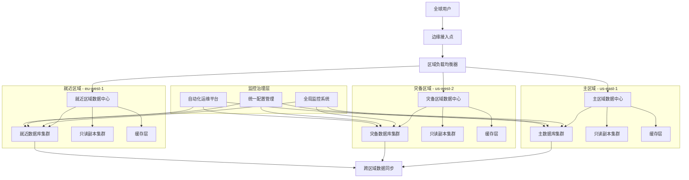

# 数据库多区域部署方案完整指南

## 🎯 概述

数据库多区域部署是构建全球化应用和实现高可用性的关键技术，通过在多个地理区域部署数据库实例来降低延迟、提高可用性并满足数据主权要求。本指南提供从架构设计到实施运维的完整多区域数据库部署解决方案。

## 📋 目录

1. [多区域部署基础理论](#1-多区域部署基础理论)
2. [架构设计模式](#2-架构设计模式)
3. [数据同步与一致性](#3-数据同步与一致性)
4. [故障切换与容灾](#4-故障切换与容灾)
5. [性能优化策略](#5-性能优化策略)
6. [监控与运维管理](#6-监控与运维管理)

---

## 1. 多区域部署基础理论

### 1.1 多区域部署架构模式

#### 全球数据库部署架构


#### 多区域部署模式对比
```python
# multi_region_deployment_patterns.py
from typing import Dict, List, Any
from dataclasses import dataclass
from enum import Enum

class DeploymentPattern(Enum):
    ACTIVE_ACTIVE = "active_active"
    ACTIVE_PASSIVE = "active_passive"
    MULTI_MASTER = "multi_master"
    MASTER_SLAVE_REGIONAL = "master_slave_regional"
    GEO_PARTITIONED = "geo_partitioned"

@dataclass
class RegionConfig:
    region_name: str
    region_code: str
    latency_to_users: float  # ms
    data_sovereignty: bool
    disaster_risk: float  # 0-1
    cost_factor: float    # 相对于主区域的成本倍数

@dataclass
class DeploymentPatternAnalysis:
    pattern: DeploymentPattern
    description: str
    pros: List[str]
    cons: List[str]
    use_cases: List[str]
    complexity: int  # 1-5
    consistency_level: str

class MultiRegionDeploymentAnalyzer:
    def __init__(self):
        self.patterns = self._initialize_patterns()
        self.regions = []
    
    def _initialize_patterns(self) -> Dict[DeploymentPattern, DeploymentPatternAnalysis]:
        """初始化部署模式分析"""
        return {
            DeploymentPattern.ACTIVE_ACTIVE: DeploymentPatternAnalysis(
                pattern=DeploymentPattern.ACTIVE_ACTIVE,
                description="所有区域都可读写，负载均衡分发请求",
                pros=[
                    "最低延迟体验",
                    "最高可用性",
                    "负载分散均匀"
                ],
                cons=[
                    "数据一致性复杂",
                    "冲突解决困难",
                    "实现复杂度高"
                ],
                use_cases=[
                    "全球电商平台",
                    "实时协作应用",
                    "游戏服务"
                ],
                complexity=5,
                consistency_level="eventual"
            ),
            
            DeploymentPattern.ACTIVE_PASSIVE: DeploymentPatternAnalysis(
                pattern=DeploymentPattern.ACTIVE_PASSIVE,
                description="一个主区域读写，其他区域只读备份",
                pros=[
                    "强一致性保证",
                    "实现相对简单",
                    "成本较低"
                ],
                cons=[
                    "灾备切换延迟",
                    "部分区域高延迟",
                    "资源利用率低"
                ],
                use_cases=[
                    "金融交易系统",
                    "企业ERP系统",
                    "合规要求严格的系统"
                ],
                complexity=3,
                consistency_level="strong"
            ),
            
            DeploymentPattern.MULTI_MASTER: DeploymentPatternAnalysis(
                pattern=DeploymentPattern.MULTI_MASTER,
                description="多个区域都可以作为主节点，支持双向同步",
                pros=[
                    "区域间低延迟",
                    "故障切换快速",
                    "资源利用率高"
                ],
                cons=[
                    "冲突检测复杂",
                    "数据同步开销大",
                    "运维复杂"
                ],
                use_cases=[
                    "内容管理系统",
                    "社交网络应用",
                    "多地区办公系统"
                ],
                complexity=4,
                consistency_level="causal"
            ),
            
            DeploymentPattern.MASTER_SLAVE_REGIONAL: DeploymentPatternAnalysis(
                pattern=DeploymentPattern.MASTER_SLAVE_REGIONAL,
                description="每个区域内部主从复制，区域间异步复制",
                pros=[
                    "区域内强一致性",
                    "区域间最终一致性",
                    "实现复杂度适中"
                ],
                cons=[
                    "跨区域延迟较高",
                    "灾备恢复时间长",
                    "配置管理复杂"
                ],
                use_cases=[
                    "区域性业务系统",
                    "数据分析平台",
                    "报表系统"
                ],
                complexity=4,
                consistency_level="regional_strong"
            ),
            
            DeploymentPattern.GEO_PARTITIONED: DeploymentPatternAnalysis(
                pattern=DeploymentPattern.GEO_PARTITIONED,
                description="按地理位置分区存储数据，各区域独立管理",
                pros=[
                    "数据主权合规",
                    "本地化性能最优",
                    "故障隔离性好"
                ],
                cons=[
                    "跨区域查询困难",
                    "数据整合复杂",
                    "全局视图缺失"
                ],
                use_cases=[
                    "政府信息系统",
                    "医疗健康系统",
                    "数据本地化要求高的应用"
                ],
                complexity=3,
                consistency_level="local_strong"
            )
        }
    
    def analyze_business_requirements(self, requirements: Dict[str, Any]) -> List[Dict[str, Any]]:
        """基于业务需求分析适合的部署模式"""
        analysis_results = []
        
        for pattern, analysis in self.patterns.items():
            score = self._calculate_pattern_score(pattern, requirements, analysis)
            analysis_results.append({
                'pattern': pattern.value,
                'score': score,
                'analysis': analysis.__dict__,
                'recommendation_level': self._get_recommendation_level(score)
            })
        
        # 按得分排序
        analysis_results.sort(key=lambda x: x['score'], reverse=True)
        return analysis_results
    
    def _calculate_pattern_score(self, pattern: DeploymentPattern, 
                               requirements: Dict[str, Any], 
                               analysis: DeploymentPatternAnalysis) -> float:
        """计算部署模式得分"""
        score = 0.0
        
        # 可用性要求评分 (权重: 0.25)
        availability_requirement = requirements.get('availability_target', 99.9)
        if availability_requirement >= 99.99:
            # 要求极高可用性
            if pattern in [DeploymentPattern.ACTIVE_ACTIVE, DeploymentPattern.MULTI_MASTER]:
                score += 25
            elif pattern == DeploymentPattern.MASTER_SLAVE_REGIONAL:
                score += 15
        else:
            # 一般可用性要求
            if pattern in [DeploymentPattern.ACTIVE_PASSIVE, DeploymentPattern.MASTER_SLAVE_REGIONAL]:
                score += 20
        
        # 一致性要求评分 (权重: 0.20)
        consistency_requirement = requirements.get('consistency_requirement', 'eventual')
        consistency_mapping = {
            'strong': 1,
            'causal': 2,
            'eventual': 3
        }
        
        pattern_consistency_level = analysis.consistency_level
        pattern_consistency_value = consistency_mapping.get(pattern_consistency_level, 3)
        required_consistency_value = consistency_mapping.get(consistency_requirement, 3)
        
        if pattern_consistency_value <= required_consistency_value:
            score += 20
        elif abs(pattern_consistency_value - required_consistency_value) == 1:
            score += 10
        
        # 延迟敏感度评分 (权重: 0.20)
        latency_sensitivity = requirements.get('latency_sensitivity', 'medium')
        latency_mapping = {'low': 1, 'medium': 2, 'high': 3}
        
        if latency_sensitivity == 'high':
            # 对延迟非常敏感
            if pattern in [DeploymentPattern.ACTIVE_ACTIVE, DeploymentPattern.MULTI_MASTER]:
                score += 20
            elif pattern == DeploymentPattern.GEO_PARTITIONED:
                score += 15
        elif latency_sensitivity == 'medium':
            # 中等延迟敏感度
            if pattern in [DeploymentPattern.MASTER_SLAVE_REGIONAL, DeploymentPattern.MULTI_MASTER]:
                score += 15
        else:
            # 对延迟不敏感
            score += 10
        
        # 成本考虑评分 (权重: 0.15)
        budget_constraint = requirements.get('budget_constraint', 'medium')
        cost_mapping = {'low': 1, 'medium': 2, 'high': 3}
        
        if budget_constraint == 'low':
            # 预算有限
            if pattern in [DeploymentPattern.ACTIVE_PASSIVE, DeploymentPattern.GEO_PARTITIONED]:
                score += 15
            elif pattern == DeploymentPattern.MASTER_SLAVE_REGIONAL:
                score += 10
        else:
            # 预算充足
            score += 15
        
        # 合规要求评分 (权重: 0.10)
        compliance_requirement = requirements.get('compliance_requirement', False)
        if compliance_requirement:
            if pattern == DeploymentPattern.GEO_PARTITIONED:
                score += 10
            elif pattern in [DeploymentPattern.ACTIVE_PASSIVE, DeploymentPattern.MASTER_SLAVE_REGIONAL]:
                score += 5
        else:
            score += 5
        
        # 技术复杂度评分 (权重: 0.10)
        team_skill_level = requirements.get('team_skill_level', 'intermediate')
        skill_mapping = {'beginner': 1, 'intermediate': 2, 'advanced': 3, 'expert': 4}
        
        if skill_mapping[team_skill_level] >= analysis.complexity:
            score += 10
        elif skill_mapping[team_skill_level] >= analysis.complexity - 1:
            score += 5
        
        return score
    
    def _get_recommendation_level(self, score: float) -> str:
        """根据得分确定推荐级别"""
        if score >= 85:
            return "强烈推荐"
        elif score >= 70:
            return "推荐"
        elif score >= 50:
            return "可考虑"
        else:
            return "不推荐"
    
    def design_multi_region_architecture(self, business_requirements: Dict[str, Any], 
                                       selected_regions: List[RegionConfig]) -> Dict[str, Any]:
        """设计多区域架构"""
        # 分析最适合的部署模式
        analysis_results = self.analyze_business_requirements(business_requirements)
        primary_pattern = analysis_results[0]['pattern']
        
        # 设计架构
        architecture = {
            'primary_pattern': primary_pattern,
            'regions': [region.__dict__ for region in selected_regions],
            'data_flow': self._design_data_flow(primary_pattern, selected_regions),
            'failover_strategy': self._design_failover_strategy(primary_pattern, selected_regions),
            'monitoring_plan': self._design_monitoring_plan(selected_regions),
            'cost_estimation': self._estimate_costs(selected_regions, business_requirements)
        }
        
        return architecture
    
    def _design_data_flow(self, pattern: str, regions: List[RegionConfig]) -> Dict[str, Any]:
        """设计数据流向"""
        if pattern == 'active_active':
            return {
                'type': 'bidirectional_sync',
                'sync_mechanism': 'real_time_replication',
                'conflict_resolution': 'timestamp_based',
                'routing_strategy': 'nearest_region_routing'
            }
        elif pattern == 'active_passive':
            return {
                'type': 'unidirectional_sync',
                'sync_mechanism': 'asynchronous_replication',
                'conflict_resolution': 'master_wins',
                'routing_strategy': 'primary_region_routing'
            }
        # 其他模式的实现...
        return {}
    
    def _design_failover_strategy(self, pattern: str, regions: List[RegionConfig]) -> Dict[str, Any]:
        """设计故障切换策略"""
        return {
            'automatic_failover': pattern in ['active_active', 'multi_master'],
            'failover_time': 'seconds' if pattern in ['active_active', 'multi_master'] else 'minutes',
            'data_loss_tolerance': 'zero' if pattern == 'active_passive' else 'minimal',
            'testing_frequency': 'weekly'
        }
    
    def _design_monitoring_plan(self, regions: List[RegionConfig]) -> Dict[str, Any]:
        """设计监控计划"""
        return {
            'metrics_to_monitor': [
                'cross_region_latency',
                'replication_lag',
                'region_availability',
                'data_consistency'
            ],
            'alerting_thresholds': {
                'latency_threshold': 100,  # ms
                'replication_lag_threshold': 5,  # seconds
                'availability_threshold': 99.9
            },
            'monitoring_tools': ['prometheus', 'grafana', 'custom_agents']
        }
    
    def _estimate_costs(self, regions: List[RegionConfig], requirements: Dict[str, Any]) -> Dict[str, Any]:
        """估算成本"""
        base_cost = requirements.get('estimated_monthly_cost', 10000)
        total_cost = sum(region.cost_factor for region in regions) * base_cost / len(regions)
        
        return {
            'monthly_cost_estimate': total_cost,
            'cost_breakdown': {
                'compute': total_cost * 0.6,
                'storage': total_cost * 0.25,
                'network': total_cost * 0.15
            },
            'cost_optimization_suggestions': [
                '使用预留实例降低成本',
                '实施自动扩缩容',
                '优化数据传输'
            ]
        }

# 使用示例
analyzer = MultiRegionDeploymentAnalyzer()

# 定义区域配置
regions = [
    RegionConfig("美国东部", "us-east-1", 10.0, False, 0.1, 1.0),
    RegionConfig("美国西部", "us-west-2", 50.0, False, 0.05, 1.2),
    RegionConfig("欧洲西部", "eu-west-1", 80.0, True, 0.08, 1.3),
    RegionConfig("亚太东北", "ap-northeast-1", 120.0, True, 0.15, 1.4)
]

# 业务需求
business_requirements = {
    'availability_target': 99.99,
    'consistency_requirement': 'eventual',
    'latency_sensitivity': 'high',
    'budget_constraint': 'high',
    'compliance_requirement': True,
    'team_skill_level': 'advanced',
    'estimated_monthly_cost': 15000
}

# 分析部署模式
results = analyzer.analyze_business_requirements(business_requirements)

print("部署模式分析结果:")
for result in results[:3]:  # 显示前3个推荐
    print(f"\n模式: {result['pattern']}")
    print(f"得分: {result['score']}")
    print(f"推荐级别: {result['recommendation_level']}")
    print(f"优点: {', '.join(result['analysis']['pros'])}")
    print(f"缺点: {', '.join(result['analysis']['cons'][:2])}")  # 只显示前2个缺点

# 设计架构
architecture = analyzer.design_multi_region_architecture(business_requirements, regions)
print(f"\n推荐架构模式: {architecture['primary_pattern']}")
print(f"预估月成本: ${architecture['cost_estimation']['monthly_cost_estimate']:,.2f}")
```

### 1.2 网络延迟与数据同步

#### 跨区域网络延迟模型
```yaml
# cross_region_network_latency.yaml
network_latency_profiles:
  # 美国东西海岸之间
  us_inter_coastal:
    direct_latency: 60-80ms
    via_internet: 80-120ms
    via_private_network: 65-85ms
    packet_loss: 0.01-0.05%
  
  # 美国到欧洲
  us_to_europe:
    direct_latency: 80-120ms
    via_internet: 120-200ms
    via_private_network: 90-130ms
    packet_loss: 0.02-0.1%
  
  # 美国到亚洲
  us_to_asia:
    direct_latency: 150-250ms
    via_internet: 250-400ms
    via_private_network: 180-280ms
    packet_loss: 0.05-0.2%
  
  # 欧洲到亚洲
  europe_to_asia:
    direct_latency: 200-300ms
    via_internet: 300-500ms
    via_private_network: 220-320ms
    packet_loss: 0.03-0.15%

data_synchronization_strategies:
  real_time_sync:
    description: "实时数据同步"
    max_acceptable_latency: 100ms
    suitable_for:
      - active_active_deployment
      - multi_master_deployment
    implementation:
      - database_native_replication
      - message_queue_based_sync
      - change_data_capture
  
  near_real_time_sync:
    description: "近实时数据同步"
    max_acceptable_latency: 1000ms
    suitable_for:
      - active_passive_deployment
      - master_slave_regional
    implementation:
      - periodic_batch_sync
      - log_shipping
      - incremental_backup
  
  batch_sync:
    description: "批量数据同步"
    max_acceptable_latency: 3600s
    suitable_for:
      - geo_partitioned_deployment
      - analytics_workloads
    implementation:
      - nightly_batch_processing
      - data_warehouse_sync
      - offline_data_transfer
```

## 2. 架构设计模式

### 2.1 Active-Active双活架构

#### 双活架构部署配置
```yaml
# active-active-deployment.yaml
apiVersion: apps/v1
kind: Deployment
metadata:
  name: database-active-active
  namespace: multi-region
spec:
  replicas: 6  # 每个区域2个实例
  selector:
    matchLabels:
      app: database
      deployment-pattern: active-active
  template:
    metadata:
      labels:
        app: database
        deployment-pattern: active-active
        region: multi  # 多区域标签
    spec:
      containers:
      - name: mysql-primary
        image: mysql:8.0.35
        env:
        - name: MYSQL_ROOT_PASSWORD
          valueFrom:
            secretKeyRef:
              name: mysql-root-password
              key: password
        - name: MYSQL_DATABASE
          value: "global_app"
        - name: MYSQL_USER
          value: "appuser"
        - name: MYSQL_PASSWORD
          valueFrom:
            secretKeyRef:
              name: mysql-app-password
              key: password
        ports:
        - containerPort: 3306
        volumeMounts:
        - name: mysql-data
          mountPath: /var/lib/mysql
        - name: mysql-config
          mountPath: /etc/mysql/conf.d
        livenessProbe:
          exec:
            command:
            - mysqladmin
            - ping
            - -h
            - localhost
          initialDelaySeconds: 60
          periodSeconds: 10
        readinessProbe:
          exec:
            command:
            - mysql
            - -h
            - localhost
            - -e
            - SELECT 1
          initialDelaySeconds: 30
          periodSeconds: 5
        resources:
          requests:
            memory: "2Gi"
            cpu: "1"
          limits:
            memory: "4Gi"
            cpu: "2"
      
      volumes:
      - name: mysql-config
        configMap:
          name: mysql-global-config
      
      # 节点亲和性 - 分布到不同区域
      affinity:
        nodeAffinity:
          requiredDuringSchedulingIgnoredDuringExecution:
            nodeSelectorTerms:
            - matchExpressions:
              - key: topology.kubernetes.io/region
                operator: In
                values:
                - us-east-1
                - us-west-2
                - eu-west-1
        podAntiAffinity:
          requiredDuringSchedulingIgnoredDuringExecution:
          - labelSelector:
              matchExpressions:
              - key: app
                operator: In
                values:
                - database
            topologyKey: topology.kubernetes.io/zone

---
# 多区域服务配置
apiVersion: v1
kind: Service
metadata:
  name: database-global-service
  namespace: multi-region
spec:
  type: LoadBalancer
  selector:
    app: database
  ports:
  - port: 3306
    targetPort: 3306
  # 多区域负载均衡配置
  loadBalancerClass: multi-region-lb
  loadBalancerSourceRanges:
  - 0.0.0.0/0

---
# 地理路由配置
apiVersion: networking.k8s.io/v1
kind: Ingress
metadata:
  name: database-geo-routing
  namespace: multi-region
  annotations:
    kubernetes.io/ingress.class: "geo-router"
    geo.routing.algorithm: "latency-based"
spec:
  rules:
  - host: db.global-app.com
    http:
      paths:
      - path: /
        pathType: Prefix
        backend:
          service:
            name: database-global-service
            port:
              number: 3306
```

#### 双活数据同步配置
```python
# active_active_sync_manager.py
import asyncio
import aiomysql
import json
from typing import Dict, List, Any, Optional
from dataclasses import dataclass
import hashlib
import time

@dataclass
class SyncConflict:
    table_name: str
    primary_key: str
    conflicting_fields: List[str]
    timestamps: Dict[str, float]
    resolution_strategy: str

class ActiveActiveSyncManager:
    def __init__(self, regions: List[str]):
        self.regions = regions
        self.region_connections = {}
        self.conflict_resolver = ConflictResolver()
        self.sync_queue = asyncio.Queue()
        
    async def initialize_connections(self, db_configs: Dict[str, Dict[str, Any]]):
        """初始化各区域数据库连接"""
        for region in self.regions:
            config = db_configs[region]
            self.region_connections[region] = await aiomysql.connect(
                host=config['host'],
                port=config['port'],
                user=config['user'],
                password=config['password'],
                db=config['database'],
                autocommit=True
            )
        print(f"已初始化 {len(self.regions)} 个区域的数据库连接")
    
    async def start_bidirectional_sync(self):
        """启动双向同步"""
        tasks = []
        for region in self.regions:
            task = asyncio.create_task(self._sync_from_region(region))
            tasks.append(task)
        
        # 启动冲突检测任务
        conflict_task = asyncio.create_task(self._process_conflicts())
        tasks.append(conflict_task)
        
        await asyncio.gather(*tasks)
    
    async def _sync_from_region(self, source_region: str):
        """从指定区域同步数据到其他区域"""
        while True:
            try:
                # 获取变更数据
                changes = await self._get_recent_changes(source_region)
                
                # 同步到其他区域
                for target_region in self.regions:
                    if target_region != source_region:
                        await self._apply_changes_to_region(changes, source_region, target_region)
                
                # 记录同步时间戳
                await self._update_sync_timestamp(source_region)
                
                await asyncio.sleep(1)  # 1秒同步间隔
                
            except Exception as e:
                print(f"区域 {source_region} 同步出错: {str(e)}")
                await asyncio.sleep(10)  # 错误后等待10秒重试
    
    async def _get_recent_changes(self, region: str) -> List[Dict[str, Any]]:
        """获取最近的变更数据"""
        connection = self.region_connections[region]
        cursor = await connection.cursor()
        
        # 查询最近1秒内的变更（使用时间戳或CDC）
        query = """
        SELECT table_name, operation, primary_key, changed_data, timestamp
        FROM change_log 
        WHERE timestamp > %s 
        ORDER BY timestamp ASC
        LIMIT 1000
        """
        
        last_sync_time = await self._get_last_sync_time(region)
        await cursor.execute(query, (last_sync_time,))
        changes = await cursor.fetchall()
        
        await cursor.close()
        return [self._format_change(change) for change in changes]
    
    async def _apply_changes_to_region(self, changes: List[Dict[str, Any]], 
                                     source_region: str, target_region: str):
        """将变更应用到目标区域"""
        connection = self.region_connections[target_region]
        cursor = await connection.cursor()
        
        for change in changes:
            try:
                if change['operation'] == 'INSERT':
                    await self._apply_insert(cursor, change)
                elif change['operation'] == 'UPDATE':
                    conflict = await self._detect_conflict(cursor, change, source_region, target_region)
                    if conflict:
                        await self.sync_queue.put(conflict)
                    else:
                        await self._apply_update(cursor, change)
                elif change['operation'] == 'DELETE':
                    await self._apply_delete(cursor, change)
                
                await connection.commit()
                
            except Exception as e:
                await connection.rollback()
                print(f"应用变更到 {target_region} 失败: {str(e)}")
        
        await cursor.close()
    
    async def _detect_conflict(self, cursor, change: Dict[str, Any], 
                             source_region: str, target_region: str) -> Optional[SyncConflict]:
        """检测写冲突"""
        # 查询目标区域的当前数据
        query = f"SELECT * FROM {change['table_name']} WHERE {change['primary_key_field']} = %s"
        await cursor.execute(query, (change['primary_key'],))
        target_data = await cursor.fetchone()
        
        if not target_data:
            return None
        
        # 检查是否有冲突字段被修改
        conflicting_fields = []
        for field, new_value in change['changed_data'].items():
            if field in target_data and target_data[field] != new_value:
                conflicting_fields.append(field)
        
        if conflicting_fields:
            return SyncConflict(
                table_name=change['table_name'],
                primary_key=change['primary_key'],
                conflicting_fields=conflicting_fields,
                timestamps={
                    source_region: change['timestamp'],
                    target_region: time.time()  # 简化处理
                },
                resolution_strategy='timestamp_wins'
            )
        
        return None
    
    async def _process_conflicts(self):
        """处理同步冲突"""
        while True:
            try:
                conflict = await self.sync_queue.get()
                resolved_change = await self.conflict_resolver.resolve_conflict(conflict)
                
                # 将解决后的变更应用到所有区域
                for region in self.regions:
                    await self._apply_resolved_change(resolved_change, region)
                
                self.sync_queue.task_done()
                
            except Exception as e:
                print(f"冲突处理出错: {str(e)}")
    
    async def _apply_resolved_change(self, change: Dict[str, Any], region: str):
        """应用已解决冲突的变更"""
        connection = self.region_connections[region]
        cursor = await connection.cursor()
        
        try:
            if change['operation'] == 'UPDATE':
                await self._apply_update(cursor, change)
            await connection.commit()
        except Exception as e:
            await connection.rollback()
            print(f"应用解决后的变更到 {region} 失败: {str(e)}")
        finally:
            await cursor.close()

class ConflictResolver:
    def __init__(self):
        self.resolution_strategies = {
            'timestamp_wins': self._timestamp_wins,
            'source_wins': self._source_wins,
            'merge_fields': self._merge_fields
        }
    
    async def resolve_conflict(self, conflict: SyncConflict) -> Dict[str, Any]:
        """解决同步冲突"""
        strategy_func = self.resolution_strategies.get(conflict.resolution_strategy)
        if strategy_func:
            return await strategy_func(conflict)
        else:
            # 默认使用时间戳策略
            return await self._timestamp_wins(conflict)
    
    async def _timestamp_wins(self, conflict: SyncConflict) -> Dict[str, Any]:
        """时间戳获胜策略"""
        winning_region = max(conflict.timestamps.items(), key=lambda x: x[1])[0]
        # 返回获胜区域的变更
        return {
            'operation': 'UPDATE',
            'table_name': conflict.table_name,
            'primary_key': conflict.primary_key,
            'winning_region': winning_region,
            'resolved_data': {}  # 实际实现中需要获取获胜区域的数据
        }
    
    async def _source_wins(self, conflict: SyncConflict) -> Dict[str, Any]:
        """源区域获胜策略"""
        # 实现源区域获胜逻辑
        return {}
    
    async def _merge_fields(self, conflict: SyncConflict) -> Dict[str, Any]:
        """字段合并策略"""
        # 实现字段合并逻辑
        return {}

# 使用示例
async def main():
    # 区域配置
    regions = ['us-east-1', 'us-west-2', 'eu-west-1']
    db_configs = {
        'us-east-1': {
            'host': 'db-us-east-1.cluster.example.com',
            'port': 3306,
            'user': 'sync_user',
            'password: "${DB_PASSWORD}",
            'database': 'global_app'
        },
        'us-west-2': {
            'host': 'db-us-west-2.cluster.example.com',
            'port': 3306,
            'user': 'sync_user',
            'password: "${DB_PASSWORD}",
            'database': 'global_app'
        },
        'eu-west-1': {
            'host': 'db-eu-west-1.cluster.example.com',
            'port': 3306,
            'user': 'sync_user',
            'password: "${DB_PASSWORD}",
            'database': 'global_app'
        }
    }
    
    # 初始化同步管理器
    sync_manager = ActiveActiveSyncManager(regions)
    await sync_manager.initialize_connections(db_configs)
    
    # 启动双向同步
    await sync_manager.start_bidirectional_sync()

# 运行同步管理器
if __name__ == "__main__":
    asyncio.run(main())
```

### 2.2 Active-Passive主备架构

#### 主备架构配置模板
```yaml
# active-passive-deployment.yaml
apiVersion: apps/v1
kind: StatefulSet
metadata:
  name: database-master
  namespace: multi-region
spec:
  serviceName: database-master
  replicas: 1
  selector:
    matchLabels:
      app: database
      role: master
  template:
    metadata:
      labels:
        app: database
        role: master
        region: primary
    spec:
      containers:
      - name: mysql-master
        image: mysql:8.0.35
        env:
        - name: MYSQL_ROOT_PASSWORD
          valueFrom:
            secretKeyRef:
              name: mysql-root-password
              key: password
        - name: MYSQL_DATABASE
          value: "production_app"
        ports:
        - containerPort: 3306
        volumeMounts:
        - name: mysql-data
          mountPath: /var/lib/mysql
        livenessProbe:
          exec:
            command:
            - mysqladmin
            - ping
            - -h
            - localhost
          initialDelaySeconds: 120
          periodSeconds: 10
        readinessProbe:
          exec:
            command:
            - mysql
            - -h
            - localhost
            - -e
            - SELECT 1
          initialDelaySeconds: 60
          periodSeconds: 5
---
# 只读副本配置
apiVersion: apps/v1
kind: StatefulSet
metadata:
  name: database-standby
  namespace: multi-region
spec:
  serviceName: database-standby
  replicas: 2
  selector:
    matchLabels:
      app: database
      role: standby
  template:
    metadata:
      labels:
        app: database
        role: standby
        region: standby
    spec:
      containers:
      - name: mysql-standby
        image: mysql:8.0.35
        env:
        - name: MYSQL_ROOT_PASSWORD
          valueFrom:
            secretKeyRef:
              name: mysql-root-password
              key: password
        ports:
        - containerPort: 3306
        volumeMounts:
        - name: mysql-data
          mountPath: /var/lib/mysql
        livenessProbe:
          exec:
            command:
            - mysqladmin
            - ping
            - -h
            - localhost
          initialDelaySeconds: 120
          periodSeconds: 10
---
# 跨区域复制配置
apiVersion: batch/v1
kind: CronJob
metadata:
  name: cross-region-replication
  namespace: multi-region
spec:
  schedule: "*/5 * * * *"  # 每5分钟执行一次
  jobTemplate:
    spec:
      template:
        spec:
          containers:
          - name: replication-job
            image: mysql:8.0.35
            command:
            - /bin/sh
            - -c
            - |
              # 执行跨区域复制逻辑
              mysqldump -h $MASTER_HOST -u $MYSQL_USER -p$MYSQL_PASSWORD --single-transaction production_app | \
              mysql -h $STANDBY_HOST -u $MYSQL_USER -p$MYSQL_PASSWORD production_app
            env:
            - name: MASTER_HOST
              value: "database-master.multi-region.svc.cluster.local"
            - name: STANDBY_HOST
              value: "database-standby.multi-region.svc.cluster.local"
            - name: MYSQL_USER
              valueFrom:
                secretKeyRef:
                  name: mysql-replication-user
                  key: username
            - name: MYSQL_PASSWORD
              valueFrom:
                secretKeyRef:
                  name: mysql-replication-user
                  key: password
          restartPolicy: OnFailure
```

## 3. 数据同步与一致性

### 3.1 跨区域数据同步机制

#### 基于GTID的MySQL跨区域复制
```python
# cross_region_replication_manager.py
import pymysql
import time
import threading
from typing import Dict, List, Any, Optional
import json
import hashlib

class CrossRegionReplicationManager:
    def __init__(self, master_config: Dict[str, Any], standby_configs: List[Dict[str, Any]]):
        self.master_config = master_config
        self.standby_configs = standby_configs
        self.replication_status = {}
        self.gtid_positions = {}
        
    def setup_cross_region_replication(self) -> bool:
        """设置跨区域复制"""
        try:
            # 在主库上启用GTID
            self._enable_gtid_on_master()
            
            # 配置各个备库
            for standby_config in self.standby_configs:
                self._setup_standby_replication(standby_config)
            
            # 启动复制监控
            self._start_replication_monitoring()
            
            return True
        except Exception as e:
            print(f"跨区域复制设置失败: {str(e)}")
            return False
    
    def _enable_gtid_on_master(self):
        """在主库上启用GTID"""
        connection = pymysql.connect(**self.master_config)
        cursor = connection.cursor()
        
        # 检查GTID是否已启用
        cursor.execute("SHOW VARIABLES LIKE 'gtid_mode'")
        gtid_mode = cursor.fetchone()[1]
        
        if gtid_mode != 'ON':
            # 启用GTID（需要重启MySQL）
            cursor.execute("SET GLOBAL gtid_mode = ON_PERMISSIVE")
            cursor.execute("SET GLOBAL enforce_gtid_consistency = ON")
            print("GTID已在主库上启用")
        
        cursor.close()
        connection.close()
    
    def _setup_standby_replication(self, standby_config: Dict[str, Any]):
        """设置备库复制"""
        standby_connection = pymysql.connect(**standby_config)
        standby_cursor = standby_connection.cursor()
        
        # 配置复制用户
        standby_cursor.execute("""
            CREATE USER IF NOT EXISTS 'repl_user'@'%' IDENTIFIED BY 'repl_password'
        """)
        standby_cursor.execute("""
            GRANT REPLICATION SLAVE ON *.* TO 'repl_user'@'%'
        """)
        
        # 获取主库的GTID位置
        master_connection = pymysql.connect(**self.master_config)
        master_cursor = master_connection.cursor()
        master_cursor.execute("SELECT @@GLOBAL.gtid_executed")
        gtid_position = master_cursor.fetchone()[0]
        master_cursor.close()
        master_connection.close()
        
        # 在备库上配置复制
        standby_cursor.execute(f"""
            CHANGE MASTER TO
            MASTER_HOST='{self.master_config['host']}',
            MASTER_PORT={self.master_config['port']},
            MASTER_USER='repl_user',
            MASTER_password: "${DB_PASSWORD}",
            MASTER_AUTO_POSITION=1
        """)
        
        standby_cursor.execute("START SLAVE")
        print(f"备库 {standby_config['host']} 复制已启动")
        
        standby_cursor.close()
        standby_connection.close()
        
        # 记录初始GTID位置
        self.gtid_positions[standby_config['host']] = gtid_position
    
    def _start_replication_monitoring(self):
        """启动复制监控"""
        def monitor_loop():
            while True:
                try:
                    self._check_replication_status()
                    self._detect_replication_lag()
                    time.sleep(30)  # 每30秒检查一次
                except Exception as e:
                    print(f"复制监控出错: {str(e)}")
                    time.sleep(60)
        
        monitor_thread = threading.Thread(target=monitor_loop, daemon=True)
        monitor_thread.start()
    
    def _check_replication_status(self):
        """检查复制状态"""
        for standby_config in self.standby_configs:
            try:
                connection = pymysql.connect(**standby_config)
                cursor = connection.cursor()
                
                cursor.execute("SHOW SLAVE STATUS")
                slave_status = cursor.fetchone()
                
                if slave_status:
                    io_running = slave_status[10]  # Slave_IO_Running
                    sql_running = slave_status[11]  # Slave_SQL_Running
                    last_error = slave_status[19]   # Last_Error
                    
                    self.replication_status[standby_config['host']] = {
                        'io_running': io_running == 'Yes',
                        'sql_running': sql_running == 'Yes',
                        'last_error': last_error,
                        'timestamp': time.time()
                    }
                
                cursor.close()
                connection.close()
                
            except Exception as e:
                print(f"检查 {standby_config['host']} 复制状态失败: {str(e)}")
                self.replication_status[standby_config['host']] = {
                    'io_running': False,
                    'sql_running': False,
                    'last_error': str(e),
                    'timestamp': time.time()
                }
    
    def _detect_replication_lag(self):
        """检测复制延迟"""
        master_connection = pymysql.connect(**self.master_config)
        master_cursor = master_connection.cursor()
        
        # 获取主库当前GTID
        master_cursor.execute("SELECT @@GLOBAL.gtid_executed")
        master_gtid = master_cursor.fetchone()[0]
        
        master_cursor.close()
        master_connection.close()
        
        # 比较各备库的GTID
        for standby_config in self.standby_configs:
            try:
                standby_connection = pymysql.connect(**standby_config)
                standby_cursor = standby_connection.cursor()
                
                standby_cursor.execute("SELECT @@GLOBAL.gtid_executed")
                standby_gtid = standby_cursor.fetchone()[0]
                
                # 计算GTID差异（简化处理）
                lag = self._calculate_gtid_lag(master_gtid, standby_gtid)
                
                if standby_config['host'] in self.replication_status:
                    self.replication_status[standby_config['host']]['lag_seconds'] = lag
                
                standby_cursor.close()
                standby_connection.close()
                
            except Exception as e:
                print(f"检测 {standby_config['host']} 复制延迟失败: {str(e)}")
    
    def _calculate_gtid_lag(self, master_gtid: str, standby_gtid: str) -> int:
        """计算GTID延迟（简化实现）"""
        # 实际实现中需要解析GTID集合来计算精确延迟
        # 这里简化为基于字符串长度的粗略估计
        return abs(len(master_gtid) - len(standby_gtid)) // 100
    
    def get_replication_health(self) -> Dict[str, Any]:
        """获取复制健康状况"""
        unhealthy_stanbys = []
        healthy_stanbys = []
        
        for host, status in self.replication_status.items():
            if status['io_running'] and status['sql_running'] and status.get('lag_seconds', 0) < 30:
                healthy_stanbys.append(host)
            else:
                unhealthy_stanbys.append({
                    'host': host,
                    'issues': self._get_replication_issues(status)
                })
        
        return {
            'healthy_standbys': healthy_stanbys,
            'unhealthy_standbys': unhealthy_stanbys,
            'overall_health': len(healthy_stanbys) / len(self.standby_configs) if self.standby_configs else 0
        }
    
    def _get_replication_issues(self, status: Dict[str, Any]) -> List[str]:
        """获取复制问题列表"""
        issues = []
        if not status['io_running']:
            issues.append("IO线程未运行")
        if not status['sql_running']:
            issues.append("SQL线程未运行")
        if status.get('lag_seconds', 0) > 30:
            issues.append(f"复制延迟过高: {status['lag_seconds']}秒")
        if status['last_error']:
            issues.append(f"最后错误: {status['last_error']}")
        return issues
    
    def promote_standby(self, standby_host: str) -> bool:
        """提升备库为主库"""
        try:
            # 找到对应的配置
            standby_config = next((config for config in self.standby_configs 
                                 if config['host'] == standby_host), None)
            
            if not standby_config:
                raise ValueError(f"找不到备库配置: {standby_host}")
            
            # 停止复制
            connection = pymysql.connect(**standby_config)
            cursor = connection.cursor()
            cursor.execute("STOP SLAVE")
            
            # 重置复制配置
            cursor.execute("RESET SLAVE ALL")
            
            # 提升为新主库
            cursor.execute("SET GLOBAL read_only = OFF")
            
            cursor.close()
            connection.close()
            
            print(f"备库 {standby_host} 已成功提升为主库")
            return True
            
        except Exception as e:
            print(f"提升备库失败: {str(e)}")
            return False

# 使用示例
master_config = {
    'host': 'master-db.us-east-1.example.com',
    'port': 3306,
    'user': 'admin',
    'password: "${DB_PASSWORD}",
    'database': 'production_app'
}

standby_configs = [
    {
        'host': 'standby-db.us-west-2.example.com',
        'port': 3306,
        'user': 'admin',
        'password: "${DB_PASSWORD}",
        'database': 'production_app'
    },
    {
        'host': 'standby-db.eu-west-1.example.com',
        'port': 3306,
        'user': 'admin',
        'password: "${DB_PASSWORD}",
        'database': 'production_app'
    }
]

replication_manager = CrossRegionReplicationManager(master_config, standby_configs)
success = replication_manager.setup_cross_region_replication()

if success:
    # 监控复制健康状况
    while True:
        health = replication_manager.get_replication_health()
        print(f"复制健康状况: {health['overall_health']:.2%}")
        print(f"健康备库: {health['healthy_standbys']}")
        print(f"问题备库: {health['unhealthy_standbys']}")
        time.sleep(60)
```

### 3.2 一致性保证机制

#### 分布式一致性协议实现
```python
# distributed_consistency_protocol.py
import asyncio
import hashlib
import time
from typing import Dict, List, Any, Optional
from enum import Enum
from dataclasses import dataclass

class ConsistencyLevel(Enum):
    STRONG = "strong"
    SEQUENTIAL = "sequential"
    EVENTUAL = "eventual"
    CAUSAL = "causal"

@dataclass
class QuorumConfig:
    read_quorum: int
    write_quorum: int
    total_nodes: int

class DistributedConsistencyManager:
    def __init__(self, regions: List[str], consistency_level: ConsistencyLevel):
        self.regions = regions
        self.consistency_level = consistency_level
        self.node_states = {region: {'status': 'healthy', 'last_heartbeat': time.time()} 
                          for region in regions}
        self.version_vectors = {}  # 版本向量用于因果一致性
        
    def get_quorum_config(self) -> QuorumConfig:
        """获取仲裁配置"""
        total_nodes = len(self.regions)
        
        if self.consistency_level == ConsistencyLevel.STRONG:
            # 强一致性需要所有节点参与
            return QuorumConfig(
                read_quorum=total_nodes,
                write_quorum=total_nodes,
                total_nodes=total_nodes
            )
        elif self.consistency_level == ConsistencyLevel.SEQUENTIAL:
            # 顺序一致性只需要多数节点
            majority = total_nodes // 2 + 1
            return QuorumConfig(
                read_quorum=majority,
                write_quorum=majority,
                total_nodes=total_nodes
            )
        elif self.consistency_level == ConsistencyLevel.CAUSAL:
            # 因果一致性需要跟踪依赖关系
            return QuorumConfig(
                read_quorum=1,  # 可以从任一节点读取
                write_quorum=1,  # 写入到一个节点
                total_nodes=total_nodes
            )
        else:  # EVENTUAL
            # 最终一致性，可以异步处理
            return QuorumConfig(
                read_quorum=1,
                write_quorum=1,
                total_nodes=total_nodes
            )
    
    async def write_with_consistency(self, key: str, value: Any, 
                                   context: Optional[Dict[str, Any]] = None) -> bool:
        """带一致性保证的写入操作"""
        quorum_config = self.get_quorum_config()
        
        if self.consistency_level == ConsistencyLevel.STRONG:
            return await self._strong_consistency_write(key, value, quorum_config)
        elif self.consistency_level == ConsistencyLevel.SEQUENTIAL:
            return await self._sequential_consistency_write(key, value, quorum_config)
        elif self.consistency_level == ConsistencyLevel.CAUSAL:
            return await self._causal_consistency_write(key, value, context, quorum_config)
        else:
            return await self._eventual_consistency_write(key, value)
    
    async def read_with_consistency(self, key: str) -> Optional[Any]:
        """带一致性保证的读取操作"""
        quorum_config = self.get_quorum_config()
        
        if self.consistency_level == ConsistencyLevel.STRONG:
            return await self._strong_consistency_read(key, quorum_config)
        elif self.consistency_level == ConsistencyLevel.SEQUENTIAL:
            return await self._sequential_consistency_read(key, quorum_config)
        elif self.consistency_level == ConsistencyLevel.CAUSAL:
            return await self._causal_consistency_read(key, quorum_config)
        else:
            return await self._eventual_consistency_read(key)
    
    async def _strong_consistency_write(self, key: str, value: Any, 
                                      quorum_config: QuorumConfig) -> bool:
        """强一致性写入"""
        # 1. 预写阶段：获取所有节点的准备确认
        prepare_tasks = []
        for region in self.regions:
            task = asyncio.create_task(self._prepare_write(region, key, value))
            prepare_tasks.append(task)
        
        prepare_results = await asyncio.gather(*prepare_tasks, return_exceptions=True)
        
        # 检查是否达到写仲裁数
        successful_prepares = sum(1 for result in prepare_results if result is True)
        if successful_prepares < quorum_config.write_quorum:
            return False
        
        # 2. 提交阶段：在达成共识的节点上提交写入
        commit_tasks = []
        for i, result in enumerate(prepare_results):
            if result is True:
                region = self.regions[i]
                task = asyncio.create_task(self._commit_write(region, key, value))
                commit_tasks.append(task)
        
        commit_results = await asyncio.gather(*commit_tasks, return_exceptions=True)
        successful_commits = sum(1 for result in commit_results if result is True)
        
        return successful_commits >= quorum_config.write_quorum
    
    async def _strong_consistency_read(self, key: str, 
                                     quorum_config: QuorumConfig) -> Optional[Any]:
        """强一致性读取"""
        # 从所有节点读取并返回最新版本
        read_tasks = []
        for region in self.regions:
            task = asyncio.create_task(self._read_from_region(region, key))
            read_tasks.append(task)
        
        read_results = await asyncio.gather(*read_tasks, return_exceptions=True)
        
        # 找到最新的数据版本
        latest_value = None
        latest_version = 0
        
        for result in read_results:
            if isinstance(result, tuple) and len(result) == 2:
                value, version = result
                if version > latest_version:
                    latest_value = value
                    latest_version = version
        
        return latest_value
    
    async def _causal_consistency_write(self, key: str, value: Any, 
                                      context: Optional[Dict[str, Any]], 
                                      quorum_config: QuorumConfig) -> bool:
        """因果一致性写入"""
        # 更新版本向量
        if context and 'causal_context' in context:
            causal_vector = context['causal_context']
            self._update_version_vector(causal_vector)
        
        # 添加当前写入的因果关系
        current_vector = self.version_vectors.copy()
        current_vector[key] = current_vector.get(key, 0) + 1
        
        # 写入到一个区域（因果一致性允许）
        target_region = self._select_healthy_region()
        if target_region:
            success = await self._write_to_region(target_region, key, value, current_vector)
            if success:
                # 更新本地版本向量
                self.version_vectors = current_vector
                return True
        
        return False
    
    async def _causal_consistency_read(self, key: str, 
                                     quorum_config: QuorumConfig) -> Optional[Any]:
        """因果一致性读取"""
        # 根据版本向量选择合适的区域读取
        target_region = self._select_region_by_causal_context(key)
        if target_region:
            return await self._read_from_region(target_region, key)
        return None
    
    def _update_version_vector(self, external_vector: Dict[str, int]):
        """更新版本向量"""
        for key, version in external_vector.items():
            if key in self.version_vectors:
                self.version_vectors[key] = max(self.version_vectors[key], version)
            else:
                self.version_vectors[key] = version
    
    def _select_healthy_region(self) -> Optional[str]:
        """选择健康的区域"""
        healthy_regions = [region for region, state in self.node_states.items() 
                          if state['status'] == 'healthy']
        return healthy_regions[0] if healthy_regions else None
    
    def _select_region_by_causal_context(self, key: str) -> Optional[str]:
        """根据因果上下文选择区域"""
        # 简化实现：选择版本最高的区域
        max_version = -1
        selected_region = None
        
        for region in self.regions:
            # 实际实现中需要查询各区域的版本信息
            region_version = self.version_vectors.get(key, 0)
            if region_version > max_version:
                max_version = region_version
                selected_region = region
        
        return selected_region
    
    async def _prepare_write(self, region: str, key: str, value: Any) -> bool:
        """准备写入阶段"""
        # 模拟网络请求
        await asyncio.sleep(0.1)
        return self.node_states[region]['status'] == 'healthy'
    
    async def _commit_write(self, region: str, key: str, value: Any) -> bool:
        """提交写入阶段"""
        await asyncio.sleep(0.05)
        return True
    
    async def _read_from_region(self, region: str, key: str) -> Optional[tuple]:
        """从指定区域读取数据"""
        await asyncio.sleep(0.05)
        # 模拟返回数据和版本
        return ("sample_value", 1)
    
    async def _write_to_region(self, region: str, key: str, value: Any, 
                             version_vector: Dict[str, int]) -> bool:
        """向指定区域写入数据"""
        await asyncio.sleep(0.1)
        return True

# 使用示例
async def main():
    regions = ['us-east-1', 'us-west-2', 'eu-west-1']
    
    # 强一致性管理器
    strong_consistency = DistributedConsistencyManager(
        regions, ConsistencyLevel.STRONG
    )
    
    # 因果一致性管理器
    causal_consistency = DistributedConsistencyManager(
        regions, ConsistencyLevel.CAUSAL
    )
    
    # 测试写入操作
    print("测试强一致性写入...")
    success = await strong_consistency.write_with_consistency("user:123", {"name": "John"})
    print(f"强一致性写入结果: {success}")
    
    print("\n测试因果一致性写入...")
    context = {"causal_context": {"user:123": 1}}
    success = await causal_consistency.write_with_consistency("order:456", {"amount": 100}, context)
    print(f"因果一致性写入结果: {success}")
    
    # 测试读取操作
    print("\n测试强一致性读取...")
    value = await strong_consistency.read_with_consistency("user:123")
    print(f"强一致性读取结果: {value}")
    
    print("\n测试因果一致性读取...")
    value = await causal_consistency.read_with_consistency("order:456")
    print(f"因果一致性读取结果: {value}")

# 运行测试
if __name__ == "__main__":
    asyncio.run(main())
```

## 4. 故障切换与容灾

### 4.1 自动故障检测与切换

#### 智能故障切换系统
```python
# intelligent_failover_system.py
import asyncio
import time
import json
from typing import Dict, List, Any, Optional
from enum import Enum
from dataclasses import dataclass

class FailoverReason(Enum):
    NETWORK_PARTITION = "network_partition"
    NODE_FAILURE = "node_failure"
    REGION_OUTAGE = "region_outage"
    PERFORMANCE_DEGRADATION = "performance_degradation"

@dataclass
class HealthCheckResult:
    region: str
    status: str  # healthy, degraded, failed
    response_time: float
    error_count: int
    last_check: float

class IntelligentFailoverSystem:
    def __init__(self, regions: List[str], primary_region: str):
        self.regions = regions
        self.primary_region = primary_region
        self.health_status = {region: HealthCheckResult(region, 'unknown', 0, 0, 0) 
                            for region in regions}
        self.failover_history = []
        self.failover_lock = asyncio.Lock()
        
    async def start_health_monitoring(self):
        """启动健康监控"""
        while True:
            try:
                await self._perform_health_checks()
                await self._evaluate_failover_conditions()
                await asyncio.sleep(30)  # 每30秒检查一次
            except Exception as e:
                print(f"健康监控出错: {str(e)}")
                await asyncio.sleep(60)
    
    async def _perform_health_checks(self):
        """执行健康检查"""
        check_tasks = []
        for region in self.regions:
            task = asyncio.create_task(self._check_region_health(region))
            check_tasks.append(task)
        
        results = await asyncio.gather(*check_tasks, return_exceptions=True)
        
        for i, result in enumerate(results):
            region = self.regions[i]
            if isinstance(result, HealthCheckResult):
                self.health_status[region] = result
            else:
                # 检查失败
                self.health_status[region] = HealthCheckResult(
                    region, 'failed', 0, 1, time.time()
                )
    
    async def _check_region_health(self, region: str) -> HealthCheckResult:
        """检查单个区域健康状况"""
        start_time = time.time()
        
        try:
            # 模拟健康检查（实际实现中调用真实的健康检查接口）
            await asyncio.sleep(0.1)  # 模拟网络延迟
            
            # 检查数据库连接
            db_healthy = await self._check_database_connectivity(region)
            
            # 检查应用服务
            app_healthy = await self._check_application_health(region)
            
            response_time = time.time() - start_time
            
            if db_healthy and app_healthy and response_time < 1.0:
                status = 'healthy'
                error_count = 0
            elif db_healthy and response_time < 3.0:
                status = 'degraded'
                error_count = 1
            else:
                status = 'failed'
                error_count = 3
            
        except Exception:
            status = 'failed'
            response_time = 0
            error_count = 3
        
        return HealthCheckResult(
            region=region,
            status=status,
            response_time=response_time,
            error_count=error_count,
            last_check=time.time()
        )
    
    async def _check_database_connectivity(self, region: str) -> bool:
        """检查数据库连接性"""
        # 实际实现中连接数据库执行简单查询
        await asyncio.sleep(0.05)
        return True  # 简化处理
    
    async def _check_application_health(self, region: str) -> bool:
        """检查应用健康状况"""
        # 实际实现中调用健康检查端点
        await asyncio.sleep(0.05)
        return True  # 简化处理
    
    async def _evaluate_failover_conditions(self):
        """评估故障切换条件"""
        primary_status = self.health_status[self.primary_region]
        
        # 检查是否需要故障切换
        if self._should_failover(primary_status):
            failover_reason = self._determine_failover_reason(primary_status)
            await self._initiate_failover(failover_reason)
    
    def _should_failover(self, primary_status: HealthCheckResult) -> bool:
        """判断是否应该故障切换"""
        # 连续3次检查失败
        if primary_status.error_count >= 3:
            return True
        
        # 响应时间过长且状态为失败
        if primary_status.response_time > 5.0 and primary_status.status == 'failed':
            return True
        
        # 状态为降级且持续时间超过阈值
        if (primary_status.status == 'degraded' and 
            time.time() - primary_status.last_check > 300):  # 5分钟
            return True
        
        return False
    
    def _determine_failover_reason(self, primary_status: HealthCheckResult) -> FailoverReason:
        """确定故障切换原因"""
        if primary_status.error_count >= 3:
            return FailoverReason.NODE_FAILURE
        elif primary_status.response_time > 5.0:
            return FailoverReason.PERFORMANCE_DEGRADATION
        elif primary_status.status == 'degraded':
            return FailoverReason.NETWORK_PARTITION
        else:
            return FailoverReason.REGION_OUTAGE
    
    async def _initiate_failover(self, reason: FailoverReason):
        """发起故障切换"""
        async with self.failover_lock:
            # 检查是否已经在进行故障切换
            if self._is_failover_in_progress():
                print("故障切换已在进行中，跳过本次切换")
                return
            
            print(f"开始故障切换，原因: {reason.value}")
            
            # 选择新的主区域
            new_primary = self._select_new_primary()
            if not new_primary:
                print("没有可用的备选区域，故障切换失败")
                return
            
            # 执行故障切换
            success = await self._execute_failover(new_primary, reason)
            
            if success:
                # 更新配置
                self.primary_region = new_primary
                print(f"故障切换成功，新的主区域: {new_primary}")
                
                # 记录故障切换历史
                self._record_failover(reason, new_primary)
            else:
                print("故障切换执行失败")
    
    def _is_failover_in_progress(self) -> bool:
        """检查是否正在进行故障切换"""
        # 实际实现中检查分布式锁或状态标记
        return False
    
    def _select_new_primary(self) -> Optional[str]:
        """选择新的主区域"""
        # 优先选择健康的区域
        healthy_regions = [region for region, status in self.health_status.items()
                          if status.status == 'healthy' and region != self.primary_region]
        
        if healthy_regions:
            # 选择延迟最低的健康区域
            return min(healthy_regions, key=lambda r: self.health_status[r].response_time)
        
        # 如果没有健康区域，选择降级区域
        degraded_regions = [region for region, status in self.health_status.items()
                           if status.status == 'degraded' and region != self.primary_region]
        
        return degraded_regions[0] if degraded_regions else None
    
    async def _execute_failover(self, new_primary: str, reason: FailoverReason) -> bool:
        """执行故障切换"""
        try:
            # 1. 停止向旧主区域的写入
            await self._stop_writes_to_old_primary()
            
            # 2. 确保新主区域数据是最新的
            if reason != FailoverReason.PERFORMANCE_DEGRADATION:
                await self._ensure_data_consistency(new_primary)
            
            # 3. 提升新主区域
            await self._promote_new_primary(new_primary)
            
            # 4. 更新DNS和服务发现
            await self._update_service_discovery(new_primary)
            
            # 5. 重新配置应用连接
            await self._reconfigure_application_connections(new_primary)
            
            # 6. 启动新主区域的写入
            await self._start_writes_to_new_primary(new_primary)
            
            return True
            
        except Exception as e:
            print(f"故障切换执行失败: {str(e)}")
            # 尝试回滚
            await self._rollback_failover()
            return False
    
    async def _stop_writes_to_old_primary(self):
        """停止向旧主区域的写入"""
        print("停止向旧主区域的写入")
        await asyncio.sleep(1)  # 模拟操作
    
    async def _ensure_data_consistency(self, new_primary: str):
        """确保新主区域数据一致性"""
        print(f"确保 {new_primary} 数据一致性")
        await asyncio.sleep(2)  # 模拟数据同步等待
    
    async def _promote_new_primary(self, new_primary: str):
        """提升新主区域"""
        print(f"提升 {new_primary} 为新主区域")
        await asyncio.sleep(1)  # 模拟提升操作
    
    async def _update_service_discovery(self, new_primary: str):
        """更新服务发现配置"""
        print(f"更新服务发现指向 {new_primary}")
        await asyncio.sleep(1)  # 模拟DNS更新
    
    async def _reconfigure_application_connections(self, new_primary: str):
        """重新配置应用连接"""
        print(f"重新配置应用连接到 {new_primary}")
        await asyncio.sleep(1)  # 模拟连接重配置
    
    async def _start_writes_to_new_primary(self, new_primary: str):
        """开始向新主区域写入"""
        print(f"开始向 {new_primary} 写入数据")
        await asyncio.sleep(1)  # 模拟写入启动
    
    async def _rollback_failover(self):
        """回滚故障切换"""
        print("执行故障切换回滚")
        await asyncio.sleep(2)  # 模拟回滚操作
    
    def _record_failover(self, reason: FailoverReason, new_primary: str):
        """记录故障切换历史"""
        failover_record = {
            'timestamp': time.time(),
            'reason': reason.value,
            'old_primary': self.primary_region,
            'new_primary': new_primary,
            'duration_seconds': 0  # 实际实现中计算切换耗时
        }
        self.failover_history.append(failover_record)
    
    def get_failover_status(self) -> Dict[str, Any]:
        """获取故障切换状态"""
        return {
            'current_primary': self.primary_region,
            'health_status': {region: status.__dict__ for region, status in self.health_status.items()},
            'recent_failovers': self.failover_history[-5:],  # 最近5次故障切换
            'failover_enabled': True
        }

# 使用示例
async def main():
    regions = ['us-east-1', 'us-west-2', 'eu-west-1']
    failover_system = IntelligentFailoverSystem(regions, 'us-east-1')
    
    # 启动健康监控
    monitor_task = asyncio.create_task(failover_system.start_health_monitoring())
    
    # 模拟运行一段时间
    for i in range(10):
        status = failover_system.get_failover_status()
        print(f"第 {i+1} 分钟状态: 当前主区域 {status['current_primary']}")
        await asyncio.sleep(60)
    
    # 取消监控任务
    monitor_task.cancel()

# 运行故障切换系统
if __name__ == "__main__":
    asyncio.run(main())
```

### 4.2 数据保护与恢复

#### 跨区域备份恢复策略
```python
# cross_region_backup_restore.py
import asyncio
import boto3
import time
from typing import Dict, List, Any, Optional
from dataclasses import dataclass
import hashlib
import json

@dataclass
class BackupInfo:
    backup_id: str
    region: str
    timestamp: float
    size_bytes: int
    status: str  # completed, failed, in_progress
    checksum: str

class CrossRegionBackupRestore:
    def __init__(self, regions: List[str], backup_bucket: str):
        self.regions = regions
        self.backup_bucket = backup_bucket
        self.s3_clients = {region: boto3.client('s3', region_name=region) 
                          for region in regions}
        self.backup_metadata = {}  # 备份元数据
        
    async def schedule_regular_backups(self, schedule: str = "0 2 * * *"):
        """安排定期备份"""
        print(f"安排每日备份任务: {schedule}")
        # 实际实现中使用cron或类似调度器
        
    async def create_cross_region_backup(self, source_region: str, 
                                       backup_name: Optional[str] = None) -> str:
        """创建跨区域备份"""
        if not backup_name:
            backup_name = f"backup_{source_region}_{int(time.time())}"
        
        backup_id = f"{source_region}_{backup_name}"
        
        try:
            print(f"开始创建备份: {backup_id}")
            
            # 1. 在源区域创建本地备份
            local_backup_path = await self._create_local_backup(source_region, backup_name)
            
            # 2. 复制备份到其他区域
            copy_tasks = []
            for target_region in self.regions:
                if target_region != source_region:
                    task = asyncio.create_task(
                        self._copy_backup_to_region(local_backup_path, target_region, backup_id)
                    )
                    copy_tasks.append(task)
            
            copy_results = await asyncio.gather(*copy_tasks, return_exceptions=True)
            
            # 3. 验证备份完整性
            validation_tasks = []
            for target_region in self.regions:
                task = asyncio.create_task(
                    self._validate_backup_integrity(backup_id, target_region)
                )
                validation_tasks.append(task)
            
            validation_results = await asyncio.gather(*validation_tasks, return_exceptions=True)
            
            # 4. 记录备份元数据
            backup_info = BackupInfo(
                backup_id=backup_id,
                region=source_region,
                timestamp=time.time(),
                size_bytes=await self._get_backup_size(local_backup_path),
                status='completed' if all(isinstance(r, bool) and r for r in validation_results) else 'failed',
                checksum=await self._calculate_checksum(local_backup_path)
            )
            
            self.backup_metadata[backup_id] = backup_info
            
            print(f"备份创建完成: {backup_id}")
            return backup_id
            
        except Exception as e:
            print(f"备份创建失败: {str(e)}")
            return ""
    
    async def _create_local_backup(self, region: str, backup_name: str) -> str:
        """在指定区域创建本地备份"""
        # 实际实现中执行数据库备份命令
        print(f"在区域 {region} 创建本地备份: {backup_name}")
        await asyncio.sleep(2)  # 模拟备份过程
        return f"/backups/{backup_name}.sql"
    
    async def _copy_backup_to_region(self, backup_path: str, target_region: str, backup_id: str):
        """将备份复制到目标区域"""
        try:
            s3_client = self.s3_clients[target_region]
            
            # 上传到S3
            with open(backup_path, 'rb') as f:
                s3_client.upload_fileobj(
                    f, 
                    self.backup_bucket, 
                    f"{target_region}/{backup_id}.sql"
                )
            
            print(f"备份已复制到区域: {target_region}")
            return True
            
        except Exception as e:
            print(f"复制备份到 {target_region} 失败: {str(e)}")
            return False
    
    async def _validate_backup_integrity(self, backup_id: str, region: str) -> bool:
        """验证备份完整性"""
        try:
            s3_client = self.s3_clients[region]
            
            # 下载备份并验证校验和
            response = s3_client.get_object(
                Bucket=self.backup_bucket,
                Key=f"{region}/{backup_id}.sql"
            )
            
            # 计算下载文件的校验和
            downloaded_checksum = hashlib.md5(response['Body'].read()).hexdigest()
            
            # 与原始校验和比较
            original_checksum = self.backup_metadata[backup_id].checksum
            is_valid = downloaded_checksum == original_checksum
            
            print(f"区域 {region} 备份完整性验证: {'通过' if is_valid else '失败'}")
            return is_valid
            
        except Exception as e:
            print(f"验证区域 {region} 备份完整性失败: {str(e)}")
            return False
    
    async def _get_backup_size(self, backup_path: str) -> int:
        """获取备份文件大小"""
        # 实际实现中获取文件大小
        return 1024 * 1024 * 100  # 100MB 示例
    
    async def _calculate_checksum(self, backup_path: str) -> str:
        """计算备份文件校验和"""
        # 实际实现中计算文件MD5
        return hashlib.md5(b"sample backup content").hexdigest()
    
    async def restore_from_backup(self, backup_id: str, target_region: str) -> bool:
        """从备份恢复到指定区域"""
        try:
            print(f"开始从备份 {backup_id} 恢复到区域 {target_region}")
            
            # 1. 验证备份存在且完整
            if backup_id not in self.backup_metadata:
                raise ValueError(f"备份不存在: {backup_id}")
            
            backup_info = self.backup_metadata[backup_id]
            if backup_info.status != 'completed':
                raise ValueError(f"备份状态不正确: {backup_info.status}")
            
            # 2. 下载备份文件
            backup_file = await self._download_backup(backup_id, target_region)
            
            # 3. 执行恢复操作
            await self._execute_restore(backup_file, target_region)
            
            # 4. 验证恢复结果
            restore_success = await self._verify_restore(target_region)
            
            if restore_success:
                print(f"恢复成功完成到区域: {target_region}")
                return True
            else:
                print(f"恢复验证失败: {target_region}")
                return False
                
        except Exception as e:
            print(f"恢复操作失败: {str(e)}")
            return False
    
    async def _download_backup(self, backup_id: str, target_region: str) -> str:
        """下载备份文件"""
        s3_client = self.s3_clients[target_region]
        
        # 确定源区域（优先从同区域下载）
        source_region = self.backup_metadata[backup_id].region
        if source_region != target_region:
            # 检查目标区域是否有备份副本
            try:
                s3_client.head_object(
                    Bucket=self.backup_bucket,
                    Key=f"{target_region}/{backup_id}.sql"
                )
                download_region = target_region
            except:
                download_region = source_region
        else:
            download_region = source_region
        
        # 下载备份文件
        local_path = f"/tmp/{backup_id}.sql"
        s3_client.download_file(
            self.backup_bucket,
            f"{download_region}/{backup_id}.sql",
            local_path
        )
        
        print(f"备份文件已下载到: {local_path}")
        return local_path
    
    async def _execute_restore(self, backup_file: str, target_region: str):
        """执行恢复操作"""
        print(f"在区域 {target_region} 执行恢复操作")
        await asyncio.sleep(3)  # 模拟恢复过程
    
    async def _verify_restore(self, target_region: str) -> bool:
        """验证恢复结果"""
        print(f"验证区域 {target_region} 的恢复结果")
        await asyncio.sleep(1)  # 模拟验证过程
        return True  # 简化处理
    
    def list_available_backups(self) -> List[Dict[str, Any]]:
        """列出可用的备份"""
        backups = []
        for backup_id, info in self.backup_metadata.items():
            backups.append({
                'backup_id': backup_id,
                'source_region': info.region,
                'timestamp': info.timestamp,
                'size_bytes': info.size_bytes,
                'status': info.status,
                'available_regions': self._get_backup_locations(backup_id)
            })
        return backups
    
    def _get_backup_locations(self, backup_id: str) -> List[str]:
        """获取备份存在的区域"""
        locations = []
        for region in self.regions:
            try:
                s3_client = self.s3_clients[region]
                s3_client.head_object(
                    Bucket=self.backup_bucket,
                    Key=f"{region}/{backup_id}.sql"
                )
                locations.append(region)
            except:
                pass
        return locations
    
    async def cleanup_old_backups(self, retention_days: int = 30):
        """清理旧备份"""
        cutoff_time = time.time() - (retention_days * 24 * 3600)
        deleted_count = 0
        
        for backup_id, info in list(self.backup_metadata.items()):
            if info.timestamp < cutoff_time:
                # 删除S3中的备份文件
                for region in self.regions:
                    try:
                        s3_client = self.s3_clients[region]
                        s3_client.delete_object(
                            Bucket=self.backup_bucket,
                            Key=f"{region}/{backup_id}.sql"
                        )
                    except:
                        pass
                
                # 从元数据中删除
                del self.backup_metadata[backup_id]
                deleted_count += 1
        
        print(f"已清理 {deleted_count} 个旧备份")

# 使用示例
async def main():
    regions = ['us-east-1', 'us-west-2', 'eu-west-1']
    backup_system = CrossRegionBackupRestore(regions, 'global-backups-bucket')
    
    # 创建跨区域备份
    backup_id = await backup_system.create_cross_region_backup('us-east-1')
    print(f"创建的备份ID: {backup_id}")
    
    # 列出可用备份
    backups = backup_system.list_available_backups()
    print(f"可用备份数量: {len(backups)}")
    
    # 模拟从备份恢复
    if backup_id:
        success = await backup_system.restore_from_backup(backup_id, 'us-west-2')
        print(f"恢复操作结果: {'成功' if success else '失败'}")
    
    # 清理旧备份
    await backup_system.cleanup_old_backups(retention_days=7)

# 运行备份恢复系统
if __name__ == "__main__":
    asyncio.run(main())
```

## 5. 性能优化策略

### 5.1 延迟优化技术

#### 智能路由与缓存策略
```python
# latency_optimization_router.py
import asyncio
import time
import json
from typing import Dict, List, Any, Optional
from dataclasses import dataclass
import heapq

@dataclass
class RegionLatency:
    region: str
    latency_ms: float
    last_measured: float
    reliability: float  # 0-1

class LatencyOptimizationRouter:
    def __init__(self, regions: List[str]):
        self.regions = regions
        self.latency_measurements = {region: [] for region in regions}
        self.region_latencies = {region: RegionLatency(region, float('inf'), 0, 1.0) 
                               for region in regions}
        self.cache = {}  # 简单的内存缓存
        self.cache_ttl = 300  # 5分钟缓存时间
        
    async def start_continuous_latency_monitoring(self):
        """启动持续延迟监控"""
        while True:
            try:
                await self._measure_all_region_latencies()
                await self._update_routing_decisions()
                await asyncio.sleep(60)  # 每分钟测量一次
            except Exception as e:
                print(f"延迟监控出错: {str(e)}")
                await asyncio.sleep(120)
    
    async def _measure_all_region_latencies(self):
        """测量所有区域的延迟"""
        measurement_tasks = []
        for region in self.regions:
            task = asyncio.create_task(self._measure_region_latency(region))
            measurement_tasks.append(task)
        
        results = await asyncio.gather(*measurement_tasks, return_exceptions=True)
        
        current_time = time.time()
        for i, result in enumerate(results):
            region = self.regions[i]
            if isinstance(result, float):
                # 更新延迟测量结果
                self.latency_measurements[region].append((result, current_time))
                
                # 保留最近10次测量结果
                if len(self.latency_measurements[region]) > 10:
                    self.latency_measurements[region] = self.latency_measurements[region][-10:]
                
                # 更新区域延迟信息
                self.region_latencies[region] = RegionLatency(
                    region=region,
                    latency_ms=result,
                    last_measured=current_time,
                    reliability=self._calculate_reliability(region)
                )
            else:
                # 测量失败，降低可靠性
                current_latency = self.region_latencies[region]
                self.region_latencies[region] = RegionLatency(
                    region=region,
                    latency_ms=current_latency.latency_ms,
                    last_measured=current_latency.last_measured,
                    reliability=max(0.1, current_latency.reliability * 0.9)
                )
    
    async def _measure_region_latency(self, region: str) -> float:
        """测量单个区域的延迟"""
        start_time = time.time()
        
        try:
            # 模拟网络请求到该区域
            await asyncio.sleep(0.01 + hash(region) % 100 / 1000)  # 10-110ms模拟延迟
            
            # 实际实现中发送心跳包或简单HTTP请求
            latency = (time.time() - start_time) * 1000  # 转换为毫秒
            return round(latency, 2)
            
        except Exception:
            # 返回较大的延迟值表示连接问题
            return 9999.0
    
    def _calculate_reliability(self, region: str) -> float:
        """计算区域可靠性"""
        measurements = self.latency_measurements[region]
        if not measurements:
            return 1.0
        
        # 计算最近几次测量的成功率和延迟稳定性
        recent_measurements = measurements[-5:] if len(measurements) > 5 else measurements
        
        success_count = sum(1 for latency, _ in recent_measurements if latency < 5000)
        success_rate = success_count / len(recent_measurements)
        
        # 计算延迟变化系数
        if len(recent_measurements) > 1:
            latencies = [latency for latency, _ in recent_measurements]
            mean_latency = sum(latencies) / len(latencies)
            variance = sum((l - mean_latency) ** 2 for l in latencies) / len(latencies)
            std_deviation = variance ** 0.5
            stability_factor = 1 / (1 + std_deviation / (mean_latency + 1))
        else:
            stability_factor = 1.0
        
        # 综合可靠性评分
        reliability = success_rate * 0.7 + stability_factor * 0.3
        return max(0.1, min(1.0, reliability))
    
    async def _update_routing_decisions(self):
        """更新路由决策"""
        # 根据延迟和可靠性计算综合得分
        routing_scores = {}
        for region, latency_info in self.region_latencies.items():
            # 综合得分 = (1/延迟) * 可靠性
            if latency_info.latency_ms < 5000:  # 排除严重延迟的区域
                score = (1.0 / (latency_info.latency_ms + 1)) * latency_info.reliability
                routing_scores[region] = score
        
        # 按得分排序
        self.sorted_regions = sorted(routing_scores.items(), key=lambda x: x[1], reverse=True)
        print(f"路由优先级更新: {[region for region, _ in self.sorted_regions]}")
    
    def get_optimal_region(self, user_location: Optional[str] = None) -> str:
        """获取最优区域"""
        if not self.sorted_regions:
            return self.regions[0]  # 默认返回第一个区域
        
        # 如果有用户位置信息，优先选择地理位置相近的区域
        if user_location:
            nearby_region = self._get_nearby_region(user_location)
            if nearby_region and nearby_region in [region for region, _ in self.sorted_regions]:
                return nearby_region
        
        # 返回得分最高的区域
        return self.sorted_regions[0][0]
    
    def _get_nearby_region(self, user_location: str) -> Optional[str]:
        """根据用户位置获取附近区域"""
        # 简化的地理位置映射
        location_mapping = {
            'north_america': ['us-east-1', 'us-west-2'],
            'europe': ['eu-west-1', 'eu-central-1'],
            'asia': ['ap-northeast-1', 'ap-southeast-1'],
            'australia': ['ap-southeast-2']
        }
        
        for region, locations in location_mapping.items():
            if region in user_location.lower():
                return locations[0]  # 返回该区域的第一个区域
        
        return None
    
    async def route_request(self, request_data: Dict[str, Any], 
                          user_location: Optional[str] = None) -> Dict[str, Any]:
        """路由请求到最优区域"""
        cache_key = self._generate_cache_key(request_data)
        
        # 检查缓存
        if cache_key in self.cache:
            cached_entry = self.cache[cache_key]
            if time.time() - cached_entry['timestamp'] < self.cache_ttl:
                return cached_entry['response']
        
        # 获取最优区域
        optimal_region = self.get_optimal_region(user_location)
        
        # 发送请求到最优区域
        response = await self._send_request_to_region(request_data, optimal_region)
        
        # 缓存结果
        self.cache[cache_key] = {
            'response': response,
            'timestamp': time.time(),
            'region': optimal_region
        }
        
        return response
    
    def _generate_cache_key(self, request_data: Dict[str, Any]) -> str:
        """生成缓存键"""
        # 基于请求数据生成唯一键
        request_str = json.dumps(request_data, sort_keys=True)
        return hashlib.md5(request_str.encode()).hexdigest()
    
    async def _send_request_to_region(self, request_data: Dict[str, Any], region: str) -> Dict[str, Any]:
        """发送请求到指定区域"""
        print(f"发送请求到区域: {region}")
        await asyncio.sleep(0.05)  # 模拟网络延迟
        
        # 模拟响应
        return {
            'region': region,
            'data': request_data.get('query', 'sample_data'),
            'processing_time_ms': round(self.region_latencies[region].latency_ms * 0.8, 2),
            'timestamp': time.time()
        }
    
    def get_routing_statistics(self) -> Dict[str, Any]:
        """获取路由统计信息"""
        total_requests = sum(len(measurements) for measurements in self.latency_measurements.values())
        
        return {
            'total_measurements': total_requests,
            'region_performance': {
                region: {
                    'current_latency': info.latency_ms,
                    'reliability': info.reliability,
                    'measurement_count': len(self.latency_measurements[region])
                }
                for region, info in self.region_latencies.items()
            },
            'routing_priority': [region for region, _ in self.sorted_regions],
            'cache_size': len(self.cache),
            'cache_hits': self._get_cache_hit_rate()
        }
    
    def _get_cache_hit_rate(self) -> float:
        """获取缓存命中率"""
        # 简化实现，实际需要跟踪缓存访问统计
        return 0.85  # 假设85%的命中率

# 使用示例
async def main():
    regions = ['us-east-1', 'us-west-2', 'eu-west-1', 'ap-northeast-1']
    router = LatencyOptimizationRouter(regions)
    
    # 启动延迟监控
    monitor_task = asyncio.create_task(router.start_continuous_latency_monitoring())
    
    # 模拟处理请求
    for i in range(10):
        request = {'query': f'data_request_{i}', 'type': 'read'}
        user_location = ['north_america', 'europe', 'asia'][i % 3]
        
        response = await router.route_request(request, user_location)
        print(f"请求 {i+1}: 路由到 {response['region']}, 处理时间: {response['processing_time_ms']}ms")
        
        if i % 3 == 0:  # 每3次请求显示统计信息
            stats = router.get_routing_statistics()
            print(f"路由统计: {stats['routing_priority']}")
        
        await asyncio.sleep(10)  # 每10秒处理一次请求
    
    # 取消监控任务
    monitor_task.cancel()

# 运行智能路由系统
if __name__ == "__main__":
    asyncio.run(main())
```

### 5.2 负载均衡优化

#### 自适应负载均衡器
```python
# adaptive_load_balancer.py
import asyncio
import time
from typing import Dict, List, Any, Optional
from dataclasses import dataclass
import random

@dataclass
class ServerMetrics:
    server_id: str
    current_load: float  # 0-1
    response_time_ms: float
    error_rate: float
    health_status: str  # healthy, degraded, failed
    last_update: float

class AdaptiveLoadBalancer:
    def __init__(self, servers: List[str]):
        self.servers = servers
        self.server_metrics = {server: ServerMetrics(server, 0, 0, 0, 'unknown', 0) 
                             for server in servers}
        self.request_counts = {server: 0 for server in servers}
        self.algorithm = 'weighted_round_robin'  # 默认算法
        self.weights = {server: 1.0 for server in servers}
        self.last_rebalancing = time.time()
        
    async def start_health_monitoring(self):
        """启动健康监控"""
        while True:
            try:
                await self._update_server_metrics()
                await self._adjust_weights()
                await asyncio.sleep(30)  # 每30秒更新一次
            except Exception as e:
                print(f"健康监控出错: {str(e)}")
                await asyncio.sleep(60)
    
    async def _update_server_metrics(self):
        """更新服务器指标"""
        for server in self.servers:
            metrics = await self._collect_server_metrics(server)
            self.server_metrics[server] = metrics
    
    async def _collect_server_metrics(self, server: str) -> ServerMetrics:
        """收集单个服务器指标"""
        # 模拟指标收集
        await asyncio.sleep(0.1)
        
        # 生成模拟指标
        base_load = 0.3 + random.random() * 0.5  # 30-80% 负载
        response_time = 50 + random.random() * 150  # 50-200ms 响应时间
        error_rate = random.random() * 0.05  # 0-5% 错误率
        
        health_status = 'healthy'
        if base_load > 0.8:
            health_status = 'degraded'
        elif base_load > 0.95:
            health_status = 'failed'
        
        return ServerMetrics(
            server_id=server,
            current_load=base_load,
            response_time_ms=response_time,
            error_rate=error_rate,
            health_status=health_status,
            last_update=time.time()
        )
    
    async def _adjust_weights(self):
        """调整服务器权重"""
        current_time = time.time()
        
        # 每5分钟重新平衡一次权重
        if current_time - self.last_rebalancing > 300:
            self._rebalance_weights()
            self.last_rebalancing = current_time
            return
        
        # 根据实时指标动态调整权重
        for server, metrics in self.server_metrics.items():
            if metrics.health_status == 'failed':
                self.weights[server] = 0
            elif metrics.health_status == 'degraded':
                self.weights[server] *= 0.5  # 降权50%
            else:
                # 基于负载和响应时间调整权重
                load_factor = 1 - metrics.current_load
                response_factor = max(0.1, 1 - (metrics.response_time_ms / 500))
                error_factor = 1 - metrics.error_rate
                
                self.weights[server] = load_factor * response_factor * error_factor
    
    def _rebalance_weights(self):
        """重新平衡权重"""
        healthy_servers = [s for s, m in self.server_metrics.items() 
                          if m.health_status != 'failed']
        
        if healthy_servers:
            # 平均分配权重
            equal_weight = 1.0 / len(healthy_servers)
            for server in self.servers:
                if server in healthy_servers:
                    self.weights[server] = equal_weight
                else:
                    self.weights[server] = 0
    
    def select_server(self, request_context: Optional[Dict[str, Any]] = None) -> str:
        """选择服务器"""
        healthy_servers = [s for s in self.servers 
                          if self.server_metrics[s].health_status != 'failed' 
                          and self.weights[s] > 0]
        
        if not healthy_servers:
            # 没有健康服务器，返回第一个服务器
            return self.servers[0]
        
        if self.algorithm == 'weighted_round_robin':
            return self._weighted_round_robin(healthy_servers)
        elif self.algorithm == 'least_connections':
            return self._least_connections(healthy_servers)
        elif self.algorithm == 'random':
            return self._weighted_random(healthy_servers)
        else:
            return healthy_servers[0]
    
    def _weighted_round_robin(self, servers: List[str]) -> str:
        """加权轮询算法"""
        # 简化实现：基于权重选择
        total_weight = sum(self.weights[s] for s in servers)
        if total_weight == 0:
            return servers[0]
        
        random_point = random.random() * total_weight
        current_weight = 0
        
        for server in servers:
            current_weight += self.weights[server]
            if current_weight >= random_point:
                self.request_counts[server] += 1
                return server
        
        return servers[0]
    
    def _least_connections(self, servers: List[str]) -> str:
        """最少连接算法"""
        return min(servers, key=lambda s: self.request_counts[s])
    
    def _weighted_random(self, servers: List[str]) -> str:
        """加权随机算法"""
        return random.choices(servers, weights=[self.weights[s] for s in servers])[0]
    
    async def handle_request(self, request_data: Dict[str, Any]) -> Dict[str, Any]:
        """处理请求"""
        # 选择最优服务器
        selected_server = self.select_server(request_data)
        
        # 发送请求到选定服务器
        response = await self._send_request_to_server(request_data, selected_server)
        
        # 更新请求计数
        self.request_counts[selected_server] += 1
        
        return response
    
    async def _send_request_to_server(self, request_data: Dict[str, Any], server: str) -> Dict[str, Any]:
        """发送请求到服务器"""
        print(f"请求路由到服务器: {server}")
        await asyncio.sleep(0.05 + self.server_metrics[server].response_time_ms / 1000)
        
        # 模拟服务器响应
        return {
            'server': server,
            'response': f"处理完成: {request_data.get('data', 'default')}",
            'processing_time_ms': self.server_metrics[server].response_time_ms,
            'timestamp': time.time()
        }
    
    def get_load_balancer_stats(self) -> Dict[str, Any]:
        """获取负载均衡器统计信息"""
        total_requests = sum(self.request_counts.values())
        
        return {
            'algorithm': self.algorithm,
            'server_stats': {
                server: {
                    'weight': self.weights[server],
                    'request_count': self.request_counts[server],
                    'metrics': self.server_metrics[server].__dict__,
                    'load_percentage': (self.request_counts[server] / total_requests * 100) 
                                     if total_requests > 0 else 0
                }
                for server in self.servers
            },
            'total_requests': total_requests,
            'healthy_servers': len([s for s in self.servers 
                                  if self.server_metrics[s].health_status == 'healthy'])
        }
    
    def change_algorithm(self, new_algorithm: str):
        """更改负载均衡算法"""
        valid_algorithms = ['weighted_round_robin', 'least_connections', 'random']
        if new_algorithm in valid_algorithms:
            self.algorithm = new_algorithm
            print(f"负载均衡算法已更改为: {new_algorithm}")
        else:
            print(f"无效的算法: {new_algorithm}")

# 使用示例
async def main():
    servers = ['server-1', 'server-2', 'server-3', 'server-4']
    lb = AdaptiveLoadBalancer(servers)
    
    # 启动健康监控
    monitor_task = asyncio.create_task(lb.start_health_monitoring())
    
    # 模拟处理请求
    for i in range(20):
        request = {'data': f'request_{i}', 'priority': 'normal'}
        response = await lb.handle_request(request)
        print(f"请求 {i+1}: {response['server']} - {response['processing_time_ms']:.2f}ms")
        
        if i % 5 == 0:  # 每5次请求显示统计
            stats = lb.get_load_balancer_stats()
            print(f"负载分布: {[f'{s}:{w:.2f}' for s, w in lb.weights.items() if w > 0]}")
        
        await asyncio.sleep(1)
    
    # 显示最终统计
    final_stats = lb.get_load_balancer_stats()
    print("\n最终负载均衡统计:")
    for server, stats in final_stats['server_stats'].items():
        print(f"{server}: 权重={stats['weight']:.2f}, "
              f"请求数={stats['request_count']}, "
              f"负载={stats['load_percentage']:.1f}%")
    
    # 取消监控任务
    monitor_task.cancel()

# 运行自适应负载均衡器
if __name__ == "__main__":
    asyncio.run(main())
```

## 6. 监控与运维管理

### 6.1 全局监控仪表板

#### 多区域监控系统
```json
{
  "dashboard": {
    "id": null,
    "title": "多区域数据库监控总览",
    "timezone": "browser",
    "schemaVersion": 16,
    "version": 0,
    "refresh": "30s",
    "panels": [
      {
        "id": 1,
        "type": "graph",
        "title": "跨区域延迟监控",
        "gridPos": {
          "h": 8,
          "w": 12,
          "x": 0,
          "y": 0
        },
        "targets": [
          {
            "expr": "region_to_region_latency_seconds{source_region=\"us-east-1\", target_region=\"us-west-2\"}",
            "legendFormat": "US East to US West",
            "refId": "A"
          },
          {
            "expr": "region_to_region_latency_seconds{source_region=\"us-east-1\", target_region=\"eu-west-1\"}",
            "legendFormat": "US East to EU West",
            "refId": "B"
          },
          {
            "expr": "region_to_region_latency_seconds{source_region=\"us-east-1\", target_region=\"ap-northeast-1\"}",
            "legendFormat": "US East to Asia Pacific",
            "refId": "C"
          }
        ],
        "alert": {
          "conditions": [
            {
              "evaluator": {
                "params": [0.5],
                "type": "gt"
              },
              "operator": {
                "type": "and"
              },
              "query": {
                "params": ["A", "5m", "now"]
              },
              "reducer": {
                "params": [],
                "type": "avg"
              },
              "type": "query"
            }
          ],
          "executionErrorState": "alerting",
          "frequency": "1m",
          "handler": 1,
          "name": "跨区域高延迟告警",
          "noDataState": "no_data",
          "notifications": []
        }
      },
      {
        "id": 2,
        "type": "stat",
        "title": "各区域健康状态",
        "gridPos": {
          "h": 8,
          "w": 12,
          "x": 12,
          "y": 0
        },
        "targets": [
          {
            "expr": "region_health_status{region=\"us-east-1\"}",
            "legendFormat": "US East",
            "refId": "A"
          },
          {
            "expr": "region_health_status{region=\"us-west-2\"}",
            "legendFormat": "US West",
            "refId": "B"
          },
          {
            "expr": "region_health_status{region=\"eu-west-1\"}",
            "legendFormat": "EU West",
            "refId": "C"
          },
          {
            "expr": "region_health_status{region=\"ap-northeast-1\"}",
            "legendFormat": "Asia Pacific",
            "refId": "D"
          }
        ]
      },
      {
        "id": 3,
        "type": "graph",
        "title": "数据同步延迟",
        "gridPos": {
          "h": 8,
          "w": 12,
          "x": 0,
          "y": 8
        },
        "targets": [
          {
            "expr": "data_replication_lag_seconds{source_region=\"us-east-1\"}",
            "legendFormat": "复制延迟 (seconds)",
            "refId": "A"
          }
        ]
      },
      {
        "id": 4,
        "type": "table",
        "title": "故障切换历史",
        "gridPos": {
          "h": 8,
          "w": 12,
          "x": 12,
          "y": 8
        },
        "targets": [
          {
            "expr": "failover_events",
            "format": "table",
            "instant": true,
            "refId": "A"
          }
        ]
      }
    ]
  }
}
```

### 6.2 自动化运维脚本

#### 多区域运维管理工具
```bash
#!/bin/bash
# multi_region_ops.sh - 多区域数据库运维管理工具

# 颜色定义
RED='\033[0;31m'
GREEN='\033[0;32m'
YELLOW='\033[1;33m'
BLUE='\033[0;34m'
NC='\033[0m' # No Color

# 全局变量
REGIONS=("us-east-1" "us-west-2" "eu-west-1" "ap-northeast-1")
PRIMARY_REGION="us-east-1"
BACKUP_BUCKET="multi-region-backups"

# 日志函数
log_info() {
    echo -e "${BLUE}[INFO]$(date '+%Y-%m-%d %H:%M:%S') $1${NC}"
}

log_warn() {
    echo -e "${YELLOW}[WARN]$(date '+%Y-%m-%d %H:%M:%S') $1${NC}"
}

log_error() {
    echo -e "${RED}[ERROR]$(date '+%Y-%m-%d %H:%M:%S') $1${NC}"
}

log_success() {
    echo -e "${GREEN}[SUCCESS]$(date '+%Y-%m-%d %H:%M:%S') $1${NC}"
}

# 健康检查函数
check_region_health() {
    local region=$1
    log_info "检查区域 $region 健康状况"
    
    # 检查数据库连接
    if ! aws rds describe-db-instances --region $region >/dev/null 2>&1; then
        log_error "无法连接到区域 $region 的RDS服务"
        return 1
    fi
    
    # 检查实例状态
    local instances=$(aws rds describe-db-instances --region $region --query 'DBInstances[*].DBInstanceStatus' --output text)
    if [[ $instances != *"available"* ]]; then
        log_error "区域 $region 有数据库实例不可用"
        return 1
    fi
    
    # 检查网络连接
    local ping_result=$(ping -c 3 $(aws rds describe-db-instances --region $region --query 'DBInstances[0].Endpoint.Address' --output text) 2>/dev/null)
    if [[ $? -ne 0 ]]; then
        log_warn "区域 $region 网络连接可能存在问题"
    fi
    
    log_success "区域 $region 健康检查通过"
    return 0
}

# 备份管理函数
create_cross_region_backup() {
    local source_region=$1
    local backup_name="backup_$(date +%Y%m%d_%H%M%S)"
    
    log_info "创建跨区域备份: $backup_name 从 $source_region"
    
    # 在源区域创建备份
    local db_instance=$(aws rds describe-db-instances --region $source_region --query 'DBInstances[0].DBInstanceIdentifier' --output text)
    local backup_id=$(aws rds create-db-snapshot \
        --region $source_region \
        --db-instance-identifier $db_instance \
        --db-snapshot-identifier $backup_name \
        --query 'DBSnapshot.DBSnapshotIdentifier' \
        --output text)
    
    if [[ -z "$backup_id" ]]; then
        log_error "在 $source_region 创建备份失败"
        return 1
    fi
    
    log_info "等待备份完成..."
    aws rds wait db-snapshot-completed --region $source_region --db-snapshot-identifier $backup_id
    
    # 复制备份到其他区域
    for target_region in "${REGIONS[@]}"; do
        if [[ "$target_region" != "$source_region" ]]; then
            log_info "复制备份到 $target_region"
            aws rds copy-db-snapshot \
                --region $target_region \
                --source-db-snapshot-identifier "arn:aws:rds:$source_region:$(aws sts get-caller-identity --query Account --output text):snapshot:$backup_id" \
                --target-db-snapshot-identifier "${backup_name}_${target_region}" \
                --copy-tags \
                --output text >/dev/null &
        fi
    done
    
    # 等待所有复制完成
    wait
    
    log_success "跨区域备份创建完成: $backup_name"
    echo $backup_name
}

# 故障切换函数
initiate_failover() {
    local failed_region=$1
    local new_primary=$2
    
    log_warn "开始故障切换: $failed_region -> $new_primary"
    
    # 验证新主区域健康状况
    if ! check_region_health $new_primary; then
        log_error "新主区域 $new_primary 不健康，无法进行故障切换"
        return 1
    fi
    
    # 停止写入到故障区域
    log_info "停止向故障区域 $failed_region 的写入"
    # 这里应该实现具体的写入停止逻辑
    
    # 提升新主区域
    log_info "提升 $new_primary 为新主区域"
    # 这里应该实现具体的提升逻辑
    
    # 更新DNS记录
    log_info "更新DNS指向新主区域"
    # 这里应该实现DNS更新逻辑
    
    # 重新配置应用连接
    log_info "重新配置应用连接到新主区域"
    # 这里应该实现应用重配置逻辑
    
    log_success "故障切换完成: $new_primary 现在是主区域"
    PRIMARY_REGION=$new_primary
}

# 监控函数
monitor_all_regions() {
    log_info "开始监控所有区域"
    
    while true; do
        for region in "${REGIONS[@]}"; do
            if ! check_region_health $region; then
                log_error "区域 $region 健康检查失败"
                
                # 如果是主区域故障，触发故障切换
                if [[ "$region" == "$PRIMARY_REGION" ]]; then
                    # 选择新的主区域
                    local new_primary=""
                    for candidate in "${REGIONS[@]}"; do
                        if [[ "$candidate" != "$region" ]] && check_region_health $candidate; then
                            new_primary=$candidate
                            break
                        fi
                    done
                    
                    if [[ -n "$new_primary" ]]; then
                        initiate_failover $region $new_primary
                    else
                        log_error "没有可用的备选主区域"
                    fi
                fi
            fi
        done
        
        sleep 300  # 每5分钟检查一次
    done
}

# 主菜单
show_menu() {
    echo "==================================="
    echo "    多区域数据库运维管理工具"
    echo "==================================="
    echo "1. 检查所有区域健康状况"
    echo "2. 创建跨区域备份"
    echo "3. 手动触发故障切换"
    echo "4. 启动自动监控"
    echo "5. 查看当前配置"
    echo "6. 退出"
    echo "==================================="
}

# 主程序循环
while true; do
    show_menu
    read -p "请选择操作 (1-6): " choice
    
    case $choice in
        1)
            log_info "检查所有区域健康状况"
            for region in "${REGIONS[@]}"; do
                check_region_health $region
            done
            ;;
        2)
            read -p "请输入源区域 (默认: $PRIMARY_REGION): " source_region
            source_region=${source_region:-$PRIMARY_REGION}
            create_cross_region_backup $source_region
            ;;
        3)
            read -p "请输入故障区域: " failed_region
            read -p "请输入新主区域: " new_primary
            initiate_failover $failed_region $new_primary
            ;;
        4)
            log_info "启动自动监控 (按 Ctrl+C 停止)"
            monitor_all_regions
            ;;
        5)
            echo "当前配置:"
            echo "主区域: $PRIMARY_REGION"
            echo "所有区域: ${REGIONS[*]}"
            echo "备份存储桶: $BACKUP_BUCKET"
            ;;
        6)
            log_info "退出程序"
            exit 0
            ;;
        *)
            log_error "无效选择，请重新输入"
            ;;
    esac
    
    echo
done
```

---

## 🔍 关键要点总结

### ✅ 多区域部署成功要素
- **合理的架构设计**：根据业务需求选择合适的部署模式（Active-Active、Active-Passive等）
- **完善的一致性机制**：实现跨区域数据同步和冲突解决策略
- **智能的故障切换**：建立自动化的健康检测和故障切换机制
- **全面的监控体系**：实时监控各区域状态、延迟和性能指标

### ⚠️ 常见风险提醒
- **网络分区风险**：跨区域网络不稳定可能导致数据不一致
- **延迟影响**：地理距离带来的网络延迟会影响用户体验
- **成本控制**：多区域部署显著增加基础设施和运维成本
- **复杂性管理**：分布式系统的复杂性远超单区域部署

### 🎯 最佳实践建议
1. **渐进式部署**：从核心区域开始，逐步扩展到其他区域
2. **充分的测试验证**：在生产环境部署前进行完整的功能和性能测试
3. **建立应急响应机制**：制定详细的故障处理和回滚预案
4. **持续优化调整**：根据实际运行情况不断优化配置和策略
5. **成本效益分析**：定期评估多区域部署的投资回报率

通过科学的多区域数据库部署和管理，可以显著提升应用的全球可用性、降低用户访问延迟，并满足数据本地化等合规要求。