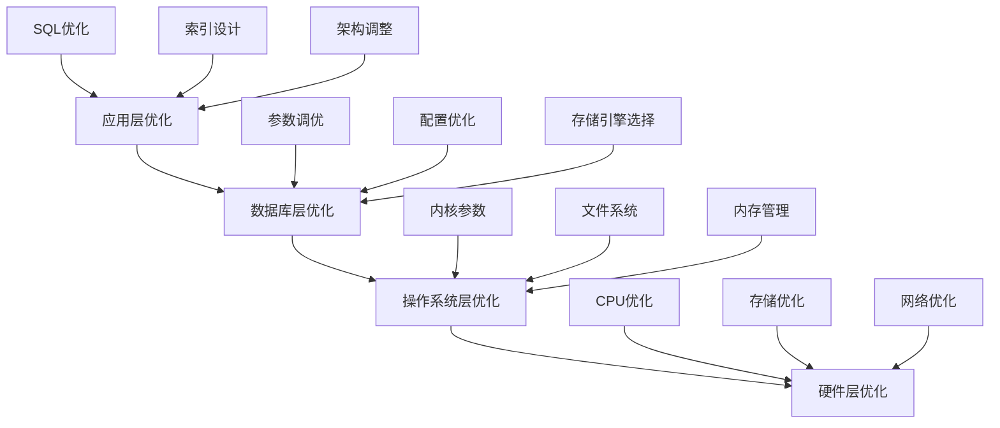

# 数据库参数调优完整指南

## 🎯 概述

数据库参数调优是提升系统性能的关键技术，通过对配置参数的精确调整，可以显著改善响应时间、吞吐量和资源利用率。本指南提供系统性的参数调优方法论和最佳实践。

## 📋 目录

1. [参数调优基础理论](#1-参数调优基础理论)
2. [MySQL参数优化](#2-mysql参数优化)
3. [PostgreSQL调优策略](#3-postgresql调优策略)
4. [MongoDB性能参数](#4-mongodb性能参数)
5. [Redis调优配置](#5-redis调优配置)
6. [系统性调优方法](#6-系统性调优方法)
7. [调优效果验证](#7-调优效果验证)

---

## 1. 参数调优基础理论

### 1.1 调优基本原则

#### 性能调优金字塔


#### 调优黄金法则
```yaml
tuning_principles:
  measure_first:
    description: "先测量再调优"
    importance: "最高"
    practice: "建立基准测试，量化当前性能"
  
  change_one_thing:
    description: "一次只改变一个参数"
    importance: "高"
    practice: "隔离变量，准确识别因果关系"
  
  monitor_continuously:
    description: "持续监控调优效果"
    importance: "高"
    practice: "实时跟踪关键指标变化"
  
  document_everything:
    description: "详细记录调优过程"
    importance: "中"
    practice: "记录参数变更和效果对比"
```

### 1.2 性能瓶颈识别

#### 瓶颈分析方法
```bash
# 系统性能瓶颈诊断脚本
diagnose_bottlenecks() {
    echo "=== 性能瓶颈诊断 ==="
    
    # CPU瓶颈检查
    echo "CPU使用率分析:"
    top -bn1 | head -20
    
    # 内存瓶颈检查
    echo "内存使用情况:"
    free -h
    echo "内存压力测试:"
    vmstat 1 5
    
    # I/O瓶颈检查
    echo "磁盘I/O分析:"
    iostat -x 1 5
    
    # 网络瓶颈检查
    echo "网络性能分析:"
    sar -n DEV 1 5
    
    # 数据库特定检查
    echo "数据库性能指标:"
    mysqladmin extended-status | grep -E "(Threads_connected|Created_tmp_disk_tables|Select_scan)"
}
```

#### 负载特征分析
```sql
-- 负载特征分析查询
SELECT 
    -- 查询类型分布
    CASE 
        WHEN DIGEST_TEXT LIKE 'SELECT%' THEN '读操作'
        WHEN DIGEST_TEXT LIKE 'INSERT%' THEN '插入操作'
        WHEN DIGEST_TEXT LIKE 'UPDATE%' THEN '更新操作'
        WHEN DIGEST_TEXT LIKE 'DELETE%' THEN '删除操作'
        ELSE '其他操作'
    END as operation_type,
    COUNT_STAR as execution_count,
    SUM_TIMER_WAIT/1000000000000 as total_time_sec,
    AVG_TIMER_WAIT/1000000000 as avg_time_ms,
    SUM_ROWS_EXAMINED as total_rows_examined,
    SUM_ROWS_SENT as total_rows_sent
FROM performance_schema.events_statements_summary_by_digest
WHERE SCHEMA_NAME = 'your_database'
GROUP BY operation_type
ORDER BY total_time_sec DESC;
```

### 1.3 调优方法论

#### 系统性调优流程
```python
# 系统性调优框架
class SystematicTuner:
    def __init__(self):
        self.baseline_metrics = {}
        self.tuning_phases = ['assessment', 'hypothesis', 'experiment', 'validation', 'implementation']
    
    def tuning_process(self, database_config):
        """完整的调优流程"""
        results = {}
        
        # 1. 现状评估
        results['assessment'] = self.assess_current_state(database_config)
        
        # 2. 假设形成
        results['hypothesis'] = self.form_hypotheses(results['assessment'])
        
        # 3. 实验设计
        results['experiment'] = self.design_experiments(results['hypothesis'])
        
        # 4. 验证测试
        results['validation'] = self.validate_changes(results['experiment'])
        
        # 5. 实施部署
        results['implementation'] = self.implement_optimizations(results['validation'])
        
        return results
    
    def assess_current_state(self, config):
        """现状评估"""
        assessment = {
            'workload_characteristics': self.analyze_workload(config),
            'current_performance': self.measure_performance(config),
            'resource_utilization': self.check_resource_usage(config),
            'configuration_review': self.review_current_settings(config)
        }
        return assessment
```

## 2. MySQL参数优化

### 2.1 核心性能参数

#### InnoDB存储引擎调优
```ini
# my.cnf 核心参数配置
[mysqld]

# 内存相关参数
innodb_buffer_pool_size = 12G           # 物理内存的70-80%
innodb_buffer_pool_instances = 8        # 并行实例数
innodb_log_file_size = 2G               # redo日志大小
innodb_log_buffer_size = 64M            # 日志缓冲区
innodb_flush_log_at_trx_commit = 2      # 事务提交刷盘策略

# 连接和线程参数
max_connections = 500                   # 最大连接数
thread_cache_size = 100                 # 线程缓存大小
table_open_cache = 4000                 # 表缓存大小
table_definition_cache = 2000           # 表定义缓存

# 查询优化参数
query_cache_type = 1                    # 查询缓存启用
query_cache_size = 256M                 # 查询缓存大小
tmp_table_size = 256M                   # 临时表大小
max_heap_table_size = 256M              # 内存表最大大小
sort_buffer_size = 2M                   # 排序缓冲区
join_buffer_size = 2M                   # 连接缓冲区
read_buffer_size = 1M                   # 顺序读取缓冲区
read_rnd_buffer_size = 1M               # 随机读取缓冲区

# 日志和复制参数
sync_binlog = 1                         # binlog同步策略
binlog_format = ROW                     # binlog格式
expire_logs_days = 7                    # binlog保留天数
```

#### 参数调优脚本
```bash
# MySQL参数优化助手
optimize_mysql_parameters() {
    echo "=== MySQL参数优化分析 ==="
    
    # 获取系统内存信息
    total_memory=$(free -g | awk '/^Mem:/{print $2}')
    echo "系统总内存: ${total_memory}GB"
    
    # 计算推荐的buffer pool大小
    recommended_buffer_pool=$((total_memory * 75 / 100))
    echo "推荐InnoDB Buffer Pool大小: ${recommended_buffer_pool}GB"
    
    # 分析当前配置
    current_buffer_pool=$(mysql -e "SHOW VARIABLES LIKE 'innodb_buffer_pool_size';" | tail -1 | awk '{print $2/1024/1024/1024}')
    echo "当前Buffer Pool大小: ${current_buffer_pool}GB"
    
    # 检查连接使用情况
    current_connections=$(mysql -e "SHOW STATUS LIKE 'Threads_connected';" | tail -1 | awk '{print $2}')
    max_connections=$(mysql -e "SHOW VARIABLES LIKE 'max_connections';" | tail -1 | awk '{print $2}')
    connection_utilization=$(echo "scale=2; $current_connections * 100 / $max_connections" | bc)
    echo "连接使用率: ${connection_utilization}%"
    
    # 生成优化建议
    generate_mysql_recommendations $total_memory $current_buffer_pool $connection_utilization
}
```

### 2.2 不同工作负载优化

#### OLTP工作负载优化
```ini
# OLTP优化配置
[mysqld]

# 高并发连接优化
max_connections = 1000
thread_handling = pool-of-threads
thread_cache_size = 200

# 事务优化
innodb_flush_log_at_trx_commit = 2
innodb_flush_method = O_DIRECT
innodb_io_capacity = 2000
innodb_io_capacity_max = 4000

# 锁优化
innodb_lock_wait_timeout = 50
innodb_deadlock_detect = ON

# 缓冲区优化
innodb_buffer_pool_size = 24G
innodb_buffer_pool_instances = 16
innodb_log_file_size = 4G
innodb_log_buffer_size = 128M
```

#### OLAP工作负载优化
```ini
# OLAP优化配置
[mysqld]

# 大查询优化
max_allowed_packet = 1G
group_concat_max_len = 1048576
tmp_table_size = 1G
max_heap_table_size = 1G

# 排序和聚合优化
sort_buffer_size = 8M
join_buffer_size = 8M
read_buffer_size = 4M
read_rnd_buffer_size = 8M

# 并行查询优化
innodb_buffer_pool_size = 32G
innodb_buffer_pool_instances = 32
innodb_read_io_threads = 16
innodb_write_io_threads = 16

# 查询缓存优化
query_cache_type = 1
query_cache_size = 512M
query_cache_limit = 32M
```

### 2.3 实时调优监控

#### 性能监控脚本
```python
# MySQL性能监控类
class MySQLPerformanceMonitor:
    def __init__(self, connection_config):
        self.connection = self.create_connection(connection_config)
        self.metrics_history = {}
    
    def collect_performance_metrics(self):
        """收集性能指标"""
        metrics = {
            'buffer_pool': self.get_buffer_pool_stats(),
            'connections': self.get_connection_stats(),
            'queries': self.get_query_stats(),
            'locks': self.get_lock_stats(),
            'replication': self.get_replication_stats()
        }
        return metrics
    
    def get_buffer_pool_stats(self):
        """获取缓冲池统计信息"""
        cursor = self.connection.cursor()
        cursor.execute("""
            SELECT 
                pool_id,
                ROUND(pool_size * 16384 / 1024 / 1024 / 1024, 2) as pool_size_gb,
                ROUND(free_buffers * 16384 / 1024 / 1024 / 1024, 2) as free_gb,
                ROUND(database_pages * 16384 / 1024 / 1024 / 1024, 2) as data_gb,
                ROUND(old_database_pages * 16384 / 1024 / 1024 / 1024, 2) as old_data_gb,
                ROUND(modified_database_pages * 16384 / 1024 / 1024 / 1024, 2) as dirty_gb
            FROM information_schema.INNODB_BUFFER_POOL_STATS
        """)
        return cursor.fetchall()
    
    def analyze_parameter_effectiveness(self, metrics_history):
        """分析参数效果"""
        analysis = {}
        
        # 缓冲池命中率分析
        buffer_hit_rates = [m['buffer_pool']['hit_rate'] for m in metrics_history[-10:]]
        analysis['buffer_pool_efficiency'] = {
            'current': buffer_hit_rates[-1],
            'trend': self.calculate_trend(buffer_hit_rates),
            'recommendation': self.buffer_pool_recommendation(buffer_hit_rates[-1])
        }
        
        # 连接使用率分析
        connection_utilization = [m['connections']['utilization'] for m in metrics_history[-10:]]
        analysis['connection_efficiency'] = {
            'current': connection_utilization[-1],
            'trend': self.calculate_trend(connection_utilization),
            'recommendation': self.connection_recommendation(connection_utilization[-1])
        }
        
        return analysis
```

## 3. PostgreSQL调优策略

### 3.1 核心配置参数

#### postgresql.conf优化
```conf
# 内存配置
shared_buffers = 8GB                    # 物理内存的25%
effective_cache_size = 24GB             # 物理内存的75%
work_mem = 64MB                         # 单个查询工作内存
maintenance_work_mem = 1GB              # 维护操作内存

# WAL和检查点配置
wal_buffers = 64MB                      # WAL缓冲区
checkpoint_segments = 64                # 检查点段数
checkpoint_completion_target = 0.9      # 检查点完成目标
checkpoint_timeout = 15min              # 检查点超时

# 查询优化器配置
random_page_cost = 1.1                  # 随机页面访问成本
seq_page_cost = 1.0                     # 顺序页面访问成本
effective_io_concurrency = 200          # IO并发度
max_worker_processes = 32               # 最大工作进程数

# 连接和并发配置
max_connections = 200                   # 最大连接数
superuser_reserved_connections = 3      # 超级用户保留连接
max_prepared_transactions = 0           # 预处理事务数

# 自动清理配置
autovacuum = on                         # 自动清理开启
autovacuum_max_workers = 6              # 最大自动清理工作进程
autovacuum_naptime = 1min               # 自动清理间隔
autovacuum_vacuum_threshold = 50        # 清理阈值
autovacuum_analyze_threshold = 50       # 分析阈值
```

#### PostgreSQL调优脚本
```bash
# PostgreSQL参数优化分析
optimize_postgresql_parameters() {
    echo "=== PostgreSQL参数优化分析 ==="
    
    # 获取系统信息
    total_memory=$(free -g | awk '/^Mem:/{print $2}')
    cpu_cores=$(nproc)
    
    echo "系统内存: ${total_memory}GB"
    echo "CPU核心数: ${cpu_cores}"
    
    # 连接到PostgreSQL获取当前配置
    psql -c "
        SELECT 
            name,
            setting,
            unit,
            short_desc
        FROM pg_settings 
        WHERE name IN (
            'shared_buffers', 'effective_cache_size', 'work_mem',
            'maintenance_work_mem', 'max_connections', 'checkpoint_segments'
        )
        ORDER BY name;
    "
    
    # 分析建议
    echo "基于系统配置的建议:"
    echo "- shared_buffers: $(echo "${total_memory} * 0.25" | bc)GB"
    echo "- effective_cache_size: $(echo "${total_memory} * 0.75" | bc)GB"
    echo "- work_mem: 根据并发查询数调整，建议64-256MB"
    echo "- max_connections: 根据应用需求，建议100-500"
}
```

### 3.2 查询优化参数

#### 查询计划器调优
```sql
-- 查询优化器参数调整
-- 调整成本常量
SET random_page_cost = 1.1;      -- SSD存储适合较低值
SET seq_page_cost = 1.0;
SET cpu_tuple_cost = 0.01;
SET cpu_index_tuple_cost = 0.005;
SET cpu_operator_cost = 0.0025;

-- 并行查询配置
SET max_parallel_workers_per_gather = 4;
SET parallel_tuple_cost = 0.1;
SET parallel_setup_cost = 1000.0;
SET min_parallel_table_scan_size = '8MB';
SET min_parallel_index_scan_size = '512kB';

-- 统计信息收集
ALTER TABLE your_table SET STATISTICS 1000;  -- 提高采样率
ANALYZE VERBOSE your_table;  -- 更新统计信息
```

#### 索引相关参数
```conf
# 索引创建和维护优化
enable_bitmapscan = on              # 位图扫描启用
enable_hashagg = on                 # 哈希聚合启用
enable_hashjoin = on                # 哈希连接启用
enable_indexscan = on               # 索引扫描启用
enable_indexonlyscan = on           # 索引仅扫描启用
enable_material = on                # 物化启用
enable_mergejoin = on               # 归并连接启用
enable_nestloop = on                # 嵌套循环启用
enable_seqscan = on                 # 顺序扫描启用
enable_sort = on                    # 排序启用
enable_tidscan = on                 # TID扫描启用
```

### 3.3 性能监控视图

#### 自定义监控视图
```sql
-- 创建性能监控视图
CREATE VIEW performance_monitoring AS
SELECT 
    datname as database_name,
    usename as user_name,
    application_name,
    client_addr,
    backend_start,
    state,
    wait_event_type,
    wait_event,
    state_change,
    query_start,
    query,
    -- 性能指标
    EXTRACT(EPOCH FROM (now() - query_start)) as query_duration_seconds,
    EXTRACT(EPOCH FROM (now() - state_change)) as state_duration_seconds
FROM pg_stat_activity 
WHERE state != 'idle' 
AND query NOT ILIKE '%pg_stat_activity%';

-- 缓冲区命中率监控
CREATE VIEW buffer_pool_stats AS
SELECT 
    blks_read,
    blks_hit,
    round(blks_hit::float/(blks_read+blks_hit)*100, 2) as hit_ratio_percent,
    now() as sample_time
FROM pg_stat_database 
WHERE datname = current_database();

-- 查询性能分析
CREATE VIEW query_performance AS
SELECT 
    queryid,
    query,
    calls,
    total_time,
    mean_time,
    rows,
    100.0 * shared_blks_hit / nullif(shared_blks_hit + shared_blks_read, 0) as hit_percent
FROM pg_stat_statements 
ORDER BY total_time DESC 
LIMIT 20;
```

## 4. MongoDB性能参数

### 4.1 核心配置优化

#### mongod.conf配置
```yaml
# MongoDB配置文件优化
storage:
  engine: wiredTiger
  wiredTiger:
    engineConfig:
      cacheSizeGB: 12                    # WiredTiger缓存大小
      blockCompressor: snappy            # 块压缩算法
    collectionConfig:
      blockCompressor: snappy
    indexConfig:
      prefixCompression: true

systemLog:
  destination: file
  path: /var/log/mongodb/mongod.log
  logAppend: true
  verbosity: 0

operationProfiling:
  slowOpThresholdMs: 100                # 慢查询阈值
  mode: slowOp                          # 性能分析模式

replication:
  oplogSizeMB: 10240                    # oplog大小(10GB)

processManagement:
  fork: true
  pidFilePath: /var/run/mongodb/mongod.pid

net:
  port: 27017
  bindIp: 0.0.0.0
  maxIncomingConnections: 65536         # 最大连接数
```

#### MongoDB调优命令
```javascript
// MongoDB参数调优
use admin

// 查看当前配置
db.runCommand({ getParameter: "*" })

// 调整WiredTiger缓存大小
db.adminCommand({ 
    "setParameter": 1, 
    "wiredTigerEngineConfigString": "cache_size=12G" 
})

// 设置慢查询阈值
db.setProfilingLevel(1, { slowms: 100 })

// 查看性能统计
db.serverStatus().wiredTiger.cache
db.serverStatus().connections
db.serverStatus().opcounters

// 分析查询性能
db.system.profile.find().sort({ millis: -1 }).limit(10)
```

### 4.2 内存和存储优化

#### 内存分配策略
```javascript
// 内存使用分析
analyze_memory_usage = function() {
    var serverStatus = db.serverStatus();
    
    // WiredTiger缓存统计
    var cache = serverStatus.wiredTiger.cache;
    print("=== WiredTiger缓存使用情况 ===");
    print("总缓存大小: " + cache["maximum bytes configured"]);
    print("当前使用: " + cache["bytes currently in the cache"]);
    print("脏页比例: " + cache["percentage overhead"]);
    print("缓存命中率: " + cache["percentage of bytes read into cache"]);
    
    // 连接统计
    var connections = serverStatus.connections;
    print("\n=== 连接统计 ===");
    print("当前连接数: " + connections.current);
    print("可用连接数: " + connections.available);
    print("总连接数: " + connections.totalCreated);
}

// 存储引擎优化
optimize_storage_engine = function() {
    // 检查存储使用情况
    db.stats()
    
    // 分析集合大小
    db.getCollectionNames().forEach(function(collName) {
        var stats = db[collName].stats();
        print("集合: " + collName);
        print("  文档数: " + stats.count);
        print("  大小: " + Math.round(stats.size/1024/1024) + " MB");
        print("  存储大小: " + Math.round(stats.storageSize/1024/1024) + " MB");
        print("  索引大小: " + Math.round(stats.totalIndexSize/1024/1024) + " MB");
        print("---");
    });
}
```

### 4.3 查询和索引优化

#### 查询性能调优
```javascript
// 查询优化分析
analyze_query_performance = function() {
    // 启用查询分析器
    db.setProfilingLevel(2);  // 记录所有操作
    
    // 执行一些典型查询
    db.collection.find({ status: "active" }).explain("executionStats");
    db.collection.aggregate([
        { $match: { createdAt: { $gte: new Date("2023-01-01") } } },
        { $group: { _id: "$category", count: { $sum: 1 } } }
    ]).explain("executionStats");
    
    // 分析慢查询
    db.system.profile.find({ 
        millis: { $gt: 100 } 
    }).sort({ 
        ts: -1 
    }).limit(10).pretty();
    
    // 重置分析级别
    db.setProfilingLevel(0);
}

// 索引优化建议
generate_index_recommendations = function() {
    // 查找未使用的索引
    var unusedIndexes = [];
    db.getCollectionNames().forEach(function(collName) {
        var coll = db[collName];
        var indexStats = coll.aggregate([{ $indexStats: {} }]);
        
        indexStats.forEach(function(stat) {
            if (stat.accesses.ops === 0) {
                unusedIndexes.push({
                    collection: collName,
                    index: stat.name,
                    since: stat.accesses.since
                });
            }
        });
    });
    
    print("未使用索引:");
    unusedIndexes.forEach(function(idx) {
        print("  " + idx.collection + "." + idx.index);
    });
}
```

## 5. Redis调优配置

### 5.1 核心性能参数

#### redis.conf优化配置
```conf
# 内存管理
maxmemory 8gb                           # 最大内存限制
maxmemory-policy allkeys-lru            # 内存淘汰策略
lazyfree-lazy-eviction yes              # 惰性删除
lazyfree-lazy-expire yes                # 惰性过期
lazyfree-lazy-server-del yes            # 惰性服务器删除

# 持久化配置
save 900 1                              # 900秒内至少1个key变化
save 300 10                             # 300秒内至少10个key变化
save 60 10000                           # 60秒内至少10000个key变化
appendonly yes                          # AOF持久化开启
appendfsync everysec                    # AOF同步策略

# 网络和连接
tcp-keepalive 300                       # TCP保活时间
timeout 0                               # 连接超时(0表示永不超时)
tcp-backlog 511                         # TCP监听队列长度
maxclients 10000                        # 最大客户端连接数

# 性能优化
hz 10                                   # 服务器频率
activerehashing yes                     # 主动重新哈希
protected-mode yes                      # 保护模式
stop-writes-on-bgsave-error no          # BGSAVE错误时不阻止写入

# 集群配置
cluster-enabled yes                     # 启用集群模式
cluster-config-file nodes.conf          # 集群配置文件
cluster-node-timeout 15000              # 节点超时时间
```

#### Redis调优脚本
```bash
#!/bin/bash
# Redis性能调优脚本

optimize_redis() {
    echo "=== Redis参数调优分析 ==="
    
    # 获取Redis信息
    redis_info=$(redis-cli INFO)
    
    # 内存使用分析
    used_memory=$(echo "$redis_info" | grep "used_memory_human" | cut -d: -f2)
    maxmemory=$(echo "$redis_info" | grep "maxmemory_human" | cut -d: -f2)
    memory_fragmentation=$(echo "$redis_info" | grep "mem_fragmentation_ratio" | cut -d: -f2)
    
    echo "内存使用情况:"
    echo "  已使用内存: $used_memory"
    echo "  最大内存限制: $maxmemory"
    echo "  内存碎片率: $memory_fragmentation"
    
    # 连接分析
    connected_clients=$(echo "$redis_info" | grep "connected_clients" | cut -d: -f2)
    blocked_clients=$(echo "$redis_info" | grep "blocked_clients" | cut -d: -f2)
    
    echo "连接统计:"
    echo "  连接客户端数: $connected_clients"
    echo "  阻塞客户端数: $blocked_clients"
    
    # 性能指标
    instantaneous_ops=$(echo "$redis_info" | grep "instantaneous_ops_per_sec" | cut -d: -f2)
    hit_rate=$(redis-cli INFO | grep "keyspace_hits" | cut -d: -f2)
    miss_rate=$(redis-cli INFO | grep "keyspace_misses" | cut -d: -f2)
    hit_ratio=$(echo "scale=2; $hit_rate / ($hit_rate + $miss_rate) * 100" | bc 2>/dev/null || echo "N/A")
    
    echo "性能指标:"
    echo "  每秒操作数: $instantaneous_ops"
    echo "  缓存命中率: ${hit_ratio}%"
    
    # 生成优化建议
    generate_redis_recommendations $memory_fragmentation $hit_ratio $connected_clients
}

generate_redis_recommendations() {
    local fragmentation=$1
    local hit_ratio=$2
    local clients=$3
    
    echo "优化建议:"
    
    # 内存碎片化建议
    if (( $(echo "$fragmentation > 1.5" | bc -l) )); then
        echo "- 内存碎片率较高(${fragmentation})，建议重启Redis或调整maxmemory-policy"
    fi
    
    # 缓存命中率建议
    if [[ "$hit_ratio" != "N/A" ]] && (( $(echo "$hit_ratio < 90" | bc -l) )); then
        echo "- 缓存命中率偏低(${hit_ratio}%)，建议增加maxmemory或优化数据访问模式"
    fi
    
    # 连接数建议
    if (( clients > 8000 )); then
        echo "- 连接数较多(${clients})，建议检查连接池配置或增加maxclients"
    fi
}
```

### 5.2 持久化策略优化

#### RDB和AOF配置
```bash
# RDB持久化优化
optimize_rdb() {
    echo "=== RDB持久化优化 ==="
    
    # 检查当前RDB配置
    redis-cli CONFIG GET save
    
    # 根据写入频率调整保存策略
    write_frequency=$(redis-cli INFO | grep "total_commands_processed" | cut -d: -f2)
    if (( write_frequency > 1000000 )); then
        echo "高频写入，建议调整RDB保存策略"
        redis-cli CONFIG SET save "60 10000"  # 更频繁保存
    elif (( write_frequency < 100000 )); then
        echo "低频写入，可以减少RDB保存频率"
        redis-cli CONFIG SET save "300 10"    # 较少保存
    fi
}

# AOF持久化优化
optimize_aof() {
    echo "=== AOF持久化优化 ==="
    
    # 检查AOF配置
    redis-cli CONFIG GET appendonly
    redis-cli CONFIG GET appendfsync
    
    # 根据性能要求调整
    performance_priority=$(get_performance_priority)  # 假设的函数
    
    if [[ "$performance_priority" == "high" ]]; then
        echo "性能优先，设置AOF为everysec"
        redis-cli CONFIG SET appendfsync "everysec"
    else
        echo "数据安全优先，设置AOF为always"
        redis-cli CONFIG SET appendfsync "always"
    fi
}
```

### 5.3 集群性能调优

#### Redis集群配置
```bash
# Redis集群性能优化
optimize_redis_cluster() {
    echo "=== Redis集群调优 ==="
    
    # 检查集群状态
    cluster_info=$(redis-cli CLUSTER INFO)
    echo "集群信息:"
    echo "$cluster_info"
    
    # 节点健康检查
    node_health=$(redis-cli CLUSTER NODES)
    echo "节点健康状态:"
    echo "$node_health" | grep -E "(fail|disconnected)"
    
    # 负载均衡检查
    slot_distribution=$(redis-cli CLUSTER SLOTS | wc -l)
    echo "槽位分布: $slot_distribution个槽位"
    
    # 生成集群优化建议
    if (( slot_distribution < 16384 )); then
        echo "警告: 槽位分布不均，建议重新分片"
    fi
}

# 集群监控脚本
monitor_cluster_performance() {
    while true; do
        echo "$(date): 集群性能快照"
        
        # 各节点性能指标
        for node in $(redis-cli CLUSTER NODES | awk '{print $2}' | cut -d@ -f1); do
            echo "节点 $node:"
            redis-cli -h ${node%:*} -p ${node#*:} INFO | grep -E "(used_memory|connected_clients|instantaneous_ops_per_sec)"
        done
        
        sleep 60
    done
}
```

## 6. 系统性调优方法

### 6.1 调优生命周期管理

#### 完整调优流程
```python
# 系统性调优管理器
class ComprehensiveTuningManager:
    def __init__(self):
        self.tuning_phases = {
            'discovery': self.discovery_phase,
            'analysis': self.analysis_phase,
            'experimentation': self.experimentation_phase,
            'validation': self.validation_phase,
            'implementation': self.implementation_phase,
            'monitoring': self.monitoring_phase
        }
    
    def execute_complete_tuning_cycle(self, database_config):
        """执行完整调优周期"""
        results = {}
        
        for phase_name, phase_method in self.tuning_phases.items():
            print(f"执行调优阶段: {phase_name}")
            results[phase_name] = phase_method(database_config, results)
            
            # 阶段间验证
            if not self.validate_phase_success(phase_name, results[phase_name]):
                print(f"阶段 {phase_name} 验证失败，停止调优")
                break
        
        return results
    
    def discovery_phase(self, config, previous_results):
        """发现阶段"""
        discovery_data = {
            'current_performance': self.measure_baseline_performance(config),
            'workload_characteristics': self.analyze_workload_patterns(config),
            'bottleneck_identification': self.identify_performance_bottlenecks(config),
            'configuration_audit': self.audit_current_configuration(config)
        }
        return discovery_data
    
    def analysis_phase(self, config, previous_results):
        """分析阶段"""
        analysis_results = {
            'root_cause_analysis': self.analyze_root_causes(previous_results['discovery']),
            'parameter_impact_assessment': self.assess_parameter_impacts(config),
            'optimization_opportunities': self.identify_optimization_opportunities(previous_results['discovery']),
            'risk_assessment': self.assess_change_risks(config)
        }
        return analysis_results
```

### 6.2 A/B测试方法

#### 参数对比测试
```python
# A/B测试框架
class ABTestingFramework:
    def __init__(self):
        self.test_groups = {}
        self.metrics_collector = MetricsCollector()
    
    def setup_ab_test(self, parameter_name, control_value, test_value, duration_hours=24):
        """设置A/B测试"""
        test_config = {
            'parameter': parameter_name,
            'control_group': {
                'value': control_value,
                'instances': self.select_control_instances()
            },
            'test_group': {
                'value': test_value,
                'instances': self.select_test_instances()
            },
            'duration': duration_hours,
            'metrics': self.define_test_metrics()
        }
        
        return self.execute_test(test_config)
    
    def execute_test(self, test_config):
        """执行测试"""
        # 应用参数变更
        self.apply_parameter_changes(test_config)
        
        # 开始监控
        start_time = time.time()
        monitoring_results = []
        
        while (time.time() - start_time) < (test_config['duration'] * 3600):
            metrics = self.collect_test_metrics(test_config)
            monitoring_results.append(metrics)
            time.sleep(300)  # 5分钟采集一次
        
        # 分析结果
        analysis = self.analyze_test_results(monitoring_results, test_config)
        return analysis
    
    def analyze_test_results(self, results, config):
        """分析测试结果"""
        analysis = {
            'statistical_significance': self.calculate_significance(results),
            'performance_impact': self.calculate_performance_impact(results),
            'resource_utilization': self.compare_resource_usage(results),
            'recommendation': self.generate_recommendation(results, config)
        }
        return analysis
```

### 6.3 自动化调优工具

#### 智能调优系统
```python
# 智能参数调优器
class IntelligentTuner:
    def __init__(self, ml_model=None):
        self.ml_model = ml_model or self.load_default_model()
        self.parameter_knowledge_base = self.build_knowledge_base()
    
    def auto_tune_database(self, database_connection, target_metrics):
        """自动调优数据库"""
        # 1. 收集当前状态
        current_state = self.collect_database_state(database_connection)
        
        # 2. 预测最优参数
        optimal_parameters = self.predict_optimal_parameters(
            current_state, 
            target_metrics
        )
        
        # 3. 生成调优计划
        tuning_plan = self.generate_tuning_plan(
            current_state['parameters'],
            optimal_parameters
        )
        
        # 4. 执行调优
        execution_results = self.execute_tuning_plan(
            database_connection,
            tuning_plan
        )
        
        # 5. 验证效果
        validation_results = self.validate_tuning_results(
            database_connection,
            target_metrics,
            execution_results
        )
        
        return {
            'plan': tuning_plan,
            'results': execution_results,
            'validation': validation_results
        }
    
    def predict_optimal_parameters(self, current_state, targets):
        """预测最优参数配置"""
        # 使用机器学习模型预测
        features = self.extract_features(current_state)
        predictions = self.ml_model.predict(features)
        
        # 结合业务约束调整
        constrained_predictions = self.apply_business_constraints(
            predictions, 
            targets, 
            current_state
        )
        
        return constrained_predictions
```

## 7. 调优效果验证

### 7.1 基准测试框架

#### 性能基准建立
```python
# 基准测试管理器
class BenchmarkManager:
    def __init__(self):
        self.benchmark_tools = {
            'sysbench': self.run_sysbench_test,
            'tpcc': self.run_tpcc_test,
            'custom': self.run_custom_workload
        }
    
    def establish_performance_baseline(self, database_config, test_duration=300):
        """建立性能基准"""
        baseline_results = {}
        
        # 运行多种基准测试
        for test_name, test_runner in self.benchmark_tools.items():
            print(f"运行基准测试: {test_name}")
            baseline_results[test_name] = test_runner(
                database_config, 
                test_duration
            )
        
        # 计算综合评分
        baseline_results['composite_score'] = self.calculate_composite_score(
            baseline_results
        )
        
        return baseline_results
    
    def run_sysbench_test(self, config, duration):
        """运行SysBench测试"""
        # CPU性能测试
        cpu_test = subprocess.run([
            'sysbench', '--test=cpu', '--cpu-max-prime=20000', 'run'
        ], capture_output=True, text=True)
        
        # 内存性能测试
        memory_test = subprocess.run([
            'sysbench', '--test=memory', '--memory-block-size=1K',
            '--memory-total-size=100G', 'run'
        ], capture_output=True, text=True)
        
        # 数据库OLTP测试
        oltp_test = subprocess.run([
            'sysbench', '--test=oltp', '--db-driver=mysql',
            f"--mysql-host={config['host']}",
            f"--mysql-port={config['port']}",
            f"--mysql-user={config['user']}",
            f"--mysql-password={config['password']}",
            '--oltp-table-size=1000000',
            f'--max-time={duration}',
            '--max-requests=0',
            'run'
        ], capture_output=True, text=True)
        
        return {
            'cpu_results': self.parse_sysbench_output(cpu_test.stdout),
            'memory_results': self.parse_sysbench_output(memory_test.stdout),
            'oltp_results': self.parse_sysbench_output(oltp_test.stdout)
        }
```

### 7.2 效果对比分析

#### 调优前后对比
```python
# 调优效果分析器
class TuningEffectAnalyzer:
    def __init__(self):
        self.metrics_analyzer = MetricsAnalyzer()
    
    def compare_before_after(self, before_metrics, after_metrics):
        """对比调优前后效果"""
        comparison = {}
        
        # 关键指标对比
        key_metrics = [
            'response_time_avg',
            'throughput_tps',
            'cpu_utilization',
            'memory_utilization',
            'disk_io_iops'
        ]
        
        for metric in key_metrics:
            before_value = before_metrics.get(metric, 0)
            after_value = after_metrics.get(metric, 0)
            
            improvement = self.calculate_improvement(before_value, after_value)
            statistical_significance = self.test_statistical_significance(
                before_metrics.get(f'{metric}_samples', []),
                after_metrics.get(f'{metric}_samples', [])
            )
            
            comparison[metric] = {
                'before': before_value,
                'after': after_value,
                'improvement': improvement,
                'significance': statistical_significance,
                'confidence_interval': self.calculate_confidence_interval(
                    before_metrics.get(f'{metric}_samples', []),
                    after_metrics.get(f'{metric}_samples', [])
                )
            }
        
        # 综合评估
        comparison['overall_assessment'] = self.assess_overall_improvement(comparison)
        
        return comparison
    
    def calculate_improvement(self, before, after):
        """计算改进幅度"""
        if before == 0:
            return float('inf') if after > 0 else 0
        
        if isinstance(before, (int, float)) and isinstance(after, (int, float)):
            return ((before - after) / before) * 100
        return 0
```

### 7.3 持续监控体系

#### 长期效果跟踪
```python
# 持续监控系统
class ContinuousMonitoringSystem:
    def __init__(self):
        self.monitoring_rules = self.load_monitoring_rules()
        self.alerting_system = AlertingSystem()
        self.trend_analyzer = TrendAnalyzer()
    
    def setup_continuous_monitoring(self, database_config):
        """设置持续监控"""
        monitoring_config = {
            'collection_interval': 60,  # 1分钟采集一次
            'retention_period': 30,     # 保留30天数据
            'alerting_rules': self.monitoring_rules,
            'dashboard_config': self.setup_dashboard()
        }
        
        return self.start_monitoring(database_config, monitoring_config)
    
    def detect_performance_degradation(self, current_metrics, baseline_metrics):
        """检测性能退化"""
        degradation_alerts = []
        
        # 检查各项指标是否超出阈值
        thresholds = {
            'response_time': 1.2,      # 比基线慢20%
            'error_rate': 0.05,        # 错误率超过5%
            'throughput': 0.8,         # 吞吐量低于80%
            'resource_utilization': 0.95  # 资源使用率超过95%
        }
        
        for metric, threshold in thresholds.items():
            current_value = current_metrics.get(metric, 0)
            baseline_value = baseline_metrics.get(metric, 0)
            
            if self.is_degraded(current_value, baseline_value, threshold):
                alert = {
                    'metric': metric,
                    'current_value': current_value,
                    'baseline_value': baseline_value,
                    'degradation_ratio': current_value / baseline_value,
                    'severity': self.calculate_severity(current_value, baseline_value, threshold)
                }
                degradation_alerts.append(alert)
        
        if degradation_alerts:
            self.alerting_system.send_alerts(degradation_alerts)
        
        return degradation_alerts
    
    def generate_tuning_recommendations(self, monitoring_data):
        """基于监控数据生成调优建议"""
        trends = self.trend_analyzer.analyze_trends(monitoring_data)
        recommendations = []
        
        # 基于趋势生成建议
        for trend_name, trend_data in trends.items():
            if trend_data['direction'] == 'degrading':
                recommendation = self.generate_recommendation_for_trend(
                    trend_name, 
                    trend_data
                )
                recommendations.append(recommendation)
        
        return recommendations
```

---

## 🔍 关键要点总结

### ✅ 调优成功要素
- **数据驱动决策**：基于实际测量数据而非猜测进行调优
- **渐进式改进**：小步快跑，避免大规模同时变更
- **充分测试验证**：在生产环境部署前充分验证效果
- **持续监控反馈**：建立长期监控机制跟踪调优效果

### ⚠️ 常见陷阱
- **过度调优**：可能导致系统不稳定或维护困难
- **忽略业务影响**：纯粹的技术指标可能不符合业务需求
- **缺乏回滚计划**：参数变更应该可逆且有应急预案
- **忽视环境差异**：不同环境下的最优参数可能不同

### 🎯 最佳实践建议
1. **建立基准测试**：调优前建立可靠的性能基准
2. **文档化所有变更**：详细记录参数变更及其效果
3. **分阶段实施**：重要的调优分多个阶段逐步实施
4. **建立监控告警**：实时监控关键指标变化
5. **定期回顾优化**：定期评估现有配置的有效性

通过科学的参数调优方法，可以在不增加硬件投入的情况下显著提升数据库性能，为企业创造更大的业务价值。