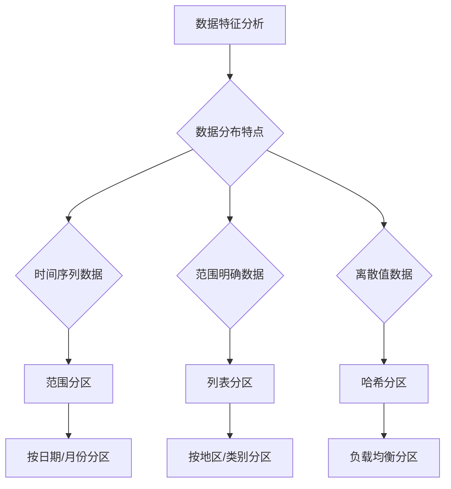

# 数据库分区优化完整指南

## 🎯 概述

数据库分区是处理海量数据的重要技术，通过将大表分割成更小的、更易管理的部分，可以显著提升查询性能和维护效率。本指南涵盖分区设计、实现和优化的完整方法论。

## 📋 目录

1. [分区基础理论](#1-分区基础理论)
2. [MySQL分区策略](#2-mysql分区策略)
3. [PostgreSQL分区实现](#3-postgresql分区实现)
4. [MongoDB分片架构](#4-mongodb分片架构)
5. [分区性能优化](#5-分区性能优化)
6. [分区维护管理](#6-分区维护管理)

---

## 1. 分区基础理论

### 1.1 分区核心概念

#### 分区类型分类
```sql
-- 水平分区 vs 垂直分区
horizontal_partitioning = {
    description: "按行分割数据",
    examples: ["按时间分区", "按地域分区", "按用户ID分区"],
    benefits: ["查询性能提升", "维护操作加速", "存储优化"]
}

vertical_partitioning = {
    description: "按列分割数据",
    examples: ["冷热数据分离", "敏感数据隔离", "访问频率分区"],
    benefits: ["减少I/O操作", "提高缓存效率", "增强安全性"]
}
```

#### 分区策略选择矩阵


### 1.2 分区设计原则

#### 设计最佳实践
```yaml
partitioning_principles:
  balance_distribution:
    rule: "确保各分区数据量相对均衡"
    example: "避免某些分区过大导致热点问题"
  
  query_alignment:
    rule: "分区键应与常用查询条件匹配"
    example: "经常按日期查询则按日期分区"
  
  maintenance_efficiency:
    rule: "考虑分区维护的便利性"
    example: "便于批量删除历史数据"
  
  future_scalability:
    rule: "预留扩展空间"
    example: "设计支持未来数据增长"
```

## 2. MySQL分区策略

### 2.1 分区类型实现

#### 范围分区
```sql
-- 按时间范围分区
CREATE TABLE sales_data (
    id INT AUTO_INCREMENT,
    sale_date DATE NOT NULL,
    product_id INT NOT NULL,
    amount DECIMAL(10,2) NOT NULL,
    PRIMARY KEY (id, sale_date)
) PARTITION BY RANGE (YEAR(sale_date)) (
    PARTITION p2020 VALUES LESS THAN (2021),
    PARTITION p2021 VALUES LESS THAN (2022),
    PARTITION p2022 VALUES LESS THAN (2023),
    PARTITION p2023 VALUES LESS THAN (2024),
    PARTITION p_future VALUES LESS THAN MAXVALUE
);

-- 按数值范围分区
CREATE TABLE user_activities (
    user_id INT NOT NULL,
    activity_date DATETIME NOT NULL,
    activity_type VARCHAR(50),
    INDEX idx_user_date (user_id, activity_date)
) PARTITION BY RANGE (user_id) (
    PARTITION p0 VALUES LESS THAN (100000),
    PARTITION p1 VALUES LESS THAN (200000),
    PARTITION p2 VALUES LESS THAN (300000),
    PARTITION p3 VALUES LESS THAN MAXVALUE
);
```

#### 列表分区
```sql
-- 按枚举值分区
CREATE TABLE customer_orders (
    order_id INT AUTO_INCREMENT,
    customer_region ENUM('NORTH', 'SOUTH', 'EAST', 'WEST') NOT NULL,
    order_date DATE NOT NULL,
    amount DECIMAL(10,2),
    PRIMARY KEY (order_id, customer_region)
) PARTITION BY LIST COLUMNS(customer_region) (
    PARTITION p_north VALUES IN ('NORTH'),
    PARTITION p_south VALUES IN ('SOUTH'),
    PARTITION p_east VALUES IN ('EAST'),
    PARTITION p_west VALUES IN ('WEST')
);
```

#### 哈希分区
```sql
-- 哈希分区实现负载均衡
CREATE TABLE transaction_logs (
    transaction_id BIGINT AUTO_INCREMENT,
    user_id INT NOT NULL,
    transaction_time TIMESTAMP DEFAULT CURRENT_TIMESTAMP,
    amount DECIMAL(12,2),
    PRIMARY KEY (transaction_id, user_id)
) PARTITION BY HASH(user_id) PARTITIONS 16;
```

### 2.2 分区管理操作

#### 分区维护脚本
```bash
#!/bin/bash
# MySQL分区维护工具

# 添加新分区
add_new_partition() {
    local table_name=$1
    local partition_name=$2
    local partition_value=$3
    
    mysql -e "
        ALTER TABLE ${table_name} 
        ADD PARTITION (
            PARTITION ${partition_name} VALUES LESS THAN (${partition_value})
        );
    "
}

# 删除旧分区
drop_old_partition() {
    local table_name=$1
    local partition_name=$2
    
    mysql -e "
        ALTER TABLE ${table_name} 
        DROP PARTITION ${partition_name};
    "
}

# 重建分区
reorganize_partition() {
    local table_name=$1
    local old_partition=$2
    local new_partitions=$3
    
    mysql -e "
        ALTER TABLE ${table_name}
        REORGANIZE PARTITION ${old_partition} INTO (${new_partitions});
    "
}

# 分区状态检查
check_partition_status() {
    local table_name=$1
    
    mysql -e "
        SELECT 
            PARTITION_NAME,
            PARTITION_ORDINAL_POSITION,
            PARTITION_METHOD,
            PARTITION_EXPRESSION,
            TABLE_ROWS,
            DATA_LENGTH,
            INDEX_LENGTH
        FROM information_schema.PARTITIONS 
        WHERE TABLE_NAME = '${table_name}'
        AND TABLE_SCHEMA = DATABASE()
        ORDER BY PARTITION_ORDINAL_POSITION;
    "
}
```

## 3. PostgreSQL分区实现

### 3.1 声明式分区

#### 范围分区表
```sql
-- PostgreSQL 10+ 声明式分区
CREATE TABLE sales (
    id SERIAL,
    sale_date DATE NOT NULL,
    product_id INT NOT NULL,
    amount NUMERIC(10,2) NOT NULL,
    PRIMARY KEY (id, sale_date)
) PARTITION BY RANGE (sale_date);

-- 创建分区表
CREATE TABLE sales_2022 PARTITION OF sales
FOR VALUES FROM ('2022-01-01') TO ('2023-01-01');

CREATE TABLE sales_2023 PARTITION OF sales
FOR VALUES FROM ('2023-01-01') TO ('2024-01-01');

CREATE TABLE sales_future PARTITION OF sales
FOR VALUES FROM ('2024-01-01') TO (MAXVALUE);
```

#### 列表分区
```sql
-- 按列表值分区
CREATE TABLE customer_data (
    customer_id SERIAL,
    region TEXT NOT NULL,
    created_date DATE NOT NULL,
    data JSONB,
    PRIMARY KEY (customer_id, region)
) PARTITION BY LIST (region);

-- 创建区域分区
CREATE TABLE customer_north PARTITION OF customer_data
FOR VALUES IN ('NORTH_AMERICA', 'CANADA', 'MEXICO');

CREATE TABLE customer_europe PARTITION OF customer_data
FOR VALUES IN ('EUROPE', 'UK', 'GERMANY', 'FRANCE');

CREATE TABLE customer_asia PARTITION OF customer_data
FOR VALUES IN ('ASIA', 'CHINA', 'JAPAN', 'INDIA');
```

### 3.2 分区性能优化

#### 分区剪枝优化
```sql
-- 查询优化示例
-- 启用分区剪枝
SET enable_partition_pruning = on;

-- 高效的分区查询
EXPLAIN (ANALYZE, BUFFERS) 
SELECT COUNT(*), AVG(amount)
FROM sales 
WHERE sale_date >= '2023-01-01' 
AND sale_date < '2023-02-01';

-- 分区键索引优化
CREATE INDEX idx_sales_date_product ON sales_2023 (sale_date, product_id);
CREATE INDEX idx_sales_product_amount ON sales_2023 (product_id, amount);
```

#### 分区维护存储过程
```sql
-- 自动分区管理函数
CREATE OR REPLACE FUNCTION manage_monthly_partitions(
    table_name TEXT,
    months_ahead INTEGER DEFAULT 3
) RETURNS VOID AS $$
DECLARE
    current_month DATE := DATE_TRUNC('month', CURRENT_DATE);
    target_month DATE;
    partition_name TEXT;
    start_date DATE;
    end_date DATE;
BEGIN
    FOR i IN 0..months_ahead LOOP
        target_month := current_month + INTERVAL '1 month' * i;
        partition_name := table_name || '_' || TO_CHAR(target_month, 'YYYY_MM');
        start_date := target_month;
        end_date := target_month + INTERVAL '1 month';
        
        -- 检查分区是否存在
        IF NOT EXISTS (
            SELECT 1 FROM pg_inherits i
            JOIN pg_class pc ON i.inhparent = pc.oid
            JOIN pg_class cc ON i.inhrelid = cc.oid
            WHERE pc.relname = table_name AND cc.relname = partition_name
        ) THEN
            -- 创建新分区
            EXECUTE format('
                CREATE TABLE %I PARTITION OF %I
                FOR VALUES FROM (%L) TO (%L)',
                partition_name, table_name, start_date, end_date
            );
            
            RAISE NOTICE 'Created partition % for range [% to %)', 
                partition_name, start_date, end_date;
        END IF;
    END LOOP;
END;
$$ LANGUAGE plpgsql;
```

## 4. MongoDB分片架构

### 4.1 分片集群配置

#### 分片键选择策略
```javascript
// 分片键设计原则
shard_key_design = {
    // 高基数属性（确保均匀分布）
    high_cardinality: {
        good_examples: ["user_id", "order_id", "timestamp"],
        bad_examples: ["status", "gender", "boolean_flag"]
    },
    
    // 查询模式对齐
    query_alignment: {
        common_queries: [
            "{ user_id: 12345 }",
            "{ date: { $gte: ISODate('2023-01-01') } }",
            "{ region: 'US', date: { $gte: ISODate('2023-01-01') } }"
        ]
    },
    
    // 写入分布优化
    write_distribution: {
        compound_keys: ["user_id", "timestamp"],
        hashed_keys: ["user_id"]  // 用于更好的分布
    }
};

// 启用分片
sh.enableSharding("myDatabase");

// 选择分片键
sh.shardCollection("myDatabase.user_sessions", { "user_id": "hashed" });
sh.shardCollection("myDatabase.orders", { "order_date": 1, "customer_id": 1 });
```

### 4.2 分片管理操作

#### 分片集群维护
```javascript
// 分片状态监控
check_shard_status = function() {
    // 检查分片分布
    db.printShardingStatus();
    
    // 检查块分布
    db.chunks.find().forEach(function(chunk) {
        print("Chunk: " + chunk._id);
        print("  Namespace: " + chunk.ns);
        print("  Shard: " + chunk.shard);
        print("  Min: " + tojson(chunk.min));
        print("  Max: " + tojson(chunk.max));
    });
    
    // 检查标签范围
    db.tags.find().forEach(function(tag) {
        print("Tag: " + tag._id);
        print("  NS: " + tag.ns);
        print("  Min: " + tojson(tag.min));
        print("  Max: " + tojson(tag.max));
        print("  Shard: " + tag.tag);
    });
};

// 平衡器管理
manage_balancer = function() {
    // 检查平衡器状态
    sh.getBalancerState();
    
    // 启动平衡器
    sh.startBalancer();
    
    // 停止平衡器
    sh.stopBalancer();
    
    // 等待当前迁移完成
    sh.waitForBalancer();
};

// 分片添加和移除
shard_management = {
    add_shard: function(shard_uri, shard_name) {
        sh.addShard(shard_uri, { name: shard_name });
    },
    
    remove_shard: function(shard_name) {
        sh.removeShard(shard_name);
    },
    
    move_chunk: function(ns, query, to_shard) {
        sh.moveChunk(ns, query, to_shard);
    }
};
```

## 5. 分区性能优化

### 5.1 查询优化策略

#### 分区剪枝技术
```sql
-- MySQL分区剪枝示例
-- 高效查询 - 只扫描相关分区
SELECT SUM(amount) 
FROM sales 
WHERE sale_date BETWEEN '2023-01-01' AND '2023-01-31';

-- 低效查询 - 可能扫描所有分区
SELECT SUM(amount) 
FROM sales 
WHERE YEAR(sale_date) = 2023;  -- 避免在分区键上使用函数

-- PostgreSQL分区剪枝
EXPLAIN (ANALYZE) 
SELECT COUNT(*) 
FROM sales 
WHERE sale_date >= '2023-06-01' 
AND sale_date < '2023-07-01';  -- 会自动剪枝到对应分区
```

#### 索引优化
```sql
-- 分区表索引策略
-- 本地分区索引（每个分区独立索引）
CREATE INDEX idx_sales_local ON sales_2023 (product_id, sale_date);

-- 全局索引（跨所有分区）
CREATE INDEX idx_sales_global ON sales (product_id) LOCAL;

-- 复合索引优化
CREATE INDEX idx_sales_composite ON sales_2023 (sale_date, product_id, amount);
```

### 5.2 存储优化

#### 分区存储引擎选择
```sql
-- 不同分区使用不同存储引擎
CREATE TABLE historical_data (
    id INT AUTO_INCREMENT,
    record_date DATE NOT NULL,
    data LONGTEXT,
    PRIMARY KEY (id, record_date)
) PARTITION BY RANGE (YEAR(record_date)) (
    PARTITION p_recent VALUES LESS THAN (2024) ENGINE=InnoDB,
    PARTITION p_archive VALUES LESS THAN MAXVALUE ENGINE=MyISAM
);

-- 压缩存储优化
ALTER TABLE sales_2020 
ENGINE=InnoDB 
ROW_FORMAT=COMPRESSED 
KEY_BLOCK_SIZE=8;
```

## 6. 分区维护管理

### 6.1 自动化维护脚本

#### 分区生命周期管理
```python
#!/usr/bin/env python3
# 分区生命周期管理工具

import mysql.connector
import datetime
import logging

class PartitionManager:
    def __init__(self, connection_config):
        self.conn = mysql.connector.connect(**connection_config)
        self.cursor = self.conn.cursor()
        self.logger = self.setup_logging()
    
    def setup_logging(self):
        logging.basicConfig(
            level=logging.INFO,
            format='%(asctime)s - %(levelname)s - %(message)s'
        )
        return logging.getLogger(__name__)
    
    def create_monthly_partitions(self, table_name, months_ahead=6):
        """创建未来月份的分区"""
        current_date = datetime.date.today()
        
        for i in range(months_ahead):
            target_date = current_date.replace(day=1) + datetime.timedelta(days=32*i)
            target_date = target_date.replace(day=1)
            
            partition_name = f"p_{target_date.strftime('%Y%m')}"
            partition_value = f"'{target_date.strftime('%Y-%m-%d')}'"
            
            # 检查分区是否已存在
            check_sql = """
                SELECT PARTITION_NAME FROM information_schema.PARTITIONS 
                WHERE TABLE_NAME = %s AND PARTITION_NAME = %s
            """
            
            self.cursor.execute(check_sql, (table_name, partition_name))
            if not self.cursor.fetchone():
                # 创建新分区
                create_sql = f"""
                    ALTER TABLE {table_name} 
                    ADD PARTITION (
                        PARTITION {partition_name} VALUES LESS THAN ({partition_value})
                    )
                """
                self.cursor.execute(create_sql)
                self.logger.info(f"Created partition {partition_name}")
    
    def drop_old_partitions(self, table_name, retention_months=12):
        """删除过期分区"""
        cutoff_date = datetime.date.today().replace(day=1) - datetime.timedelta(days=30*retention_months)
        cutoff_partition = f"p_{cutoff_date.strftime('%Y%m')}"
        
        # 获取可删除的分区列表
        get_partitions_sql = """
            SELECT PARTITION_NAME FROM information_schema.PARTITIONS 
            WHERE TABLE_NAME = %s AND PARTITION_NAME < %s
        """
        
        self.cursor.execute(get_partitions_sql, (table_name, cutoff_partition))
        old_partitions = self.cursor.fetchall()
        
        for partition in old_partitions:
            partition_name = partition[0]
            drop_sql = f"ALTER TABLE {table_name} DROP PARTITION {partition_name}"
            self.cursor.execute(drop_sql)
            self.logger.info(f"Dropped partition {partition_name}")
    
    def rebuild_partition_statistics(self, table_name):
        """重建分区统计信息"""
        analyze_sql = f"ANALYZE TABLE {table_name}"
        self.cursor.execute(analyze_sql)
        self.logger.info(f"Rebuilt statistics for {table_name}")

# 使用示例
if __name__ == "__main__":
    config = {
        'host': 'localhost',
        'user': 'root',
        'password: "${DB_PASSWORD}",
        'database': 'testdb'
    }
    
    manager = PartitionManager(config)
    manager.create_monthly_partitions('sales_data', 6)
    manager.drop_old_partitions('sales_data', 12)
    manager.rebuild_partition_statistics('sales_data')
```

### 6.2 监控和告警

#### 分区健康检查
```sql
-- 分区健康监控视图
CREATE VIEW partition_health AS
SELECT 
    TABLE_SCHEMA,
    TABLE_NAME,
    PARTITION_NAME,
    PARTITION_ORDINAL_POSITION,
    TABLE_ROWS,
    DATA_LENGTH,
    INDEX_LENGTH,
    ROUND(DATA_LENGTH/1024/1024, 2) as data_size_mb,
    ROUND(INDEX_LENGTH/1024/1024, 2) as index_size_mb,
    CASE 
        WHEN TABLE_ROWS > 10000000 THEN 'LARGE'
        WHEN TABLE_ROWS > 1000000 THEN 'MEDIUM'
        WHEN TABLE_ROWS > 100000 THEN 'SMALL'
        ELSE 'TINY'
    END as size_category,
    NOW() as check_time
FROM information_schema.PARTITIONS 
WHERE PARTITION_NAME IS NOT NULL
ORDER BY TABLE_SCHEMA, TABLE_NAME, PARTITION_ORDINAL_POSITION;

-- 分区不平衡检测
SELECT 
    TABLE_NAME,
    MIN(TABLE_ROWS) as min_rows,
    MAX(TABLE_ROWS) as max_rows,
    AVG(TABLE_ROWS) as avg_rows,
    ROUND(MAX(TABLE_ROWS)/AVG(TABLE_ROWS), 2) as imbalance_ratio
FROM information_schema.PARTITIONS 
WHERE PARTITION_NAME IS NOT NULL
GROUP BY TABLE_NAME
HAVING imbalance_ratio > 2.0;  -- 不平衡比率超过2倍
```

---

## 🔍 关键要点总结

### ✅ 分区成功要素
- **合理选择分区键**：基于查询模式和数据分布特点
- **均衡的数据分布**：避免数据倾斜和热点问题
- **适当的分区粒度**：平衡管理复杂度和性能收益
- **完善的维护机制**：自动化分区创建和清理

### ⚠️ 常见问题提醒
- **分区过多**：可能导致元数据管理开销增大
- **分区键选择不当**：无法有效利用分区剪枝
- **缺乏监控**：难以发现分区不平衡等问题
- **维护成本忽视**：未考虑长期维护的复杂性

### 🎯 最佳实践建议
1. **从小规模开始**：先在测试环境验证分区效果
2. **持续监控优化**：定期检查分区健康状况
3. **文档化策略**：记录分区设计决策和变更历史
4. **建立自动化流程**：减少人工维护工作量
5. **预留扩展空间**：设计支持未来业务增长

通过科学的分区设计和管理，可以显著提升大型数据库系统的查询性能和可维护性，为企业数据架构提供坚实的基础支撑。