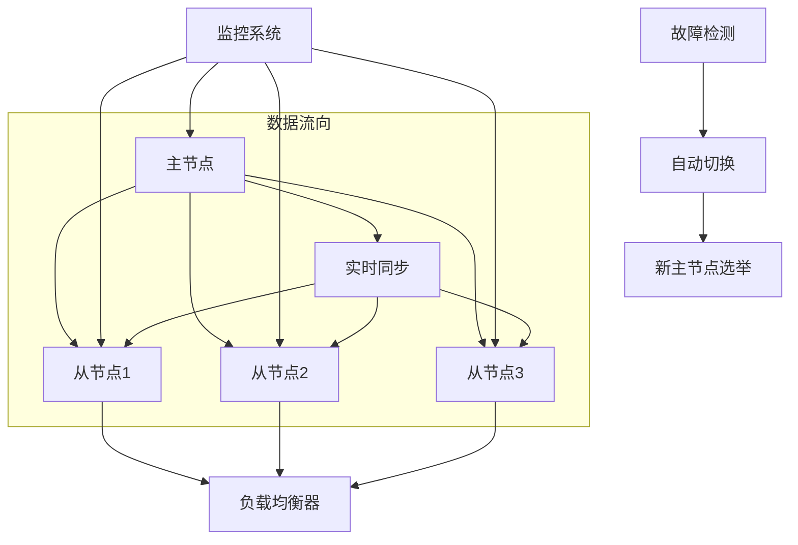

# PostgreSQL高可用架构完整指南

## 🎯 概述

PostgreSQL高可用架构是确保数据库服务连续性和数据可靠性的关键技术。本指南提供从基础复制到企业级集群的完整高可用解决方案，涵盖流复制、故障切换、负载均衡等核心技术。

## 📋 目录

1. [高可用架构基础](#1-高可用架构基础)
2. [流复制技术详解](#2-流复制技术详解)
3. [主从复制部署](#3-主从复制部署)
4. [自动故障切换](#4-自动故障切换)
5. [负载均衡配置](#5-负载均衡配置)
6. [数据一致性保障](#6-数据一致性保障)

---

## 1. 高可用架构基础

### 1.1 PostgreSQL高可用方案对比

#### 主要高可用技术
```yaml
postgresql_ha_solutions:
  streaming_replication:
    description: "流复制 - 实时数据同步"
    advantages: ["延迟低", "配置简单", "性能好"]
    disadvantages: ["单点故障", "手动故障切换"]
    use_cases: ["读写分离", "灾备方案"]
  
  patroni:
    description: "基于etcd的集群管理"
    advantages: ["自动故障切换", "配置灵活", "社区活跃"]
    disadvantages: ["依赖外部组件", "复杂度较高"]
    use_cases: ["生产环境高可用", "容器化部署"]
  
  repmgr:
    description: "复制管理工具"
    advantages: ["专门针对PostgreSQL", "成熟的管理工具"]
    disadvantages: ["功能相对单一", "社区支持有限"]
    use_cases: ["传统环境部署", "简单高可用需求"]
  
  stolon:
    description: "云原生高可用方案"
    advantages: ["Kubernetes集成", "无状态设计", "自动恢复"]
    disadvantages: ["学习曲线陡峭", "配置复杂"]
    use_cases: ["云原生环境", "微服务架构"]
```

### 1.2 架构设计原则

#### 高可用架构模式


#### 可用性计算模型
```python
# 高可用性计算
class AvailabilityCalculator:
    def __init__(self):
        self.components = {}
    
    def calculate_system_availability(self, architecture_components):
        """计算系统整体可用性"""
        # 单组件可用性
        master_availability = 0.999  # 主节点99.9%
        slave_availability = 0.995   # 从节点99.5%
        network_availability = 0.999 # 网络99.9%
        storage_availability = 0.999 # 存储99.9%
        
        # 整体可用性计算
        total_availability = (
            master_availability * 
            (1 - (1 - slave_availability) ** 3) *  # 3个从节点
            network_availability * 
            storage_availability
        )
        
        return {
            'theoretical_uptime': f"{total_availability * 100:.3f}%",
            'annual_downtime': f"{(1 - total_availability) * 365 * 24:.2f}小时",
            'monthly_downtime': f"{(1 - total_availability) * 30 * 24 * 60:.1f}分钟"
        }
    
    def design_recommendations(self, availability_target):
        """根据可用性目标提供建议"""
        recommendations = {}
        
        if availability_target >= 0.9999:  # 99.99%
            recommendations = {
                'architecture': 'multi_master_with_quorum',
                'components': ['5节点集群', '跨区域部署', '实时备份'],
                'monitoring': '毫秒级故障检测',
                'recovery': '秒级自动切换'
            }
        elif availability_target >= 0.999:  # 99.9%
            recommendations = {
                'architecture': 'master_slave_with_failover',
                'components': ['主从复制', '自动故障切换', '异地备份'],
                'monitoring': '秒级故障检测',
                'recovery': '分钟级切换'
            }
        
        return recommendations
```

## 2. 流复制技术详解

### 2.1 物理流复制

#### 基础配置
```conf
# postgresql.conf - 主节点配置
listen_addresses = '*'
port = 5432
max_connections = 200

# WAL配置
wal_level = replica
max_wal_senders = 10
max_replication_slots = 10
wal_keep_segments = 64
archive_mode = on
archive_command = 'cp %p /var/lib/postgresql/archive/%f'

# 流复制配置
hot_standby = on
max_standby_streaming_delay = 30s
wal_receiver_status_interval = 10s
hot_standby_feedback = on
```

#### 从节点配置
```conf
# postgresql.conf - 从节点配置
listen_addresses = '*'
port = 5432
max_connections = 200

# WAL配置
wal_level = replica
hot_standby = on

# 复制配置
primary_conninfo = 'host=master_host port=5432 user=replicator password=rep_password'
primary_slot_name = 'standby_slot_1'
hot_standby_feedback = on
```

#### 复制槽管理
```sql
-- 创建复制槽
SELECT pg_create_physical_replication_slot('standby_slot_1');

-- 查看复制槽状态
SELECT slot_name, active, restart_lsn, confirmed_flush_lsn
FROM pg_replication_slots;

-- 删除复制槽
SELECT pg_drop_replication_slot('standby_slot_1');
```

### 2.2 逻辑复制

#### 发布者配置
```sql
-- 创建复制用户
CREATE USER replicator WITH REPLICATION PASSWORD 'rep_password';

-- 创建发布
CREATE PUBLICATION my_publication FOR TABLE users, orders, products;

-- 查看发布信息
SELECT pubname, puballtables, pubinsert, pubupdate, pubdelete
FROM pg_publication;
```

#### 订阅者配置
```sql
-- 创建订阅
CREATE SUBSCRIPTION my_subscription
CONNECTION 'host=publisher_host port=5432 dbname=mydb user=replicator password=rep_password'
PUBLICATION my_publication;

-- 查看订阅状态
SELECT subname, subenabled, subslotname, subsynccommit
FROM pg_subscription;

-- 监控复制延迟
SELECT 
    s.subname,
    s.subenabled,
    pg_wal_lsn_diff(pg_current_wal_lsn(), s.sublatestlsn) as lag_bytes
FROM pg_subscription s;
```

## 3. 主从复制部署

### 3.1 基础环境准备

#### 系统配置脚本
```bash
#!/bin/bash
# PostgreSQL主从复制环境准备

setup_replication_environment() {
    echo "=== PostgreSQL主从复制环境准备 ==="
    
    # 1. 系统优化
    tune_system_parameters() {
        # 内核参数优化
        echo "kernel.shmmax = 1073741824" >> /etc/sysctl.conf
        echo "kernel.shmall = 262144" >> /etc/sysctl.conf
        echo "net.core.rmem_max = 16777216" >> /etc/sysctl.conf
        echo "net.core.wmem_max = 16777216" >> /etc/sysctl.conf
        sysctl -p
        
        # 文件描述符限制
        echo "* soft nofile 65536" >> /etc/security/limits.conf
        echo "* hard nofile 65536" >> /etc/security/limits.conf
    }
    
    # 2. PostgreSQL安装
    install_postgresql() {
        # CentOS/RHEL
        yum install -y postgresql14-server postgresql14-contrib
        
        # Ubuntu/Debian
        # apt install -y postgresql-14 postgresql-client-14
        
        # 初始化数据库
        postgresql-14-setup initdb
        systemctl enable postgresql-14
    }
    
    # 3. 网络配置
    configure_networking() {
        # 防火墙开放端口
        firewall-cmd --permanent --add-port=5432/tcp
        firewall-cmd --reload
        
        # hosts文件配置
        echo "192.168.1.10 master" >> /etc/hosts
        echo "192.168.1.11 slave1" >> /etc/hosts
        echo "192.168.1.12 slave2" >> /etc/hosts
    }
    
    tune_system_parameters
    install_postgresql
    configure_networking
    
    echo "环境准备完成"
}
```

### 3.2 主节点配置

#### 主节点初始化
```bash
# 主节点配置脚本
configure_master_node() {
    echo "=== 配置主节点 ==="
    
    # 1. 创建复制用户
    sudo -u postgres psql -c "
        CREATE USER replicator WITH REPLICATION 
        ENCRYPTED PASSWORD 'secure_replication_password';
        
        -- 创建测试数据库和表
        CREATE DATABASE testdb;
        \c testdb
        CREATE TABLE users (
            id SERIAL PRIMARY KEY,
            username VARCHAR(50) UNIQUE NOT NULL,
            email VARCHAR(100),
            created_at TIMESTAMP DEFAULT CURRENT_TIMESTAMP
        );
    "
    
    # 2. 配置postgresql.conf
    cat >> /var/lib/pgsql/14/data/postgresql.conf << EOF
# 基础配置
listen_addresses = '*'
port = 5432
max_connections = 200

# WAL和复制配置
wal_level = replica
max_wal_senders = 10
max_replication_slots = 10
wal_keep_segments = 64
archive_mode = on
archive_command = 'cp %p /var/lib/postgresql/archive/%f'

# 流复制配置
hot_standby = on
max_standby_streaming_delay = 30s
wal_receiver_status_interval = 10s
hot_standby_feedback = on
EOF
    
    # 3. 配置pg_hba.conf
    cat >> /var/lib/pgsql/14/data/pg_hba.conf << EOF
# 复制连接配置
host replication replicator 192.168.1.0/24 md5
host all all 192.168.1.0/24 md5
EOF
    
    # 4. 创建归档目录
    mkdir -p /var/lib/postgresql/archive
    chown postgres:postgres /var/lib/postgresql/archive
    
    # 5. 重启服务
    systemctl restart postgresql-14
    
    echo "主节点配置完成"
}
```

### 3.3 从节点配置

#### 从节点基础配置
```bash
# 从节点配置脚本
configure_slave_node() {
    local master_ip=$1
    local node_name=$2
    
    echo "=== 配置从节点 ${node_name} ==="
    
    # 1. 停止PostgreSQL服务
    systemctl stop postgresql-14
    
    # 2. 备份主节点数据
    sudo -u postgres pg_basebackup -h $master_ip -D /var/lib/pgsql/14/data \
        -U replicator -P -v -R -X stream -C -S ${node_name}_slot
    
    # 3. 配置从节点postgresql.conf
    cat >> /var/lib/pgsql/14/data/postgresql.conf << EOF
# 从节点特有配置
hot_standby = on
max_standby_streaming_delay = 30s
wal_receiver_status_interval = 10s
hot_standby_feedback = on
EOF
    
    # 4. 创建恢复配置文件
    cat > /var/lib/pgsql/14/data/standby.signal << EOF
# standby模式标识文件
EOF
    
    # 5. 启动从节点
    systemctl start postgresql-14
    
    # 6. 验证复制状态
    sudo -u postgres psql -c "
        SELECT 
            client_addr,
            state,
            sync_state,
            pg_wal_lsn_diff(pg_current_wal_lsn(), replay_lsn) as lag_bytes
        FROM pg_stat_replication;
    "
    
    echo "从节点 ${node_name} 配置完成"
}
```

## 4. 自动故障切换

### 4.1 Patroni高可用方案

#### Patroni配置
```yaml
# patroni.yml - Patroni配置文件
scope: postgres-cluster
namespace: /db/
name: postgresql0

restapi:
  listen: 0.0.0.0:8008
  connect_address: 192.168.1.10:8008

etcd:
  hosts: 192.168.1.100:2379,192.168.1.101:2379,192.168.1.102:2379

bootstrap:
  dcs:
    ttl: 30
    loop_wait: 10
    retry_timeout: 10
    maximum_lag_on_failover: 1048576
    postgresql:
      use_pg_rewind: true
      parameters:
        wal_level: replica
        hot_standby: "on"
        max_connections: 200
        max_wal_senders: 8
        wal_keep_segments: 64
        max_prepared_transactions: 0
        max_locks_per_transaction: 64
        max_worker_processes: 8

  initdb:
  - encoding: UTF8
  - data-checksums

  pg_hba:
  - host replication replicator 127.0.0.1/32 md5
  - host replication replicator 192.168.1.0/24 md5
  - host all all 0.0.0.0/0 md5

  users:
    replicator:
      password: replicator_password
      options:
        - replication

postgresql:
  listen: 0.0.0.0:5432
  connect_address: 192.168.1.10:5432
  data_dir: /var/lib/postgresql/14/main
  bin_dir: /usr/lib/postgresql/14/bin
  pgpass: /tmp/pgpass
  authentication:
    replication:
      username: replicator
      password: replicator_password
    superuser:
      username: postgres
      password: postgres_password

tags:
  nofailover: false
  noloadbalance: false
  clonefrom: false
  nosync: false
```

#### Patroni管理命令
```bash
# Patroni集群管理
patroni_cluster_management() {
    echo "=== Patroni集群管理 ==="
    
    # 启动Patroni服务
    start_patroni() {
        systemctl start patroni
        systemctl enable patroni
    }
    
    # 查看集群状态
    check_cluster_status() {
        patronictl -c /etc/patroni.yml list
    }
    
    # 手动故障切换
    manual_failover() {
        patronictl -c /etc/patroni.yml switchover
    }
    
    # 重新初始化节点
    reinitialize_node() {
        local node_name=$1
        patronictl -c /etc/patroni.yml reinit postgres-cluster $node_name
    }
    
    # 暂停集群管理
    pause_cluster() {
        patronictl -c /etc/patroni.yml pause
    }
    
    # 恢复集群管理
    resume_cluster() {
        patronictl -c /etc/patroni.yml resume
    }
}
```

### 4.2 Repmgr自动切换

#### Repmgr配置
```ini
# /etc/repmgr.conf - Repmgr配置文件
node_id=1
node_name='node1'
conninfo='host=node1 user=repmgr dbname=repmgr'
data_directory='/var/lib/postgresql/14/main'
pg_bindir='/usr/lib/postgresql/14/bin'

# 集群配置
use_replication_slots=true
replication_user='replicator'
replication_password: "${DB_PASSWORD}"
failover='automatic'
promote_command='repmgr standby promote -f /etc/repmgr.conf'
follow_command='repmgr standby follow -f /etc/repmgr.conf'
log_level=INFO
log_facility=STDERR
log_file='/var/log/repmgr/repmgr.log'

# 监控配置
monitor_interval_secs=2
retry_promote_interval_secs=300
```

#### Repmgr管理操作
```bash
# Repmgr集群管理脚本
repmgr_cluster_operations() {
    echo "=== Repmgr集群操作 ==="
    
    # 初始化主节点
    initialize_primary() {
        sudo -u postgres createuser -s repmgr
        sudo -u postgres createdb repmgr -O repmgr
        
        repmgr -f /etc/repmgr.conf primary register
    }
    
    # 注册从节点
    register_standby() {
        local primary_host=$1
        repmgr -h $primary_host -U repmgr -d repmgr standby clone
        systemctl start postgresql
        repmgr -f /etc/repmgr.conf standby register
    }
    
    # 监控集群状态
    monitor_cluster() {
        repmgr -f /etc/repmgr.conf cluster show
    }
    
    # 手动故障切换
    manual_switchover() {
        repmgr -f /etc/repmgr.conf standby switchover
    }
    
    # 自动故障检测
    setup_failover_monitoring() {
        # 配置cron任务定期检查
        echo "*/5 * * * * /usr/bin/repmgr -f /etc/repmgr.conf cluster cleanup" | crontab -
    }
}
```

## 5. 负载均衡配置

### 5.1 PgBouncer连接池

#### PgBouncer配置
```ini
# pgbouncer.ini
[databases]
mydb = host=master_host port=5432 dbname=mydb

[pgbouncer]
# 连接池配置
pool_mode = transaction
default_pool_size = 50
min_pool_size = 10
reserve_pool_size = 10
reserve_pool_timeout = 5

# 连接限制
max_client_conn = 500
default_max_db_connections = 100

# 超时配置
server_reset_query = DISCARD ALL
server_check_delay = 30
server_lifetime = 3600
server_idle_timeout = 600

# 客户端配置
client_login_timeout = 60
client_connection_check_interval = 30

# 认证配置
auth_type = md5
auth_file = /etc/pgbouncer/userlist.txt

# 日志配置
logfile = /var/log/pgbouncer/pgbouncer.log
pidfile = /var/run/pgbouncer/pgbouncer.pid
```

#### 用户认证文件
```bash
# /etc/pgbouncer/userlist.txt
"postgres" "encrypted_password"
"app_user" "encrypted_password"
"replicator" "encrypted_password"
```

### 5.2 HAProxy负载均衡

#### HAProxy配置
```haproxy
# /etc/haproxy/haproxy.cfg
global
    daemon
    maxconn 4096
    user haproxy
    group haproxy

defaults
    mode tcp
    timeout connect 5000ms
    timeout client 50000ms
    timeout server 50000ms

frontend postgresql_frontend
    bind *:5432
    default_backend postgresql_backend

backend postgresql_backend
    option httpchk
    http-check expect status 200
    server master master_host:5432 check port 8008
    server slave1 slave1_host:5432 check port 8008 backup
    server slave2 slave2_host:5432 check port 8008 backup

# 健康检查端点
listen postgresql_stats
    bind *:8080
    stats enable
    stats uri /stats
    stats realm PostgreSQL\ Statistics
    stats auth admin:admin_password
```

#### 健康检查脚本
```python
# PostgreSQL健康检查脚本
#!/usr/bin/env python3
import psycopg2
import sys

def health_check(host, port=5432, database='postgres'):
    try:
        conn = psycopg2.connect(
            host=host,
            port=port,
            database=database,
            user='health_checker',
            password: "${DB_PASSWORD}",
            connect_timeout=5
        )
        
        cur = conn.cursor()
        cur.execute('SELECT 1')
        result = cur.fetchone()
        cur.close()
        conn.close()
        
        if result and result[0] == 1:
            print("HTTP/1.1 200 OK")
            print("Content-Type: text/plain")
            print("")
            print("PostgreSQL is healthy")
            return True
        else:
            print("HTTP/1.1 503 Service Unavailable")
            print("Content-Type: text/plain")
            print("")
            print("PostgreSQL health check failed")
            return False
            
    except Exception as e:
        print("HTTP/1.1 503 Service Unavailable")
        print("Content-Type: text/plain")
        print("")
        print(f"PostgreSQL connection failed: {str(e)}")
        return False

if __name__ == "__main__":
    host = sys.argv[1] if len(sys.argv) > 1 else 'localhost'
    health_check(host)
```

## 6. 数据一致性保障

### 6.1 同步复制配置

#### 同步复制设置
```conf
# postgresql.conf - 同步复制配置
# 同步复制模式
synchronous_commit = on
synchronous_standby_names = 'FIRST 1 (slave1,slave2)'

# 同步参数调优
vacuum_defer_cleanup_age = 1000
max_standby_archive_delay = 30s
max_standby_streaming_delay = 30s
```

#### 同步状态监控
```sql
-- 监控同步复制状态
SELECT 
    application_name,
    state,
    sync_state,
    pg_wal_lsn_diff(sent_lsn, flush_lsn) as send_lag,
    pg_wal_lsn_diff(sent_lsn, replay_lsn) as replay_lag,
    pg_wal_lsn_diff(pg_current_wal_lsn(), replay_lsn) as total_lag
FROM pg_stat_replication;

-- 检查同步提交状态
SELECT name, setting, short_desc 
FROM pg_settings 
WHERE name IN ('synchronous_commit', 'synchronous_standby_names');

-- 监控WAL发送延迟
SELECT 
    client_addr,
    sent_lsn,
    write_lsn,
    flush_lsn,
    replay_lsn,
    pg_wal_lsn_diff(sent_lsn, replay_lsn) as lag_bytes
FROM pg_stat_replication;
```

### 6.2 数据校验和修复

#### 数据一致性校验
```python
# 数据一致性校验工具
class DataConsistencyChecker:
    def __init__(self, master_conn, slave_conn):
        self.master = master_conn
        self.slave = slave_conn
    
    def check_table_consistency(self, table_name, primary_key='id'):
        """检查表数据一致性"""
        # 获取主库数据摘要
        master_checksum = self.get_table_checksum(table_name, self.master)
        slave_checksum = self.get_table_checksum(table_name, self.slave)
        
        if master_checksum == slave_checksum:
            return {'consistent': True, 'checksum': master_checksum}
        else:
            # 详细对比差异
            differences = self.find_differences(table_name, primary_key)
            return {
                'consistent': False,
                'master_checksum': master_checksum,
                'slave_checksum': slave_checksum,
                'differences': differences
            }
    
    def get_table_checksum(self, table_name, connection):
        """计算表数据校验和"""
        cursor = connection.cursor()
        cursor.execute(f"""
            SELECT md5(string_agg(row_data::text, '' ORDER BY row_data))
            FROM (
                SELECT * FROM {table_name} ORDER BY ctid
            ) t(row_data)
        """)
        result = cursor.fetchone()
        cursor.close()
        return result[0] if result else None
    
    def find_differences(self, table_name, primary_key):
        """找出具体的数据差异"""
        differences = []
        
        # 使用FULL OUTER JOIN找出差异
        query = f"""
            SELECT 
                COALESCE(m.{primary_key}, s.{primary_key}) as id,
                CASE 
                    WHEN m.{primary_key} IS NULL THEN 'missing_in_master'
                    WHEN s.{primary_key} IS NULL THEN 'missing_in_slave'
                    ELSE 'data_different'
                END as difference_type,
                m.*, s.*
            FROM {table_name} m
            FULL OUTER JOIN {table_name} s ON m.{primary_key} = s.{primary_key}
            WHERE m.{primary_key} IS NULL 
               OR s.{primary_key} IS NULL 
               OR m IS DISTINCT FROM s
        """
        
        cursor = self.master.cursor()
        cursor.execute(query)
        differences = cursor.fetchall()
        cursor.close()
        
        return differences
    
    def repair_differences(self, table_name, differences):
        """修复数据差异"""
        for diff in differences:
            if diff['difference_type'] == 'missing_in_slave':
                self.copy_row_to_slave(table_name, diff['id'])
            elif diff['difference_type'] == 'missing_in_master':
                self.copy_row_to_master(table_name, diff['id'])
            elif diff['difference_type'] == 'data_different':
                self.resolve_conflict(table_name, diff['id'])

# 使用示例
checker = DataConsistencyChecker(master_connection, slave_connection)
result = checker.check_table_consistency('users', 'id')
if not result['consistent']:
    print(f"发现数据不一致，差异数量: {len(result['differences'])}")
    checker.repair_differences('users', result['differences'])
```

### 6.3 备份和恢复策略

#### PITR配置
```conf
# postgresql.conf - PITR配置
# WAL归档配置
archive_mode = on
archive_command = 'cp %p /var/lib/postgresql/archive/%f'
archive_timeout = 300

# 检查点优化
checkpoint_completion_target = 0.9
checkpoint_warning = 30s
max_wal_size = 4GB
min_wal_size = 1GB
```

#### 备份脚本
```bash
#!/bin/bash
# PostgreSQL备份脚本

perform_backup() {
    local backup_dir="/var/backups/postgresql"
    local timestamp=$(date +%Y%m%d_%H%M%S)
    local backup_name="pg_backup_${timestamp}"
    
    echo "开始执行PostgreSQL备份: ${backup_name}"
    
    # 1. 创建基础备份
    sudo -u postgres pg_basebackup \
        -D ${backup_dir}/${backup_name}/data \
        -F tar \
        -z \
        -P \
        -v \
        --checkpoint=fast \
        --label="${backup_name}"
    
    # 2. 记录备份时间线
    echo "备份完成时间: $(date)" > ${backup_dir}/${backup_name}/backup_info.txt
    echo "WAL位置: $(sudo -u postgres psql -c "SELECT pg_current_wal_lsn();" -t)" >> ${backup_dir}/${backup_name}/backup_info.txt
    
    # 3. 清理旧备份
    cleanup_old_backups() {
        find ${backup_dir} -name "pg_backup_*" -mtime +7 -exec rm -rf {} \;
    }
    
    # 4. 验证备份完整性
    verify_backup_integrity() {
        local backup_file="${backup_dir}/${backup_name}/data.tar.gz"
        if [ -f "$backup_file" ]; then
            gzip -t "$backup_file" && echo "备份文件完整性验证通过" || echo "备份文件损坏"
        fi
    }
    
    cleanup_old_backups
    verify_backup_integrity
    
    echo "备份任务完成: ${backup_name}"
}

# 恢复脚本
perform_recovery() {
    local backup_name=$1
    local recovery_target_time=$2
    
    echo "开始恢复备份: ${backup_name}"
    
    # 1. 停止PostgreSQL服务
    systemctl stop postgresql-14
    
    # 2. 清理现有数据目录
    rm -rf /var/lib/pgsql/14/data/*
    
    # 3. 解压备份
    tar -xzf /var/backups/postgresql/${backup_name}/data.tar.gz -C /var/lib/pgsql/14/data
    
    # 4. 创建恢复配置
    cat > /var/lib/pgsql/14/data/recovery.conf << EOF
restore_command = 'cp /var/lib/postgresql/archive/%f %p'
recovery_target_time = '${recovery_target_time}'
recovery_target_action = 'promote'
EOF
    
    # 5. 启动恢复
    systemctl start postgresql-14
    
    echo "恢复任务启动，正在恢复到时间点: ${recovery_target_time}"
}
```

---

## 🔍 关键要点总结

### ✅ 高可用架构成功要素
- **合理的架构设计**：根据业务需求选择合适的高可用方案
- **完善的监控体系**：实时监控集群状态和性能指标
- **自动化的故障处理**：建立可靠的自动故障检测和切换机制
- **数据一致性保障**：确保主从数据同步和一致性

### ⚠️ 常见风险提醒
- **网络分区风险**：网络故障可能导致脑裂问题
- **数据丢失风险**：异步复制可能存在数据丢失窗口
- **性能影响**：同步复制会影响写入性能
- **复杂性管理**：高可用架构增加了系统复杂度

### 🎯 最佳实践建议
1. **渐进式部署**：从简单主从复制开始，逐步升级到复杂集群
2. **充分测试**：在生产环境部署前充分测试故障切换流程
3. **文档化配置**：详细记录所有配置参数和变更历史
4. **定期演练**：定期进行故障切换演练，确保方案有效性
5. **监控告警**：建立完善的监控告警体系，及时发现问题

通过科学的PostgreSQL高可用架构设计和实施，可以显著提升数据库服务的可用性和可靠性，为企业业务连续性提供坚实保障。