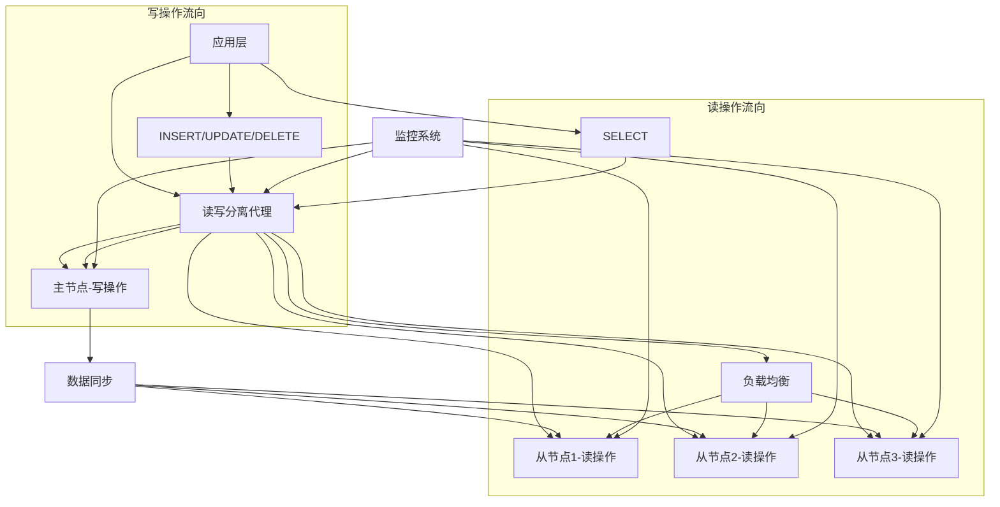

# 数据库读写分离完整指南

## 🎯 概述

数据库读写分离是提升系统性能和可用性的关键技术，通过将读操作和写操作分发到不同的数据库实例，实现负载均衡和性能优化。本指南提供从基础理论到企业级实践的完整读写分离解决方案。

## 📋 目录

1. [读写分离基础理论](#1-读写分离基础理论)
2. [MySQL读写分离实现](#2-mysql读写分离实现)
3. [PostgreSQL读写分离配置](#3-postgresql读写分离配置)
4. [负载均衡策略](#4-负载均衡策略)
5. [故障处理机制](#5-故障处理机制)
6. [监控与优化](#6-监控与优化)

---

## 1. 读写分离基础理论

### 1.1 核心概念与架构

#### 读写分离架构模式


#### 读写分离优势分析
```yaml
read_write_splitting_advantages:
  performance_improvement:
    description: "性能提升"
    benefits: 
      - "读操作分散到多个从节点"
      - "写操作集中在主节点"
      - "整体吞吐量显著提升"
    metrics: "通常可提升2-5倍读性能"
  
  availability_enhancement:
    description: "可用性增强"
    benefits:
      - "从节点故障不影响写操作"
      - "主节点故障可快速切换"
      - "系统整体稳定性提升"
    metrics: "可用性可达到99.9%以上"
  
  scalability:
    description: "可扩展性"
    benefits:
      - "可根据读负载动态增加从节点"
      - "支持水平扩展"
      - "资源利用更加灵活"
    metrics: "支持数十个从节点扩展"
  
  maintenance_flexibility:
    description: "维护灵活性"
    benefits:
      - "可在从节点进行备份操作"
      - "支持在线DDL操作"
      - "便于系统升级和维护"
    metrics: "维护窗口大幅缩短"
```

### 1.2 实现方式对比

#### 主要实现方案
```python
# 读写分离实现方案对比分析
class ReadWriteSplittingComparison:
    def __init__(self):
        self.solutions = {
            'application_level': {
                'description': '应用层实现',
                'implementation': '在应用代码中区分读写连接',
                'advantages': ['控制精细', '性能好', '无额外组件'],
                'disadvantages': ['开发复杂', '维护成本高', '耦合度高'],
                'use_cases': ['定制化需求强', '对性能要求极高']
            },
            
            'middleware_proxy': {
                'description': '中间件代理',
                'implementation': '使用数据库代理中间件',
                'advantages': ['对应用透明', '功能丰富', '易于管理'],
                'disadvantages': ['增加系统复杂度', '可能存在性能瓶颈'],
                'use_cases': ['快速部署', '标准化需求']
            },
            
            'database_builtin': {
                'description': '数据库内置',
                'implementation': '使用数据库自带的读写分离功能',
                'advantages': ['集成度高', '配置简单', '稳定性好'],
                'disadvantages': ['功能受限', '厂商绑定', '扩展性差'],
                'use_cases': ['云数据库服务', '标准化部署']
            }
        }
    
    def recommend_solution(self, requirements):
        """根据需求推荐方案"""
        scores = {}
        
        for solution_name, solution in self.solutions.items():
            score = 0
            
            # 性能要求评分
            if requirements.get('high_performance', False) and '性能好' in solution['advantages']:
                score += 30
            
            # 开发复杂度评分
            if requirements.get('quick_deployment', False) and '配置简单' in solution['advantages']:
                score += 25
            
            # 维护成本评分
            if requirements.get('low_maintenance', False) and '易于管理' in solution['advantages']:
                score += 20
            
            # 扩展性评分
            if requirements.get('scalability', False) and '支持水平扩展' in solution['advantages']:
                score += 25
            
            scores[solution_name] = score
        
        best_solution = max(scores, key=scores.get)
        return {
            'recommended': best_solution,
            'score': scores[best_solution],
            'details': self.solutions[best_solution]
        }

# 使用示例
comparator = ReadWriteSplittingComparison()
requirements = {
    'high_performance': True,
    'quick_deployment': False,
    'low_maintenance': True,
    'scalability': True
}
recommendation = comparator.recommend_solution(requirements)
```

## 2. MySQL读写分离实现

### 2.1 主从复制配置

#### 主节点配置
```ini
# my.cnf - MySQL主节点配置
[mysqld]
# 基础配置
server-id = 1
log-bin = mysql-bin
binlog-format = ROW
binlog-do-db = your_database
binlog-ignore-db = mysql

# 复制配置
log-slave-updates = 1
binlog-checksum = CRC32
binlog-row-image = FULL
expire_logs_days = 7
max_binlog_size = 100M

# 性能优化
innodb_flush_log_at_trx_commit = 2
sync_binlog = 1
innodb_buffer_pool_size = 2G
```

#### 从节点配置
```ini
# my.cnf - MySQL从节点配置
[mysqld]
# 基础配置
server-id = 2
relay-log = relay-bin
read-only = 1
skip-slave-start = 1

# 复制配置
log-slave-updates = 1
relay-log-recovery = 1
slave-net-timeout = 60
slave-skip-errors = ddl_exist_errors

# 性能优化
innodb_buffer_pool_size = 4G
innodb_read_io_threads = 8
innodb_write_io_threads = 8
```

#### 复制初始化脚本
```bash
#!/bin/bash
# MySQL主从复制初始化

initialize_mysql_replication() {
    echo "=== MySQL主从复制初始化 ==="
    
    # 1. 主节点准备
    setup_master() {
        # 创建复制用户
        mysql -e "
            CREATE USER 'repl'@'%' IDENTIFIED BY 'repl_password';
            GRANT REPLICATION SLAVE ON *.* TO 'repl'@'%';
            FLUSH PRIVILEGES;
        "
        
        # 锁定表并获取二进制日志位置
        mysql -e "FLUSH TABLES WITH READ LOCK;"
        master_status=$(mysql -e "SHOW MASTER STATUS\G")
        
        # 记录日志文件和位置
        log_file=$(echo "$master_status" | grep "File:" | awk '{print $2}')
        log_pos=$(echo "$master_status" | grep "Position:" | awk '{print $2}')
        
        # 备份数据
        mysqldump --all-databases --single-transaction --flush-logs --master-data=2 > master_backup.sql
        
        # 解锁表
        mysql -e "UNLOCK TABLES;"
        
        echo "主节点配置完成"
        echo "日志文件: $log_file"
        echo "日志位置: $log_pos"
    }
    
    # 2. 从节点配置
    setup_slave() {
        local master_host=$1
        local log_file=$2
        local log_pos=$3
        
        # 恢复数据
        mysql < master_backup.sql
        
        # 配置主从关系
        mysql -e "
            CHANGE MASTER TO
                MASTER_HOST='$master_host',
                MASTER_USER='repl',
                MASTER_password: "${DB_PASSWORD}",
                MASTER_LOG_FILE='$log_file',
                MASTER_LOG_POS=$log_pos;
        "
        
        # 启动复制
        mysql -e "START SLAVE;"
        
        # 验证复制状态
        sleep 10
        mysql -e "SHOW SLAVE STATUS\G" | grep -E "(Slave_IO_Running|Slave_SQL_Running|Seconds_Behind_Master)"
    }
    
    # 执行配置
    setup_master
    setup_slave "master_host" "$log_file" "$log_pos"
}
```

### 2.2 读写分离中间件

#### MaxScale配置
```ini
# maxscale.cnf - MaxScale配置文件
[maxscale]
threads=4

# 服务器定义
[server1]
type=server
address=master_host
port=3306
protocol=MariaDBBackend

[server2]
type=server
address=slave1_host
port=3306
protocol=MariaDBBackend

[server3]
type=server
address=slave2_host
port=3306
protocol=MariaDBBackend

# 监控器配置
[MariaDB-Monitor]
type=monitor
module=mariadbmon
servers=server1,server2,server3
user=maxscale
passwd=maxscale_password
monitor_interval=2000

# 读写分离服务
[Read-Write-Service]
type=service
router=readwritesplit
servers=server1,server2,server3
user=maxscale
passwd=maxscale_password
max_slave_connections=100%
max_sescmd_history=1000

# 监听器配置
[Read-Write-Listener]
type=listener
service=Read-Write-Service
protocol=MariaDBClient
port=4006
```

#### 应用连接配置
```python
# Python应用连接读写分离
import pymysql
from pymysql.constants import CLIENT

class ReadWriteSplitConnection:
    def __init__(self, master_config, slave_configs):
        self.master_config = master_config
        self.slave_configs = slave_configs
        self.slave_index = 0
    
    def get_master_connection(self):
        """获取主节点连接（用于写操作）"""
        return pymysql.connect(
            host=self.master_config['host'],
            port=self.master_config['port'],
            user=self.master_config['user'],
            password=self.master_config['password'],
            database=self.master_config['database'],
            client_flag=CLIENT.MULTI_STATEMENTS
        )
    
    def get_slave_connection(self):
        """获取从节点连接（用于读操作）"""
        # 轮询选择从节点
        slave_config = self.slave_configs[self.slave_index]
        self.slave_index = (self.slave_index + 1) % len(self.slave_configs)
        
        return pymysql.connect(
            host=slave_config['host'],
            port=slave_config['port'],
            user=slave_config['user'],
            password=slave_config['password'],
            database=slave_config['database'],
            client_flag=CLIENT.MULTI_STATEMENTS
        )
    
    def execute_query(self, sql, params=None, write=False):
        """执行SQL查询"""
        if write or self.is_write_operation(sql):
            conn = self.get_master_connection()
            operation_type = "写操作"
        else:
            conn = self.get_slave_connection()
            operation_type = "读操作"
        
        try:
            with conn.cursor() as cursor:
                cursor.execute(sql, params)
                if write:
                    conn.commit()
                    return cursor.rowcount
                else:
                    return cursor.fetchall()
        finally:
            conn.close()
    
    def is_write_operation(self, sql):
        """判断是否为写操作"""
        write_keywords = ['INSERT', 'UPDATE', 'DELETE', 'CREATE', 'DROP', 'ALTER']
        sql_upper = sql.upper().strip()
        return any(keyword in sql_upper for keyword in write_keywords)

# 使用示例
db_config = {
    'master': {
        'host': 'master_host',
        'port': 3306,
        'user': 'app_user',
        'password: "${DB_PASSWORD}",
        'database': 'myapp'
    },
    'slaves': [
        {
            'host': 'slave1_host',
            'port': 3306,
            'user': 'app_user',
            'password: "${DB_PASSWORD}",
            'database': 'myapp'
        },
        {
            'host': 'slave2_host',
            'port': 3306,
            'user': 'app_user',
            'password: "${DB_PASSWORD}",
            'database': 'myapp'
        }
    ]
}

db = ReadWriteSplitConnection(db_config['master'], db_config['slaves'])

# 读操作
users = db.execute_query("SELECT * FROM users WHERE status = %s", ('active',))

# 写操作
affected_rows = db.execute_query(
    "UPDATE users SET last_login = NOW() WHERE id = %s", 
    (123,), 
    write=True
)
```

## 3. PostgreSQL读写分离配置

### 3.1 逻辑复制配置

#### 发布者配置
```sql
-- 主节点配置 - 创建发布
-- postgresql.conf
wal_level = logical
max_replication_slots = 10
max_wal_senders = 10

-- 创建复制用户
CREATE USER replicator WITH REPLICATION PASSWORD 'rep_password';

-- 创建发布
CREATE PUBLICATION my_publication FOR TABLE users, orders, products;

-- 授予权限
GRANT SELECT ON TABLE users, orders, products TO replicator;
```

#### 订阅者配置
```sql
-- 从节点配置 - 创建订阅
-- postgresql.conf
wal_level = replica
hot_standby = on

-- 创建订阅
CREATE SUBSCRIPTION my_subscription
CONNECTION 'host=master_host port=5432 dbname=mydb user=replicator password=rep_password'
PUBLICATION my_publication;

-- 验证订阅状态
SELECT subname, subenabled, subslotname FROM pg_subscription;
```

### 3.2 PgBouncer读写分离

#### PgBouncer配置
```ini
# pgbouncer.ini
[databases]
mydb = host=master_host port=5432 dbname=mydb fallback_application_name=pgbouncer

[pgbouncer]
# 基础配置
pool_mode = transaction
listen_port = 6432
listen_addr = 0.0.0.0
auth_type = md5
auth_file = /etc/pgbouncer/userlist.txt
admin_users = postgres

# 连接池配置
default_pool_size = 50
min_pool_size = 10
reserve_pool_size = 10
reserve_pool_timeout = 5

# 超时配置
server_reset_query = DISCARD ALL
server_check_delay = 30
server_lifetime = 3600
server_idle_timeout = 600

# 读写分离配置
query_wait_timeout = 120
client_idle_timeout = 0
```

#### HAProxy负载均衡配置
```haproxy
# haproxy.cfg
global
    daemon
    maxconn 4096
    user haproxy
    group haproxy

defaults
    mode tcp
    timeout connect 5000ms
    timeout client 50000ms
    timeout server 50000ms

# 写操作路由到主节点
frontend write_frontend
    bind *:5432
    default_backend master_backend

# 读操作路由到从节点
frontend read_frontend
    bind *:5433
    default_backend slave_backend

backend master_backend
    server master master_host:5432 check

backend slave_backend
    balance roundrobin
    server slave1 slave1_host:5432 check
    server slave2 slave2_host:5432 check
    server slave3 slave3_host:5432 check
```

## 4. 负载均衡策略

### 4.1 负载均衡算法

#### 负载均衡策略实现
```python
# 数据库负载均衡器
import random
import time
from enum import Enum

class LoadBalancingStrategy(Enum):
    ROUND_ROBIN = "round_robin"
    WEIGHTED_ROUND_ROBIN = "weighted_round_robin"
    LEAST_CONNECTIONS = "least_connections"
    RESPONSE_TIME = "response_time"
    RANDOM = "random"

class DatabaseLoadBalancer:
    def __init__(self, servers, strategy=LoadBalancingStrategy.ROUND_ROBIN):
        self.servers = servers
        self.strategy = strategy
        self.current_index = 0
        self.server_stats = {server['host']: {'connections': 0, 'response_time': 0} 
                           for server in servers}
    
    def get_next_server(self):
        """根据策略选择下一个服务器"""
        if self.strategy == LoadBalancingStrategy.ROUND_ROBIN:
            return self._round_robin()
        elif self.strategy == LoadBalancingStrategy.WEIGHTED_ROUND_ROBIN:
            return self._weighted_round_robin()
        elif self.strategy == LoadBalancingStrategy.LEAST_CONNECTIONS:
            return self._least_connections()
        elif self.strategy == LoadBalancingStrategy.RESPONSE_TIME:
            return self._lowest_response_time()
        elif self.strategy == LoadBalancingStrategy.RANDOM:
            return self._random_selection()
    
    def _round_robin(self):
        """轮询算法"""
        server = self.servers[self.current_index]
        self.current_index = (self.current_index + 1) % len(self.servers)
        return server
    
    def _weighted_round_robin(self):
        """加权轮询算法"""
        # 根据权重分配选择概率
        total_weight = sum(server.get('weight', 1) for server in self.servers)
        rand_num = random.randint(1, total_weight)
        
        current_weight = 0
        for server in self.servers:
            current_weight += server.get('weight', 1)
            if rand_num <= current_weight:
                return server
    
    def _least_connections(self):
        """最少连接算法"""
        return min(self.servers, 
                  key=lambda s: self.server_stats[s['host']]['connections'])
    
    def _lowest_response_time(self):
        """最低响应时间算法"""
        return min(self.servers,
                  key=lambda s: self.server_stats[s['host']]['response_time'])
    
    def _random_selection(self):
        """随机选择算法"""
        return random.choice(self.servers)
    
    def update_server_stats(self, server_host, connections=None, response_time=None):
        """更新服务器统计信息"""
        if connections is not None:
            self.server_stats[server_host]['connections'] = connections
        if response_time is not None:
            self.server_stats[server_host]['response_time'] = response_time

# 使用示例
servers = [
    {'host': 'master_host', 'port': 3306, 'weight': 1, 'role': 'master'},
    {'host': 'slave1_host', 'port': 3306, 'weight': 2, 'role': 'slave'},
    {'host': 'slave2_host', 'port': 3306, 'weight': 2, 'role': 'slave'},
    {'host': 'slave3_host', 'port': 3306, 'weight': 2, 'role': 'slave'}
]

# 创建不同策略的负载均衡器
rr_lb = DatabaseLoadBalancer(servers, LoadBalancingStrategy.ROUND_ROBIN)
wrr_lb = DatabaseLoadBalancer(servers, LoadBalancingStrategy.WEIGHTED_ROUND_ROBIN)
lc_lb = DatabaseLoadBalancer(servers, LoadBalancingStrategy.LEAST_CONNECTIONS)

# 模拟请求分发
for i in range(10):
    server = rr_lb.get_next_server()
    print(f"请求 {i+1}: 分配到 {server['host']}:{server['port']}")
```

### 4.2 智能路由策略

#### 智能读写路由
```python
# 智能读写路由器
class SmartReadWriteRouter:
    def __init__(self, master_config, slave_configs):
        self.master = master_config
        self.slaves = slave_configs
        self.load_balancer = DatabaseLoadBalancer(slave_configs)
        self.query_classifier = QueryClassifier()
    
    def route_query(self, sql_query, transaction_context=None):
        """智能路由查询"""
        # 1. 分析查询类型
        query_type = self.query_classifier.classify_query(sql_query)
        
        # 2. 检查事务上下文
        if transaction_context and transaction_context.get('in_transaction'):
            return self.master  # 事务内查询走主库
        
        # 3. 根据查询类型路由
        if query_type == 'WRITE':
            return self.master
        elif query_type == 'READ':
            # 检查数据新鲜度要求
            if self.requires_fresh_data(sql_query):
                return self.master
            else:
                return self.load_balancer.get_next_server()
        elif query_type == 'DDL':
            return self.master  # DDL操作走主库
        else:
            return self.load_balancer.get_next_server()
    
    def requires_fresh_data(self, query):
        """判断是否需要最新数据"""
        # 检查是否查询刚写入的数据
        fresh_indicators = ['LAST_INSERT_ID', 'FOUND_ROWS', 'ROW_COUNT']
        return any(indicator in query.upper() for indicator in fresh_indicators)
    
    def handle_failover(self, failed_server):
        """处理服务器故障"""
        if failed_server['host'] == self.master['host']:
            # 主库故障，选择新的主库
            self.promote_new_master()
        else:
            # 从库故障，从负载均衡器中移除
            self.load_balancer.servers = [
                s for s in self.load_balancer.servers 
                if s['host'] != failed_server['host']
            ]

class QueryClassifier:
    def classify_query(self, sql):
        """SQL查询分类"""
        sql_upper = sql.strip().upper()
        
        write_keywords = ['INSERT', 'UPDATE', 'DELETE', 'REPLACE', 'CREATE', 'DROP', 'ALTER', 'TRUNCATE']
        ddl_keywords = ['CREATE', 'DROP', 'ALTER', 'TRUNCATE', 'RENAME']
        
        if any(keyword in sql_upper for keyword in write_keywords):
            if any(keyword in sql_upper for keyword in ddl_keywords):
                return 'DDL'
            else:
                return 'WRITE'
        else:
            return 'READ'

# 使用示例
router = SmartReadWriteRouter(master_config, slave_configs)

queries = [
    "SELECT * FROM users WHERE id = 1",
    "INSERT INTO users (name, email) VALUES ('John', 'john@example.com')",
    "UPDATE users SET last_login = NOW() WHERE id = 1",
    "SELECT LAST_INSERT_ID()",
    "CREATE INDEX idx_email ON users(email)"
]

for query in queries:
    target_server = router.route_query(query)
    print(f"查询: {query}")
    print(f"路由到: {target_server['host']}:{target_server['port']}")
    print("---")
```

## 5. 故障处理机制

### 5.1 健康检查系统

#### 数据库健康检查
```python
# 数据库健康检查系统
import threading
import time
from datetime import datetime

class HealthChecker:
    def __init__(self, servers, check_interval=30):
        self.servers = servers
        self.check_interval = check_interval
        self.health_status = {server['host']: True for server in servers}
        self.check_thread = None
        self.running = False
    
    def start_health_check(self):
        """启动健康检查"""
        self.running = True
        self.check_thread = threading.Thread(target=self._health_check_loop)
        self.check_thread.daemon = True
        self.check_thread.start()
    
    def stop_health_check(self):
        """停止健康检查"""
        self.running = False
        if self.check_thread:
            self.check_thread.join()
    
    def _health_check_loop(self):
        """健康检查循环"""
        while self.running:
            for server in self.servers:
                is_healthy = self._check_server_health(server)
                self.health_status[server['host']] = is_healthy
                
                if not is_healthy:
                    self._handle_server_failure(server)
            
            time.sleep(self.check_interval)
    
    def _check_server_health(self, server):
        """检查单个服务器健康状态"""
        try:
            # 尝试建立连接
            conn = self._create_connection(server)
            
            # 执行简单查询
            cursor = conn.cursor()
            cursor.execute("SELECT 1")
            result = cursor.fetchone()
            cursor.close()
            conn.close()
            
            return result is not None and result[0] == 1
            
        except Exception as e:
            print(f"健康检查失败 {server['host']}: {str(e)}")
            return False
    
    def _handle_server_failure(self, failed_server):
        """处理服务器故障"""
        print(f"[{datetime.now()}] 检测到服务器故障: {failed_server['host']}")
        
        # 记录故障信息
        self._log_failure(failed_server)
        
        # 触发告警
        self._trigger_alert(failed_server)
        
        # 执行故障转移（如果是主库）
        if failed_server.get('role') == 'master':
            self._initiate_failover(failed_server)
    
    def get_healthy_servers(self):
        """获取健康的服务器列表"""
        return [server for server in self.servers 
                if self.health_status[server['host']]]
    
    def is_server_healthy(self, server_host):
        """检查指定服务器是否健康"""
        return self.health_status.get(server_host, False)

# 使用示例
health_checker = HealthChecker(servers, check_interval=15)
health_checker.start_health_check()

# 定期检查健康状态
while True:
    healthy_servers = health_checker.get_healthy_servers()
    print(f"健康服务器数量: {len(healthy_servers)}/{len(servers)}")
    time.sleep(60)
```

### 5.2 自动故障转移

#### 故障转移实现
```python
# 自动故障转移系统
class FailoverManager:
    def __init__(self, servers, health_checker):
        self.servers = servers
        self.health_checker = health_checker
        self.current_master = self._find_initial_master()
        self.failover_history = []
    
    def _find_initial_master(self):
        """查找初始主库"""
        for server in self.servers:
            if server.get('role') == 'master':
                return server
        return self.servers[0]  # 默认第一个为master
    
    def monitor_and_failover(self):
        """监控并执行故障转移"""
        while True:
            # 检查主库是否健康
            if not self.health_checker.is_server_healthy(self.current_master['host']):
                print("检测到主库故障，启动故障转移...")
                self._execute_failover()
            
            time.sleep(10)  # 每10秒检查一次
    
    def _execute_failover(self):
        """执行故障转移"""
        failover_start_time = time.time()
        
        # 1. 确认主库确实故障
        if self.health_checker.is_server_healthy(self.current_master['host']):
            print("误报，主库实际上健康")
            return False
        
        # 2. 选择新的主库
        new_master = self._select_new_master()
        if not new_master:
            print("没有可用的从库进行故障转移")
            return False
        
        # 3. 提升从库为主库
        if self._promote_slave(new_master):
            # 4. 重新配置其他从库指向新主库
            self._reconfigure_slaves(new_master)
            
            # 5. 更新当前主库
            old_master = self.current_master
            self.current_master = new_master
            
            # 6. 记录故障转移历史
            self._record_failover(old_master, new_master, failover_start_time)
            
            print(f"故障转移完成: {old_master['host']} -> {new_master['host']}")
            return True
        else:
            print("从库提升失败")
            return False
    
    def _select_new_master(self):
        """选择新的主库"""
        healthy_slaves = [
            server for server in self.servers
            if (server.get('role') == 'slave' and 
                self.health_checker.is_server_healthy(server['host']))
        ]
        
        if not healthy_slaves:
            return None
        
        # 选择数据最接近原主库的从库
        return max(healthy_slaves, key=lambda s: self._data_lag_score(s))
    
    def _promote_slave(self, slave_server):
        """提升从库为主库"""
        try:
            # 连接到从库执行提升操作
            conn = self._create_connection(slave_server)
            cursor = conn.cursor()
            
            # 停止复制
            cursor.execute("STOP SLAVE;")
            
            # 重置复制配置
            cursor.execute("RESET SLAVE ALL;")
            
            # 设置为可写模式
            cursor.execute("SET GLOBAL read_only = OFF;")
            
            cursor.close()
            conn.close()
            
            # 更新服务器角色
            slave_server['role'] = 'master'
            return True
            
        except Exception as e:
            print(f"提升从库失败: {str(e)}")
            return False
    
    def _reconfigure_slaves(self, new_master):
        """重新配置从库指向新主库"""
        for server in self.servers:
            if (server['host'] != new_master['host'] and 
                self.health_checker.is_server_healthy(server['host'])):
                
                try:
                    self._change_master(server, new_master)
                except Exception as e:
                    print(f"重新配置从库 {server['host']} 失败: {str(e)}")
    
    def _change_master(self, slave_server, new_master):
        """更改从库的主库配置"""
        conn = self._create_connection(slave_server)
        cursor = conn.cursor()
        
        # 停止当前复制
        cursor.execute("STOP SLAVE;")
        
        # 更改主库配置
        change_master_sql = f"""
            CHANGE MASTER TO
                MASTER_HOST='{new_master['host']}',
                MASTER_PORT={new_master['port']},
                MASTER_USER='repl',
                MASTER_password: "${DB_PASSWORD}",
                MASTER_AUTO_POSITION=1;
        """
        cursor.execute(change_master_sql)
        
        # 启动复制
        cursor.execute("START SLAVE;")
        
        cursor.close()
        conn.close()

# 使用示例
failover_manager = FailoverManager(servers, health_checker)
failover_thread = threading.Thread(target=failover_manager.monitor_and_failover)
failover_thread.daemon = True
failover_thread.start()
```

## 6. 监控与优化

### 6.1 监控指标体系

#### 核心监控指标
```python
# 读写分离监控系统
class ReadWriteMonitor:
    def __init__(self, servers):
        self.servers = servers
        self.metrics_collector = MetricsCollector()
        self.alert_manager = AlertManager()
    
    def collect_metrics(self):
        """收集监控指标"""
        metrics = {
            'routing_metrics': self._collect_routing_metrics(),
            'performance_metrics': self._collect_performance_metrics(),
            'health_metrics': self._collect_health_metrics(),
            'replication_metrics': self._collect_replication_metrics()
        }
        
        self.metrics_collector.store_metrics(metrics)
        self._check_alerts(metrics)
        return metrics
    
    def _collect_routing_metrics(self):
        """收集路由指标"""
        return {
            'read_requests': self.metrics_collector.get_counter('read_requests'),
            'write_requests': self.metrics_collector.get_counter('write_requests'),
            'route_decisions': self.metrics_collector.get_counter('route_decisions'),
            'failover_events': self.metrics_collector.get_counter('failover_events')
        }
    
    def _collect_performance_metrics(self):
        """收集性能指标"""
        performance_data = {}
        
        for server in self.servers:
            server_metrics = self._get_server_performance(server)
            performance_data[server['host']] = server_metrics
        
        return performance_data
    
    def _collect_health_metrics(self):
        """收集健康指标"""
        return {
            'healthy_servers': len([s for s in self.servers 
                                  if self.health_checker.is_server_healthy(s['host'])]),
            'total_servers': len(self.servers),
            'uptime_percentage': self._calculate_uptime_percentage()
        }
    
    def _collect_replication_metrics(self):
        """收集复制指标"""
        replication_data = {}
        
        for server in self.servers:
            if server.get('role') == 'slave':
                lag = self._get_replication_lag(server)
                replication_data[server['host']] = {
                    'lag_seconds': lag,
                    'status': 'healthy' if lag < 30 else 'delayed'
                }
        
        return replication_data
    
    def _check_alerts(self, metrics):
        """检查告警条件"""
        alerts = []
        
        # 检查复制延迟
        for host, rep_data in metrics['replication_metrics'].items():
            if rep_data['lag_seconds'] > 60:
                alerts.append({
                    'type': 'replication_lag',
                    'severity': 'warning',
                    'host': host,
                    'value': rep_data['lag_seconds']
                })
        
        # 检查服务器健康状态
        health_ratio = (metrics['health_metrics']['healthy_servers'] / 
                       metrics['health_metrics']['total_servers'])
        if health_ratio < 0.7:
            alerts.append({
                'type': 'server_unhealthy',
                'severity': 'critical',
                'value': health_ratio
            })
        
        # 发送告警
        for alert in alerts:
            self.alert_manager.send_alert(alert)

# 监控面板配置
monitoring_dashboard = {
    'panels': [
        {
            'title': '读写请求分布',
            'type': 'pie_chart',
            'query': 'rate(read_requests) vs rate(write_requests)',
            'refresh_interval': '30s'
        },
        {
            'title': '服务器健康状态',
            'type': 'status_grid',
            'query': 'health_metrics.healthy_servers/total_servers',
            'thresholds': {'0.8': 'yellow', '0.9': 'green'}
        },
        {
            'title': '复制延迟监控',
            'type': 'timeseries',
            'query': 'replication_metrics.lag_seconds',
            'warning_threshold': 30,
            'critical_threshold': 60
        },
        {
            'title': '查询响应时间',
            'type': 'heatmap',
            'query': 'performance_metrics.response_time',
            'time_range': '1h'
        }
    ]
}
```

### 6.2 性能优化建议

#### 自动化优化系统
```python
# 读写分离性能优化器
class PerformanceOptimizer:
    def __init__(self, monitor_system):
        self.monitor = monitor_system
        self.optimization_history = []
    
    def analyze_and_optimize(self):
        """分析并优化性能"""
        metrics = self.monitor.collect_metrics()
        recommendations = self._generate_recommendations(metrics)
        
        for recommendation in recommendations:
            if self._should_apply_optimization(recommendation, metrics):
                self._apply_optimization(recommendation)
                self._record_optimization(recommendation)
    
    def _generate_recommendations(self, metrics):
        """生成优化建议"""
        recommendations = []
        
        # 负载均衡优化
        load_distribution = self._analyze_load_distribution(metrics)
        if load_distribution['imbalance_ratio'] > 1.5:
            recommendations.append({
                'type': 'load_balancing',
                'action': 'adjust_weights',
                'parameters': self._calculate_optimal_weights(load_distribution)
            })
        
        # 连接池优化
        connection_utilization = self._analyze_connection_usage(metrics)
        if connection_utilization['peak_usage'] > 0.85:
            recommendations.append({
                'type': 'connection_pool',
                'action': 'increase_pool_size',
                'parameters': {'increase_percentage': 20}
            })
        
        # 查询路由优化
        routing_efficiency = self._analyze_routing_efficiency(metrics)
        if routing_efficiency['misroute_rate'] > 0.05:
            recommendations.append({
                'type': 'query_routing',
                'action': 'refine_classification_rules',
                'parameters': self._identify_problematic_queries(routing_efficiency)
            })
        
        return recommendations
    
    def _should_apply_optimization(self, recommendation, metrics):
        """判断是否应该应用优化"""
        # 避免频繁优化
        recent_optimizations = [
            opt for opt in self.optimization_history[-10:]
            if opt['type'] == recommendation['type']
        ]
        
        if len(recent_optimizations) > 2:
            return False  # 同类型优化过于频繁
        
        # 检查优化条件
        return self._check_optimization_conditions(recommendation, metrics)
    
    def _apply_optimization(self, recommendation):
        """应用优化建议"""
        print(f"应用优化: {recommendation['type']} - {recommendation['action']}")
        
        if recommendation['type'] == 'load_balancing':
            self._adjust_load_balancer_weights(recommendation['parameters'])
        elif recommendation['type'] == 'connection_pool':
            self._resize_connection_pools(recommendation['parameters'])
        elif recommendation['type'] == 'query_routing':
            self._update_routing_rules(recommendation['parameters'])

# 性能基准测试
def run_performance_benchmark():
    """运行性能基准测试"""
    test_scenarios = [
        {
            'name': '纯读测试',
            'queries': ['SELECT * FROM users LIMIT 100'] * 1000,
            'concurrent_users': 50
        },
        {
            'name': '纯写测试',
            'queries': ['INSERT INTO users (name) VALUES (?)'] * 1000,
            'concurrent_users': 20
        },
        {
            'name': '混合读写测试',
            'queries': (['SELECT * FROM users WHERE id=?'] * 4 + 
                       ['UPDATE users SET name=? WHERE id=?']) * 200,
            'concurrent_users': 30
        }
    ]
    
    results = {}
    for scenario in test_scenarios:
        print(f"执行测试: {scenario['name']}")
        result = execute_load_test(scenario)
        results[scenario['name']] = result
        print(f"TPS: {result['tps']}, 平均响应时间: {result['avg_response_time']}ms")
    
    return results

# 使用示例
monitor = ReadWriteMonitor(servers)
optimizer = PerformanceOptimizer(monitor)

# 定期优化
while True:
    optimizer.analyze_and_optimize()
    time.sleep(300)  # 每5分钟优化一次
```

---

## 🔍 关键要点总结

### ✅ 读写分离成功要素
- **合理的架构设计**：根据业务特点选择合适的实现方案
- **完善的监控体系**：实时监控路由效果和系统性能
- **自动化的故障处理**：建立可靠的故障检测和转移机制
- **持续的性能优化**：定期分析和优化路由策略

### ⚠️ 常见风险提醒
- **数据一致性风险**：主从延迟可能导致读取到过期数据
- **路由策略风险**：复杂的路由逻辑可能引入性能瓶颈
- **故障转移风险**：自动故障转移可能带来短暂的服务中断
- **运维复杂度**：相比单节点架构，运维复杂度显著增加

### 🎯 最佳实践建议
1. **渐进式实施**：从简单配置开始，逐步增加复杂功能
2. **充分测试**：在生产环境部署前充分测试各种场景
3. **文档化配置**：详细记录所有配置参数和变更历史
4. **监控告警**：建立完善的监控告警体系
5. **定期评估**：定期回顾和优化读写分离效果

通过科学的读写分离设计和实施，可以显著提升数据库系统的性能和可用性，为企业业务发展提供强有力的数据支撑。