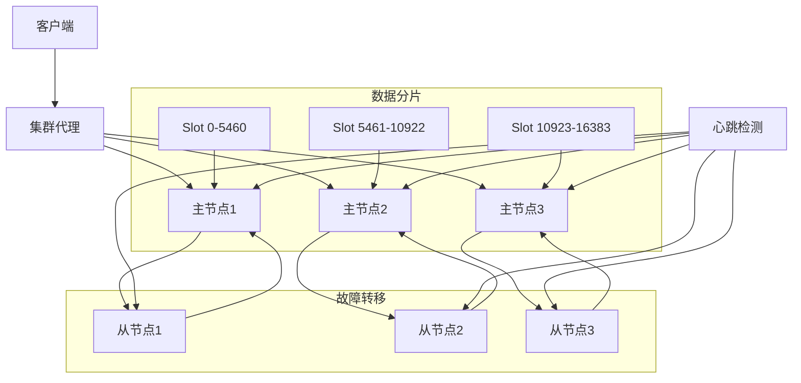

# Redis集群架构完整指南

## 🎯 概述

Redis集群是Redis官方提供的分布式解决方案，通过数据分片和自动故障转移实现高可用性和水平扩展。本指南提供从基础部署到高级管理的完整Redis集群实践方案。

## 📋 目录

1. [集群基础理论](#1-集群基础理论)
2. [六节点集群部署](#2-六节点集群部署)
3. [数据分片管理](#3-数据分片管理)
4. [故障检测与转移](#4-故障检测与转移)
5. [集群监控运维](#5-集群监控运维)
6. [性能优化实践](#6-性能优化实践)

---

## 1. 集群基础理论

### 1.1 Redis集群架构

#### 集群核心概念


#### 集群关键特性
```yaml
redis_cluster_features:
  data_sharding:
    description: "数据分片 - 16384个哈希槽"
    mechanism: "CRC16(key) % 16384"
    benefits: ["水平扩展", "负载均衡", "无中心节点"]
  
  high_availability:
    description: "高可用性 - 主从复制和故障转移"
    mechanism: "Gossip协议 + Raft算法"
    benefits: ["自动故障检测", "秒级故障转移", "数据冗余"]
  
  linear_scaling:
    description: "线性扩展 - 支持动态添加节点"
    mechanism: "槽位重新分配"
    benefits: ["无缝扩容", "在线迁移", "资源弹性"]
  
  client_redirection:
    description: "客户端重定向 - MOVED和ASK命令"
    mechanism: "智能客户端路由"
    benefits: ["减少代理开销", "直接节点访问", "性能优化"]
```

### 1.2 集群设计原则

#### 节点规划建议
```python
# Redis集群节点规划工具
class ClusterPlanner:
    def __init__(self, data_requirements):
        self.requirements = data_requirements
        self.node_specs = {}
    
    def calculate_node_requirements(self):
        """计算节点配置需求"""
        # 基于数据量计算内存需求
        data_size_gb = self.requirements['data_size_gb']
        replication_factor = self.requirements.get('replication_factor', 2)
        overhead_factor = 1.3  # 30%内存开销
        
        total_memory_needed = data_size_gb * replication_factor * overhead_factor
        
        # 计算节点数量
        nodes_per_role = {
            'masters': self.calculate_master_nodes(data_size_gb),
            'slaves': self.calculate_slave_nodes(data_size_gb),
            'total': 0
        }
        
        nodes_per_role['total'] = nodes_per_role['masters'] + nodes_per_role['slaves']
        
        return {
            'memory_per_node_gb': total_memory_needed / nodes_per_role['total'],
            'node_count': nodes_per_role,
            'network_bandwidth_mbps': self.calculate_network_bandwidth(nodes_per_role['total']),
            'disk_space_gb': data_size_gb * 1.5  # 包含AOF和RDB
        }
    
    def generate_deployment_plan(self):
        """生成部署计划"""
        requirements = self.calculate_node_requirements()
        
        plan = {
            'node_configuration': self.configure_nodes(requirements),
            'network_topology': self.design_network_topology(),
            'monitoring_setup': self.setup_monitoring_infrastructure(),
            'failure_scenarios': self.plan_failure_handling()
        }
        
        return plan

# 使用示例
planner = ClusterPlanner({
    'data_size_gb': 50,
    'expected_qps': 100000,
    'availability_target': 0.999
})
deployment_plan = planner.generate_deployment_plan()
```

## 2. 六节点集群部署

### 2.1 环境准备

#### 系统配置脚本
```bash
#!/bin/bash
# Redis集群环境准备脚本

prepare_cluster_environment() {
    echo "=== Redis集群环境准备 ==="
    
    # 1. 系统优化
    optimize_system() {
        # 内核参数优化
        echo "vm.overcommit_memory = 1" >> /etc/sysctl.conf
        echo "net.core.somaxconn = 65535" >> /etc/sysctl.conf
        echo "net.ipv4.tcp_tw_reuse = 1" >> /etc/sysctl.conf
        sysctl -p
        
        # 内存大页禁用
        echo never > /sys/kernel/mm/transparent_hugepage/enabled
        
        # 文件描述符限制
        echo "* soft nofile 262144" >> /etc/security/limits.conf
        echo "* hard nofile 262144" >> /etc/security/limits.conf
    }
    
    # 2. Redis安装
    install_redis() {
        # 下载编译Redis 7.0
        cd /tmp
        wget http://download.redis.io/releases/redis-7.0.8.tar.gz
        tar xzf redis-7.0.8.tar.gz
        cd redis-7.0.8
        make && make install
        
        # 创建用户和目录
        useradd -r -s /sbin/nologin redis
        mkdir -p /etc/redis /var/lib/redis /var/log/redis
        chown redis:redis /var/lib/redis /var/log/redis
    }
    
    # 3. 网络配置
    configure_networking() {
        # 防火墙开放端口
        for port in {7000..7005} 17000; do
            firewall-cmd --permanent --add-port=${port}/tcp
        done
        firewall-cmd --reload
        
        # hosts文件配置
        cat >> /etc/hosts << EOF
192.168.1.10 redis-node-1
192.168.1.11 redis-node-2
192.168.1.12 redis-node-3
192.168.1.13 redis-node-4
192.168.1.14 redis-node-5
192.168.1.15 redis-node-6
EOF
    }
    
    optimize_system
    install_redis
    configure_networking
    
    echo "环境准备完成"
}
```

### 2.2 节点配置

#### Redis配置文件模板
```conf
# redis.conf - Redis节点配置模板
port 7000
bind 0.0.0.0
daemonize yes
pidfile /var/run/redis/redis-7000.pid
logfile /var/log/redis/redis-7000.log
dir /var/lib/redis/7000

# 集群配置
cluster-enabled yes
cluster-config-file nodes-7000.conf
cluster-node-timeout 15000
cluster-announce-ip 192.168.1.10
cluster-announce-port 7000
cluster-announce-bus-port 17000

# 持久化配置
appendonly yes
appendfilename "appendonly-7000.aof"
appendfsync everysec
auto-aof-rewrite-percentage 100
auto-aof-rewrite-min-size 64mb

# 内存配置
maxmemory 2gb
maxmemory-policy allkeys-lru
lazyfree-lazy-eviction yes
lazyfree-lazy-expire yes

# 网络配置
tcp-keepalive 300
timeout 0
tcp-backlog 511

# 安全配置
requirepass your_redis_password
masterauth your_redis_password
```

#### 集群初始化脚本
```bash
#!/bin/bash
# Redis集群初始化脚本

initialize_redis_cluster() {
    echo "=== Redis集群初始化 ==="
    
    # 1. 启动所有节点
    start_all_nodes() {
        local ports=(7000 7001 7002 7003 7004 7005)
        local ips=("192.168.1.10" "192.168.1.11" "192.168.1.12" 
                  "192.168.1.13" "192.168.1.14" "192.168.1.15")
        
        for i in "${!ports[@]}"; do
            local port=${ports[$i]}
            local ip=${ips[$i]}
            
            # 创建节点目录和配置文件
            mkdir -p /var/lib/redis/$port
            cp /tmp/redis.conf /etc/redis/redis-$port.conf
            sed -i "s/7000/$port/g" /etc/redis/redis-$port.conf
            sed -i "s/192.168.1.10/$ip/g" /etc/redis/redis-$port.conf
            
            # 启动Redis实例
            redis-server /etc/redis/redis-$port.conf
        done
    }
    
    # 2. 创建集群
    create_cluster() {
        # 使用redis-cli创建集群
        echo "yes" | redis-cli --cluster create \
            192.168.1.10:7000 \
            192.168.1.11:7001 \
            192.168.1.12:7002 \
            192.168.1.13:7003 \
            192.168.1.14:7004 \
            192.168.1.15:7005 \
            --cluster-replicas 1
    }
    
    # 3. 验证集群状态
    verify_cluster() {
        redis-cli -c -p 7000 cluster nodes
        redis-cli -c -p 7000 cluster info
    }
    
    start_all_nodes
    sleep 10
    create_cluster
    verify_cluster
    
    echo "Redis集群初始化完成"
}
```

## 3. 数据分片管理

### 3.1 槽位分配策略

#### 槽位管理命令
```bash
# Redis集群槽位管理
cluster_slot_management() {
    echo "=== Redis集群槽位管理 ==="
    
    # 查看槽位分配
    check_slot_distribution() {
        redis-cli -c -p 7000 cluster slots | head -20
    }
    
    # 手动迁移槽位
    migrate_slots() {
        local source_node=$1
        local target_node=$2
        local slots=$3
        
        # 设置导入状态
        redis-cli -c -h $target_node -p 7000 cluster setslot $slots IMPORTING $source_node
        
        # 设置导出状态
        redis-cli -c -h $source_node -p 7000 cluster setslot $slots MIGRATING $target_node
        
        # 执行数据迁移
        redis-cli -c -h $source_node -p 7000 cluster getkeysinslot $slots 1000 | \
        xargs -I {} redis-cli -c -h $source_node -p 7000 migrate $target_node 7000 {} 0 5000
        
        # 完成槽位迁移
        redis-cli -c -h $target_node -p 7000 cluster setslot $slots NODE $target_node
        redis-cli -c -h $source_node -p 7000 cluster setslot $slots NODE $target_node
    }
    
    # 重新分片集群
    reshard_cluster() {
        local target_node=$1
        local num_slots=$2
        
        redis-cli --cluster reshard 192.168.1.10:7000 \
            --cluster-from all \
            --cluster-to $target_node \
            --cluster-slots $num_slots \
            --cluster-yes
    }
}
```

### 3.2 数据分布优化

#### 分片键设计
```python
# Redis集群分片键优化
class ShardingKeyOptimizer:
    def __init__(self, cluster_client):
        self.cluster = cluster_client
        self.key_patterns = {}
    
    def analyze_key_distribution(self):
        """分析键分布情况"""
        slot_distribution = {}
        
        # 获取所有键的槽位分布
        for key in self.scan_all_keys():
            slot = self.get_slot_for_key(key)
            slot_distribution[slot] = slot_distribution.get(slot, 0) + 1
        
        # 分析分布均匀性
        slots_used = len(slot_distribution)
        avg_keys_per_slot = sum(slot_distribution.values()) / slots_used
        variance = self.calculate_variance(slot_distribution.values())
        
        return {
            'slots_used': slots_used,
            'avg_keys_per_slot': avg_keys_per_slot,
            'distribution_variance': variance,
            'hot_slots': self.identify_hot_slots(slot_distribution)
        }
    
    def optimize_key_patterns(self, current_distribution):
        """优化键模式以改善分布"""
        recommendations = []
        
        # 检查热点槽位
        hot_slots = current_distribution['hot_slots']
        if hot_slots:
            recommendations.append({
                'type': 'key_redesign',
                'issue': '热点槽位 detected',
                'suggestion': '重新设计键前缀以分散槽位分布',
                'example': '使用哈希标签: {user:123}:profile -> user:{123}:profile'
            })
        
        # 检查槽位使用率
        slot_utilization = current_distribution['slots_used'] / 16384
        if slot_utilization < 0.5:
            recommendations.append({
                'type': 'cluster_resize',
                'issue': '槽位使用率低',
                'suggestion': '考虑减少集群节点数以提高资源利用率'
            })
        
        return recommendations
    
    def get_slot_for_key(self, key):
        """计算键对应的槽位"""
        import hashlib
        key_hash = hashlib.sha1(key.encode()).hexdigest()
        return int(key_hash[:4], 16) % 16384

# 使用示例
optimizer = ShardingKeyOptimizer(redis_cluster_client)
distribution = optimizer.analyze_key_distribution()
recommendations = optimizer.optimize_key_patterns(distribution)
```

## 4. 故障检测与转移

### 4.1 故障检测机制

#### 节点健康检查
```python
# Redis集群故障检测
class ClusterFailureDetector:
    def __init__(self, cluster_nodes):
        self.nodes = cluster_nodes
        self.failure_history = []
    
    def detect_node_failures(self):
        """检测节点故障"""
        failures = []
        
        for node in self.nodes:
            health_status = self.check_node_health(node)
            if not health_status['healthy']:
                failure = {
                    'node': node,
                    'failure_time': time.time(),
                    'failure_type': health_status['failure_type'],
                    'detection_method': health_status['detection_method']
                }
                failures.append(failure)
                self.record_failure(failure)
        
        return failures
    
    def check_node_health(self, node):
        """检查单个节点健康状态"""
        checks = {
            'ping': self.ping_node(node),
            'cluster_info': self.get_cluster_info(node),
            'memory_usage': self.check_memory_usage(node),
            'connection_count': self.check_connections(node)
        }
        
        # 综合判断节点健康状态
        unhealthy_checks = [k for k, v in checks.items() if not v['healthy']]
        
        if len(unhealthy_checks) >= 2:
            return {
                'healthy': False,
                'failure_type': 'multiple_failures',
                'detection_method': unhealthy_checks,
                'details': {k: v for k, v in checks.items() if k in unhealthy_checks}
            }
        elif checks['ping']['healthy'] and checks['cluster_info']['healthy']:
            return {'healthy': True}
        else:
            return {
                'healthy': False,
                'failure_type': 'partial_failure',
                'detection_method': [k for k, v in checks.items() if not v['healthy']]
            }
    
    def trigger_failover(self, failed_node):
        """触发故障转移"""
        # 检查是否有从节点可以接管
        slave_nodes = self.get_slave_nodes(failed_node)
        if not slave_nodes:
            raise Exception(f"No slave nodes available for {failed_node}")
        
        # 选择最佳从节点进行故障转移
        best_slave = self.select_best_slave(slave_nodes)
        
        # 执行故障转移
        result = self.execute_failover(best_slave, failed_node)
        
        return {
            'failed_node': failed_node,
            'new_master': best_slave,
            'failover_time': time.time(),
            'result': result
        }

# 监控脚本
monitor_cluster_health() {
    while true; do
        # 检查集群状态
        redis-cli -c -p 7000 cluster info | grep -E "(cluster_state|cluster_slots_assigned)"
        
        # 检查节点状态
        redis-cli -c -p 7000 cluster nodes | grep -E "(fail|disconnected)"
        
        # 检查内存使用
        for port in {7000..7005}; do
            redis-cli -p $port info memory | grep used_memory_human
        done
        
        sleep 30
    done
}
```

### 4.2 自动故障转移

#### 故障转移配置
```conf
# redis.conf - 故障转移相关配置
# 节点超时配置
cluster-node-timeout 15000           # 节点超时时间15秒
cluster-slave-validity-factor 10     # 从节点有效性因子
cluster-migration-barrier 1          # 迁移屏障

# 故障检测配置
tcp-keepalive 300                    # TCP保活时间
timeout 0                            # 连接超时(0表示永不超时)

# 从节点配置
slave-priority 100                   # 从节点优先级
slave-serve-stale-data yes           # 允许服务过期数据
slave-read-only yes                  # 从节点只读
```

#### 故障转移测试
```bash
# 故障转移测试脚本
test_failover_process() {
    echo "=== 故障转移测试 ==="
    
    # 1. 模拟主节点故障
    simulate_master_failure() {
        local master_port=$1
        echo "模拟主节点 $master_port 故障"
        
        # 停止主节点
        redis-cli -p $master_port shutdown nosave
        
        # 等待故障检测
        sleep 20
        
        # 检查故障转移结果
        redis-cli -c -p 7000 cluster nodes | grep master
    }
    
    # 2. 验证数据一致性
    verify_data_consistency() {
        local key="test_key_$(date +%s)"
        local value="test_value_$(date +%s)"
        
        # 写入数据到新主节点
        redis-cli -c -p 7000 set $key $value
        
        # 从从节点读取验证
        for port in {7003..7005}; do
            local read_value=$(redis-cli -p $port get $key)
            if [ "$read_value" != "$value" ]; then
                echo "数据不一致: 期望 $value, 实际 $read_value"
                return 1
            fi
        done
        
        echo "数据一致性验证通过"
        return 0
    }
    
    # 3. 恢复故障节点
    recover_failed_node() {
        local failed_port=$1
        echo "恢复故障节点 $failed_port"
        
        # 重启节点
        redis-server /etc/redis/redis-$failed_port.conf
        
        # 等待重新加入集群
        sleep 30
        
        # 验证节点状态
        redis-cli -c -p 7000 cluster nodes | grep $failed_port
    }
    
    # 执行测试流程
    local test_master=7000
    simulate_master_failure $test_master
    verify_data_consistency
    recover_failed_node $test_master
}
```

## 5. 集群监控运维

### 5.1 监控指标体系

#### 核心监控指标
```python
# Redis集群监控系统
class RedisClusterMonitor:
    def __init__(self, cluster_nodes):
        self.nodes = cluster_nodes
        self.metrics_history = {}
    
    def collect_cluster_metrics(self):
        """收集集群指标"""
        metrics = {
            'cluster_health': self.get_cluster_health(),
            'node_status': self.get_node_statuses(),
            'performance_metrics': self.get_performance_metrics(),
            'memory_usage': self.get_memory_usage(),
            'network_metrics': self.get_network_metrics()
        }
        
        self.store_metrics(metrics)
        return metrics
    
    def get_cluster_health(self):
        """获取集群健康状态"""
        health_info = {}
        
        # 检查集群状态
        cluster_info = self.execute_on_node(7000, 'CLUSTER INFO')
        health_info['state'] = cluster_info.get('cluster_state', 'unknown')
        health_info['known_nodes'] = int(cluster_info.get('cluster_known_nodes', 0))
        health_info['size'] = int(cluster_info.get('cluster_size', 0))
        
        # 检查槽位分配
        health_info['slots_assigned'] = int(cluster_info.get('cluster_slots_assigned', 0))
        health_info['slots_ok'] = int(cluster_info.get('cluster_slots_ok', 0))
        health_info['slots_fail'] = int(cluster_info.get('cluster_slots_fail', 0))
        
        return health_info
    
    def generate_alerts(self, metrics):
        """生成告警"""
        alerts = []
        
        # 集群状态告警
        if metrics['cluster_health']['state'] != 'ok':
            alerts.append({
                'level': 'critical',
                'message': '集群状态异常',
                'details': metrics['cluster_health']
            })
        
        # 内存使用告警
        for node, memory_info in metrics['memory_usage'].items():
            if memory_info['used_ratio'] > 0.9:
                alerts.append({
                    'level': 'warning',
                    'message': f'节点 {node} 内存使用率过高',
                    'value': memory_info['used_ratio']
                })
        
        # 连接数告警
        for node, perf_info in metrics['performance_metrics'].items():
            if perf_info['connected_clients'] > 10000:
                alerts.append({
                    'level': 'warning',
                    'message': f'节点 {node} 连接数过多',
                    'value': perf_info['connected_clients']
                })
        
        return alerts

# 监控面板配置
dashboard_config = {
    'panels': [
        {
            'title': '集群健康状态',
            'type': 'status',
            'query': 'cluster_health.state',
            'thresholds': {'ok': 'green', 'fail': 'red'}
        },
        {
            'title': '内存使用率',
            'type': 'gauge',
            'query': 'avg(memory_usage.used_ratio)',
            'thresholds': {'0.8': 'yellow', '0.9': 'red'}
        },
        {
            'title': 'QPS趋势',
            'type': 'graph',
            'query': 'rate(instantaneous_ops_per_sec)',
            'time_range': '1h'
        }
    ]
}
```

### 5.2 运维管理工具

#### 集群管理脚本
```bash
#!/bin/bash
# Redis集群管理工具

redis_cluster_manager() {
    echo "=== Redis集群管理工具 ==="
    
    # 集群状态检查
    check_cluster_status() {
        echo "集群基本信息:"
        redis-cli -c -p 7000 cluster info
        
        echo -e "\n节点状态:"
        redis-cli -c -p 7000 cluster nodes
        
        echo -e "\n槽位分配:"
        redis-cli -c -p 7000 cluster slots | head -10
    }
    
    # 节点添加
    add_cluster_node() {
        local new_node_ip=$1
        local new_node_port=$2
        local node_type=$3  # master or slave
        
        if [ "$node_type" = "master" ]; then
            # 添加新的主节点
            redis-cli --cluster add-node \
                ${new_node_ip}:${new_node_port} \
                192.168.1.10:7000 \
                --cluster-slave
        else
            # 添加从节点
            local master_node=$4
            redis-cli --cluster add-node \
                ${new_node_ip}:${new_node_port} \
                192.168.1.10:7000 \
                --cluster-slave \
                --cluster-master-id $master_node
        fi
    }
    
    # 节点移除
    remove_cluster_node() {
        local node_id=$1
        
        # 检查节点状态
        local node_info=$(redis-cli -c -p 7000 cluster nodes | grep $node_id)
        if echo "$node_info" | grep -q "master"; then
            # 主节点需要先转移槽位
            echo "主节点需要先转移槽位"
            # 实现槽位转移逻辑
        fi
        
        # 移除节点
        redis-cli --cluster del-node 192.168.1.10:7000 $node_id
    }
    
    # 集群备份
    backup_cluster() {
        local backup_dir="/var/backups/redis-cluster/$(date +%Y%m%d_%H%M%S)"
        mkdir -p $backup_dir
        
        # 备份所有节点配置
        for port in {7000..7005}; do
            cp /var/lib/redis/$port/nodes-${port}.conf $backup_dir/
            redis-cli -p $port BGSAVE
        done
        
        # 备份集群状态
        redis-cli -c -p 7000 CLUSTER SAVECONFIG
        
        echo "集群备份完成: $backup_dir"
    }
    
    # 根据命令参数执行相应操作
    case $1 in
        "status")
            check_cluster_status
            ;;
        "add-node")
            add_cluster_node $2 $3 $4 $5
            ;;
        "remove-node")
            remove_cluster_node $2
            ;;
        "backup")
            backup_cluster
            ;;
        *)
            echo "Usage: $0 {status|add-node|remove-node|backup}"
            ;;
    esac
}
```

## 6. 性能优化实践

### 6.1 性能调优配置

#### 系统级优化
```conf
# /etc/sysctl.conf - 系统优化配置
# 网络优化
net.core.somaxconn = 65535
net.ipv4.tcp_max_syn_backlog = 65535
net.ipv4.tcp_fin_timeout = 30
net.ipv4.tcp_keepalive_time = 300
net.ipv4.tcp_keepalive_intvl = 30
net.ipv4.tcp_keepalive_probes = 3

# 内存优化
vm.overcommit_memory = 1
vm.swappiness = 1

# 文件系统优化
fs.file-max = 1000000
```

#### Redis配置优化
```conf
# redis.conf - 性能优化配置
# 内存优化
maxmemory 8gb
maxmemory-policy allkeys-lru
lazyfree-lazy-eviction yes
lazyfree-lazy-expire yes
lazyfree-lazy-server-del yes

# 网络优化
tcp-keepalive 300
tcp-backlog 511
timeout 0

# 持久化优化
appendonly yes
appendfilename "appendonly.aof"
appendfsync everysec
auto-aof-rewrite-percentage 100
auto-aof-rewrite-min-size 64mb
no-appendfsync-on-rewrite yes

# 集群优化
cluster-node-timeout 15000
cluster-allow-replica-migration yes
cluster-require-full-coverage no
```

### 6.2 性能测试与分析

#### 基准测试脚本
```bash
#!/bin/bash
# Redis集群性能测试

run_cluster_benchmark() {
    echo "=== Redis集群性能测试 ==="
    
    # 1. 基础性能测试
    basic_benchmark() {
        echo "执行基础性能测试..."
        redis-benchmark -h 192.168.1.10 -p 7000 -c 50 -n 100000 -t set,get
    }
    
    # 2. 集群模式测试
    cluster_benchmark() {
        echo "执行集群模式测试..."
        redis-benchmark -h 192.168.1.10 -p 7000 -c 50 -n 100000 \
            -t set,get,hset,hget,lpush,lpop,sadd,spop \
            --cluster
    }
    
    # 3. 管道测试
    pipeline_benchmark() {
        echo "执行管道性能测试..."
        for pipeline in 1 10 50 100; do
            echo "管道大小: $pipeline"
            redis-benchmark -h 192.168.1.10 -p 7000 -c 50 -n 100000 \
                -P $pipeline -t set,get
        done
    }
    
    # 4. 内存测试
    memory_benchmark() {
        echo "执行内存性能测试..."
        redis-benchmark -h 192.168.1.10 -p 7000 -c 50 -n 1000000 \
            -d 256 -t set,get  # 256字节value
    }
    
    # 执行所有测试
    basic_benchmark
    cluster_benchmark
    pipeline_benchmark
    memory_benchmark
    
    echo "性能测试完成"
}

# 性能分析工具
analyze_cluster_performance() {
    # 收集性能指标
    collect_metrics() {
        for port in {7000..7005}; do
            echo "=== 节点 $port 性能指标 ==="
            redis-cli -p $port info | grep -E "(instantaneous_ops_per_sec|used_memory|connected_clients|rejected_connections)"
        done
    }
    
    # 分析慢查询
    analyze_slow_queries() {
        redis-cli -p 7000 slowlog get 10
    }
    
    # 检查内存碎片
    check_memory_fragmentation() {
        for port in {7000..7005}; do
            fragmentation=$(redis-cli -p $port info | grep mem_fragmentation_ratio | cut -d: -f2)
            echo "节点 $port 内存碎片率: $fragmentation"
        done
    }
    
    collect_metrics
    analyze_slow_queries
    check_memory_fragmentation
}
```

### 6.3 容量规划建议

#### 容量计算模型
```python
# Redis集群容量规划
class CapacityPlanner:
    def __init__(self, workload_profile):
        self.workload = workload_profile
        self.growth_rate = 0.2  # 预留20%增长空间
    
    def calculate_memory_requirements(self):
        """计算内存需求"""
        # 基础数据大小
        data_size = self.workload['data_size_gb']
        
        # 复制开销
        replication_factor = 1 + len(self.workload['slave_nodes']) / len(self.workload['master_nodes'])
        
        # 内存开销因子
        overhead_factor = 1.3  # 30%额外开销
        
        # 计算总内存需求
        total_memory = data_size * replication_factor * overhead_factor * (1 + self.growth_rate)
        
        # 按节点分配
        nodes_count = len(self.workload['master_nodes']) + len(self.workload['slave_nodes'])
        memory_per_node = total_memory / nodes_count
        
        return {
            'total_memory_gb': round(total_memory, 2),
            'memory_per_node_gb': round(memory_per_node, 2),
            'nodes_required': nodes_count,
            'recommendation': self.generate_recommendation(total_memory, nodes_count)
        }
    
    def plan_scaling_strategy(self):
        """制定扩展策略"""
        current_capacity = self.calculate_current_capacity()
        projected_capacity = self.calculate_projected_capacity()
        
        scaling_plan = {
            'current_state': current_capacity,
            'projected_state': projected_capacity,
            'scaling_actions': [],
            'timeline': '6-12 months'
        }
        
        # 如果需要扩展
        if projected_capacity['memory_per_node_gb'] > 8:
            scaling_plan['scaling_actions'].append({
                'action': 'add_more_nodes',
                'nodes_to_add': self.calculate_additional_nodes(projected_capacity),
                'timing': 'immediate'
            })
        
        if projected_capacity['total_memory_gb'] > 100:
            scaling_plan['scaling_actions'].append({
                'action': 'consider_clustering',
                'alternative': 'multiple_smaller_clusters',
                'timing': 'long_term'
            })
        
        return scaling_plan

# 使用示例
workload = {
    'data_size_gb': 20,
    'master_nodes': ['node1', 'node2', 'node3'],
    'slave_nodes': ['slave1', 'slave2', 'slave3'],
    'expected_qps': 50000
}

planner = CapacityPlanner(workload)
memory_requirements = planner.calculate_memory_requirements()
scaling_plan = planner.plan_scaling_strategy()
```

---

## 🔍 关键要点总结

### ✅ 集群成功要素
- **合理的节点规划**：根据数据量和访问模式设计节点数量
- **完善的监控体系**：实时监控集群状态和性能指标
- **自动化的故障处理**：建立可靠的故障检测和转移机制
- **性能优化配置**：针对工作负载特点进行系统和应用优化

### ⚠️ 常见风险提醒
- **网络分区风险**：可能导致脑裂和数据不一致
- **内存不足风险**：需要合理规划内存和设置淘汰策略
- **热点槽位风险**：键设计不当可能导致数据分布不均
- **运维复杂度**：集群管理相比单节点复杂度显著增加

### 🎯 最佳实践建议
1. **渐进式部署**：从简单配置开始，逐步增加复杂功能
2. **充分测试**：在生产环境部署前充分测试各种故障场景
3. **文档化配置**：详细记录所有配置参数和变更历史
4. **定期维护**：定期检查和优化集群配置
5. **监控告警**：建立完善的监控告警体系

通过科学的Redis集群设计和管理，可以构建高可用、高性能的分布式缓存架构，为现代应用提供可靠的缓存服务支撑。