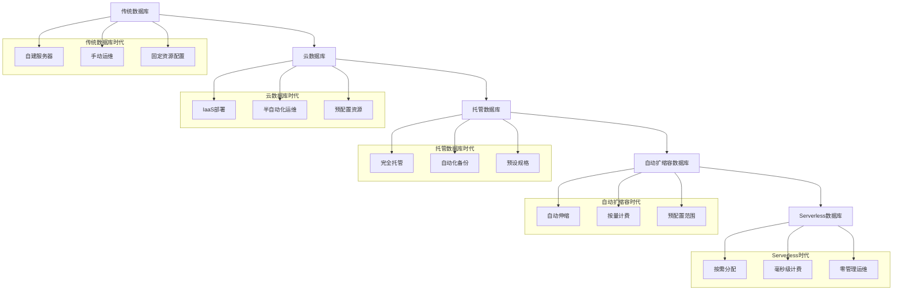

# Serverless数据库实践完整指南

## 🎯 概述

Serverless数据库作为无服务器计算的重要组成部分，通过按需付费、自动扩缩容和事件驱动的特性，为现代应用提供了极致的弹性和成本效益。本指南深入解析AWS Aurora Serverless、Azure Cosmos DB Serverless和Google Cloud Firestore等主流Serverless数据库服务，帮助企业构建高效、经济的数据库解决方案。

## 📋 目录

1. [Serverless数据库基础理论](#1-serverless数据库基础理论)
2. [主流Serverless数据库服务](#2-主流serverless数据库服务)
3. [架构设计与最佳实践](#3-架构设计与最佳实践)
4. [成本优化与性能调优](#4-成本优化与性能调优)
5. [监控告警与故障排查](#5-监控告警与故障排查)
6. [实际应用案例](#6-实际应用案例)

---

## 1. Serverless数据库基础理论

### 1.1 Serverless数据库核心概念

#### Serverless数据库架构演进


#### Serverless数据库特性分析
```python
# serverless_database_analyzer.py
from typing import Dict, List, Any
from dataclasses import dataclass
from enum import Enum

class DatabaseType(Enum):
    RELATIONAL = "relational"
    DOCUMENT = "document"
    KEY_VALUE = "key_value"
    WIDE_COLUMN = "wide_column"
    GRAPH = "graph"
    TIME_SERIES = "time_series"

@dataclass
class ServerlessFeature:
    name: str
    description: str
    benefit: str
    limitation: str
   适用场景: List[str]

@dataclass
class ProviderComparison:
    provider: str
    service_name: str
    database_type: DatabaseType
    auto_scaling: bool
    pay_per_use: bool
    cold_start_time: str
    max_connections: int
    storage_limits: str
    pricing_model: str

class ServerlessDatabaseAnalyzer:
    def __init__(self):
        self.features = self._initialize_features()
        self.providers = self._initialize_providers()
    
    def _initialize_features(self) -> List[ServerlessFeature]:
        """初始化Serverless数据库核心特性"""
        return [
            ServerlessFeature(
                name="自动扩缩容",
                description="根据负载自动调整计算资源",
                benefit="无需预配置容量，资源利用率最大化",
                limitation="可能存在冷启动延迟",
                适用场景=["突发流量", "不可预测的工作负载", "成本敏感应用"]
            ),
            ServerlessFeature(
                name="按需付费",
                description="只为实际使用的资源付费",
                benefit="成本透明，无闲置资源浪费",
                limitation="高持续负载可能比预留实例贵",
                适用场景=["间歇性工作负载", "开发测试环境", "原型验证"]
            ),
            ServerlessFeature(
                name="零管理运维",
                description="完全托管的服务，无需管理底层基础设施",
                benefit="专注业务逻辑，降低运维复杂度",
                limitation="定制化能力受限",
                适用场景=["快速产品迭代", "初创公司", "技术团队较小的组织"]
            ),
            ServerlessFeature(
                name="事件驱动集成",
                description="与函数计算、消息队列等服务无缝集成",
                benefit="构建响应式、松耦合的系统架构",
                limitation="调试和监控复杂度增加",
                适用场景=["实时数据处理", "微服务架构", "IoT应用"]
            ),
            ServerlessFeature(
                name="全球分布",
                description="内置的多区域复制和就近访问能力",
                benefit="低延迟全球访问，高可用性保障",
                limitation="数据同步可能带来一致性挑战",
                适用场景=["全球化应用", "内容分发", "多地办公系统"]
            )
        ]
    
    def _initialize_providers(self) -> List[ProviderComparison]:
        """初始化主流提供商对比"""
        return [
            ProviderComparison(
                provider="AWS",
                service_name="Aurora Serverless v2",
                database_type=DatabaseType.RELATIONAL,
                auto_scaling=True,
                pay_per_use=True,
                cold_start_time="几秒到几十秒",
                max_connections=200000,
                storage_limits="128TB",
                pricing_model="ACU*小时 + 存储GB*月"
            ),
            ProviderComparison(
                provider="Azure",
                service_name="Cosmos DB Serverless",
                database_type=DatabaseType.DOCUMENT,
                auto_scaling=True,
                pay_per_use=True,
                cold_start_time="几乎即时",
                max_connections=无限制,
                storage_limits="无限制",
                pricing_model="每万次RU消耗"
            ),
            ProviderComparison(
                provider="Google Cloud",
                service_name="Firestore",
                database_type=DatabaseType.DOCUMENT,
                auto_scaling=True,
                pay_per_use=True,
                cold_start_time="几乎即时",
                max_connections=1000000,
                storage_limits="无限制",
                pricing_model="读写操作数 + 存储GB"
            ),
            ProviderComparison(
                provider="阿里云",
                service_name="PolarDB Serverless",
                database_type=DatabaseType.RELATIONAL,
                auto_scaling=True,
                pay_per_use=True,
                cold_start_time="几秒",
                max_connections=100000,
                storage_limits="64TB",
                pricing_model="CU*小时 + 存储GB*月"
            )
        ]
    
    def analyze_workload_suitability(self, workload_profile: Dict[str, Any]) -> Dict[str, Any]:
        """分析工作负载对Serverless的适用性"""
        suitability_score = 0
        recommendations = []
        risk_factors = []
        
        # 工作负载特征分析
        workload_characteristics = {
            'burstiness': workload_profile.get('burstiness', 0.5),  # 突发性 0-1
            'predictability': workload_profile.get('predictability', 0.5),  # 可预测性 0-1
            'duration': workload_profile.get('average_duration', 300),  # 平均持续时间(秒)
            'concurrency': workload_profile.get('peak_concurrency', 100),  # 峰值并发数
            'consistency_requirement': workload_profile.get('consistency_requirement', 'eventual'),  # 一致性要求
            'latency_sensitivity': workload_profile.get('latency_sensitivity', 'medium')  # 延迟敏感度
        }
        
        # 适用性评分逻辑
        if workload_characteristics['burstiness'] > 0.7:
            suitability_score += 30
            recommendations.append("高突发性工作负载非常适合Serverless架构")
        elif workload_characteristics['burstiness'] < 0.3:
            suitability_score -= 20
            risk_factors.append("低突发性工作负载可能产生较高成本")
        
        if workload_characteristics['predictability'] < 0.3:
            suitability_score += 25
            recommendations.append("不可预测的工作负载是Serverless的理想场景")
        elif workload_characteristics['predictability'] > 0.8:
            suitability_score -= 15
            risk_factors.append("高度可预测的工作负载更适合预留实例")
        
        if workload_characteristics['duration'] < 900:  # 15分钟以下
            suitability_score += 20
            recommendations.append("短时任务非常适合按需付费模式")
        else:
            suitability_score -= 10
            risk_factors.append("长时间运行的任务可能产生较高成本")
        
        if workload_characteristics['concurrency'] < 1000:
            suitability_score += 15
            recommendations.append("中低并发场景Serverless表现优异")
        else:
            risk_factors.append("高并发场景需要注意冷启动和连接限制")
        
        if workload_characteristics['consistency_requirement'] == 'eventual':
            suitability_score += 10
        else:
            risk_factors.append("强一致性要求可能限制Serverless选择")
        
        # 生成分析结果
        overall_suitability = "非常适合" if suitability_score > 60 else \
                            "适合" if suitability_score > 30 else \
                            "需要谨慎评估" if suitability_score > 0 else "不太适合"
        
        return {
            'suitability_score': max(0, suitability_score),
            'overall_suitability': overall_suitability,
            'recommendations': recommendations,
            'risk_factors': risk_factors,
            'workload_characteristics': workload_characteristics,
            'detailed_analysis': self._generate_detailed_analysis(workload_characteristics)
        }
    
    def _generate_detailed_analysis(self, characteristics: Dict[str, Any]) -> Dict[str, Any]:
        """生成详细分析"""
        analysis = {}
        
        # 成本分析
        if characteristics['burstiness'] > 0.7 and characteristics['predictability'] < 0.3:
            analysis['cost_benefit'] = "显著节省成本，避免资源闲置"
        elif characteristics['duration'] > 900:
            analysis['cost_benefit'] = "长时间运行可能成本较高，需详细测算"
        else:
            analysis['cost_benefit'] = "成本效益中等，需要与预留实例对比"
        
        # 性能分析
        if characteristics['latency_sensitivity'] == 'high':
            analysis['performance_considerations'] = "需要注意冷启动延迟影响"
        else:
            analysis['performance_considerations'] = "性能表现良好，延迟影响可接受"
        
        # 架构建议
        if characteristics['concurrency'] > 1000:
            analysis['architectural_recommendations'] = [
                "考虑使用连接池",
                "实现请求排队机制",
                "设计优雅降级策略"
            ]
        else:
            analysis['architectural_recommendations'] = [
                "直接使用Serverless服务",
                "关注API调用频率",
                "合理设计数据访问模式"
            ]
        
        return analysis
    
    def compare_provider_suitability(self, workload_profile: Dict[str, Any]) -> List[Dict[str, Any]]:
        """比较不同提供商的适用性"""
        comparisons = []
        
        for provider in self.providers:
            score = self._calculate_provider_score(provider, workload_profile)
            comparisons.append({
                'provider': provider.provider,
                'service': provider.service_name,
                'suitability_score': score,
                'strengths': self._get_provider_strengths(provider),
                'weaknesses': self._get_provider_weaknesses(provider),
                'pricing_estimate': self._estimate_pricing(provider, workload_profile)
            })
        
        # 按得分排序
        comparisons.sort(key=lambda x: x['suitability_score'], reverse=True)
        return comparisons
    
    def _calculate_provider_score(self, provider: ProviderComparison, 
                                workload_profile: Dict[str, Any]) -> int:
        """计算提供商适用性得分"""
        score = 0
        
        # 数据库类型匹配度
        required_type = workload_profile.get('database_type', 'document')
        if provider.database_type.value == required_type:
            score += 30
        elif provider.database_type in [DatabaseType.DOCUMENT, DatabaseType.KEY_VALUE]:
            score += 20  # 文档和键值数据库通用性较强
        
        # 自动扩缩容能力
        if provider.auto_scaling:
            score += 15
        
        # 按需付费模式
        if provider.pay_per_use:
            score += 15
        
        # 并发处理能力
        required_concurrency = workload_profile.get('peak_concurrency', 100)
        if provider.max_connections >= required_concurrency * 2:
            score += 20
        elif provider.max_connections >= required_concurrency:
            score += 10
        else:
            score -= 10  # 容量不足
        
        # 存储限制
        storage_needs = workload_profile.get('storage_gb', 100)
        if "无限制" in provider.storage_limits or int(provider.storage_limits.replace('TB', '')) * 1024 > storage_needs:
            score += 10
        else:
            score -= 20  # 存储不足
        
        return max(0, score)
    
    def _get_provider_strengths(self, provider: ProviderComparison) -> List[str]:
        """获取提供商优势"""
        strengths = []
        if provider.provider == "AWS":
            strengths.extend(["生态完善", "功能丰富", "企业级支持"])
        elif provider.provider == "Azure":
            strengths.extend(["企业集成好", "合规认证多", ".NET生态强"])
        elif provider.provider == "Google Cloud":
            strengths.extend(["性能优异", "全球网络好", "机器学习集成"])
        elif provider.provider == "阿里云":
            strengths.extend(["本土化好", "价格优势", "中文支持"])
        return strengths
    
    def _get_provider_weaknesses(self, provider: ProviderComparison) -> List[str]:
        """获取提供商劣势"""
        weaknesses = []
        if provider.cold_start_time != "几乎即时":
            weaknesses.append("冷启动延迟较长")
        if provider.provider in ["AWS", "阿里云"]:
            weaknesses.append("学习曲线较陡")
        return weaknesses
    
    def _estimate_pricing(self, provider: ProviderComparison, 
                         workload_profile: Dict[str, Any]) -> Dict[str, float]:
        """估算定价"""
        # 简化的定价估算逻辑
        monthly_requests = workload_profile.get('monthly_requests', 1000000)
        average_request_duration = workload_profile.get('average_duration', 100)  # 毫秒
        storage_gb = workload_profile.get('storage_gb', 100)
        
        estimates = {}
        
        if provider.provider == "AWS":
            # Aurora Serverless v2 估算
            acu_hours = (monthly_requests * average_request_duration / 1000 / 3600) * 0.5  # 假设50%利用率
            compute_cost = acu_hours * 0.12  # $0.12 per ACU-hour
            storage_cost = storage_gb * 0.10  # $0.10 per GB-month
            estimates['monthly_cost'] = compute_cost + storage_cost
            estimates['cost_per_million_requests'] = (compute_cost / monthly_requests) * 1000000
            
        elif provider.provider == "Azure":
            # Cosmos DB Serverless 估算
            ru_consumption = monthly_requests * 10  # 假设每次请求消耗10 RU
            compute_cost = (ru_consumption / 10000) * 0.000016  # $0.000016 per RU
            storage_cost = storage_gb * 0.25  # $0.25 per GB-month
            estimates['monthly_cost'] = compute_cost + storage_cost
            estimates['cost_per_million_requests'] = (compute_cost / monthly_requests) * 1000000
            
        elif provider.provider == "Google Cloud":
            # Firestore 估算
            reads = monthly_requests * 0.7  # 假设70%是读操作
            writes = monthly_requests * 0.3  # 30%是写操作
            read_cost = (reads / 100000) * 0.06  # $0.06 per 100,000 document reads
            write_cost = (writes / 100000) * 0.18  # $0.18 per 100,000 document writes
            storage_cost = storage_gb * 0.18  # $0.18 per GB-month
            estimates['monthly_cost'] = read_cost + write_cost + storage_cost
            estimates['cost_per_million_requests'] = ((read_cost + write_cost) / monthly_requests) * 1000000
            
        return estimates

# 使用示例
analyzer = ServerlessDatabaseAnalyzer()

# 分析工作负载适用性
workload_profile = {
    'burstiness': 0.8,
    'predictability': 0.2,
    'average_duration': 50,  # 50毫秒
    'peak_concurrency': 500,
    'consistency_requirement': 'eventual',
    'latency_sensitivity': 'medium',
    'database_type': 'document',
    'monthly_requests': 2000000,
    'storage_gb': 200
}

# 工作负载适用性分析
suitability = analyzer.analyze_workload_suitability(workload_profile)
print("工作负载适用性分析:")
print(f"适用性评分: {suitability['suitability_score']}")
print(f"总体评价: {suitability['overall_suitability']}")
print(f"推荐建议: {suitability['recommendations']}")
print(f"风险因素: {suitability['risk_factors']}")

# 提供商对比分析
provider_comparisons = analyzer.compare_provider_suitability(workload_profile)
print("\n提供商对比分析:")
for comparison in provider_comparisons[:3]:  # 显示前3名
    print(f"\n{comparison['provider']} {comparison['service']}:")
    print(f"  适用性得分: {comparison['suitability_score']}")
    print(f"  月度预估成本: ${comparison['pricing_estimate']['monthly_cost']:.2f}")
    print(f"  每百万请求成本: ${comparison['pricing_estimate']['cost_per_million_requests']:.4f}")
```

### 1.2 Serverless数据库架构模式

#### 典型Serverless应用架构
```yaml
# serverless-architecture-patterns.yaml
architecture_patterns:
  event_driven_architecture:
    description: "基于事件驱动的Serverless架构"
    components:
      - trigger_source: "API Gateway / HTTP触发器"
      - function_layer: "Function Compute / Lambda函数"
      - database_layer: "Serverless数据库"
      - event_bus: "消息队列 / 事件总线"
    
    data_flow:
      - step: "1. 用户请求到达API网关"
      - step: "2. 触发相应的函数计算"
      - step: "3. 函数访问Serverless数据库"
      - step: "4. 数据库自动扩缩容处理请求"
      - step: "5. 响应返回给用户"
    
    advantages:
      - "零管理运维"
      - "按需付费，成本优化"
      - "自动弹性扩缩容"
      - "高可用性和容错性"
    
    use_cases:
      - "Web应用后端"
      - "移动应用API"
      - "IoT数据处理"
      - "实时数据流处理"

  microservices_architecture:
    description: "基于微服务的Serverless架构"
    components:
      - service_mesh: "服务网格"
      - api_gateway: "统一API入口"
      - function_services: "多个独立的函数服务"
      - serverless_databases: "多个专用数据库实例"
      - message_queue: "异步通信队列"
    
    service_decomposition:
      - user_service:
          database: "用户信息数据库"
          functions: ["用户注册", "用户登录", "用户信息管理"]
      - order_service:
          database: "订单数据库"
          functions: ["创建订单", "查询订单", "订单状态更新"]
      - payment_service:
          database: "支付数据库"
          functions: ["处理支付", "退款处理", "对账服务"]
    
    communication_patterns:
      - synchronous: "API调用，直接响应"
      - asynchronous: "消息队列，异步处理"
      - event_based: "事件发布订阅模式"

  data_pipeline_architecture:
    description: "数据管道处理架构"
    pipeline_stages:
      - ingestion: "数据摄入层"
        components: ["IoT设备", "移动应用", "Web表单"]
        processing: "数据验证和初步处理"
      
      - processing: "数据处理层"
        components: ["流处理函数", "批处理作业"]
        processing: "数据转换、清洗、聚合"
      
      - storage: "数据存储层"
        components: ["实时数据库", "数据仓库", "对象存储"]
        processing: "结构化和非结构化数据存储"
      
      - analytics: "数据分析层"
        components: ["BI工具", "机器学习模型", "报表系统"]
        processing: "数据洞察和智能分析"
    
    scaling_characteristics:
      - auto_scaling: "根据数据流量自动调整"
      - burst_handling: "处理数据峰值和突发流量"
      - cost_optimization: "只为处理的数据付费"
```

## 2. 主流Serverless数据库服务

### 2.1 AWS Aurora Serverless

#### Aurora Serverless v2配置示例
```yaml
# aurora-serverless-v2-template.yaml
AWSTemplateFormatVersion: '2010-09-09'
Description: 'Aurora Serverless v2 Database Cluster'

Parameters:
  DBUsername:
    Type: String
    Default: admin
    Description: 数据库用户名
  
  DBPassword:
    Type: String
    NoEcho: true
    Description: 数据库密码
  
  MinCapacity:
    Type: Number
    Default: 0.5
    Description: 最小ACU容量
  
  MaxCapacity:
    Type: Number
    Default: 32
    Description: 最大ACU容量

Resources:
  # Aurora Serverless v2集群
  AuroraServerlessCluster:
    Type: AWS::RDS::DBCluster
    Properties:
      Engine: aurora-mysql
      EngineVersion: '8.0.mysql_aurora.3.02.0'
      DatabaseName: serverlessdb
      MasterUsername: !Ref DBUsername
      MasterUserPassword: !Ref DBPassword
      ServerlessV2ScalingConfiguration:
        MinCapacity: !Ref MinCapacity
        MaxCapacity: !Ref MaxCapacity
      BackupRetentionPeriod: 7
      StorageEncrypted: true
      DeletionProtection: false
      EnableHttpEndpoint: true  # 启用HTTP API端点
      
  # 数据库实例
  AuroraServerlessInstance:
    Type: AWS::RDS::DBInstance
    Properties:
      DBInstanceClass: db.serverless
      Engine: aurora-mysql
      DBClusterIdentifier: !Ref AuroraServerlessCluster
      PubliclyAccessible: false

  # IAM角色用于HTTP API访问
  AuroraAccessRole:
    Type: AWS::IAM::Role
    Properties:
      AssumeRolePolicyDocument:
        Version: '2012-10-17'
        Statement:
          - Effect: Allow
            Principal:
              Service: 'lambda.amazonaws.com'
            Action: 'sts:AssumeRole'
      Policies:
        - PolicyName: AuroraServerlessAccess
          PolicyDocument:
            Version: '2012-10-17'
            Statement:
              - Effect: Allow
                Action:
                  - 'rds-data:ExecuteStatement'
                  - 'rds-data:BatchExecuteStatement'
                  - 'rds-data:BeginTransaction'
                  - 'rds-data:CommitTransaction'
                  - 'rds-data:RollbackTransaction'
                Resource: !Sub 'arn:aws:rds:${AWS::Region}:${AWS::AccountId}:cluster:${AuroraServerlessCluster}'

Outputs:
  ClusterEndpoint:
    Description: Aurora Serverless集群端点
    Value: !GetAtt AuroraServerlessCluster.Endpoint.Address
  
  HttpEndpoint:
    Description: HTTP API端点
    Value: !Sub 'https://rds-data.${AWS::Region}.amazonaws.com'
  
  AccessRoleArn:
    Description: 访问角色ARN
    Value: !GetAtt AuroraAccessRole.Arn
```

#### Python应用集成示例
```python
# aurora_serverless_client.py
import boto3
import json
from typing import Dict, List, Any, Optional
import time

class AuroraServerlessClient:
    def __init__(self, cluster_arn: str, secret_arn: str, database: str, region: str = 'us-east-1'):
        self.cluster_arn = cluster_arn
        self.secret_arn = secret_arn
        self.database = database
        self.region = region
        self.rds_data_client = boto3.client('rds-data', region_name=region)
    
    def execute_statement(self, sql: str, parameters: Optional[List[Dict]] = None) -> Dict[str, Any]:
        """执行SQL语句"""
        try:
            response = self.rds_data_client.execute_statement(
                resourceArn=self.cluster_arn,
                secretArn=self.secret_arn,
                database=self.database,
                sql=sql,
                parameters=parameters or []
            )
            return response
        except Exception as e:
            print(f"SQL执行失败: {str(e)}")
            raise
    
    def batch_execute(self, sql: str, parameter_sets: List[List[Dict]]) -> Dict[str, Any]:
        """批量执行SQL语句"""
        try:
            response = self.rds_data_client.batch_execute_statement(
                resourceArn=self.cluster_arn,
                secretArn=self.secret_arn,
                database=self.database,
                sql=sql,
                parameterSets=parameter_sets
            )
            return response
        except Exception as e:
            print(f"批量执行失败: {str(e)}")
            raise
    
    def begin_transaction(self) -> str:
        """开始事务"""
        response = self.rds_data_client.begin_transaction(
            resourceArn=self.cluster_arn,
            secretArn=self.secret_arn,
            database=self.database
        )
        return response['transactionId']
    
    def commit_transaction(self, transaction_id: str) -> Dict[str, Any]:
        """提交事务"""
        response = self.rds_data_client.commit_transaction(
            resourceArn=self.cluster_arn,
            secretArn=self.secret_arn,
            transactionId=transaction_id
        )
        return response
    
    def rollback_transaction(self, transaction_id: str) -> Dict[str, Any]:
        """回滚事务"""
        response = self.rds_data_client.rollback_transaction(
            resourceArn=self.cluster_arn,
            secretArn=self.secret_arn,
            transactionId=transaction_id
        )
        return response

# Lambda函数示例
def lambda_handler(event, context):
    """处理API请求的Lambda函数"""
    
    # 初始化Aurora Serverless客户端
    client = AuroraServerlessClient(
        cluster_arn='arn:aws:rds:us-east-1:123456789012:cluster:my-serverless-cluster',
        secret_arn='arn:aws:secretsmanager:us-east-1:123456789012:secret:my-db-secret',
        database='serverlessdb'
    )
    
    # 解析请求
    http_method = event['httpMethod']
    path = event['path']
    body = json.loads(event.get('body', '{}')) if event.get('body') else {}
    
    try:
        if http_method == 'GET' and path == '/users':
            # 查询用户列表
            result = client.execute_statement(
                "SELECT id, name, email FROM users WHERE active = :active",
                [{'name': 'active', 'value': {'booleanValue': True}}]
            )
            users = [
                {
                    'id': record[0]['longValue'],
                    'name': record[1]['stringValue'],
                    'email': record[2]['stringValue']
                }
                for record in result.get('records', [])
            ]
            return {
                'statusCode': 200,
                'body': json.dumps(users)
            }
        
        elif http_method == 'POST' and path == '/users':
            # 创建新用户
            transaction_id = client.begin_transaction()
            
            try:
                # 插入用户
                client.execute_statement(
                    "INSERT INTO users (name, email, created_at) VALUES (:name, :email, NOW())",
                    [
                        {'name': 'name', 'value': {'stringValue': body['name']}},
                        {'name': 'email', 'value': {'stringValue': body['email']}}
                    ]
                )
                
                # 获取插入的用户ID
                result = client.execute_statement("SELECT LAST_INSERT_ID()")
                user_id = result['records'][0][0]['longValue']
                
                client.commit_transaction(transaction_id)
                
                return {
                    'statusCode': 201,
                    'body': json.dumps({'id': user_id, 'message': '用户创建成功'})
                }
                
            except Exception as e:
                client.rollback_transaction(transaction_id)
                raise e
        
        else:
            return {
                'statusCode': 404,
                'body': json.dumps({'error': '未找到的路由'})
            }
            
    except Exception as e:
        return {
            'statusCode': 500,
            'body': json.dumps({'error': str(e)})
        }

# 批量数据处理示例
def process_batch_data(event, context):
    """批量处理数据的Lambda函数"""
    
    client = AuroraServerlessClient(
        cluster_arn='arn:aws:rds:us-east-1:123456789012:cluster:my-serverless-cluster',
        secret_arn='arn:aws:secretsmanager:us-east-1:123456789012:secret:my-db-secret',
        database='serverlessdb'
    )
    
    # 从SQS获取批量数据
    records = event['Records']
    
    # 准备批量插入参数
    parameter_sets = []
    for record in records:
        body = json.loads(record['body'])
        parameter_sets.append([
            {'name': 'name', 'value': {'stringValue': body['name']}},
            {'name': 'email', 'value': {'stringValue': body['email']}},
            {'name': 'data', 'value': {'stringValue': json.dumps(body['data'])}}
        ])
    
    # 批量插入
    client.batch_execute(
        "INSERT INTO user_events (name, email, event_data, created_at) VALUES (:name, :email, :data, NOW())",
        parameter_sets
    )
    
    return {'statusCode': 200, 'processedRecords': len(records)}
```

### 2.2 Azure Cosmos DB Serverless

#### Cosmos DB Serverless配置
```json
{
  "$schema": "https://schema.management.azure.com/schemas/2019-04-01/deploymentTemplate.json#",
  "contentVersion": "1.0.0.0",
  "parameters": {
    "accountName": {
      "type": "string",
      "defaultValue": "[concat('cosmos-', uniqueString(resourceGroup().id))]",
      "metadata": {
        "description": "Cosmos DB account name"
      }
    },
    "databaseName": {
      "type": "string",
      "defaultValue": "serverless-db",
      "metadata": {
        "description": "Database name"
      }
    }
  },
  "resources": [
    {
      "type": "Microsoft.DocumentDB/databaseAccounts",
      "apiVersion": "2021-04-15",
      "name": "[parameters('accountName')]",
      "location": "[resourceGroup().location]",
      "properties": {
        "databaseAccountOfferType": "Standard",
        "consistencyPolicy": {
          "defaultConsistencyLevel": "Session"
        },
        "locations": [
          {
            "locationName": "[resourceGroup().location]",
            "failoverPriority": 0
          }
        ],
        "capabilities": [
          {
            "name": "EnableServerless"
          }
        ]
      }
    },
    {
      "type": "Microsoft.DocumentDB/databaseAccounts/sqlDatabases",
      "apiVersion": "2021-04-15",
      "name": "[concat(parameters('accountName'), '/', parameters('databaseName'))]",
      "dependsOn": [
        "[resourceId('Microsoft.DocumentDB/databaseAccounts', parameters('accountName'))]"
      ],
      "properties": {
        "resource": {
          "id": "[parameters('databaseName')]"
        }
      }
    },
    {
      "type": "Microsoft.DocumentDB/databaseAccounts/sqlDatabases/containers",
      "apiVersion": "2021-04-15",
      "name": "[concat(parameters('accountName'), '/', parameters('databaseName'), '/users')]",
      "dependsOn": [
        "[resourceId('Microsoft.DocumentDB/databaseAccounts/sqlDatabases', parameters('accountName'), parameters('databaseName'))]"
      ],
      "properties": {
        "resource": {
          "id": "users",
          "partitionKey": {
            "paths": ["/userId"],
            "kind": "Hash"
          },
          "indexingPolicy": {
            "indexingMode": "consistent",
            "automatic": true,
            "includedPaths": [
              {
                "path": "/*"
              }
            ],
            "excludedPaths": [
              {
                "path": "/_etag/?"
              }
            ]
          }
        }
      }
    }
  ],
  "outputs": {
    "connectionString": {
      "type": "string",
      "value": "[listConnectionStrings(resourceId('Microsoft.DocumentDB/databaseAccounts', parameters('accountName')), '2021-04-15').connectionStrings[0].connectionString]"
    }
  }
}
```

#### Azure Functions集成示例
```python
# cosmos_db_functions.py
import azure.functions as func
import azure.cosmos.cosmos_client as cosmos_client
import azure.cosmos.exceptions as exceptions
import json
import os
import logging

class CosmosDBHandler:
    def __init__(self):
        self.endpoint = os.environ['COSMOS_DB_ENDPOINT']
        self.key = os.environ['COSMOS_DB_KEY']
        self.database_id = os.environ['COSMOS_DB_DATABASE']
        self.container_id = os.environ['COSMOS_DB_CONTAINER']
        
        self.client = cosmos_client.CosmosClient(self.endpoint, {'masterKey': self.key})
        self.database = self.client.get_database_client(self.database_id)
        self.container = self.database.get_container_client(self.container_id)
    
    def create_item(self, item: dict) -> dict:
        """创建文档"""
        try:
            created_item = self.container.create_item(body=item)
            return created_item
        except exceptions.CosmosHttpResponseError as e:
            logging.error(f'创建文档失败: {e.message}')
            raise
    
    def get_item(self, item_id: str, partition_key: str) -> dict:
        """获取文档"""
        try:
            item = self.container.read_item(item=item_id, partition_key=partition_key)
            return item
        except exceptions.CosmosResourceNotFoundError:
            return None
        except exceptions.CosmosHttpResponseError as e:
            logging.error(f'获取文档失败: {e.message}')
            raise
    
    def query_items(self, query: str, parameters: list = None) -> list:
        """查询文档"""
        try:
            items = list(self.container.query_items(
                query=query,
                parameters=parameters,
                enable_cross_partition_query=True
            ))
            return items
        except exceptions.CosmosHttpResponseError as e:
            logging.error(f'查询文档失败: {e.message}')
            raise
    
    def update_item(self, item_id: str, partition_key: str, updates: dict) -> dict:
        """更新文档"""
        try:
            # 先获取现有文档
            existing_item = self.get_item(item_id, partition_key)
            if not existing_item:
                return None
            
            # 应用更新
            existing_item.update(updates)
            
            # 保存更新后的文档
            updated_item = self.container.upsert_item(body=existing_item)
            return updated_item
        except exceptions.CosmosHttpResponseError as e:
            logging.error(f'更新文档失败: {e.message}')
            raise

# HTTP触发器函数
def main(req: func.HttpRequest) -> func.HttpResponse:
    logging.info('Python HTTP trigger function processed a request.')
    
    # 初始化Cosmos DB处理器
    handler = CosmosDBHandler()
    
    try:
        if req.method == 'GET':
            # 获取用户列表
            users = handler.query_items(
                "SELECT * FROM c WHERE c.type = @type",
                [{"name": "@type", "value": "user"}]
            )
            return func.HttpResponse(
                json.dumps(users),
                status_code=200,
                mimetype="application/json"
            )
        
        elif req.method == 'POST':
            # 创建新用户
            req_body = req.get_json()
            
            user_document = {
                "id": req_body.get('userId'),
                "userId": req_body.get('userId'),
                "name": req_body.get('name'),
                "email": req_body.get('email'),
                "type": "user",
                "createdAt": func.datetime.utcnow().isoformat()
            }
            
            created_user = handler.create_item(user_document)
            
            return func.HttpResponse(
                json.dumps(created_user),
                status_code=201,
                mimetype="application/json"
            )
        
        elif req.method == 'PUT':
            # 更新用户
            user_id = req.route_params.get('userId')
            if not user_id:
                return func.HttpResponse(
                    json.dumps({"error": "缺少用户ID"}),
                    status_code=400,
                    mimetype="application/json"
                )
            
            req_body = req.get_json()
            updates = {k: v for k, v in req_body.items() if k != 'id' and k != 'userId'}
            
            updated_user = handler.update_item(user_id, user_id, updates)
            
            if updated_user:
                return func.HttpResponse(
                    json.dumps(updated_user),
                    status_code=200,
                    mimetype="application/json"
                )
            else:
                return func.HttpResponse(
                    json.dumps({"error": "用户不存在"}),
                    status_code=404,
                    mimetype="application/json"
                )
        
        else:
            return func.HttpResponse(
                json.dumps({"error": "不支持的HTTP方法"}),
                status_code=405,
                mimetype="application/json"
            )
            
    except Exception as e:
        logging.error(f'处理请求时出错: {str(e)}')
        return func.HttpResponse(
            json.dumps({"error": str(e)}),
            status_code=500,
            mimetype="application/json"
        )

# 定时触发器函数 - 数据清理
def cleanup_expired_data(mytimer: func.TimerRequest) -> None:
    utc_timestamp = func.datetime.utcnow().replace(tzinfo=None).isoformat()
    
    if mytimer.past_due:
        logging.info('定时器过去时间，立即执行')
    
    logging.info('Python timer trigger function ran at %s', utc_timestamp)
    
    # 初始化处理器
    handler = CosmosDBHandler()
    
    # 查询过期数据
    expired_items = handler.query_items(
        "SELECT * FROM c WHERE c.expiryDate < @currentDate",
        [{"name": "@currentDate", "value": utc_timestamp}]
    )
    
    # 删除过期数据
    deleted_count = 0
    for item in expired_items:
        try:
            handler.container.delete_item(
                item=item['id'],
                partition_key=item['userId']
            )
            deleted_count += 1
        except Exception as e:
            logging.error(f'删除过期项失败 {item["id"]}: {str(e)}')
    
    logging.info(f'清理了 {deleted_count} 个过期项')
```

### 2.3 Google Cloud Firestore

#### Firestore配置和初始化
```python
# firestore_client.py
from google.cloud import firestore
from google.cloud.firestore_v1.base_query import FieldFilter
import json
from typing import Dict, List, Any, Optional
import logging

class FirestoreClient:
    def __init__(self, project_id: str = None):
        """初始化Firestore客户端"""
        if project_id:
            self.client = firestore.Client(project=project_id)
        else:
            # 使用默认项目
            self.client = firestore.Client()
    
    def add_document(self, collection_name: str, data: Dict[str, Any], 
                    document_id: Optional[str] = None) -> str:
        """添加文档"""
        try:
            collection_ref = self.client.collection(collection_name)
            
            if document_id:
                doc_ref = collection_ref.document(document_id)
                doc_ref.set(data)
                return document_id
            else:
                doc_ref = collection_ref.add(data)
                return doc_ref[1].id
                
        except Exception as e:
            logging.error(f"添加文档失败: {str(e)}")
            raise
    
    def get_document(self, collection_name: str, document_id: str) -> Optional[Dict[str, Any]]:
        """获取文档"""
        try:
            doc_ref = self.client.collection(collection_name).document(document_id)
            doc = doc_ref.get()
            
            if doc.exists:
                return doc.to_dict()
            else:
                return None
                
        except Exception as e:
            logging.error(f"获取文档失败: {str(e)}")
            raise
    
    def update_document(self, collection_name: str, document_id: str, 
                       updates: Dict[str, Any]) -> bool:
        """更新文档"""
        try:
            doc_ref = self.client.collection(collection_name).document(document_id)
            doc_ref.update(updates)
            return True
        except Exception as e:
            logging.error(f"更新文档失败: {str(e)}")
            return False
    
    def delete_document(self, collection_name: str, document_id: str) -> bool:
        """删除文档"""
        try:
            doc_ref = self.client.collection(collection_name).document(document_id)
            doc_ref.delete()
            return True
        except Exception as e:
            logging.error(f"删除文档失败: {str(e)}")
            return False
    
    def query_documents(self, collection_name: str, 
                       filters: List[tuple] = None,
                       order_by: Optional[str] = None,
                       limit: Optional[int] = None) -> List[Dict[str, Any]]:
        """查询文档"""
        try:
            collection_ref = self.client.collection(collection_name)
            query = collection_ref
            
            # 应用过滤器
            if filters:
                for field, operator, value in filters:
                    query = query.where(field, operator, value)
            
            # 排序
            if order_by:
                query = query.order_by(order_by)
            
            # 限制结果数量
            if limit:
                query = query.limit(limit)
            
            # 执行查询
            docs = query.stream()
            
            results = []
            for doc in docs:
                doc_dict = doc.to_dict()
                doc_dict['id'] = doc.id
                results.append(doc_dict)
            
            return results
            
        except Exception as e:
            logging.error(f"查询文档失败: {str(e)}")
            raise
    
    def batch_write(self, operations: List[Dict[str, Any]]) -> List[str]:
        """批量写入操作"""
        try:
            batch = self.client.batch()
            created_ids = []
            
            for operation in operations:
                op_type = operation['type']
                collection = operation['collection']
                data = operation['data']
                
                collection_ref = self.client.collection(collection)
                
                if op_type == 'create':
                    if 'id' in operation:
                        doc_ref = collection_ref.document(operation['id'])
                        batch.set(doc_ref, data)
                        created_ids.append(operation['id'])
                    else:
                        doc_ref = collection_ref.document()
                        batch.set(doc_ref, data)
                        created_ids.append(doc_ref.id)
                
                elif op_type == 'update':
                    doc_ref = collection_ref.document(operation['id'])
                    batch.update(doc_ref, data)
                    created_ids.append(operation['id'])
                
                elif op_type == 'delete':
                    doc_ref = collection_ref.document(operation['id'])
                    batch.delete(doc_ref)
                    created_ids.append(operation['id'])
            
            # 执行批量操作
            batch.commit()
            return created_ids
            
        except Exception as e:
            logging.error(f"批量写入失败: {str(e)}")
            raise

# Cloud Functions集成示例
def handle_firestore_request(request):
    """处理Firestore相关请求的Cloud Function"""
    
    # 初始化Firestore客户端
    db = FirestoreClient()
    
    # 解析请求
    request_json = request.get_json(silent=True)
    request_args = request.args
    
    if request.method == 'GET':
        # 查询用户数据
        user_id = request_args.get('userId')
        
        if user_id:
            # 获取特定用户
            user = db.get_document('users', user_id)
            if user:
                return {'user': user}, 200
            else:
                return {'error': '用户不存在'}, 404
        else:
            # 获取用户列表
            users = db.query_documents(
                'users',
                filters=[('active', '==', True)],
                order_by='createdAt',
                limit=100
            )
            return {'users': users}, 200
    
    elif request.method == 'POST':
        # 创建新用户
        if not request_json:
            return {'error': '请求体不能为空'}, 400
        
        user_data = {
            'name': request_json.get('name'),
            'email': request_json.get('email'),
            'active': True,
            'createdAt': firestore.SERVER_TIMESTAMP,
            'profile': request_json.get('profile', {})
        }
        
        user_id = db.add_document('users', user_data)
        return {'message': '用户创建成功', 'userId': user_id}, 201
    
    elif request.method == 'PUT':
        # 更新用户信息
        user_id = request_args.get('userId')
        if not user_id:
            return {'error': '缺少用户ID'}, 400
        
        if not request_json:
            return {'error': '请求体不能为空'}, 400
        
        # 移除不可更新的字段
        update_data = {k: v for k, v in request_json.items() 
                      if k not in ['id', 'createdAt', 'userId']}
        
        if update_data:
            update_data['updatedAt'] = firestore.SERVER_TIMESTAMP
            success = db.update_document('users', user_id, update_data)
            
            if success:
                return {'message': '用户更新成功'}, 200
            else:
                return {'error': '用户更新失败'}, 500
        else:
            return {'error': '没有有效的更新数据'}, 400
    
    elif request.method == 'DELETE':
        # 删除用户
        user_id = request_args.get('userId')
        if not user_id:
            return {'error': '缺少用户ID'}, 400
        
        success = db.delete_document('users', user_id)
        if success:
            return {'message': '用户删除成功'}, 200
        else:
            return {'error': '用户删除失败'}, 500
    
    else:
        return {'error': '不支持的HTTP方法'}, 405

# 实时监听函数
def listen_to_user_changes(data, context):
    """监听用户集合的变化"""
    
    trigger_resource = context.resource
    logging.info(f'处理来自 {trigger_resource} 的事件')
    
    # 获取变更类型
    if context.event_type == 'google.firestore.document.create':
        logging.info('检测到新文档创建')
        # 处理新用户注册逻辑
        handle_new_user(data['value'])
        
    elif context.event_type == 'google.firestore.document.update':
        logging.info('检测到文档更新')
        # 处理用户信息更新逻辑
        handle_user_update(data['value'], data.get('oldValue'))
        
    elif context.event_type == 'google.firestore.document.delete':
        logging.info('检测到文档删除')
        # 处理用户删除逻辑
        handle_user_deletion(data.get('oldValue'))

def handle_new_user(user_data):
    """处理新用户注册"""
    db = FirestoreClient()
    
    # 发送欢迎邮件
    user_email = user_data.get('fields', {}).get('email', {}).get('stringValue')
    user_name = user_data.get('fields', {}).get('name', {}).get('stringValue')
    
    if user_email and user_name:
        # 这里可以集成邮件服务发送欢迎邮件
        logging.info(f'准备向 {user_name} <{user_email}> 发送欢迎邮件')
        
        # 创建用户统计文档
        stats_data = {
            'userId': user_data.get('name').split('/')[-1],  # 从文档路径提取用户ID
            'registrationDate': firestore.SERVER_TIMESTAMP,
            'loginCount': 0,
            'lastActivity': firestore.SERVER_TIMESTAMP
        }
        
        db.add_document('user_stats', stats_data)

def handle_user_update(new_data, old_data):
    """处理用户信息更新"""
    # 比较变更内容
    if old_data and new_data:
        old_fields = old_data.get('fields', {})
        new_fields = new_data.get('fields', {})
        
        # 检查邮箱变更
        old_email = old_fields.get('email', {}).get('stringValue')
        new_email = new_fields.get('email', {}).get('stringValue')
        
        if old_email != new_email and new_email:
            logging.info(f'用户邮箱从 {old_email} 变更为 {new_email}')
            # 可以在这里触发邮箱验证流程

def handle_user_deletion(old_data):
    """处理用户删除"""
    if old_data:
        user_id = old_data.get('name').split('/')[-1]
        logging.info(f'用户 {user_id} 已被删除')
        # 可以在这里执行清理操作
```

## 3. 架构设计与最佳实践

### 3.1 Serverless数据库设计原则

#### 数据建模最佳实践
```python
# serverless_data_modeling.py
from typing import Dict, List, Any, Optional
from dataclasses import dataclass
from enum import Enum
import json

class DataModelPattern(Enum):
    DENORMALIZED = "denormalized"
    NORMALIZED = "normalized"
    HYBRID = "hybrid"

@dataclass
class CollectionDesign:
    name: str
    partition_key: str
    indexes: List[str]
    ttl_enabled: bool
    ttl_field: Optional[str]

class ServerlessDataModeler:
    def __init__(self, database_type: str):
        self.database_type = database_type  # 'document', 'key_value', 'relational'
        self.collections = {}
    
    def design_user_centric_model(self) -> Dict[str, CollectionDesign]:
        """设计以用户为中心的数据模型"""
        
        if self.database_type == 'document':
            return self._design_document_user_model()
        elif self.database_type == 'key_value':
            return self._design_keyvalue_user_model()
        else:
            return self._design_relational_user_model()
    
    def _design_document_user_model(self) -> Dict[str, CollectionDesign]:
        """文档数据库用户模型设计"""
        collections = {
            'users': CollectionDesign(
                name='users',
                partition_key='userId',
                indexes=['email', 'createdAt', 'status'],
                ttl_enabled=False,
                ttl_field=None
            ),
            
            'user_sessions': CollectionDesign(
                name='user_sessions',
                partition_key='sessionId',
                indexes=['userId', 'createdAt', 'expiresAt'],
                ttl_enabled=True,
                ttl_field='expiresAt'
            ),
            
            'user_preferences': CollectionDesign(
                name='user_preferences',
                partition_key='userId',
                indexes=['category', 'updatedAt'],
                ttl_enabled=False,
                ttl_field=None
            ),
            
            'user_activities': CollectionDesign(
                name='user_activities',
                partition_key='activityId',
                indexes=['userId', 'timestamp', 'type'],
                ttl_enabled=True,
                ttl_field='timestamp'  # 保留90天活动记录
            )
        }
        
        return collections
    
    def _design_keyvalue_user_model(self) -> Dict[str, CollectionDesign]:
        """键值数据库用户模型设计"""
        collections = {
            'user_profiles': CollectionDesign(
                name='user_profiles',
                partition_key='userId',
                indexes=['email'],
                ttl_enabled=False,
                ttl_field=None
            ),
            
            'user_settings': CollectionDesign(
                name='user_settings',
                partition_key='userId:setting_key',
                indexes=[],
                ttl_enabled=False,
                ttl_field=None
            ),
            
            'session_tokens': CollectionDesign(
                name='session_tokens',
                partition_key='token',
                indexes=['userId'],
                ttl_enabled=True,
                ttl_field='expiry'
            )
        }
        
        return collections
    
    def _design_relational_user_model(self) -> Dict[str, CollectionDesign]:
        """关系型数据库用户模型设计"""
        collections = {
            'users': CollectionDesign(
                name='users',
                partition_key='id',
                indexes=['email', 'created_at', 'status'],
                ttl_enabled=False,
                ttl_field=None
            ),
            
            'user_sessions': CollectionDesign(
                name='user_sessions',
                partition_key='id',
                indexes=['user_id', 'created_at', 'expires_at'],
                ttl_enabled=True,
                ttl_field='expires_at'
            ),
            
            'user_preferences': CollectionDesign(
                name='user_preferences',
                partition_key='id',
                indexes=['user_id', 'category'],
                ttl_enabled=False,
                ttl_field=None
            )
        }
        
        return collections
    
    def optimize_for_serverless(self, collections: Dict[str, CollectionDesign]) -> Dict[str, Any]:
        """针对Serverless优化数据模型"""
        optimizations = {
            'denormalization_strategy': self._suggest_denormalization(collections),
            'indexing_recommendations': self._suggest_indexes(collections),
            'partitioning_strategy': self._suggest_partitioning(collections),
            'cost_optimization': self._suggest_cost_optimization(collections)
        }
        
        return optimizations
    
    def _suggest_denormalization(self, collections: Dict[str, CollectionDesign]) -> List[str]:
        """建议反规范化策略"""
        suggestions = []
        
        if self.database_type == 'document':
            suggestions.extend([
                "将频繁访问的用户信息嵌入到相关文档中",
                "预计算聚合数据减少查询复杂度",
                "复制引用数据避免JOIN操作"
            ])
        elif self.database_type == 'key_value':
            suggestions.extend([
                "使用复合键存储关联数据",
                "在值中存储冗余信息提高读取效率",
                "避免跨多个键的复杂查询"
            ])
        
        return suggestions
    
    def _suggest_indexes(self, collections: Dict[str, CollectionDesign]) -> Dict[str, List[str]]:
        """建议索引策略"""
        index_suggestions = {}
        
        for collection_name, design in collections.items():
            # 基本索引建议
            suggested_indexes = design.indexes.copy()
            
            # 根据查询模式添加更多索引
            if collection_name == 'users':
                suggested_indexes.extend(['status', 'last_login'])
            elif collection_name == 'user_activities':
                suggested_indexes.extend(['userId_type', 'timestamp_type'])
            
            index_suggestions[collection_name] = suggested_indexes
        
        return index_suggestions
    
    def _suggest_partitioning(self, collections: Dict[str, CollectionDesign]) -> Dict[str, str]:
        """建议分区策略"""
        partitioning_suggestions = {}
        
        for collection_name, design in collections.items():
            if self.database_type == 'document':
                # 文档数据库分区建议
                if collection_name == 'users':
                    partitioning_suggestions[collection_name] = "按userId哈希分区"
                elif collection_name == 'user_activities':
                    partitioning_suggestions[collection_name] = "按userId范围分区，配合时间戳"
            elif self.database_type == 'key_value':
                # 键值数据库分区建议
                partitioning_suggestions[collection_name] = f"按{design.partition_key}分区"
        
        return partitioning_suggestions
    
    def _suggest_cost_optimization(self, collections: Dict[str, CollectionDesign]) -> List[str]:
        """建议成本优化策略"""
        suggestions = [
            "启用TTL自动清理过期数据",
            "合理设置读写容量单位",
            "使用批量操作减少请求次数",
            "缓存热点数据减少数据库访问",
            "压缩大字段数据"
        ]
        
        return suggestions
    
    def generate_model_documentation(self, collections: Dict[str, CollectionDesign], 
                                   optimizations: Dict[str, Any]) -> str:
        """生成数据模型文档"""
        doc = "# Serverless数据库数据模型设计\n\n"
        
        doc += "## 集合设计\n\n"
        for name, design in collections.items():
            doc += f"### {name}\n"
            doc += f"- **分区键**: {design.partition_key}\n"
            doc += f"- **索引**: {', '.join(design.indexes)}\n"
            doc += f"- **TTL启用**: {'是' if design.ttl_enabled else '否'}\n"
            if design.ttl_field:
                doc += f"- **TTL字段**: {design.ttl_field}\n"
            doc += "\n"
        
        doc += "## 优化建议\n\n"
        
        doc += "### 反规范化策略\n"
        for suggestion in optimizations['denormalization_strategy']:
            doc += f"- {suggestion}\n"
        doc += "\n"
        
        doc += "### 索引建议\n"
        for collection, indexes in optimizations['indexing_recommendations'].items():
            doc += f"- **{collection}**: {', '.join(indexes)}\n"
        doc += "\n"
        
        doc += "### 分区策略\n"
        for collection, strategy in optimizations['partitioning_strategy'].items():
            doc += f"- **{collection}**: {strategy}\n"
        doc += "\n"
        
        doc += "### 成本优化\n"
        for suggestion in optimizations['cost_optimization']:
            doc += f"- {suggestion}\n"
        
        return doc

# 使用示例
modeler = ServerlessDataModeler('document')

# 设计用户中心模型
collections = modeler.design_user_centric_model()
print("集合设计:")
for name, design in collections.items():
    print(f"{name}: 分区键={design.partition_key}, 索引={design.indexes}")

# 生成优化建议
optimizations = modeler.optimize_for_serverless(collections)
print("\n优化建议:")
print(json.dumps(optimizations, indent=2, ensure_ascii=False))

# 生成文档
documentation = modeler.generate_model_documentation(collections, optimizations)
print("\n生成的文档:")
print(documentation[:500] + "..." if len(documentation) > 500 else documentation)
```

### 3.2 应用架构模式

#### 微服务架构设计
```yaml
# serverless-microservices-architecture.yaml
microservices_architecture:
  api_gateway:
    service: "API Gateway"
    responsibilities:
      - "请求路由和负载均衡"
      - "身份认证和授权"
      - "请求验证和限流"
      - "API文档和监控"
    integration_points:
      - function_compute: "路由到相应函数"
      - serverless_database: "直接数据库访问"
  
  user_service:
    functions:
      - register_user:
          trigger: "HTTP POST /users"
          database_operations:
            - "users集合: 创建用户文档"
            - "user_stats集合: 创建统计文档"
            - "audit_logs集合: 记录注册事件"
      
      - authenticate_user:
          trigger: "HTTP POST /auth/login"
          database_operations:
            - "users集合: 查询用户凭据"
            - "user_sessions集合: 创建会话"
            - "user_activities集合: 记录登录活动"
      
      - get_user_profile:
          trigger: "HTTP GET /users/{userId}"
          database_operations:
            - "users集合: 获取用户基本信息"
            - "user_preferences集合: 获取用户偏好设置"
  
  order_service:
    functions:
      - create_order:
          trigger: "HTTP POST /orders"
          database_operations:
            - "orders集合: 创建订单文档"
            - "inventory集合: 更新库存"
            - "user_activities集合: 记录下单活动"
      
      - process_payment:
          trigger: "EventBridge事件"
          database_operations:
            - "payments集合: 创建支付记录"
            - "orders集合: 更新订单状态"
            - "notifications集合: 创建通知记录"
  
  notification_service:
    functions:
      - send_email:
          trigger: "SNS主题: email_notifications"
          database_operations:
            - "notifications集合: 更新发送状态"
            - "email_templates集合: 获取模板"
      
      - send_push_notification:
          trigger: "SNS主题: push_notifications"
          database_operations:
            - "device_tokens集合: 获取设备令牌"
            - "notifications集合: 记录推送历史"
  
  data_processing_service:
    functions:
      - process_user_analytics:
          trigger: "Scheduled Event (每天凌晨2点)"
          database_operations:
            - "user_activities集合: 聚合用户行为数据"
            - "analytics集合: 存储分析结果"
            - "reports集合: 生成报告文档"
      
      - cleanup_expired_data:
          trigger: "Scheduled Event (每小时)"
          database_operations:
            - "user_sessions集合: 删除过期会话"
            - "temporary_data集合: 清理临时数据"
  
  shared_components:
    authentication_layer:
      service: "Cognito / Auth0"
      responsibilities:
        - "用户身份管理"
        - "JWT令牌生成和验证"
        - "社交登录集成"
    
    caching_layer:
      service: "Redis / DynamoDB Accelerator"
      responsibilities:
        - "热点数据缓存"
        - "会话存储"
        - "速率限制"
    
    messaging_system:
      service: "EventBridge / SNS + SQS"
      responsibilities:
        - "服务间异步通信"
        - "事件驱动架构"
        - "消息队列管理"
    
    monitoring_system:
      service: "CloudWatch / Datadog"
      responsibilities:
        - "性能监控"
        - "错误追踪"
        - "日志聚合"
        - "告警通知"
  
  database_design:
    collections_structure:
      users:
        fields: ["userId", "email", "name", "profile", "preferences", "createdAt"]
        partition_key: "userId"
        indexes: ["email", "createdAt"]
      
      orders:
        fields: ["orderId", "userId", "items", "total", "status", "createdAt"]
        partition_key: "orderId"
        indexes: ["userId", "status", "createdAt"]
      
      user_activities:
        fields: ["activityId", "userId", "type", "data", "timestamp"]
        partition_key: "activityId"
        indexes: ["userId", "type", "timestamp"]
        ttl: "90天"
      
      notifications:
        fields: ["notificationId", "userId", "type", "content", "status", "createdAt"]
        partition_key: "notificationId"
        indexes: ["userId", "status", "createdAt"]
```

## 4. 成本优化与性能调优

### 4.1 成本分析和优化策略

#### Serverless数据库成本计算器
```python
# serverless_cost_calculator.py
from typing import Dict, List, Any
from dataclasses import dataclass
import json

@dataclass
class CostComponent:
    name: str
    unit: str
    rate: float
    quantity: float
    total_cost: float

class ServerlessCostCalculator:
    def __init__(self):
        # 各云服务商的定价信息（简化版）
        self.pricing = {
            'aws': {
                'aurora_serverless_v2': {
                    'acu_hour': 0.12,  # $0.12 per ACU-hour
                    'storage_gb_month': 0.10,  # $0.10 per GB-month
                    'io_request': 0.0002  # $0.0002 per IO request (估算)
                }
            },
            'azure': {
                'cosmos_db_serverless': {
                    'ru_hour': 0.000016,  # $0.000016 per RU
                    'storage_gb_month': 0.25  # $0.25 per GB-month
                }
            },
            'gcp': {
                'firestore': {
                    'document_read': 0.0000006,  # $0.0000006 per document read
                    'document_write': 0.0000018,  # $0.0000018 per document write
                    'document_delete': 0.0000002,  # $0.0000002 per document delete
                    'storage_gb_month': 0.18  # $0.18 per GB-month
                }
            }
        }
    
    def calculate_workload_cost(self, provider: str, service: str, 
                              workload_profile: Dict[str, Any]) -> Dict[str, Any]:
        """计算工作负载成本"""
        
        if provider == 'aws' and service == 'aurora_serverless_v2':
            return self._calculate_aurora_cost(workload_profile)
        elif provider == 'azure' and service == 'cosmos_db_serverless':
            return self._calculate_cosmos_cost(workload_profile)
        elif provider == 'gcp' and service == 'firestore':
            return self._calculate_firestore_cost(workload_profile)
        else:
            raise ValueError(f"不支持的组合: {provider} {service}")
    
    def _calculate_aurora_cost(self, profile: Dict[str, Any]) -> Dict[str, Any]:
        """计算Aurora Serverless成本"""
        monthly_requests = profile.get('monthly_requests', 1000000)
        avg_request_duration = profile.get('avg_request_duration_ms', 100)
        storage_gb = profile.get('storage_gb', 100)
        peak_concurrent = profile.get('peak_concurrent_requests', 100)
        
        # 计算ACU使用量（简化估算）
        # 假设每个并发请求需要0.5 ACU，平均利用率50%
        acu_needed = peak_concurrent * 0.5
        hours_per_month = 730  # 平均每月小时数
        acu_hours = acu_needed * hours_per_month * 0.5  # 50%利用率
        
        compute_cost = acu_hours * self.pricing['aws']['aurora_serverless_v2']['acu_hour']
        storage_cost = storage_gb * self.pricing['aws']['aurora_serverless_v2']['storage_gb_month']
        
        # IO成本估算（假设每次请求10个IO操作）
        io_operations = monthly_requests * 10
        io_cost = io_operations * self.pricing['aws']['aurora_serverless_v2']['io_request']
        
        total_cost = compute_cost + storage_cost + io_cost
        
        cost_breakdown = [
            CostComponent('计算成本', 'ACU-hours', 
                         self.pricing['aws']['aurora_serverless_v2']['acu_hour'],
                         acu_hours, compute_cost),
            CostComponent('存储成本', 'GB-month',
                         self.pricing['aws']['aurora_serverless_v2']['storage_gb_month'],
                         storage_gb, storage_cost),
            CostComponent('IO成本', 'IO操作',
                         self.pricing['aws']['aurora_serverless_v2']['io_request'],
                         io_operations, io_cost)
        ]
        
        return {
            'total_monthly_cost': round(total_cost, 2),
            'cost_breakdown': cost_breakdown,
            'cost_per_thousand_requests': round((total_cost / monthly_requests) * 1000, 4),
            'daily_cost': round(total_cost / 30, 2),
            'recommendations': self._generate_aurora_recommendations(profile, total_cost)
        }
    
    def _calculate_cosmos_cost(self, profile: Dict[str, Any]) -> Dict[str, Any]:
        """计算Cosmos DB成本"""
        monthly_requests = profile.get('monthly_requests', 1000000)
        read_ratio = profile.get('read_ratio', 0.7)  # 读操作比例
        write_ratio = profile.get('write_ratio', 0.3)  # 写操作比例
        storage_gb = profile.get('storage_gb', 100)
        
        # RU消耗估算（假设平均每次操作消耗10 RU）
        read_ru = monthly_requests * read_ratio * 10
        write_ru = monthly_requests * write_ratio * 20  # 写操作通常消耗更多RU
        total_ru = read_ru + write_ru
        
        compute_cost = (total_ru / 1000000) * self.pricing['azure']['cosmos_db_serverless']['ru_hour'] * 730
        storage_cost = storage_gb * self.pricing['azure']['cosmos_db_serverless']['storage_gb_month']
        total_cost = compute_cost + storage_cost
        
        cost_breakdown = [
            CostComponent('RU计算成本', 'RU-hours',
                         self.pricing['azure']['cosmos_db_serverless']['ru_hour'],
                         total_ru / 1000000 * 730, compute_cost),
            CostComponent('存储成本', 'GB-month',
                         self.pricing['azure']['cosmos_db_serverless']['storage_gb_month'],
                         storage_gb, storage_cost)
        ]
        
        return {
            'total_monthly_cost': round(total_cost, 2),
            'cost_breakdown': cost_breakdown,
            'cost_per_thousand_requests': round((total_cost / monthly_requests) * 1000, 4),
            'daily_cost': round(total_cost / 30, 2),
            'recommendations': self._generate_cosmos_recommendations(profile, total_cost)
        }
    
    def _calculate_firestore_cost(self, profile: Dict[str, Any]) -> Dict[str, Any]:
        """计算Firestore成本"""
        monthly_requests = profile.get('monthly_requests', 1000000)
        read_ratio = profile.get('read_ratio', 0.7)
        write_ratio = profile.get('write_ratio', 0.25)
        delete_ratio = profile.get('delete_ratio', 0.05)
        storage_gb = profile.get('storage_gb', 100)
        
        read_operations = monthly_requests * read_ratio
        write_operations = monthly_requests * write_ratio
        delete_operations = monthly_requests * delete_ratio
        
        read_cost = read_operations * self.pricing['gcp']['firestore']['document_read']
        write_cost = write_operations * self.pricing['gcp']['firestore']['document_write']
        delete_cost = delete_operations * self.pricing['gcp']['firestore']['document_delete']
        storage_cost = storage_gb * self.pricing['gcp']['firestore']['storage_gb_month']
        
        total_cost = read_cost + write_cost + delete_cost + storage_cost
        
        cost_breakdown = [
            CostComponent('读操作成本', '操作数',
                         self.pricing['gcp']['firestore']['document_read'],
                         read_operations, read_cost),
            CostComponent('写操作成本', '操作数',
                         self.pricing['gcp']['firestore']['document_write'],
                         write_operations, write_cost),
            CostComponent('删除操作成本', '操作数',
                         self.pricing['gcp']['firestore']['document_delete'],
                         delete_operations, delete_cost),
            CostComponent('存储成本', 'GB-month',
                         self.pricing['gcp']['firestore']['storage_gb_month'],
                         storage_gb, storage_cost)
        ]
        
        return {
            'total_monthly_cost': round(total_cost, 2),
            'cost_breakdown': cost_breakdown,
            'cost_per_thousand_requests': round((total_cost / monthly_requests) * 1000, 4),
            'daily_cost': round(total_cost / 30, 2),
            'recommendations': self._generate_firestore_recommendations(profile, total_cost)
        }
    
    def _generate_aurora_recommendations(self, profile: Dict[str, Any], total_cost: float) -> List[str]:
        """生成Aurora优化建议"""
        recommendations = []
        
        if profile.get('avg_request_duration_ms', 100) > 200:
            recommendations.append("优化SQL查询，减少请求处理时间")
        
        if profile.get('storage_gb', 100) > 500:
            recommendations.append("考虑数据归档策略，减少热数据存储")
        
        if total_cost > 1000:
            recommendations.append("评估预留实例是否更经济")
        
        return recommendations
    
    def _generate_cosmos_recommendations(self, profile: Dict[str, Any], total_cost: float) -> List[str]:
        """生成Cosmos DB优化建议"""
        recommendations = []
        
        if profile.get('read_ratio', 0.7) > 0.9:
            recommendations.append("考虑使用只读副本来降低RU消耗")
        
        if total_cost > 500:
            recommendations.append("评估预配吞吐量模式是否更合适")
        
        return recommendations
    
    def _generate_firestore_recommendations(self, profile: Dict[str, Any], total_cost: float) -> List[str]:
        """生成Firestore优化建议"""
        recommendations = []
        
        if profile.get('read_ratio', 0.7) > 0.8:
            recommendations.append("使用缓存减少重复读取操作")
        
        if profile.get('write_ratio', 0.25) > 0.4:
            recommendations.append("考虑批量写入操作来优化成本")
        
        return recommendations
    
    def compare_providers(self, workload_profile: Dict[str, Any]) -> Dict[str, Any]:
        """比较不同提供商的成本"""
        comparisons = {}
        
        providers = [
            ('aws', 'aurora_serverless_v2'),
            ('azure', 'cosmos_db_serverless'),
            ('gcp', 'firestore')
        ]
        
        for provider, service in providers:
            try:
                cost_details = self.calculate_workload_cost(provider, service, workload_profile)
                comparisons[f"{provider}_{service}"] = {
                    'total_cost': cost_details['total_monthly_cost'],
                    'cost_per_1000_requests': cost_details['cost_per_thousand_requests'],
                    'recommendations': cost_details['recommendations']
                }
            except Exception as e:
                comparisons[f"{provider}_{service}"] = {
                    'error': str(e)
                }
        
        # 找出最具成本效益的选项
        valid_options = {k: v for k, v in comparisons.items() if 'error' not in v}
        if valid_options:
            best_option = min(valid_options.items(), key=lambda x: x[1]['total_cost'])
            comparisons['best_option'] = best_option[0]
            comparisons['cost_savings'] = {
                option: round(((valid_options[best_option[0]]['total_cost'] - details['total_cost']) 
                              / valid_options[best_option[0]]['total_cost']) * 100, 2)
                for option, details in valid_options.items()
            }
        
        return comparisons

# 使用示例
calculator = ServerlessCostCalculator()

# 定义工作负载配置
workload_profile = {
    'monthly_requests': 2000000,
    'avg_request_duration_ms': 80,
    'storage_gb': 150,
    'peak_concurrent_requests': 200,
    'read_ratio': 0.7,
    'write_ratio': 0.25,
    'delete_ratio': 0.05
}

# 计算各提供商成本
cost_comparisons = calculator.compare_providers(workload_profile)

print("成本比较结果:")
print(json.dumps(cost_comparisons, indent=2, ensure_ascii=False))

# 详细计算某个提供商的成本
aws_cost = calculator.calculate_workload_cost('aws', 'aurora_serverless_v2', workload_profile)
print(f"\nAWS Aurora Serverless详细成本:")
print(f"月度总成本: ${aws_cost['total_monthly_cost']}")
print(f"千次请求成本: ${aws_cost['cost_per_thousand_requests']}")
print("成本构成:")
for component in aws_cost['cost_breakdown']:
    print(f"  {component.name}: ${component.total_cost:.2f}")
```

### 4.2 性能调优策略

#### 性能监控和优化工具
```python
# performance_optimizer.py
import time
import statistics
from typing import Dict, List, Any, Callable
from dataclasses import dataclass
import json

@dataclass
class PerformanceMetric:
    name: str
    value: float
    unit: str
    timestamp: float
    threshold: float

class ServerlessPerformanceOptimizer:
    def __init__(self):
        self.metrics_history = []
        self.optimization_rules = self._initialize_optimization_rules()
    
    def _initialize_optimization_rules(self) -> Dict[str, Callable]:
        """初始化优化规则"""
        return {
            'high_latency': self._optimize_high_latency,
            'high_cost': self._optimize_high_cost,
            'low_throughput': self._optimize_low_throughput,
            'high_error_rate': self._optimize_high_error_rate
        }
    
    def collect_metrics(self, function_name: str, execution_data: Dict[str, Any]) -> List[PerformanceMetric]:
        """收集性能指标"""
        metrics = []
        current_time = time.time()
        
        # 执行时间
        duration = execution_data.get('duration_ms', 0)
        metrics.append(PerformanceMetric(
            name='execution_duration',
            value=duration,
            unit='milliseconds',
            timestamp=current_time,
            threshold=1000  # 1秒阈值
        ))
        
        # 内存使用
        memory_used = execution_data.get('memory_used_mb', 0)
        memory_limit = execution_data.get('memory_limit_mb', 128)
        memory_utilization = (memory_used / memory_limit) * 100
        metrics.append(PerformanceMetric(
            name='memory_utilization',
            value=memory_utilization,
            unit='percentage',
            timestamp=current_time,
            threshold=80  # 80%阈值
        ))
        
        # 冷启动检测
        cold_start = execution_data.get('cold_start', False)
        metrics.append(PerformanceMetric(
            name='cold_start',
            value=1 if cold_start else 0,
            unit='boolean',
            timestamp=current_time,
            threshold=0.1  # 10%冷启动率阈值
        ))
        
        # 错误率
        error_occurred = execution_data.get('error', False)
        metrics.append(PerformanceMetric(
            name='error_occurrence',
            value=1 if error_occurred else 0,
            unit='boolean',
            timestamp=current_time,
            threshold=0.01  # 1%错误率阈值
        ))
        
        # 存储I/O
        io_operations = execution_data.get('io_operations', 0)
        metrics.append(PerformanceMetric(
            name='io_operations',
            value=io_operations,
            unit='count',
            timestamp=current_time,
            threshold=100  # 100次I/O操作阈值
        ))
        
        # 将指标添加到历史记录
        self.metrics_history.extend(metrics)
        
        return metrics
    
    def analyze_performance_trends(self, window_hours: int = 24) -> Dict[str, Any]:
        """分析性能趋势"""
        cutoff_time = time.time() - (window_hours * 3600)
        recent_metrics = [m for m in self.metrics_history if m.timestamp >= cutoff_time]
        
        if not recent_metrics:
            return {'error': '没有足够的历史数据'}
        
        # 按指标名称分组
        metrics_by_name = {}
        for metric in recent_metrics:
            if metric.name not in metrics_by_name:
                metrics_by_name[metric.name] = []
            metrics_by_name[metric.name].append(metric.value)
        
        # 计算统计信息
        trends = {}
        issues_detected = []
        
        for name, values in metrics_by_name.items():
            if not values:
                continue
                
            avg_value = statistics.mean(values)
            max_value = max(values)
            min_value = min(values)
            
            trends[name] = {
                'average': round(avg_value, 2),
                'maximum': max_value,
                'minimum': min_value,
                'count': len(values)
            }
            
            # 检测性能问题
            sample_metric = next(m for m in recent_metrics if m.name == name)
            if avg_value > sample_metric.threshold:
                issues_detected.append({
                    'metric': name,
                    'current_average': round(avg_value, 2),
                    'threshold': sample_metric.threshold,
                    'severity': 'high' if avg_value > sample_metric.threshold * 1.5 else 'medium'
                })
        
        return {
            'trends': trends,
            'issues_detected': issues_detected,
            'analysis_period_hours': window_hours,
            'total_metrics_collected': len(recent_metrics)
        }
    
    def generate_optimization_recommendations(self, trends_analysis: Dict[str, Any]) -> List[Dict[str, Any]]:
        """生成优化建议"""
        recommendations = []
        issues = trends_analysis.get('issues_detected', [])
        
        for issue in issues:
            metric_name = issue['metric']
            severity = issue['severity']
            
            if metric_name in self.optimization_rules:
                rule_function = self.optimization_rules[metric_name]
                rule_recommendations = rule_function(issue)
                recommendations.extend(rule_recommendations)
            else:
                # 默认优化建议
                recommendations.append({
                    'issue': metric_name,
                    'severity': severity,
                    'recommendation': f'优化{metric_name}性能',
                    'implementation': '需要具体分析',
                    'expected_improvement': '待评估'
                })
        
        return recommendations
    
    def _optimize_high_latency(self, issue: Dict[str, Any]) -> List[Dict[str, Any]]:
        """优化高延迟问题"""
        return [
            {
                'issue': 'execution_duration',
                'severity': issue['severity'],
                'recommendation': '优化函数代码执行效率',
                'implementation': [
                    '分析代码热点，优化算法复杂度',
                    '减少不必要的计算和循环',
                    '使用更高效的数据结构'
                ],
                'expected_improvement': '20-50% 执行时间减少'
            },
            {
                'issue': 'execution_duration',
                'severity': issue['severity'],
                'recommendation': '优化数据库访问',
                'implementation': [
                    '添加数据库查询索引',
                    '使用连接池减少连接开销',
                    '批量处理数据库操作'
                ],
                'expected_improvement': '30-70% 数据库访问时间减少'
            },
            {
                'issue': 'execution_duration',
                'severity': issue['severity'],
                'recommendation': '实施缓存策略',
                'implementation': [
                    '缓存频繁访问的数据',
                    '使用Redis或内存缓存',
                    '设置合适的缓存过期时间'
                ],
                'expected_improvement': '50-90% 重复请求响应时间减少'
            }
        ]
    
    def _optimize_high_cost(self, issue: Dict[str, Any]) -> List[Dict[str, Any]]:
        """优化高成本问题"""
        return [
            {
                'issue': 'memory_utilization',
                'severity': issue['severity'],
                'recommendation': '优化内存使用',
                'implementation': [
                    '减少全局变量和大对象',
                    '及时释放不需要的对象',
                    '使用流式处理大数据'
                ],
                'expected_improvement': '降低内存配置级别，节省20-40%成本'
            },
            {
                'issue': 'io_operations',
                'severity': issue['severity'],
                'recommendation': '减少I/O操作',
                'implementation': [
                    '批量处理数据库操作',
                    '使用数据库连接池',
                    '优化查询减少返回数据量'
                ],
                'expected_improvement': '减少30-60% I/O相关成本'
            }
        ]
    
    def _optimize_low_throughput(self, issue: Dict[str, Any]) -> List[Dict[str, Any]]:
        """优化低吞吐量问题"""
        return [
            {
                'issue': 'cold_start',
                'severity': issue['severity'],
                'recommendation': '减少冷启动影响',
                'implementation': [
                    '配置预置并发',
                    '优化函数包大小',
                    '使用更快的运行时'
                ],
                'expected_improvement': '减少80-95%冷启动延迟'
            }
        ]
    
    def _optimize_high_error_rate(self, issue: Dict[str, Any]) -> List[Dict[str, Any]]:
        """优化高错误率问题"""
        return [
            {
                'issue': 'error_occurrence',
                'severity': issue['severity'],
                'recommendation': '提高代码健壮性',
                'implementation': [
                    '添加输入验证和错误处理',
                    '实现重试机制',
                    '添加监控和告警'
                ],
                'expected_improvement': '错误率降低至0.1%以下'
            }
        ]
    
    def simulate_performance_improvement(self, current_metrics: Dict[str, Any], 
                                       optimizations: List[Dict[str, Any]]) -> Dict[str, Any]:
        """模拟性能改进效果"""
        improved_metrics = current_metrics.copy()
        
        # 根据优化建议调整指标
        for optimization in optimizations:
            improvement_factor = 0.3  # 默认30%改善
            
            if 'expected_improvement' in optimization:
                # 解析预期改善百分比
                improvement_text = optimization['expected_improvement']
                if '%' in improvement_text:
                    try:
                        improvement_factor = float(improvement_text.split('-')[0].replace('%', '')) / 100
                        improvement_factor = min(0.9, improvement_factor)  # 最多90%改善
                    except:
                        pass
            
            # 应用改善到相关指标
            issue = optimization['issue']
            if issue == 'execution_duration' and 'execution_duration' in improved_metrics:
                improved_metrics['execution_duration'] *= (1 - improvement_factor)
            elif issue == 'memory_utilization' and 'memory_utilization' in improved_metrics:
                improved_metrics['memory_utilization'] *= (1 - improvement_factor * 0.5)  # 内存改善通常较小
            elif issue == 'io_operations' and 'io_operations' in improved_metrics:
                improved_metrics['io_operations'] *= (1 - improvement_factor)
            elif issue == 'cold_start' and 'cold_start_rate' in improved_metrics:
                improved_metrics['cold_start_rate'] *= (1 - improvement_factor)
        
        return improved_metrics

# 使用示例
optimizer = ServerlessPerformanceOptimizer()

# 模拟收集性能数据
sample_executions = [
    {
        'duration_ms': 1200,
        'memory_used_mb': 85,
        'memory_limit_mb': 128,
        'cold_start': True,
        'error': False,
        'io_operations': 150
    },
    {
        'duration_ms': 800,
        'memory_used_mb': 95,
        'memory_limit_mb': 128,
        'cold_start': False,
        'error': False,
        'io_operations': 120
    },
    {
        'duration_ms': 2500,
        'memory_used_mb': 110,
        'memory_limit_mb': 128,
        'cold_start': True,
        'error': True,
        'io_operations': 200
    }
]

# 收集指标
for execution in sample_executions:
    metrics = optimizer.collect_metrics('user_processing_function', execution)
    print(f"收集到 {len(metrics)} 个指标")

# 分析性能趋势
trends = optimizer.analyze_performance_trends(window_hours=1)
print("\n性能趋势分析:")
print(json.dumps(trends, indent=2, ensure_ascii=False))

# 生成优化建议
if 'issues_detected' in trends:
    recommendations = optimizer.generate_optimization_recommendations(trends)
    print("\n优化建议:")
    for rec in recommendations:
        print(f"- {rec['recommendation']}")
        print(f"  实施方案: {rec['implementation']}")
        print(f"  预期改善: {rec['expected_improvement']}")
```

## 5. 监控告警与故障排查

### 5.1 监控体系搭建

#### Serverless监控仪表板配置
```json
{
  "dashboard": {
    "id": null,
    "title": "Serverless数据库监控总览",
    "timezone": "browser",
    "schemaVersion": 16,
    "version": 0,
    "refresh": "30s",
    "panels": [
      {
        "id": 1,
        "type": "graph",
        "title": "函数执行性能",
        "gridPos": {
          "h": 8,
          "w": 12,
          "x": 0,
          "y": 0
        },
        "targets": [
          {
            "expr": "aws_lambda_duration_sum / aws_lambda_duration_count",
            "legendFormat": "平均执行时间 (ms)",
            "refId": "A"
          },
          {
            "expr": "aws_lambda_invocations_sum",
            "legendFormat": "调用次数",
            "refId": "B"
          }
        ],
        "alert": {
          "conditions": [
            {
              "evaluator": {
                "params": [1000],
                "type": "gt"
              },
              "operator": {
                "type": "and"
              },
              "query": {
                "params": ["A", "5m", "now"]
              },
              "reducer": {
                "params": [],
                "type": "avg"
              },
              "type": "query"
            }
          ],
          "executionErrorState": "alerting",
          "frequency": "1m",
          "handler": 1,
          "name": "函数执行时间过长告警",
          "noDataState": "no_data",
          "notifications": []
        }
      },
      {
        "id": 2,
        "type": "stat",
        "title": "数据库性能指标",
        "gridPos": {
          "h": 8,
          "w": 12,
          "x": 12,
          "y": 0
        },
        "targets": [
          {
            "expr": "aws_dynamodb_consumed_read_capacity_units",
            "legendFormat": "读取容量单位",
            "refId": "A"
          },
          {
            "expr": "aws_dynamodb_consumed_write_capacity_units",
            "legendFormat": "写入容量单位",
            "refId": "B"
          },
          {
            "expr": "aws_dynamodb_successful_request_latency_average",
            "legendFormat": "平均延迟 (ms)",
            "refId": "C"
          }
        ]
      },
      {
        "id": 3,
        "type": "graph",
        "title": "错误率监控",
        "gridPos": {
          "h": 8,
          "w": 12,
          "x": 0,
          "y": 8
        },
        "targets": [
          {
            "expr": "aws_lambda_errors_sum / aws_lambda_invocations_sum * 100",
            "legendFormat": "错误率 (%)",
            "refId": "A"
          }
        ],
        "alert": {
          "conditions": [
            {
              "evaluator": {
                "params": [5],
                "type": "gt"
              },
              "operator": {
                "type": "and"
              },
              "query": {
                "params": ["A", "5m", "now"]
              },
              "reducer": {
                "params": [],
                "type": "avg"
              },
              "type": "query"
            }
          ],
          "name": "函数错误率过高告警"
        }
      },
      {
        "id": 4,
        "type": "table",
        "title": "冷启动分析",
        "gridPos": {
          "h": 8,
          "w": 12,
          "x": 12,
          "y": 8
        },
        "targets": [
          {
            "expr": "aws_lambda_init_duration_sum / aws_lambda_init_duration_count",
            "legendFormat": "平均冷启动时间 (ms)",
            "refId": "A"
          }
        ]
      }
    ]
  }
}
```

### 5.2 故障诊断工具

#### Serverless故障排查助手
```python
# troubleshooting_assistant.py
import json
import traceback
from typing import Dict, List, Any, Optional
from datetime import datetime, timedelta
import re

class ServerlessTroubleshootingAssistant:
    def __init__(self):
        self.known_issues = self._initialize_known_issues()
        self.diagnosis_history = []
    
    def _initialize_known_issues(self) -> Dict[str, Dict[str, Any]]:
        """初始化已知问题库"""
        return {
            'timeout_error': {
                'patterns': [
                    r'Task timed out after \d+\.\d+ seconds',
                    r'Execution timeout',
                    r'Function timeout exceeded'
                ],
                'causes': [
                    '函数执行时间超过配置的超时时间',
                    '数据库查询过于复杂',
                    '外部API调用响应缓慢',
                    '循环或递归操作过多'
                ],
                'solutions': [
                    '增加函数超时时间配置',
                    '优化数据库查询，添加索引',
                    '实现异步处理或分页',
                    '使用缓存减少重复计算'
                ],
                'severity': 'high'
            },
            
            'memory_error': {
                'patterns': [
                    r'Out of memory',
                    r'Memory limit exceeded',
                    r'Process exited before completing request'
                ],
                'causes': [
                    '函数内存配置不足',
                    '内存泄漏问题',
                    '处理大数据集时内存溢出',
                    '全局变量占用过多内存'
                ],
                'solutions': [
                    '增加函数内存配置',
                    '优化内存使用，及时释放对象',
                    '使用流式处理大数据',
                    '避免全局变量存储大量数据'
                ],
                'severity': 'high'
            },
            
            'cold_start': {
                'patterns': [
                    r'Cold start detected',
                    r'Init duration',
                    r'First invocation delay'
                ],
                'causes': [
                    '函数长时间未被调用',
                    '函数包体积过大',
                    '复杂的初始化逻辑',
                    '依赖库加载时间长'
                ],
                'solutions': [
                    '配置预置并发',
                    '优化函数包大小，移除不必要的依赖',
                    '简化初始化逻辑',
                    '使用更快的运行时环境'
                ],
                'severity': 'medium'
            },
            
            'database_connection': {
                'patterns': [
                    r'Connection timeout',
                    r'Connection refused',
                    r'Database connection failed'
                ],
                'causes': [
                    '数据库连接池配置不当',
                    '网络问题导致连接失败',
                    '数据库实例资源不足',
                    '连接字符串配置错误'
                ],
                'solutions': [
                    '优化数据库连接池配置',
                    '增加连接重试机制',
                    '监控数据库资源使用情况',
                    '验证连接字符串和网络配置'
                ],
                'severity': 'high'
            }
        }
    
    def diagnose_issue(self, error_info: Dict[str, Any]) -> Dict[str, Any]:
        """诊断问题"""
        diagnosis = {
            'timestamp': datetime.now().isoformat(),
            'error_message': error_info.get('error_message', ''),
            'function_name': error_info.get('function_name', 'unknown'),
            'matched_patterns': [],
            'likely_causes': [],
            'recommended_solutions': [],
            'severity': 'unknown',
            'confidence': 0.0
        }
        
        error_message = error_info.get('error_message', '')
        
        # 匹配已知问题模式
        for issue_name, issue_info in self.known_issues.items():
            for pattern in issue_info['patterns']:
                if re.search(pattern, error_message, re.IGNORECASE):
                    diagnosis['matched_patterns'].append(issue_name)
                    diagnosis['likely_causes'].extend(issue_info['causes'])
                    diagnosis['recommended_solutions'].extend(issue_info['solutions'])
                    diagnosis['severity'] = issue_info['severity']
                    diagnosis['confidence'] += 0.3
        
        # 如果没有匹配到已知模式，进行通用分析
        if not diagnosis['matched_patterns']:
            generic_analysis = self._generic_analysis(error_info)
            diagnosis.update(generic_analysis)
        
        # 去重和整理结果
        diagnosis['likely_causes'] = list(set(diagnosis['likely_causes']))
        diagnosis['recommended_solutions'] = list(set(diagnosis['recommended_solutions']))
        diagnosis['confidence'] = min(1.0, diagnosis['confidence'])
        
        # 记录诊断历史
        self.diagnosis_history.append(diagnosis)
        
        return diagnosis
    
    def _generic_analysis(self, error_info: Dict[str, Any]) -> Dict[str, Any]:
        """通用问题分析"""
        error_message = error_info.get('error_message', '').lower()
        
        analysis = {
            'matched_patterns': ['generic'],
            'likely_causes': [],
            'recommended_solutions': [],
            'severity': 'medium',
            'confidence': 0.1
        }
        
        # 基于错误消息内容的启发式分析
        if 'timeout' in error_message or 'timed out' in error_message:
            analysis['likely_causes'].append('可能存在性能瓶颈或超时配置不足')
            analysis['recommended_solutions'].append('检查函数超时配置和性能监控')
            analysis['severity'] = 'high'
            analysis['confidence'] += 0.2
        
        if 'memory' in error_message or 'heap' in error_message:
            analysis['likely_causes'].append('可能存在内存使用问题')
            analysis['recommended_solutions'].append('检查内存使用情况和配置')
            analysis['severity'] = 'high'
            analysis['confidence'] += 0.2
        
        if 'connection' in error_message or 'network' in error_message:
            analysis['likely_causes'].append('可能存在网络连接问题')
            analysis['recommended_solutions'].append('检查网络配置和连接状态')
            analysis['confidence'] += 0.15
        
        return analysis
    
    def get_troubleshooting_guide(self, issue_type: str) -> Dict[str, Any]:
        """获取故障排除指南"""
        guides = {
            'timeout_error': {
                'title': '函数超时问题排除指南',
                'steps': [
                    {
                        'step': 1,
                        'action': '检查函数超时配置',
                        'details': '在云控制台或配置文件中查看当前超时设置'
                    },
                    {
                        'step': 2,
                        'action': '分析执行日志',
                        'details': '查看CloudWatch日志了解函数在何处耗时较多'
                    },
                    {
                        'step': 3,
                        'action': '优化代码性能',
                        'details': '识别并优化执行时间较长的代码段'
                    },
                    {
                        'step': 4,
                        'action': '考虑架构调整',
                        'details': '对于长时间运行的任务，考虑使用异步处理'
                    }
                ]
            },
            
            'memory_error': {
                'title': '内存不足问题排除指南',
                'steps': [
                    {
                        'step': 1,
                        'action': '检查内存配置',
                        'details': '确认当前内存配置是否满足应用需求'
                    },
                    {
                        'step': 2,
                        'action': '分析内存使用模式',
                        'details': '使用内存分析工具识别内存使用热点'
                    },
                    {
                        'step': 3,
                        'action': '优化数据处理',
                        'details': '实现流式处理，避免一次性加载大量数据'
                    },
                    {
                        'step': 4,
                        'action': '清理资源',
                        'details': '确保及时释放不再使用的对象和连接'
                    }
                ]
            }
        }
        
        return guides.get(issue_type, {
            'title': '通用故障排除指南',
            'steps': [
                {
                    'step': 1,
                    'action': '检查错误日志',
                    'details': '详细查看错误信息和堆栈跟踪'
                },
                {
                    'step': 2,
                    'action': '验证配置',
                    'details': '检查相关服务的配置是否正确'
                },
                {
                    'step': 3,
                    'action': '测试环境验证',
                    'details': '在测试环境中重现问题'
                },
                {
                    'step': 4,
                    'action': '联系技术支持',
                    'details': '如问题持续存在，寻求专业技术支持'
                }
            ]
        })
    
    def generate_incident_report(self, diagnosis: Dict[str, Any]) -> str:
        """生成事故报告"""
        report = f"""
# Serverless应用事故报告

## 基本信息
- **时间**: {diagnosis['timestamp']}
- **函数名称**: {diagnosis['function_name']}
- **严重程度**: {diagnosis['severity']}
- **诊断置信度**: {diagnosis['confidence']:.2%}

## 错误详情
```
{diagnosis['error_message']}
```

## 问题分析
### 匹配的已知问题模式
{', '.join(diagnosis['matched_patterns']) if diagnosis['matched_patterns'] else '未匹配到已知模式'}

### 可能的根本原因
"""
        for cause in diagnosis['likely_causes']:
            report += f"- {cause}\n"
        
        report += "\n### 建议的解决方案\n"
        for solution in diagnosis['recommended_solutions']:
            report += f"- {solution}\n"
        
        # 添加相关的历史诊断信息
        if len(self.diagnosis_history) > 1:
            recent_history = self.diagnosis_history[-5:]  # 最近5次诊断
            report += f"\n## 近期类似问题历史\n"
            for i, hist in enumerate(recent_history[:-1], 1):  # 排除当前这次
                report += f"{i}. {hist['timestamp'][:19]} - {hist['function_name']} - {hist['severity']}\n"
        
        return report
    
    def suggest_preventive_measures(self, diagnosis_history: List[Dict[str, Any]]) -> List[str]:
        """建议预防措施"""
        preventive_measures = []
        
        # 分析历史问题模式
        issue_types = {}
        for diagnosis in diagnosis_history:
            for pattern in diagnosis['matched_patterns']:
                issue_types[pattern] = issue_types.get(pattern, 0) + 1
        
        # 基于高频问题提供建议
        if issue_types.get('timeout_error', 0) > 2:
            preventive_measures.append("实施主动性能监控和告警")
        
        if issue_types.get('memory_error', 0) > 2:
            preventive_measures.append("建立内存使用基线和异常检测")
        
        if issue_types.get('cold_start', 0) > 3:
            preventive_measures.append("配置预置并发和优化函数包大小")
        
        # 通用预防措施
        preventive_measures.extend([
            "建立完善的日志记录和监控体系",
            "实施蓝绿部署和回滚机制",
            "定期进行性能压力测试",
            "建立故障演练和应急响应流程"
        ])
        
        return preventive_measures

# 使用示例
assistant = ServerlessTroubleshootingAssistant()

# 模拟错误信息
error_info = {
    'error_message': 'Task timed out after 30.03 seconds',
    'function_name': 'process_user_data',
    'timestamp': datetime.now().isoformat()
}

# 进行诊断
diagnosis = assistant.diagnose_issue(error_info)
print("诊断结果:")
print(json.dumps(diagnosis, indent=2, ensure_ascii=False))

# 获取故障排除指南
guide = assistant.get_troubleshooting_guide('timeout_error')
print(f"\n故障排除指南: {guide['title']}")
for step in guide['steps']:
    print(f"步骤 {step['step']}: {step['action']}")
    print(f"  详情: {step['details']}")

# 生成事故报告
report = assistant.generate_incident_report(diagnosis)
print("\n事故报告:")
print(report)

# 建议预防措施
preventive_measures = assistant.suggest_preventive_measures(assistant.diagnosis_history)
print("\n建议的预防措施:")
for measure in preventive_measures:
    print(f"- {measure}")
```

## 6. 实际应用案例

### 6.1 电商应用案例

#### Serverless电商后端架构
```yaml
# ecommerce_serverless_architecture.yaml
ecommerce_backend:
  user_management:
    functions:
      - user_registration:
          trigger: "API Gateway POST /users/register"
          database_operations:
            - "users集合: 创建用户文档"
            - "user_profiles集合: 初始化用户资料"
            - "verification_codes集合: 存储验证码"
          integrations:
            - "SES: 发送验证邮件"
            - "SNS: 发布用户注册事件"
      
      - user_authentication:
          trigger: "API Gateway POST /auth/login"
          database_operations:
            - "users集合: 验证用户凭据"
            - "user_sessions集合: 创建会话令牌"
            - "login_attempts集合: 记录登录尝试"
          security:
            - "Cognito: 身份验证"
            - "Rate limiting: 防止暴力破解"
  
  product_catalog:
    functions:
      - list_products:
          trigger: "API Gateway GET /products"
          database_operations:
            - "products集合: 查询商品列表"
            - "categories集合: 获取分类信息"
            - "inventory集合: 检查库存状态"
          optimizations:
            - "Redis缓存: 热门商品数据"
            - "分页查询: 减少单次查询数据量"
      
      - get_product_details:
          trigger: "API Gateway GET /products/{productId}"
          database_operations:
            - "products集合: 获取商品详情"
            - "reviews集合: 获取商品评价"
            - "related_products集合: 获取关联商品"
          caching:
            - "商品详情缓存1小时"
            - "评价数据缓存30分钟"
  
  shopping_cart:
    functions:
      - add_to_cart:
          trigger: "API Gateway POST /cart/items"
          database_operations:
            - "shopping_carts集合: 更新购物车"
            - "inventory集合: 预扣库存"
            - "cart_events集合: 记录购物车事件"
          real_time:
            - "WebSocket: 实时更新购物车状态"
      
      - checkout_process:
          trigger: "API Gateway POST /checkout"
          database_operations:
            - "orders集合: 创建订单"
            - "payments集合: 处理支付"
            - "inventory集合: 扣减库存"
            - "user_addresses集合: 获取配送地址"
          orchestration:
            - "Step Functions: 编排结账流程"
            - "Saga模式: 确保事务一致性"
  
  order_management:
    functions:
      - process_payment:
          trigger: "EventBridge: payment_completed"
          database_operations:
            - "orders集合: 更新订单状态"
            - "notifications集合: 创建通知"
            - "inventory集合: 确认库存扣减"
          integrations:
            - "Payment Gateway: 第三方支付处理"
            - "Email Service: 发送订单确认邮件"
      
      - fulfillment_tracking:
          trigger: "Scheduled Event: 每15分钟"
          database_operations:
            - "orders集合: 查询待发货订单"
            - "shipping_providers集合: 获取物流信息"
            - "tracking_updates集合: 记录物流更新"
          notifications:
            - "SMS: 发货通知"
            - "Push: 物流状态更新"
  
  analytics_and_reporting:
    functions:
      - generate_sales_report:
          trigger: "Scheduled Event: 每日凌晨"
          database_operations:
            - "orders集合: 聚合销售数据"
            - "sales_reports集合: 存储报告"
            - "user_behavior集合: 分析用户行为"
          processing:
            - "批处理: 大量数据聚合"
            - "数据仓库: 结果存储"
      
      - real_time_analytics:
          trigger: "Kinesis Stream: 用户行为流"
          database_operations:
            - "user_events集合: 存储实时事件"
            - "realtime_metrics集合: 计算实时指标"
          dashboards:
            - "Grafana: 实时监控面板"
            - "Business Intelligence: 商业智能分析"

  database_design:
    collections:
      users:
        schema:
          userId: "string (主键)"
          email: "string (唯一索引)"
          passwordHash: "string"
          profile: "object"
          createdAt: "timestamp"
          lastLogin: "timestamp"
        indexing:
          - "email: 唯一索引"
          - "createdAt: 二级索引"
      
      products:
        schema:
          productId: "string (主键)"
          name: "string"
          description: "string"
          price: "number"
          category: "string"
          inventory: "object"
          images: "array"
          attributes: "object"
        indexing:
          - "category: 二级索引"
          - "price: 范围索引"
          - "name: 全文搜索索引"
      
      orders:
        schema:
          orderId: "string (主键)"
          userId: "string"
          items: "array"
          totalAmount: "number"
          status: "string"
          shippingAddress: "object"
          paymentInfo: "object"
          timestamps: "object"
        indexing:
          - "userId: 二级索引"
          - "status: 二级索引"
          - "createdAt: 二级索引"
      
      shopping_carts:
        schema:
          cartId: "string (主键)"
          userId: "string"
          items: "array"
          totals: "object"
          updatedAt: "timestamp"
        indexing:
          - "userId: 唯一索引"
          - "updatedAt: TTL索引 (30天)"

  monitoring_and_alerting:
    metrics:
      - "函数执行时间分布"
      - "数据库请求延迟"
      - "错误率和成功率"
      - "用户活跃度指标"
      - "销售额和转化率"
    
    alerts:
      - "高错误率 (>5%)"
      - "慢查询 (>1秒)"
      - "高延迟 (>2秒)"
      - "库存不足预警"
      - "支付失败率异常"
```

### 6.2 IoT数据处理案例

#### IoT实时数据处理架构
```python
# iot_data_processor.py
import json
import time
from typing import Dict, List, Any
from dataclasses import dataclass
from datetime import datetime
import boto3

@dataclass
class IoTDeviceData:
    device_id: str
    timestamp: float
    sensor_data: Dict[str, Any]
    location: Dict[str, float]
    battery_level: float

class IoTDataProcessor:
    def __init__(self, dynamodb_table: str):
        self.dynamodb = boto3.resource('dynamodb')
        self.table = self.dynamodb.Table(dynamodb_table)
        self.processed_count = 0
    
    def process_device_message(self, message: Dict[str, Any]) -> Dict[str, Any]:
        """处理设备消息"""
        try:
            # 解析设备数据
            device_data = self._parse_device_message(message)
            
            # 数据验证和清洗
            cleaned_data = self._validate_and_clean(device_data)
            
            # 实时处理
            processing_results = self._real_time_processing(cleaned_data)
            
            # 存储到数据库
            self._store_device_data(cleaned_data)
            
            # 触发相关业务逻辑
            self._trigger_business_logic(cleaned_data, processing_results)
            
            self.processed_count += 1
            
            return {
                'status': 'success',
                'processed_data': cleaned_data,
                'processing_results': processing_results,
                'timestamp': time.time()
            }
            
        except Exception as e:
            error_info = {
                'status': 'error',
                'error': str(e),
                'message': message,
                'timestamp': time.time()
            }
            
            # 记录错误但不中断处理流程
            self._log_processing_error(error_info)
            return error_info
    
    def _parse_device_message(self, message: Dict[str, Any]) -> IoTDeviceData:
        """解析设备消息"""
        payload = json.loads(message['payload'])
        
        return IoTDeviceData(
            device_id=payload['deviceId'],
            timestamp=payload.get('timestamp', time.time()),
            sensor_data=payload.get('sensors', {}),
            location=payload.get('location', {'lat': 0, 'lng': 0}),
            battery_level=payload.get('battery', 100)
        )
    
    def _validate_and_clean(self, device_data: IoTDeviceData) -> IoTDeviceData:
        """验证和清洗数据"""
        # 数据范围验证
        for sensor_name, value in device_data.sensor_data.items():
            if sensor_name == 'temperature':
                # 温度范围验证 (-40°C 到 85°C)
                device_data.sensor_data[sensor_name] = max(-40, min(85, value))
            elif sensor_name == 'humidity':
                # 湿度范围验证 (0% 到 100%)
                device_data.sensor_data[sensor_name] = max(0, min(100, value))
            elif sensor_name == 'pressure':
                # 气压范围验证 (300 hPa 到 1100 hPa)
                device_data.sensor_data[sensor_name] = max(300, min(1100, value))
        
        # 电池电量验证
        device_data.battery_level = max(0, min(100, device_data.battery_level))
        
        return device_data
    
    def _real_time_processing(self, device_data: IoTDeviceData) -> Dict[str, Any]:
        """实时数据处理"""
        results = {}
        
        # 异常检测
        anomalies = self._detect_anomalies(device_data)
        if anomalies:
            results['anomalies'] = anomalies
        
        # 预测性维护
        maintenance_needed = self._predictive_maintenance(device_data)
        if maintenance_needed:
            results['maintenance_alert'] = maintenance_needed
        
        # 业务规则处理
        business_actions = self._apply_business_rules(device_data)
        if business_actions:
            results['business_actions'] = business_actions
        
        return results
    
    def _detect_anomalies(self, device_data: IoTDeviceData) -> List[str]:
        """检测异常数据"""
        anomalies = []
        
        # 温度异常检测
        temp = device_data.sensor_data.get('temperature', 0)
        if temp > 70 or temp < -30:
            anomalies.append(f"温度异常: {temp}°C")
        
        # 湿度异常检测
        humidity = device_data.sensor_data.get('humidity', 0)
        if humidity > 95 or humidity < 5:
            anomalies.append(f"湿度过高: {humidity}%")
        
        # 电池低电量警告
        if device_data.battery_level < 20:
            anomalies.append(f"电池电量低: {device_data.battery_level}%")
        
        return anomalies
    
    def _predictive_maintenance(self, device_data: IoTDeviceData) -> Dict[str, Any]:
        """预测性维护分析"""
        maintenance_alert = {}
        
        # 基于传感器数据的趋势分析
        # 这里简化处理，实际应用中需要机器学习模型
        
        vibration = device_data.sensor_data.get('vibration', 0)
        if vibration > 10:  # 假设振动阈值
            maintenance_alert['type'] = 'predictive'
            maintenance_alert['component'] = 'motor'
            maintenance_alert['urgency'] = 'medium'
            maintenance_alert['recommendation'] = '建议检查电机轴承'
        
        return maintenance_alert
    
    def _apply_business_rules(self, device_data: IoTDeviceData) -> List[Dict[str, Any]]:
        """应用业务规则"""
        actions = []
        
        # 基于位置的业务逻辑
        lat, lng = device_data.location['lat'], device_data.location['lng']
        
        # 示例：如果设备进入特定区域
        if 39.90 < lat < 39.95 and 116.35 < lng < 116.40:  # 北京某区域
            actions.append({
                'action': 'geofence_enter',
                'zone': 'restricted_area',
                'timestamp': device_data.timestamp
            })
        
        # 基于时间的业务逻辑
        current_hour = datetime.fromtimestamp(device_data.timestamp).hour
        if 22 <= current_hour or current_hour <= 6:  # 夜间时段
            if device_data.sensor_data.get('motion', 0) > 0.5:
                actions.append({
                    'action': 'night_motion_detected',
                    'level': 'high',
                    'timestamp': device_data.timestamp
                })
        
        return actions
    
    def _store_device_data(self, device_data: IoTDeviceData):
        """存储设备数据到数据库"""
        item = {
            'deviceId': device_data.device_id,
            'timestamp': int(device_data.timestamp * 1000),  # DynamoDB需要毫秒时间戳
            'sensorData': device_data.sensor_data,
            'location': device_data.location,
            'batteryLevel': device_data.battery_level,
            'processedAt': int(time.time() * 1000)
        }
        
        # 使用批处理提高写入效率
        self.table.put_item(Item=item)
    
    def _trigger_business_logic(self, device_data: IoTDeviceData, 
                              processing_results: Dict[str, Any]):
        """触发相关业务逻辑"""
        
        # 发送告警通知
        if 'anomalies' in processing_results:
            self._send_alerts(device_data, processing_results['anomalies'])
        
        # 触发维护工单
        if 'maintenance_alert' in processing_results:
            self._create_maintenance_ticket(device_data, processing_results['maintenance_alert'])
        
        # 更新业务系统
        if 'business_actions' in processing_results:
            self._update_business_systems(device_data, processing_results['business_actions'])
    
    def _send_alerts(self, device_data: IoTDeviceData, anomalies: List[str]):
        """发送告警通知"""
        for anomaly in anomalies:
            alert_message = {
                'deviceId': device_data.device_id,
                'alertType': 'sensor_anomaly',
                'message': anomaly,
                'timestamp': device_data.timestamp,
                'severity': 'high'
            }
            
            # 发送到SNS主题
            sns_client = boto3.client('sns')
            sns_client.publish(
                TopicArn='arn:aws:sns:us-east-1:123456789012:iot-alerts',
                Message=json.dumps(alert_message),
                Subject=f'设备{device_data.device_id}告警'
            )
    
    def _create_maintenance_ticket(self, device_data: IoTDeviceData, 
                                 maintenance_info: Dict[str, Any]):
        """创建维护工单"""
        ticket = {
            'deviceId': device_data.device_id,
            'ticketType': maintenance_info['type'],
            'component': maintenance_info['component'],
            'urgency': maintenance_info['urgency'],
            'description': maintenance_info['recommendation'],
            'createdAt': int(time.time() * 1000)
        }
        
        # 存储到维护工单表
        maintenance_table = self.dynamodb.Table('maintenance_tickets')
        maintenance_table.put_item(Item=ticket)
    
    def _update_business_systems(self, device_data: IoTDeviceData, 
                               actions: List[Dict[str, Any]]):
        """更新业务系统"""
        for action in actions:
            if action['action'] == 'geofence_enter':
                # 更新资产位置系统
                self._update_asset_location(device_data.device_id, device_data.location)
            
            elif action['action'] == 'night_motion_detected':
                # 触发安防系统
                self._trigger_security_system(device_data.device_id, action)
    
    def _update_asset_location(self, device_id: str, location: Dict[str, float]):
        """更新资产位置"""
        assets_table = self.dynamodb.Table('assets')
        assets_table.update_item(
            Key={'assetId': device_id},
            UpdateExpression='SET currentLocation = :loc, lastUpdated = :time',
            ExpressionAttributeValues={
                ':loc': location,
                ':time': int(time.time() * 1000)
            }
        )
    
    def _trigger_security_system(self, device_id: str, action: Dict[str, Any]):
        """触发安防系统"""
        security_event = {
            'deviceId': device_id,
            'eventType': 'night_motion',
            'level': action['level'],
            'timestamp': action['timestamp']
        }
        
        # 发送到安防系统队列
        sqs_client = boto3.client('sqs')
        sqs_client.send_message(
            QueueUrl='https://sqs.us-east-1.amazonaws.com/123456789012/security-events',
            MessageBody=json.dumps(security_event)
        )
    
    def get_processing_statistics(self) -> Dict[str, Any]:
        """获取处理统计信息"""
        return {
            'processed_count': self.processed_count,
            'processing_rate': self.processed_count / (time.time() - getattr(self, 'start_time', time.time())),
            'uptime': time.time() - getattr(self, 'start_time', time.time()),
            'error_count': getattr(self, 'error_count', 0)
        }
    
    def _log_processing_error(self, error_info: Dict[str, Any]):
        """记录处理错误"""
        # 发送到错误日志表
        errors_table = self.dynamodb.Table('processing_errors')
        errors_table.put_item(Item=error_info)
        
        # 更新错误计数
        self.error_count = getattr(self, 'error_count', 0) + 1

# Lambda处理器函数
def lambda_handler(event, context):
    """IoT数据处理Lambda函数"""
    
    # 初始化处理器
    processor = IoTDataProcessor('iot_device_data')
    
    # 记录开始时间
    processor.start_time = time.time()
    
    results = []
    
    # 处理批量消息
    for record in event['Records']:
        # 从SQS/Kinesis获取消息
        if 'body' in record:
            message = json.loads(record['body'])
        else:
            message = json.loads(record['kinesis']['data'])
        
        # 处理单条消息
        result = processor.process_device_message(message)
        results.append(result)
    
    # 返回处理统计
    stats = processor.get_processing_statistics()
    
    return {
        'statusCode': 200,
        'body': json.dumps({
            'results': results,
            'statistics': stats
        })
    }

# 批量处理优化版本
def batch_processor_lambda(event, context):
    """批量处理优化版本"""
    
    processor = IoTDataProcessor('iot_device_data')
    processor.start_time = time.time()
    
    # 批量处理消息
    batch_size = 25  # DynamoDB批处理大小限制
    records = event['Records']
    
    for i in range(0, len(records), batch_size):
        batch = records[i:i + batch_size]
        
        # 准备批处理写入
        batch_items = []
        for record in batch:
            message = json.loads(record['body'])
            device_data = processor._parse_device_message(message)
            cleaned_data = processor._validate_and_clean(device_data)
            
            item = {
                'PutRequest': {
                    'Item': {
                        'deviceId': cleaned_data.device_id,
                        'timestamp': int(cleaned_data.timestamp * 1000),
                        'sensorData': cleaned_data.sensor_data,
                        'location': cleaned_data.location,
                        'batteryLevel': cleaned_data.battery_level,
                        'processedAt': int(time.time() * 1000)
                    }
                }
            }
            batch_items.append(item)
        
        # 执行批处理写入
        if batch_items:
            processor.dynamodb.batch_write_item(
                RequestItems={
                    'iot_device_data': batch_items
                }
            )
        
        processor.processed_count += len(batch)
    
    return {
        'statusCode': 200,
        'body': json.dumps(processor.get_processing_statistics())
    }
```

---

## 🔍 关键要点总结

### ✅ Serverless数据库成功要素
- **合理的工作负载匹配**：选择适合突发性、不可预测工作负载的场景
- **成本效益分析**：详细测算Serverless与传统方案的成本差异
- **性能优化设计**：通过缓存、批处理等方式优化性能
- **监控告警体系**：建立完善的可观测性系统

### ⚠️ 常见风险提醒
- **冷启动延迟**：首次调用可能产生的延迟影响用户体验
- **成本失控风险**：高频率调用可能导致意外的高额费用
- **供应商锁定**：深度依赖特定云服务商的Serverless服务
- **调试复杂性**：分布式无服务器环境下的故障排查难度较大

### 🎯 最佳实践建议
1. **渐进式采用**：从非核心业务开始试点Serverless数据库
2. **成本监控**：建立实时成本监控和预算告警机制
3. **性能基准测试**：在生产环境部署前进行充分的性能测试
4. **混合架构**：结合Serverless和传统架构发挥各自优势
5. **团队技能培训**：提升团队对Serverless架构的理解和实践能力

通过科学的Serverless数据库选型和实施，企业可以在合适的场景下获得显著的成本优势和运维效率提升，同时享受云原生架构带来的弹性扩展能力。