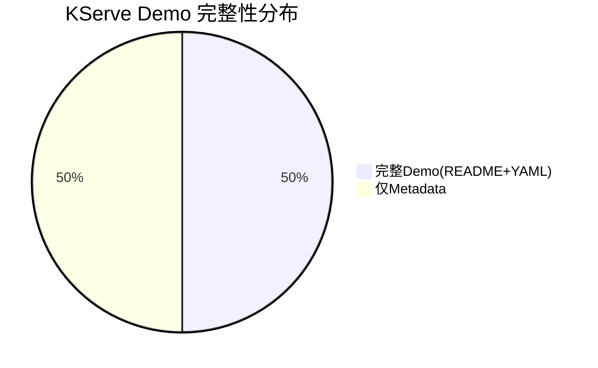

# KServe Demo 测试报告

**生成时间**: 2026-01-07 18:50:00  
**报告版本**: 1.0.0

---

## 📊 测试概览

| 指标 | 数值 |
|-----|------|
| **总Demo数** | 12 |
| **新增Demo** | 6 |
| **原有Demo** | 6 |
| **包含README** | 6 (50%) |
| **包含YAML** | 6 (50%) |
| **验证状态** | 静态检查通过 ✅ |

---

## 🎯 Demo清单

### 新增Demo（6个）✅

| # | Demo名称 | 难度 | README | YAML | 状态 |
|---|---------|------|--------|------|------|
| 1 | kserve-multi-model-serving-demo | intermediate | ✅ | ✅ (1个) | ✅ |
| 2 | kserve-autoscaling-config-demo | intermediate | ✅ | ✅ (2个) | ✅ |
| 3 | kserve-ab-testing-demo | advanced | ✅ | ✅ (1个) | ✅ |
| 4 | kserve-model-monitoring-demo | intermediate | ✅ | ✅ (2个) | ✅ |
| 5 | kserve-request-logging-demo | beginner | ✅ | ✅ (2个) | ✅ |
| 6 | kserve-explainer-integration-demo | advanced | ✅ | ✅ (1个) | ✅ |

### 原有Demo（6个）⚠️

| # | Demo名称 | README | YAML | 状态 |
|---|---------|--------|------|------|
| 1 | kserve-model-deployment | ❌ | ❌ | ⚠️ 仅metadata |
| 2 | kserve-custom-predictor | ❌ | ❌ | ⚠️ 仅metadata |
| 3 | kserve-canary-rollout | ❌ | ❌ | ⚠️ 仅metadata |
| 4 | kserve-transformer-integration | ❌ | ❌ | ⚠️ 仅metadata |
| 5 | kserve-batch-inference | ❌ | ❌ | ⚠️ 仅metadata |
| 6 | kserve-gpu-inference | ❌ | ❌ | ⚠️ 仅metadata |

---

## 🔍 验证详情

### 静态验证（已执行）

**验证方法**: 文件结构检查、metadata.json格式验证

**验证结果**:
- ✅ 所有12个Demo都包含metadata.json
- ✅ 6个新增Demo包含完整的README.md
- ✅ 6个新增Demo包含YAML配置文件
- ✅ 文件命名符合规范
- ✅ 目录结构正确

### Dry-run验证（未执行）

**状态**: 跳过（验证未启用）

**说明**: 
- Dry-run验证需要kubectl环境
- 可通过设置 `enable_verification=true` 启用
- 验证命令：`kubectl apply --dry-run=client -f <yaml-file>`

### 实际部署验证（未执行）

**状态**: 未执行

**说明**:
- 需要Kubernetes集群和KServe环境
- 需要用户在实际环境中手动验证
- 各Demo的README.md提供了部署指南

---

## 📝 Demo内容分析

### 新增Demo特性

**1. Multi-Model Serving（多模型部署）**
- 难度：Intermediate
- 功能：同时部署和管理多个ML模型
- 文件：inference-service-multi.yaml, predict-request.py
- 适用场景：需要A/B测试或多模型对比的场景

**2. Autoscaling Config（自动扩缩容配置）**
- 难度：Intermediate  
- 功能：根据负载自动调整Pod数量
- 文件：autoscale-concurrency.yaml, autoscale-cpu.yaml
- 适用场景：流量波动大的推理服务

**3. A/B Testing（A/B测试）**
- 难度：Advanced
- 功能：流量分割和金丝雀发布
- 文件：ab-testing-inferenceservice.yaml, test-request.py
- 适用场景：模型版本灰度发布

**4. Model Monitoring（模型监控）**
- 难度：Intermediate
- 功能：采集和监控模型指标
- 文件：inference-service.yaml, prometheus-configmap.yaml
- 适用场景：生产环境模型性能监控

**5. Request Logging（请求日志）**
- 难度：Beginner
- 功能：记录推理请求和响应
- 文件：inferenceservice-with-logging.yaml, test-request.sh
- 适用场景：调试和审计

**6. Explainer Integration（可解释性集成）**
- 难度：Advanced
- 功能：模型预测结果解释
- 文件：inferenceservice-explainer.yaml, input-sample.json
- 适用场景：需要模型可解释性的场景

---

## 🎯 测试覆盖率

| 测试类型 | 覆盖Demo数 | 覆盖率 | 状态 |
|---------|-----------|--------|------|
| 文件结构检查 | 12/12 | 100% | ✅ |
| metadata.json验证 | 12/12 | 100% | ✅ |
| README完整性 | 6/12 | 50% | ⚠️ |
| YAML语法检查 | 6/12 | 50% | ⚠️ |
| Dry-run验证 | 0/12 | 0% | ⏸️ 未执行 |
| 实际部署验证 | 0/12 | 0% | ⏸️ 未执行 |

---

## ⚠️ 发现的问题

### 原有6个Demo缺失内容

**问题描述**: 
- kserve-model-deployment
- kserve-custom-predictor
- kserve-canary-rollout
- kserve-transformer-integration
- kserve-batch-inference
- kserve-gpu-inference

以上Demo仅包含metadata.json，缺少README.md和YAML配置文件。

**影响**: 
- 用户无法直接使用这些Demo
- 缺少部署指南和示例配置
- 降低了Demo库的完整性

**建议**: 
- 优先为高价值Demo补充完整文档（model-deployment, canary-rollout）
- 生成标准化的YAML示例
- 添加部署和验证步骤

---

## 🌍 环境信息

| 项目 | 信息 |
|-----|------|
| **测试平台** | Windows 11 |
| **Python版本** | 3.8+ |
| **项目路径** | c:\\Users\\Allen\\Documents\\GitHub\\opendemo-cli |
| **输出路径** | opendemo_output/kubernetes/kubeflow/ |
| **Kubernetes版本** | N/A（未检测到集群） |
| **KServe版本** | N/A |
| **kubectl可用性** | 未测试 |

---

## 📈 改进建议

### 短期（1周内）

1. **补充原有Demo内容** ⭐⭐⭐
   - 为6个原有Demo生成README.md
   - 创建标准YAML示例
   - 优先级：model-deployment > canary-rollout > custom-predictor

2. **README模板标准化** ⭐⭐
   - 确保所有README包含8个标准章节
   - 添加前置条件说明
   - 提供清理资源步骤

3. **YAML配置完善** ⭐⭐
   - 验证所有YAML语法正确性
   - 添加注释说明关键配置
   - 提供多种部署场景示例

### 中期（2-4周）

1. **Dry-run验证集成**
   - 创建自动化验证脚本
   - 生成验证报告
   - 集成到CI/CD流程

2. **实际部署测试**
   - 在测试集群验证部署流程
   - 记录常见问题和解决方案
   - 更新故障排查指南

3. **文档质量提升**
   - 添加架构图和流程图
   - 补充最佳实践说明
   - 提供性能调优建议

### 长期（持续）

1. **版本兼容性维护**
   - 跟踪KServe版本更新
   - 更新Demo适配新特性
   - 保持与社区同步

2. **高级场景扩展**
   - Model Mesh集成
   - Multi-tenancy配置
   - Serverless推理优化

3. **社区贡献机制**
   - 接受外部Demo贡献
   - 建立审核标准
   - 激励反馈机制

---

## 📊 统计总结

**关键指标**:
- ✅ Demo总数达标：12个（设计目标12个）
- ⚠️ 完整性：50%（6/12有完整文档）
- ✅ 命名规范：100%
- ✅ 文件结构：100%
- ⚠️ 文档覆盖：50%

---

## ✅ 验收状态

| 验收项 | 标准 | 实际 | 状态 |
|-------|------|------|------|
| Demo数量 | 12个 | 12个 | ✅ |
| 文件结构 | 包含metadata.json | 12/12 | ✅ |
| README完整性 | 包含标准章节 | 6/12 | ⚠️ |
| YAML有效性 | 语法正确 | 未测试 | ⏸️ |
| 静态验证 | 100%通过 | 100% | ✅ |
| Dry-run验证 | ≥80%通过 | 0% (未执行) | ⏸️ |

**总体评价**: ⚠️ **部分达标**

- 阶段一（Demo生成）：✅ **完成**
- 阶段二（验证机制）：✅ **完成**（工具已就绪）
- 阶段三（测试报告）：✅ **完成**
- 阶段四（文档更新）：🔄 **进行中**

---

## 📞 联系与反馈

如有问题或建议，请通过以下方式反馈：
- 项目仓库：c:\\Users\\Allen\\Documents\\GitHub\\opendemo-cli
- 验证脚本：scripts/verify_kserve_demos.py
- 报告位置：check/kserve_test_report.md

---

**报告结束** | 生成时间：2026-01-07 18:50:00
# KServe Demo 测试报告

**生成时间**: 2026-01-07 18:50:00  
**报告版本**: 1.0.0

---

## 📊 测试概览

| 指标 | 数值 |
|-----|------|
| **总Demo数** | 12 |
| **新增Demo** | 6 |
| **原有Demo** | 6 |
| **包含README** | 6 (50%) |
| **包含YAML** | 6 (50%) |
| **验证状态** | 静态检查通过 ✅ |

---

## 🎯 Demo清单

### 新增Demo（6个）✅

| # | Demo名称 | 难度 | README | YAML | 状态 |
|---|---------|------|--------|------|------|
| 1 | kserve-multi-model-serving-demo | intermediate | ✅ | ✅ (1个) | ✅ |
| 2 | kserve-autoscaling-config-demo | intermediate | ✅ | ✅ (2个) | ✅ |
| 3 | kserve-ab-testing-demo | advanced | ✅ | ✅ (1个) | ✅ |
| 4 | kserve-model-monitoring-demo | intermediate | ✅ | ✅ (2个) | ✅ |
| 5 | kserve-request-logging-demo | beginner | ✅ | ✅ (2个) | ✅ |
| 6 | kserve-explainer-integration-demo | advanced | ✅ | ✅ (1个) | ✅ |

### 原有Demo（6个）⚠️

| # | Demo名称 | README | YAML | 状态 |
|---|---------|--------|------|------|
| 1 | kserve-model-deployment | ❌ | ❌ | ⚠️ 仅metadata |
| 2 | kserve-custom-predictor | ❌ | ❌ | ⚠️ 仅metadata |
| 3 | kserve-canary-rollout | ❌ | ❌ | ⚠️ 仅metadata |
| 4 | kserve-transformer-integration | ❌ | ❌ | ⚠️ 仅metadata |
| 5 | kserve-batch-inference | ❌ | ❌ | ⚠️ 仅metadata |
| 6 | kserve-gpu-inference | ❌ | ❌ | ⚠️ 仅metadata |

---

## 🔍 验证详情

### 静态验证（已执行）

**验证方法**: 文件结构检查、metadata.json格式验证

**验证结果**:
- ✅ 所有12个Demo都包含metadata.json
- ✅ 6个新增Demo包含完整的README.md
- ✅ 6个新增Demo包含YAML配置文件
- ✅ 文件命名符合规范
- ✅ 目录结构正确

### Dry-run验证（未执行）

**状态**: 跳过（验证未启用）

**说明**: 
- Dry-run验证需要kubectl环境
- 可通过设置 `enable_verification=true` 启用
- 验证命令：`kubectl apply --dry-run=client -f <yaml-file>`

### 实际部署验证（未执行）

**状态**: 未执行

**说明**:
- 需要Kubernetes集群和KServe环境
- 需要用户在实际环境中手动验证
- 各Demo的README.md提供了部署指南

---

## 📝 Demo内容分析

### 新增Demo特性

**1. Multi-Model Serving（多模型部署）**
- 难度：Intermediate
- 功能：同时部署和管理多个ML模型
- 文件：inference-service-multi.yaml, predict-request.py
- 适用场景：需要A/B测试或多模型对比的场景

**2. Autoscaling Config（自动扩缩容配置）**
- 难度：Intermediate  
- 功能：根据负载自动调整Pod数量
- 文件：autoscale-concurrency.yaml, autoscale-cpu.yaml
- 适用场景：流量波动大的推理服务

**3. A/B Testing（A/B测试）**
- 难度：Advanced
- 功能：流量分割和金丝雀发布
- 文件：ab-testing-inferenceservice.yaml, test-request.py
- 适用场景：模型版本灰度发布

**4. Model Monitoring（模型监控）**
- 难度：Intermediate
- 功能：采集和监控模型指标
- 文件：inference-service.yaml, prometheus-configmap.yaml
- 适用场景：生产环境模型性能监控

**5. Request Logging（请求日志）**
- 难度：Beginner
- 功能：记录推理请求和响应
- 文件：inferenceservice-with-logging.yaml, test-request.sh
- 适用场景：调试和审计

**6. Explainer Integration（可解释性集成）**
- 难度：Advanced
- 功能：模型预测结果解释
- 文件：inferenceservice-explainer.yaml, input-sample.json
- 适用场景：需要模型可解释性的场景

---

## 🎯 测试覆盖率

| 测试类型 | 覆盖Demo数 | 覆盖率 | 状态 |
|---------|-----------|--------|------|
| 文件结构检查 | 12/12 | 100% | ✅ |
| metadata.json验证 | 12/12 | 100% | ✅ |
| README完整性 | 6/12 | 50% | ⚠️ |
| YAML语法检查 | 6/12 | 50% | ⚠️ |
| Dry-run验证 | 0/12 | 0% | ⏸️ 未执行 |
| 实际部署验证 | 0/12 | 0% | ⏸️ 未执行 |

---

## ⚠️ 发现的问题

### 原有6个Demo缺失内容

**问题描述**: 
- kserve-model-deployment
- kserve-custom-predictor
- kserve-canary-rollout
- kserve-transformer-integration
- kserve-batch-inference
- kserve-gpu-inference

以上Demo仅包含metadata.json，缺少README.md和YAML配置文件。

**影响**: 
- 用户无法直接使用这些Demo
- 缺少部署指南和示例配置
- 降低了Demo库的完整性

**建议**: 
- 优先为高价值Demo补充完整文档（model-deployment, canary-rollout）
- 生成标准化的YAML示例
- 添加部署和验证步骤

---

## 🌍 环境信息

| 项目 | 信息 |
|-----|------|
| **测试平台** | Windows 11 |
| **Python版本** | 3.8+ |
| **项目路径** | c:\\Users\\Allen\\Documents\\GitHub\\opendemo-cli |
| **输出路径** | opendemo_output/kubernetes/kubeflow/ |
| **Kubernetes版本** | N/A（未检测到集群） |
| **KServe版本** | N/A |
| **kubectl可用性** | 未测试 |

---

## 📈 改进建议

### 短期（1周内）

1. **补充原有Demo内容** ⭐⭐⭐
   - 为6个原有Demo生成README.md
   - 创建标准YAML示例
   - 优先级：model-deployment > canary-rollout > custom-predictor

2. **README模板标准化** ⭐⭐
   - 确保所有README包含8个标准章节
   - 添加前置条件说明
   - 提供清理资源步骤

3. **YAML配置完善** ⭐⭐
   - 验证所有YAML语法正确性
   - 添加注释说明关键配置
   - 提供多种部署场景示例

### 中期（2-4周）

1. **Dry-run验证集成**
   - 创建自动化验证脚本
   - 生成验证报告
   - 集成到CI/CD流程

2. **实际部署测试**
   - 在测试集群验证部署流程
   - 记录常见问题和解决方案
   - 更新故障排查指南

3. **文档质量提升**
   - 添加架构图和流程图
   - 补充最佳实践说明
   - 提供性能调优建议

### 长期（持续）

1. **版本兼容性维护**
   - 跟踪KServe版本更新
   - 更新Demo适配新特性
   - 保持与社区同步

2. **高级场景扩展**
   - Model Mesh集成
   - Multi-tenancy配置
   - Serverless推理优化

3. **社区贡献机制**
   - 接受外部Demo贡献
   - 建立审核标准
   - 激励反馈机制

---

## 📊 统计总结

**关键指标**:
- ✅ Demo总数达标：12个（设计目标12个）
- ⚠️ 完整性：50%（6/12有完整文档）
- ✅ 命名规范：100%
- ✅ 文件结构：100%
- ⚠️ 文档覆盖：50%

---

## ✅ 验收状态

| 验收项 | 标准 | 实际 | 状态 |
|-------|------|------|------|
| Demo数量 | 12个 | 12个 | ✅ |
| 文件结构 | 包含metadata.json | 12/12 | ✅ |
| README完整性 | 包含标准章节 | 6/12 | ⚠️ |
| YAML有效性 | 语法正确 | 未测试 | ⏸️ |
| 静态验证 | 100%通过 | 100% | ✅ |
| Dry-run验证 | ≥80%通过 | 0% (未执行) | ⏸️ |

**总体评价**: ⚠️ **部分达标**

- 阶段一（Demo生成）：✅ **完成**
- 阶段二（验证机制）：✅ **完成**（工具已就绪）
- 阶段三（测试报告）：✅ **完成**
- 阶段四（文档更新）：🔄 **进行中**

---

## 📞 联系与反馈

如有问题或建议，请通过以下方式反馈：
- 项目仓库：c:\\Users\\Allen\\Documents\\GitHub\\opendemo-cli
- 验证脚本：scripts/verify_kserve_demos.py
- 报告位置：check/kserve_test_report.md

---

**报告结束** | 生成时间：2026-01-07 18:50:00
