# ⎈ Kubernetes技术栈完整指南

> Kubernetes从基础到企业级运维的完整学习体系，包含185个核心案例

---

## 🚀 快速入口

- 📋 **[K8s 命令行速查表 (k8s-cli.md)](./cli/k8s-cli.md)** - 生产环境必备的Kubernetes命令大全
- 🔍 **[交叉引用索引](#kubernetes案例交叉引用索引)** - 完整的案例导航和关联关系
- 📊 **案例统计**: 185个核心案例，覆盖Kubernetes全技术栈

## 📋 技术栈概述

Kubernetes是一个开源的容器编排平台，用于自动化部署、扩展和管理容器化应用。本技术栈提供从基础概念到生产运维的完整Kubernetes学习路径。

### 🔧 核心技能覆盖

- **基础概念**: Pod、Service、Deployment、StatefulSet等核心资源
- **网络管理**: Service、Ingress、网络策略、DNS服务
- **存储管理**: PV/PVC、StorageClass、CSI插件
- **工作负载**: 各种控制器和调度策略
- **基础架构**: 集群管理、RBAC、监控日志
- **运维实践**: 故障排查、备份恢复、性能优化
- **AI训练**: 大模型训练、分布式训练、模型优化
- **模型服务**: 推理部署、服务网格、负载均衡

### 🎯 适用人群

- Kubernetes初学者
- DevOps工程师
- 云平台架构师
- SRE团队成员
- 容器平台管理员
- AI/ML工程师
- 大模型训练研究人员

---

## 📚 学习路径

### 核心概念系列 (约30个案例)
从Pod到各种控制器，掌握Kubernetes基础资源。

### 网络管理系列 (约25个案例)
学习Service、Ingress、DNS等网络相关组件。

### 存储管理系列 (约20个案例)
掌握PV/PVC、StorageClass等存储相关功能。

### 企业级运维系列 (约90个案例)
涵盖集群管理、监控、安全、故障排查等高级主题。

---

## 🚀 快速开始

### 命令行工具使用

```bash
# 查看所有Kubernetes案例
opendemo search kubernetes

# 获取基础概念案例
opendemo get kubernetes pod-basics

# 获取网络管理案例
opendemo get kubernetes service-types-overview

# 获取大模型训练案例
opendemo get kubernetes model-training-basics

# 直接查看K8s CLI速查表
opendemo get kubernetes k8s-cli-cheatsheet
```

### 生产环境常用命令参考

详细命令清单请查看 **[K8s CLI 命令行速查表](./cli/k8s-cli.md)**，包含：

- 集群管理和节点操作
- Pod 和工作负载管理
- 服务发现和网络配置
- 存储管理和配置管理
- 权限认证和安全加固
- 监控诊断和调试排错
- AI/ML 特殊场景命令

---

## 📊 案例统计

| 分类 | 案例数量 | 状态 |
|------|----------|------|
| 核心概念 | ~30 | ✅ 基本完成 |
| 网络管理 | ~35 | ✅ 完整增强 |
| 存储管理 | ~20 | ✅ 基本完成 |
| 企业级运维 | ~90 | ✅ 基本完成 |
| 大模型训练 | 5 | ✅ 完整增强 |
| 大模型推理 | 5 | ✅ 新增完成 |
| **总计** | **185** | ✅ |

---

## 📚 详细目录

### 核心概念 (约30个)
<details>
<summary>点击查看完整列表</summary>

- Pod基础入门
- Deployment管理
- StatefulSet有状态应用
- DaemonSet节点级部署
- Job/CronJob批处理
- ConfigMap/Secret配置管理
- Namespace资源隔离

</details>

### 网络管理 (约45个)
<details>
<summary>点击查看完整列表</summary>

- [service-types-overview](./service/service-types-overview/) - Service类型详解
- [**service-production-suite**](./service/service-production-suite/) - **Service生产级完整套件** ⭐
- [ingress-basics](./ingress/ingress-basics/) - Ingress基础入门
- [ingress-advanced](./ingress/ingress-advanced/) - Ingress高级特性
- [ingress-security](./ingress/ingress-security/) - Ingress安全配置
- [ingress-production](./ingress/ingress-production/) - Ingress生产实践
- [ingress-troubleshooting](./ingress/ingress-troubleshooting/) - Ingress故障排查
- [**ingress-production-suite**](./ingress/ingress-production-suite/) - **Ingress生产级完整套件** ⭐
- [**service-ingress-integration-demo**](./service-ingress-integration-demo/) - **Service和Ingress集成演示** ⭐
- [ingress/controllers/nginx-controller](./ingress/controllers/nginx-controller/) - NGINX控制器管理
- [ingress/routing-strategies/path-based-routing](./ingress/routing-strategies/path-based-routing/) - 路径路由策略
- [ingress/security-hardening/tls-ssl-security](./ingress/security-hardening/tls-ssl-security/) - TLS安全加固
- [ingress/monitoring-operations/prometheus-monitoring](./ingress/monitoring-operations/prometheus-monitoring/) - Prometheus监控
- [ingress/advanced-features/custom-annotations](./ingress/advanced-features/custom-annotations/) - 自定义注解
- [network/coredns/coredns-deployment](./network/coredns/coredns-deployment/) - CoreDNS生产部署 ⭐
- [network/coredns/coredns-advanced-features](./network/coredns/coredns-advanced-features/) - CoreDNS高级特性 ⭐
- [network/coredns/monitoring-operations](./network/coredns/monitoring-operations/) - CoreDNS监控运维 ⭐
- [network/coredns/security-hardening](./network/coredns/security-hardening/) - CoreDNS安全加固 ⭐
- [network/coredns-basics](./network/coredns-basics/) - CoreDNS基础入门
- [network/coredns-advanced](./network/coredns-advanced/) - CoreDNS高级特性
- [terway/basics/network-fundamentals](./terway/basics/network-fundamentals/) - Terway网络基础 ⭐
- [terway/advanced-features/advanced-networking](./terway/advanced-features/advanced-networking/) - Terway高级网络 ⭐
- [terway/advanced-features/custom-networking](./terway/advanced-features/custom-networking/) - Terway自定义网络 ⭐
- [terway/deployment/terway-deployment](./terway/deployment/terway-deployment/) - Terway生产部署 ⭐
- [terway/monitoring-operations/prometheus-monitoring](./terway/monitoring-operations/prometheus-monitoring/) - Terway监控运维 ⭐
- [terway/security-hardening/network-security](./terway/security-hardening/network-security/) - Terway安全加固 ⭐
- [network/csi-plugin-basics](./network/csi-plugin-basics/) - CSI存储插件基础

</details>

### 存储管理 (约20个)
<details>
<summary>点击查看完整列表</summary>

- PV/PVC基础
- StorageClass动态供应
- CSI存储插件
- 存储性能优化
- 存储故障排查

</details>

### 企业级运维 (约90个)
<details>
<summary>点击查看完整列表</summary>

- 集群搭建与初始化
- RBAC权限管理
- 监控与日志系统
- 备份与灾备恢复
- 安全加固配置
- 性能优化调优
- 故障排查诊断

</details>

### 大模型训练 (5个)
<details>
<summary>点击查看完整列表</summary>

- [model-training-basics](./model-training/model-training-basics/) - 大模型训练基础入门 (含可运行示例)
- [distributed-training-advanced](./model-training/distributed-training-advanced/) - 分布式训练进阶 (含DDP工具)
- [model-finetuning-optimization](./model-training/model-finetuning-optimization/) - 模型微调与优化 (完整增强版)
- [production-deployment](./model-training/production-deployment/) - 生产环境部署 (含成本优化)
- [monitoring-operations](./model-training/monitoring-operations/) - 监控与运维 (完整体系)

</details>

### 大模型推理 (5个)
<details>
<summary>点击查看完整列表</summary>

- [inference-basics](./model-inference/inference-basics/) - 推理基础入门 (完整教程)
- [inference-advanced](./model-inference/inference-advanced/) - 推理进阶优化 (批量/流式处理)
- [inference-performance](./model-inference/inference-performance/) - 推理性能优化 (延迟/吞吐量)
- [inference-deployment](./model-inference/inference-deployment/) - 推理生产部署 (高可用/自动扩缩容)
- [inference-operations](./model-inference/inference-operations/) - 推理监控运维 (完整监控体系)

</details>

---

# Kubernetes案例交叉引用索引

## 1. 索引体系概述

本索引提供了Kubernetes案例之间的关联关系和学习路径指引，帮助用户系统化地学习和应用相关技术。

### 1.1 索引结构说明

```mermaid
graph TD
    A[学习起点] --> B[基础概念]
    B --> C[网络管理]
    C --> D[存储管理]
    D --> E[企业运维]
    E --> F[AI训练]
    F --> G[模型服务]
    
    A --> H[故障排查]
    H --> I[监控告警]
    I --> J[性能优化]
    
    F --> K[大模型训练]
    K --> L[分布式训练]
    L --> M[模型微调]
    M --> N[生产部署]
    N --> O[监控运维]
    
    G --> P[模型推理]
    P --> Q[基础推理]
    Q --> R[批量处理]
    R --> S[流式处理]
    S --> T[多模型服务]
```



## 2. 按技术领域索引

### 2.1 基础概念系列

| 案例名称 | 核心概念 | 关联案例 | 学习难度 | 预估时间 |
|----------|----------|----------|----------|----------|
| Pod基础入门 | Pod生命周期、容器编排 | 工作负载管理 | 初级 | 2小时 |
| Deployment管理 | 应用部署、滚动更新 | ReplicaSet、StatefulSet | 初级 | 3小时 |
| Service类型详解 | 服务发现、负载均衡 | CoreDNS、Ingress | 初级 | 2小时 |
| ConfigMap/Secret | 配置管理、敏感信息 | 应用配置最佳实践 | 初级 | 1.5小时 |
| Namespace资源隔离 | 多租户、资源配额 | RBAC、资源管理 | 中级 | 2小时 |

### 2.2 网络管理系列

| 案例名称 | 核心概念 | 关联案例 | 学习难度 | 预估时间 |
|----------|----------|----------|----------|----------|
| Service类型详解 | ClusterIP、NodePort、LoadBalancer | CoreDNS、网络策略 | 初级 | 2小时 |
| Ingress入口管理 | HTTP路由、TLS终结 | NGINX Ingress、Traefik | 中级 | 3小时 |
| CoreDNS服务发现 | DNS解析、服务注册 | Service、Pod DNS | 中级 | 2小时 |
| 网络策略配置 | 流量控制、安全隔离 | CNI插件、安全组 | 高级 | 4小时 |
| Terway网络插件 | 阿里云网络方案 | VPC集成、安全组 | 中级 | 3小时 |

### 2.3 存储管理系列

| 案例名称 | 核心概念 | 关联案例 | 学习难度 | 预估时间 |
|----------|----------|----------|----------|----------|
| PV/PVC基础 | 持久化存储、动态供应 | StorageClass、CSI | 初级 | 2.5小时 |
| StorageClass详解 | 存储类、参数配置 | 动态供应、回收策略 | 中级 | 3小时 |
| CSI存储插件 | 容器存储接口、插件开发 | 存储供应商集成 | 高级 | 4小时 |
| 存储性能优化 | I/O优化、缓存策略 | 监控指标、调优实践 | 高级 | 3.5小时 |

### 2.4 企业运维系列

| 案例名称 | 核心概念 | 关联案例 | 学习难度 | 预估时间 |
|----------|----------|----------|----------|----------|
| 集群搭建与初始化 | Kubeadm、高可用 | 网络插件、存储配置 | 高级 | 6小时 |
| RBAC权限管理 | 角色绑定、权限控制 | ServiceAccount、准入控制 | 中级 | 3小时 |
| 监控系统部署 | Prometheus、Grafana | 告警规则、仪表板 | 中级 | 4小时 |
| 日志收集系统 | EFK/ELK堆栈、Loki | Fluentd、Logstash | 中级 | 4小时 |
| 备份与灾备 | etcd备份、应用恢复 | Velero、快照管理 | 高级 | 5小时 |

## 3. 按学习路径索引

### 3.1 新手入门路径

**路径名称**: Kubernetes基础学习路径
**目标**: 掌握Kubernetes核心概念和基本操作

```mermaid
graph LR
    A[Pod基础] --> B[Service概念]
    B --> C[Deployment管理]
    C --> D[ConfigMap使用]
    D --> E[简单应用部署]
```



**推荐学习顺序**:
1. [Pod基础入门](./workload/pod-basics/) - 2小时
2. [Service类型详解](./service/service-types-overview/) - 2小时  
3. [Deployment管理](./workload/deployment-management/) - 3小时
4. [ConfigMap/Secret配置](./core/config-management/) - 1.5小时
5. [简单应用部署实践](./examples/simple-app/) - 2小时

**前置要求**: Docker基础、Linux命令行操作

### 3.2 网络专家路径

**路径名称**: Kubernetes网络深度学习路径
**目标**: 精通Kubernetes网络架构和高级配置

```mermaid
graph LR
    A[Service深入] --> B[Ingress配置]
    B --> C[CoreDNS管理]
    C --> D[网络策略]
    D --> E[CNI插件开发]
```



**推荐学习顺序**:
1. [Service类型详解](./service/service-types-overview/) - 2小时
2. [Ingress入口管理](./ingress/ingress-basics/) - 3小时
3. [CoreDNS服务发现](./network/coredns-configuration/) - 2小时
4. [网络策略配置](./network/network-policy-advanced/) - 4小时
5. [CNI插件开发](./network/cni-plugin-development/) - 6小时

**前置要求**: 网络基础知识、TCP/IP协议理解

### 3.3 存储专家路径

**路径名称**: Kubernetes存储专家路径
**目标**: 掌握企业级存储解决方案和性能优化

```mermaid
graph LR
    A[PV/PVC基础] --> B[StorageClass]
    B --> C[CSI插件]
    C --> D[存储优化]
    D --> E[存储监控]
```



**推荐学习顺序**:
1. [PV/PVC基础](./pv-pvc/pv-pvc-basics/) - 2.5小时
2. [StorageClass详解](./pv-pvc/storageclass-advanced/) - 3小时
3. [CSI存储插件](./storage/csi-plugin-development/) - 4小时
4. [存储性能优化](./pv-pvc/storage-performance-optimization/) - 3.5小时
5. [存储监控告警](./monitoring/storage-monitoring/) - 3小时

**前置要求**: 存储系统基础、性能调优经验

### 3.4 运维专家路径

**路径名称**: Kubernetes运维专家路径
**目标**: 具备生产环境运维和故障处理能力

```mermaid
graph LR
    A[集群管理] --> B[权限控制]
    B --> C[监控告警]
    C --> D[日志系统]
    D --> E[备份恢复]
```



**推荐学习顺序**:
1. [集群搭建与初始化](./infrastructure/cluster-setup/) - 6小时
2. [RBAC权限管理](./rbac/basic-rbac/) - 3小时
3. [监控系统部署](./prometheus/basic-prometheus/) - 4小时
4. [日志收集系统](./efk/basic-efk/) - 4小时
5. [备份与灾备](./velero/backup-restore/) - 5小时

**前置要求**: 系统管理经验、监控工具使用

## 4. AI/ML专项索引

### 4.1 大模型训练路径

**路径名称**: 大模型训练完整实践路径
**目标**: 掌握Kubernetes环境下大模型训练全流程

```mermaid
graph LR
    A[基础环境] --> B[分布式训练]
    B --> C[模型微调]
    C --> D[生产部署]
    D --> E[监控运维]
```



**推荐学习顺序**:
1. [大模型训练基础入门](./model-training/model-training-basics/) - 4小时
2. [分布式训练进阶](./model-training/distributed-training-advanced/) - 5小时
3. [模型微调与优化](./model-training/model-finetuning-optimization/) - 6小时
4. [生产环境部署](./model-training/production-deployment/) - 4小时
5. [监控与运维](./model-training/monitoring-operations/) - 3小时

**前置要求**: 机器学习基础、PyTorch/TensorFlow使用经验

### 4.2 模型推理路径

**路径名称**: 模型推理服务化路径
**目标**: 掌握AI模型的生产级推理部署

```mermaid
graph LR
    A[基础推理] --> B[批量处理]
    B --> C[流式处理]
    C --> D[性能优化]
    D --> E[高可用部署]
```



**推荐学习顺序**:
1. [推理基础入门](./model-inference/inference-basics/) - 3小时
2. [推理进阶优化](./model-inference/inference-advanced/) - 4小时
3. [推理性能优化](./model-inference/inference-performance/) - 3小时
4. [推理生产部署](./model-inference/inference-deployment/) - 4小时
5. [推理监控运维](./model-inference/inference-operations/) - 3小时

**前置要求**: 模型部署经验、性能优化基础

## 5. 故障排查专项索引

### 5.1 系统化故障排查

**路径名称**: Kubernetes故障排查专家路径
**目标**: 建立完整的故障诊断和处理能力

```mermaid
graph LR
    A[基础设施层] --> B[控制平面层]
    B --> C[工作负载层]
    C --> D[网络层]
    D --> E[存储层]
```



**推荐学习顺序**:
1. [基础设施故障排查](./infrastructure/infra-troubleshooting/) - 4小时
2. [控制平面故障诊断](./troubleshooting/control-plane-failure/) - 3小时
3. [工作负载问题处理](./troubleshooting/pod-troubleshooting/) - 2小时
4. [网络连通性排查](./troubleshooting/service-connectivity/) - 3小时
5. [存储系统故障](./troubleshooting/persistent-storage/) - 3小时

**前置要求**: Kubernetes基础操作、系统管理经验

### 5.2 性能问题诊断

**路径名称**: 性能优化与瓶颈分析
**目标**: 掌握性能问题的识别和优化方法

```mermaid
graph LR
    A[资源监控] --> B[性能分析]
    B --> C[瓶颈识别]
    C --> D[优化实施]
    D --> E[效果验证]
```



**推荐学习顺序**:
1. [资源使用监控](./monitoring/resource-monitoring/) - 2小时
2. [应用性能分析](./monitoring/application-performance/) - 3小时
3. [系统瓶颈识别](./troubleshooting/resource-shortage/) - 2小时
4. [优化策略实施](./optimization/performance-tuning/) - 4小时
5. [优化效果验证](./monitoring/performance-validation/) - 2小时

## 6. 工具集成索引

### 6.1 MCP集成案例

| 工具厂商 | 案例目录 | 核心功能 | 集成方式 | 兼容版本 |
|----------|----------|----------|----------|----------|
| OpenAI | [mcp/openai](./mcp/openai/) | GPT模型集成 | API调用 | GPT-3.5/4 |
| Google | [mcp/google](./mcp/google/) | Gemini模型集成 | Vertex AI | Gemini Pro |
| Microsoft | [mcp/microsoft](./mcp/microsoft/) | Azure AI集成 | Azure API | 最新版 |
| Meta | [mcp/meta](./mcp/meta/) | LLaMA模型集成 | API服务 | LLaMA2 |
| 阿里云 | [mcp/alibaba](./mcp/alibaba/) | 通义千问集成 | DashScope | Qwen系列 |
| 腾讯云 | [mcp/tencent](./mcp/tencent/) | 混元大模型 | Hunyuan API | 最新版 |

### 6.2 Agent集成案例

| Agent类型 | 案例目录 | 主要功能 | 部署方式 | 监控集成 |
|-----------|----------|----------|----------|----------|
| 监控Agent | [agent/prometheus](./agent/prometheus/) | 指标收集 | DaemonSet | Prometheus |
| 日志Agent | [agent/fluentd](./agent/fluentd/) | 日志收集 | DaemonSet | Elasticsearch |
| 网络Agent | [agent/cilium](./agent/cilium/) | CNI网络 | DaemonSet | Hubble |
| 安全Agent | [agent/falco](./agent/falco/) | 安全监控 | DaemonSet | Falcosidekick |

## 7. 最佳实践索引

### 7.1 安全最佳实践

| 实践主题 | 相关案例 | 安全控制点 | 实施难度 |
|----------|----------|------------|----------|
| Pod安全策略 | [security/pod-security](./security/pod-security/) | PSP/OPA | 中级 |
| 网络隔离 | [network/network-policy](./network/network-policy/) | NetworkPolicy | 初级 |
| 密钥管理 | [security/secrets-management](./security/secrets-management/) | External Secrets | 中级 |
| 镜像安全 | [security/image-scanning](./security/image-scanning/) | Trivy/Clair | 初级 |

### 7.2 性能优化实践

| 优化方向 | 相关案例 | 优化技术 | 预期收益 |
|----------|----------|----------|----------|
| 资源调度 | [optimization/scheduling](./optimization/scheduling/) | 亲和性、污点 | 20-30% |
| 存储优化 | [pv-pvc/storage-optimization](./pv-pvc/storage-optimization/) | SSD、缓存 | 40-60% |
| 网络优化 | [network/performance](./network/performance/) | CNI优化 | 15-25% |
| 应用优化 | [optimization/application](./optimization/application/) | 资源限制 | 30-50% |

## 8. 学习资源索引

### 8.1 官方文档链接

| 资源类型 | 链接地址 | 适用场景 |
|----------|----------|----------|
| Kubernetes官方文档 | https://kubernetes.io/docs/ | 所有学习阶段 |
| API参考文档 | https://kubernetes.io/docs/reference/ | 开发集成 |
| 教程和示例 | https://kubernetes.io/docs/tutorials/ | 入门学习 |
| 故障排查指南 | https://kubernetes.io/docs/tasks/debug/ | 问题解决 |

### 8.2 社区资源

| 资源类型 | 链接地址 | 特点说明 |
|----------|----------|----------|
| GitHub组织 | https://github.com/kubernetes | 官方代码仓库 |
| Slack社区 | https://slack.k8s.io/ | 实时交流讨论 |
| Stack Overflow | https://stackoverflow.com/questions/tagged/kubernetes | 问题解答 |
| Reddit社区 | https://www.reddit.com/r/kubernetes/ | 经验分享 |

### 8.3 学习平台

| 平台名称 | 链接地址 | 课程特色 |
|----------|----------|----------|
| KubeAcademy | https://kube.academy/ | 免费在线课程 |
| Linux Foundation | https://training.linuxfoundation.org/ | 认证培训 |
| Udemy | https://www.udemy.com/topic/kubernetes/ | 实战项目 |
| Coursera | https://www.coursera.org/ | 大学课程 |

## 9. 版本兼容性索引

### 9.1 Kubernetes版本支持矩阵

| 案例类别 | 支持的Kubernetes版本 | 最低版本要求 | 推荐版本 |
|----------|---------------------|--------------|----------|
| 基础概念 | 1.18+ | 1.18 | 1.24+ |
| 网络管理 | 1.19+ | 1.19 | 1.25+ |
| 存储管理 | 1.20+ | 1.20 | 1.25+ |
| 企业运维 | 1.20+ | 1.20 | 1.26+ |
| AI训练 | 1.21+ | 1.21 | 1.26+ |
| 模型推理 | 1.22+ | 1.22 | 1.27+ |

### 9.2 云平台兼容性

| 云服务商 | 支持的服务 | 集成程度 | 特殊配置 |
|----------|------------|----------|----------|
| AWS | EKS、ECR、S3 | 完全支持 | IRSA配置 |
| Azure | AKS、ACR、Blob | 完全支持 | MSI集成 |
| GCP | GKE、GCR、GCS | 完全支持 | Workload Identity |
| 阿里云 | ACK、ACR、OSS | 完全支持 | RAM角色 |
| 腾讯云 | TKE、TCR、COS | 完全支持 | CAM策略 |

## 10. 贡献和维护索引

### 10.1 案例贡献指南

**贡献流程**:
1. Fork项目仓库
2. 创建功能分支
3. 编写案例代码和文档
4. 提交Pull Request
5. 通过Code Review合并

**案例标准要求**:
- ✅ 包含完整的README文档
- ✅ 提供可执行的配置文件
- ✅ 遵循统一的目录结构
- ✅ 包含必要的元数据信息
- ✅ 提供测试验证方法

### 10.2 维护责任分配

| 维护领域 | 负责人 | 联系方式 | 维护频率 |
|----------|--------|----------|----------|
| 基础概念 | 核心团队 | team@opendemo.dev | 每月 |
| 网络管理 | 网络专家 | network-team@opendemo.dev | 每季度 |
| 存储管理 | 存储专家 | storage-team@opendemo.dev | 每季度 |
| AI训练 | AI团队 | ai-team@opendemo.dev | 每月 |
| 文档质量 | 技术写作 | docs@opendemo.dev | 持续 |

---

## 🛠️ 环境准备

```bash
# 安装kubectl
# 推荐版本: 最新稳定版

# 配置集群访问
kubectl cluster-info

# 验证权限
kubectl auth can-i get pods --all-namespaces

# 安装必要工具
kubectl krew install ctx ns
```

---

## 📖 学习建议

1. **理论结合实践**: 边学边练，每个概念都要动手实验
2. **循序渐进**: 按照基础→网络→存储→运维的顺序学习
3. **重视安全**: Kubernetes安全配置是生产环境的关键
4. **监控先行**: 建立完善的监控告警体系
5. **网络重点**: 深入学习Service和Ingress的生产级配置
6. **集成思维**: 掌握Service与Ingress的协同工作机制
7. **AI训练特别注意**: 大模型训练需要额外关注GPU资源、分布式协调和成本控制
8. **微调实践重点**: 模型微调应注重参数效率、领域适应和生产部署的完整闭环
9. **训练体系完整性**: 确保从环境搭建到生产部署的全链路可执行性
10. **推理服务优化**: AI推理服务需重点关注延迟优化、资源利用率和高可用部署
11. **文档查阅**: 养成查阅官方文档的习惯

---

## 🤝 贡献指南

欢迎提交新的Kubernetes案例或改进现有案例：
- 遵循Kubernetes最佳实践
- 提供可运行的YAML配置
- 确保案例的生产可用性
- 遵循统一的文档格式
- AI/ML相关案例需包含性能基准和资源需求说明
- 模型微调案例需提供完整的行业应用场景和合规指导
- 所有案例必须包含可运行的配置文件和部署脚本
- 建立完整的交叉引用和索引体系便于学习导航
- 推理案例需包含性能基准测试和监控告警配置
- CLI命令示例需经过实际环境验证，确保准确性和实用性

---

> **💡 提示**: Kubernetes是云原生时代的标准容器编排平台，掌握它是现代DevOps工程师的必备技能。

**更新时间**: 2026-02-06  
**版本**: v1.1.0  
**维护状态**: ✅ 活跃维护中