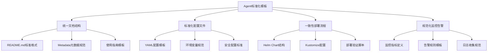

# Agent标准化模板文档

## 1. 模板概述

本模板为Kubernetes Agent相关案例提供标准化的文档结构和配置规范。

### 1.1 标准化目标



### 1.2 模板目录结构

```
agent-template/
├── README.md                    # 标准文档说明
├── metadata.json               # 元数据配置
├── manifests/                  # 部署配置文件
│   ├── deployment.yaml        # Deployment配置
│   ├── service.yaml           # Service配置
│   ├── configmap.yaml         # ConfigMap配置
│   └── secret.yaml            # Secret配置
├── helm-chart/                # Helm Chart目录
│   ├── Chart.yaml            # Chart定义
│   ├── values.yaml           # 默认值配置
│   └── templates/            # 模板文件
├── scripts/                   # 辅助脚本
│   ├── deploy.sh             # 部署脚本
│   ├── validate.sh           # 验证脚本
│   └── cleanup.sh            # 清理脚本
├── monitoring/                # 监控配置
│   ├── prometheus-rules.yaml # Prometheus告警规则
│   └── grafana-dashboard.json # Grafana仪表板
└── examples/                  # 使用示例
    ├── basic-usage.yaml      # 基础使用示例
    └── advanced-config.yaml  # 高级配置示例
```

## 2. 标准文档模板

### 2.1 README.md标准格式

```markdown
# [Agent名称] Kubernetes集成指南

## 1. 概述

简要描述该Agent的功能特性和主要用途。

### 1.1 核心特性
- 特性1描述
- 特性2描述
- 特性3描述

### 1.2 适用场景
- 场景1说明
- 场景2说明
- 场景3说明

## 2. 快速开始

### 2.1 环境要求
```bash
# Kubernetes版本要求
kubectl version >= 1.20

# 必需的权限
- 创建Deployments权限
- 创建Services权限
- 访问Secrets权限
```

### 2.2 部署步骤
```bash
# 1. 克隆仓库
git clone [repository-url]

# 2. 进入目录
cd [agent-directory]

# 3. 配置环境变量
export api_key: "${API_KEY}"
export NAMESPACE="default"

# 4. 部署Agent
kubectl apply -f manifests/

# 5. 验证部署
kubectl get pods -n $NAMESPACE
```

## 3. 配置说明

### 3.1 环境变量配置
| 变量名 | 描述 | 默认值 | 是否必需 |
|--------|------|--------|----------|
| API_KEY | API密钥 | 无 | 是 |
| LOG_LEVEL | 日志级别 | info | 否 |
| NAMESPACE | 部署命名空间 | default | 否 |

### 3.2 ConfigMap配置
```yaml
apiVersion: v1
kind: ConfigMap
metadata:
  name: [agent-name]-config
data:
  config.yaml: |
    # Agent配置文件
    server:
      port: 8080
    logging:
      level: info
```

## 4. 使用指南

### 4.1 基础使用
```yaml
# 基础部署示例
apiVersion: apps/v1
kind: Deployment
metadata:
  name: [agent-name]-basic
spec:
  replicas: 1
  selector:
    matchLabels:
      app: [agent-name]
  template:
    metadata:
      labels:
        app: [agent-name]
    spec:
      containers:
      - name: agent
        image: [agent-image]:latest
        envFrom:
        - configMapRef:
            name: [agent-name]-config
        - secretRef:
            name: [agent-name]-secret
```

### 4.2 高级配置
```yaml
# 高级配置示例
apiVersion: apps/v1
kind: Deployment
metadata:
  name: [agent-name]-advanced
spec:
  replicas: 3
  selector:
    matchLabels:
      app: [agent-name]
  template:
    metadata:
      labels:
        app: [agent-name]
    spec:
      containers:
      - name: agent
        image: [agent-image]:latest
        resources:
          requests:
            cpu: "500m"
            memory: "1Gi"
          limits:
            cpu: "1"
            memory: "2Gi"
        env:
        - name: API_KEY
          valueFrom:
            secretKeyRef:
              name: [agent-name]-secret
              key: api-key
        volumeMounts:
        - name: config-volume
          mountPath: /etc/config
      volumes:
      - name: config-volume
        configMap:
          name: [agent-name]-config
```

## 5. 监控与告警

### 5.1 监控指标
- `agent_requests_total`: 请求总数
- `agent_errors_total`: 错误总数
- `agent_response_time_seconds`: 响应时间
- `agent_up`: Agent运行状态

### 5.2 告警规则
```yaml
groups:
- name: [agent-name].alerts
  rules:
  - alert: AgentDown
    expr: agent_up == 0
    for: 2m
    labels:
      severity: critical
    annotations:
      summary: "[agent-name] is down"
      description: "[agent-name] has been down for more than 2 minutes"
```

## 6. 故障排查

### 6.1 常见问题
| 问题 | 原因 | 解决方案 |
|------|------|----------|
| 无法连接API | 网络策略限制 | 检查NetworkPolicy配置 |
| 认证失败 | API密钥错误 | 验证Secret配置 |
| 资源不足 | 请求超过限制 | 调整resources配置 |

### 6.2 诊断命令
```bash
# 检查Pod状态
kubectl get pods -n [namespace] -l app=[agent-name]

# 查看Pod日志
kubectl logs -n [namespace] -l app=[agent-name] --tail=100

# 检查资源使用
kubectl top pod -n [namespace] -l app=[agent-name]

# 验证服务连接
kubectl exec -it [pod-name] -n [namespace] -- curl http://localhost:8080/health
```

## 7. 安全配置

### 7.1 网络策略
```yaml
apiVersion: networking.k8s.io/v1
kind: NetworkPolicy
metadata:
  name: [agent-name]-network-policy
spec:
  podSelector:
    matchLabels:
      app: [agent-name]
  policyTypes:
  - Ingress
  - Egress
  ingress:
  - from:
    - namespaceSelector:
        matchLabels:
          name: monitoring
    ports:
    - protocol: TCP
      port: 8080
```

### 7.2 RBAC配置
```yaml
apiVersion: rbac.authorization.k8s.io/v1
kind: Role
metadata:
  name: [agent-name]-role
rules:
- apiGroups: [""]
  resources: ["pods", "services"]
  verbs: ["get", "list"]

---
apiVersion: rbac.authorization.k8s.io/v1
kind: RoleBinding
metadata:
  name: [agent-name]-rolebinding
subjects:
- kind: ServiceAccount
  name: [agent-name]-sa
roleRef:
  kind: Role
  name: [agent-name]-role
  apiGroup: rbac.authorization.k8s.io
```

## 8. 版本兼容性

| Agent版本 | Kubernetes版本 | 兼容性 |
|-----------|----------------|--------|
| v1.0.0    | 1.20+          | ✅ 完全兼容 |
| v1.1.0    | 1.21+          | ✅ 完全兼容 |
| v1.2.0    | 1.22+          | ✅ 完全兼容 |

## 9. 相关资源

- [官方文档链接]()
- [GitHub仓库]()
- [API文档]()
- [社区论坛]()

## 10. 许可证

MIT License
```

### 2.2 Metadata.json标准格式

```json
{
  "name": "[agent-name]",
  "title": "[Agent显示名称]",
  "language": "kubernetes",
  "keywords": [
    "agent",
    "kubernetes",
    "integration",
    "monitoring",
    "automation"
  ],
  "description": "详细的Agent功能描述和用途说明",
  "difficulty": "intermediate",
  "author": "维护者姓名或团队",
  "created_at": "2026-01-30T00:00:00Z",
  "updated_at": "2026-01-30T00:00:00Z",
  "version": "1.0.0",
  "verified": true,
  "category": "agent",
  "subcategory": "[具体子类别]",
  "tags": [
    "监控代理",
    "自动化工具",
    "Kubernetes集成"
  ],
  "requires": [
    "kubectl",
    "kubernetes-cluster-1.20+"
  ],
  "estimated_time": "30分钟",
  "compatibility": {
    "kubernetes": ">=1.20",
    "operating_systems": [
      "linux/amd64",
      "linux/arm64"
    ],
    "cloud_providers": [
      "aws",
      "azure",
      "gcp",
      "on-premises"
    ]
  },
  "files": [
    "README.md",
    "metadata.json",
    "manifests/deployment.yaml",
    "manifests/service.yaml",
    "manifests/configmap.yaml",
    "scripts/deploy.sh",
    "scripts/validate.sh"
  ],
  "prerequisites": [
    "Kubernetes基础知识",
    "YAML配置经验",
    "kubectl命令行工具"
  ],
  "learning_objectives": [
    "掌握Agent的基本部署方法",
    "理解Agent的配置选项",
    "学会监控和故障排查",
    "掌握安全配置最佳实践"
  ]
}
```

## 3. 标准部署配置模板

### 3.1 Deployment.yaml模板

```yaml
apiVersion: apps/v1
kind: Deployment
metadata:
  name: [agent-name]
  namespace: [namespace]
  labels:
    app: [agent-name]
    version: "1.0.0"
spec:
  replicas: 1
  selector:
    matchLabels:
      app: [agent-name]
  template:
    metadata:
      labels:
        app: [agent-name]
        version: "1.0.0"
    spec:
      serviceAccountName: [agent-name]-sa
      containers:
      - name: [agent-name]
        image: [agent-image]:latest
        imagePullPolicy: Always
        ports:
        - containerPort: 8080
          name: http
        env:
        - name: NAMESPACE
          valueFrom:
            fieldRef:
              fieldPath: metadata.namespace
        - name: POD_NAME
          valueFrom:
            fieldRef:
              fieldPath: metadata.name
        - name: API_KEY
          valueFrom:
            secretKeyRef:
              name: [agent-name]-secret
              key: api-key
        - name: LOG_LEVEL
          value: "info"
        envFrom:
        - configMapRef:
            name: [agent-name]-config
        resources:
          requests:
            cpu: "100m"
            memory: "128Mi"
          limits:
            cpu: "500m"
            memory: "512Mi"
        livenessProbe:
          httpGet:
            path: /health
            port: 8080
          initialDelaySeconds: 30
          periodSeconds: 10
          timeoutSeconds: 5
          failureThreshold: 3
        readinessProbe:
          httpGet:
            path: /ready
            port: 8080
          initialDelaySeconds: 5
          periodSeconds: 5
          timeoutSeconds: 3
          failureThreshold: 3
        volumeMounts:
        - name: config-volume
          mountPath: /etc/[agent-name]
          readOnly: true
        - name: tmp-volume
          mountPath: /tmp
      volumes:
      - name: config-volume
        configMap:
          name: [agent-name]-config
      - name: tmp-volume
        emptyDir: {}
      securityContext:
        runAsNonRoot: true
        runAsUser: 1000
        fsGroup: 2000
```

### 3.2 Service.yaml模板

```yaml
apiVersion: v1
kind: Service
metadata:
  name: [agent-name]
  namespace: [namespace]
  labels:
    app: [agent-name]
spec:
  selector:
    app: [agent-name]
  ports:
  - name: http
    port: 80
    targetPort: 8080
    protocol: TCP
  type: ClusterIP
```

### 3.3 ConfigMap.yaml模板

```yaml
apiVersion: v1
kind: ConfigMap
metadata:
  name: [agent-name]-config
  namespace: [namespace]
data:
  config.yaml: |
    # Agent配置文件
    server:
      host: "0.0.0.0"
      port: 8080
      read_timeout: "30s"
      write_timeout: "30s"
    
    logging:
      level: "info"
      format: "json"
      output: "stdout"
    
    metrics:
      enabled: true
      path: "/metrics"
    
    health:
      liveness_path: "/health"
      readiness_path: "/ready"
    
    # Agent特定配置
    agent:
      poll_interval: "30s"
      batch_size: 100
      retry_attempts: 3
      retry_delay: "5s"
```

### 3.4 Secret.yaml模板

```yaml
apiVersion: v1
kind: Secret
metadata:
  name: [agent-name]-secret
  namespace: [namespace]
type: Opaque
data:
  # 使用 echo -n "your-api-key" | base64 编码
  api-key: eW91ci1hcGkta2V5Cg==
```

## 4. 部署脚本模板

### 4.1 Deploy.sh部署脚本

```bash
#!/bin/bash

# Agent部署脚本
set -euo pipefail

# 配置变量
AGENT_NAME="[agent-name]"
NAMESPACE="${NAMESPACE:-default}"
IMAGE_TAG="${IMAGE_TAG:-latest}"

# 颜色输出
RED='\033[0;31m'
GREEN='\033[0;32m'
YELLOW='\033[1;33m'
NC='\033[0m' # No Color

echo_color() {
    local color=$1
    local message=$2
    echo -e "${color}${message}${NC}"
}

# 验证环境
validate_environment() {
    echo_color $YELLOW "🔍 验证环境..."
    
    # 检查kubectl
    if ! command -v kubectl &> /dev/null; then
        echo_color $RED "❌ kubectl未安装"
        exit 1
    fi
    
    # 检查集群连接
    if ! kubectl cluster-info &> /dev/null; then
        echo_color $RED "❌ 无法连接到Kubernetes集群"
        exit 1
    fi
    
    # 检查命名空间
    if ! kubectl get namespace "$NAMESPACE" &> /dev/null; then
        echo_color $YELLOW "创建工作命名空间: $NAMESPACE"
        kubectl create namespace "$NAMESPACE"
    fi
    
    echo_color $GREEN "✅ 环境验证通过"
}

# 部署配置
deploy_configurations() {
    echo_color $YELLOW "🚀 部署配置..."
    
    # 创建ConfigMap
    echo "创建ConfigMap..."
    kubectl apply -f manifests/configmap.yaml -n "$NAMESPACE"
    
    # 创建Secret（如果不存在）
    if ! kubectl get secret "[agent-name]-secret" -n "$NAMESPACE" &> /dev/null; then
        echo "创建Secret..."
        kubectl apply -f manifests/secret.yaml -n "$NAMESPACE"
    else
        echo "Secret已存在，跳过创建"
    fi
    
    # 创建Service
    echo "创建Service..."
    kubectl apply -f manifests/service.yaml -n "$NAMESPACE"
    
    echo_color $GREEN "✅ 配置部署完成"
}

# 部署应用
deploy_application() {
    echo_color $YELLOW "📦 部署应用..."
    
    # 替换镜像标签
    sed "s|[agent-image]:latest|[agent-image]:$IMAGE_TAG|g" manifests/deployment.yaml | \
        kubectl apply -n "$NAMESPACE" -f -
    
    echo_color $GREEN "✅ 应用部署完成"
}

# 等待部署完成
wait_for_deployment() {
    echo_color $YELLOW "⏳ 等待部署完成..."
    
    local timeout=300  # 5分钟超时
    local start_time=$(date +%s)
    
    while true; do
        local current_time=$(date +%s)
        local elapsed=$((current_time - start_time))
        
        if [ $elapsed -gt $timeout ]; then
            echo_color $RED "❌ 部署超时"
            exit 1
        fi
        
        # 检查Pod状态
        local ready_pods=$(kubectl get pods -n "$NAMESPACE" -l app="$AGENT_NAME" -o jsonpath='{.items[*].status.containerStatuses[*].ready}' 2>/dev/null | grep -c true || echo "0")
        local total_pods=$(kubectl get pods -n "$NAMESPACE" -l app="$AGENT_NAME" --no-headers 2>/dev/null | wc -l || echo "0")
        
        if [ "$ready_pods" -eq "$total_pods" ] && [ "$total_pods" -gt 0 ]; then
            echo_color $GREEN "✅ 部署成功完成"
            kubectl get pods -n "$NAMESPACE" -l app="$AGENT_NAME"
            return 0
        fi
        
        echo "等待中... ($elapsed/$timeout 秒)"
        sleep 10
    done
}

# 验证部署
validate_deployment() {
    echo_color $YELLOW "🧪 验证部署..."
    
    # 检查服务可达性
    local pod_name=$(kubectl get pods -n "$NAMESPACE" -l app="$AGENT_NAME" -o jsonpath='{.items[0].metadata.name}')
    
    if kubectl exec -n "$NAMESPACE" "$pod_name" -- curl -sf http://localhost:8080/health &> /dev/null; then
        echo_color $GREEN "✅ 健康检查通过"
    else
        echo_color $RED "❌ 健康检查失败"
        exit 1
    fi
    
    # 显示部署信息
    echo ""
    echo "应用查看地址:"
    echo "  Pod: $(kubectl get pods -n "$NAMESPACE" -l app="$AGENT_NAME" -o name)"
    echo "  Service: $(kubectl get service "$AGENT_NAME" -n "$NAMESPACE" -o name)"
    echo "  端口转发: kubectl port-forward -n $NAMESPACE svc/$AGENT_NAME 8080:80"
}

# 主函数
main() {
    echo_color $GREEN "🚀 开始部署 $AGENT_NAME..."
    echo "命名空间: $NAMESPACE"
    echo "镜像标签: $IMAGE_TAG"
    echo ""
    
    validate_environment
    deploy_configurations
    deploy_application
    wait_for_deployment
    validate_deployment
    
    echo_color $GREEN "🎉 $AGENT_NAME 部署完成!"
}

# 执行主函数
main "$@"
```

### 4.2 Validate.sh验证脚本

```bash
#!/bin/bash

# Agent验证脚本
set -euo pipefail

AGENT_NAME="[agent-name]"
NAMESPACE="${NAMESPACE:-default}"

# 颜色输出
RED='\033[0;31m'
GREEN='\033[0;32m'
YELLOW='\033[1;33m'
NC='\033[0m'

echo_color() {
    local color=$1
    local message=$2
    echo -e "${color}${message}${NC}"
}

# 验证组件状态
validate_components() {
    echo_color $YELLOW "🔍 验证组件状态..."
    
    local failures=0
    
    # 验证Deployment
    if kubectl get deployment "$AGENT_NAME" -n "$NAMESPACE" &> /dev/null; then
        echo_color $GREEN "✅ Deployment存在"
    else
        echo_color $RED "❌ Deployment不存在"
        ((failures++))
    fi
    
    # 验证Service
    if kubectl get service "$AGENT_NAME" -n "$NAMESPACE" &> /dev/null; then
        echo_color $GREEN "✅ Service存在"
    else
        echo_color $RED "❌ Service不存在"
        ((failures++))
    fi
    
    # 验证ConfigMap
    if kubectl get configmap "${AGENT_NAME}-config" -n "$NAMESPACE" &> /dev/null; then
        echo_color $GREEN "✅ ConfigMap存在"
    else
        echo_color $RED "❌ ConfigMap不存在"
        ((failures++))
    fi
    
    # 验证Secret
    if kubectl get secret "${AGENT_NAME}-secret" -n "$NAMESPACE" &> /dev/null; then
        echo_color $GREEN "✅ Secret存在"
    else
        echo_color $RED "❌ Secret不存在"
        ((failures++))
    fi
    
    return $failures
}

# 验证Pod状态
validate_pods() {
    echo_color $YELLOW "🔍 验证Pod状态..."
    
    local pods=$(kubectl get pods -n "$NAMESPACE" -l app="$AGENT_NAME" -o jsonpath='{.items[*].metadata.name}' 2>/dev/null)
    
    if [ -z "$pods" ]; then
        echo_color $RED "❌ 没有找到相关Pod"
        return 1
    fi
    
    local all_ready=true
    for pod in $pods; do
        local status=$(kubectl get pod "$pod" -n "$NAMESPACE" -o jsonpath='{.status.phase}')
        local ready=$(kubectl get pod "$pod" -n "$NAMESPACE" -o jsonpath='{.status.containerStatuses[*].ready}')
        
        echo "Pod: $pod - 状态: $status - 就绪: $ready"
        
        if [ "$status" != "Running" ] || [[ ! "$ready" =~ ^true ]]; then
            all_ready=false
        fi
    done
    
    if [ "$all_ready" = true ]; then
        echo_color $GREEN "✅ 所有Pod运行正常"
        return 0
    else
        echo_color $RED "❌ 部分Pod存在问题"
        return 1
    fi
}

# 验证服务功能
validate_functionality() {
    echo_color $YELLOW "🔍 验证服务功能..."
    
    local pod_name=$(kubectl get pods -n "$NAMESPACE" -l app="$AGENT_NAME" -o jsonpath='{.items[0].metadata.name}' 2>/dev/null)
    
    if [ -z "$pod_name" ]; then
        echo_color $RED "❌ 无法获取Pod名称"
        return 1
    fi
    
    # 健康检查
    if kubectl exec -n "$NAMESPACE" "$pod_name" -- curl -sf http://localhost:8080/health &> /dev/null; then
        echo_color $GREEN "✅ 健康检查通过"
    else
        echo_color $RED "❌ 健康检查失败"
        return 1
    fi
    
    # 准备就绪检查
    if kubectl exec -n "$NAMESPACE" "$pod_name" -- curl -sf http://localhost:8080/ready &> /dev/null; then
        echo_color $GREEN "✅ 准备就绪检查通过"
    else
        echo_color $RED "❌ 准备就绪检查失败"
        return 1
    fi
    
    # 指标端点检查
    if kubectl exec -n "$NAMESPACE" "$pod_name" -- curl -sf http://localhost:8080/metrics &> /dev/null; then
        echo_color $GREEN "✅ 指标端点可用"
    else
        echo_color $YELLOW "⚠️  指标端点不可用"
    fi
    
    return 0
}

# 显示详细信息
show_details() {
    echo ""
    echo_color $YELLOW "📋 部署详情:"
    echo "命名空间: $NAMESPACE"
    echo "应用名称: $AGENT_NAME"
    echo ""
    
    echo "Pods:"
    kubectl get pods -n "$NAMESPACE" -l app="$AGENT_NAME" -o wide
    
    echo ""
    echo "Services:"
    kubectl get services -n "$NAMESPACE" -l app="$AGENT_NAME"
    
    echo ""
    echo "最近事件:"
    kubectl get events -n "$NAMESPACE" --field-selector involvedObject.name="$AGENT_NAME" --sort-by='.lastTimestamp' | tail -10
}

# 主函数
main() {
    echo_color $GREEN "🧪 开始验证 $AGENT_NAME..."
    echo ""
    
    local overall_failures=0
    
    # 执行各项验证
    if ! validate_components; then
        ((overall_failures++))
    fi
    
    echo ""
    
    if ! validate_pods; then
        ((overall_failures++))
    fi
    
    echo ""
    
    if ! validate_functionality; then
        ((overall_failures++))
    fi
    
    echo ""
    show_details
    
    # 输出最终结果
    if [ $overall_failures -eq 0 ]; then
        echo_color $GREEN "🎉 所有验证通过! $AGENT_NAME 运行正常"
        exit 0
    else
        echo_color $RED "❌ 发现 $overall_failures 个问题需要解决"
        exit 1
    fi
}

# 执行主函数
main "$@"
```

这个标准化模板为Kubernetes Agent相关案例提供了完整的文档结构、配置模板和部署工具，确保所有Agent案例都遵循统一的标准和最佳实践。