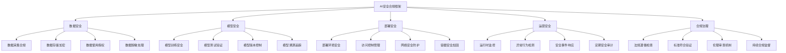

# AI模型安全合规框架

## 1. 安全合规体系概述

AI模型的安全合规是一个多层面、全周期的治理体系，涵盖从模型开发到部署运营的每个环节。

### 1.1 安全合规框架架构



### 1.2 核心安全原则

```python
# ai_security_principles.py
from typing import Dict, List, Any
from dataclasses import dataclass
from enum import Enum

class SecurityPrinciple(Enum):
    """AI安全核心原则"""
    PRIVACY_BY_DESIGN = "privacy_by_design"
    FAIRNESS_AND_NON_DISCRIMINATION = "fairness_non_discrimination"
    TRANSPARENCY_AND_EXPLAINABILITY = "transparency_explainability"
    ROBUSTNESS_AND_RELIABILITY = "robustness_reliability"
    ACCOUNTABILITY_AND_GOVERNANCE = "accountability_governance"
    HUMAN_CENTRIC_AI = "human_centric_ai"

@dataclass
class SecurityRequirement:
    """安全要求定义"""
    principle: SecurityPrinciple
    description: str
    implementation_guidelines: List[str]
    compliance_checkpoints: List[str]
    risk_level: str  # HIGH, MEDIUM, LOW

class AISecurityFramework:
    """AI安全框架"""
    
    def __init__(self):
        self.principles = self._define_security_principles()
        self.requirements = self._map_requirements()
        self.compliance_matrix = {}
    
    def _define_security_principles(self) -> Dict[SecurityPrinciple, Dict]:
        """定义安全原则"""
        return {
            SecurityPrinciple.PRIVACY_BY_DESIGN: {
                "description": "在系统设计之初就考虑隐私保护",
                "key_aspects": [
                    "数据最小化收集",
                    "默认隐私保护设置",
                    "用户同意机制",
                    "数据生命周期管理"
                ],
                "technical_measures": [
                    "差分隐私技术",
                    "联邦学习",
                    "同态加密",
                    "安全多方计算"
                ]
            },
            SecurityPrinciple.FAIRNESS_AND_NON_DISCRIMINATION: {
                "description": "确保AI系统公平对待所有用户群体",
                "key_aspects": [
                    "偏见检测与消除",
                    "代表性数据集",
                    "公平性指标监控",
                    "包容性设计"
                ],
                "technical_measures": [
                    "公平性约束优化",
                    "对抗去偏见",
                    "因果推断方法",
                    "群体公平性测试"
                ]
            },
            SecurityPrinciple.TRANSPARENCY_AND_EXPLAINABILITY: {
                "description": "确保AI决策过程可解释和透明",
                "key_aspects": [
                    "决策逻辑可追溯",
                    "影响因素可解释",
                    "用户知情权保障",
                    "系统局限性披露"
                ],
                "technical_measures": [
                    "LIME解释方法",
                    "SHAP值分析",
                    "注意力机制可视化",
                    "决策树解释"
                ]
            }
        }
    
    def _map_requirements(self) -> List[SecurityRequirement]:
        """映射安全要求"""
        requirements = [
            SecurityRequirement(
                principle=SecurityPrinciple.PRIVACY_BY_DESIGN,
                description="实施数据隐私保护措施",
                implementation_guidelines=[
                    "实施数据匿名化和假名化",
                    "建立数据访问控制机制",
                    "部署数据泄露防护系统",
                    "定期进行隐私影响评估"
                ],
                compliance_checkpoints=[
                    "数据处理协议签署",
                    "隐私政策更新确认",
                    "第三方数据处理审计",
                    "用户权利行使记录"
                ],
                risk_level="HIGH"
            ),
            SecurityRequirement(
                principle=SecurityPrinciple.FAIRNESS_AND_NON_DISCRIMINATION,
                description="防止算法歧视和偏见",
                implementation_guidelines=[
                    "多样化训练数据集",
                    "公平性指标持续监控",
                    "偏见检测工具集成",
                    "定期公平性审计"
                ],
                compliance_checkpoints=[
                    "公平性测试报告",
                    "偏见消除措施记录",
                    "受影响群体反馈机制",
                    "纠正行动计划执行"
                ],
                risk_level="MEDIUM"
            )
        ]
        return requirements
    
    def assess_compliance(self, system_config: Dict) -> Dict[str, Any]:
        """评估合规性"""
        compliance_results = {}
        
        for requirement in self.requirements:
            principle = requirement.principle.value
            compliance_results[principle] = {
                "status": self._check_requirement_compliance(requirement, system_config),
                "findings": self._generate_findings(requirement, system_config),
                "recommendations": requirement.implementation_guidelines,
                "risk_level": requirement.risk_level
            }
        
        return compliance_results
    
    def _check_requirement_compliance(self, requirement: SecurityRequirement, 
                                    config: Dict) -> str:
        """检查要求合规性"""
        # 简化的合规性检查逻辑
        implemented_measures = config.get('security_measures', [])
        required_measures = requirement.implementation_guidelines
        
        compliance_ratio = len(set(implemented_measures) & set(required_measures)) / len(required_measures)
        
        if compliance_ratio >= 0.8:
            return "COMPLIANT"
        elif compliance_ratio >= 0.5:
            return "PARTIALLY_COMPLIANT"
        else:
            return "NON_COMPLIANT"
    
    def _generate_findings(self, requirement: SecurityRequirement, config: Dict) -> List[str]:
        """生成发现项"""
        findings = []
        
        implemented = set(config.get('security_measures', []))
        required = set(requirement.implementation_guidelines)
        
        missing_measures = required - implemented
        if missing_measures:
            findings.append(f"Missing security measures: {list(missing_measures)}")
        
        return findings

# 使用示例
def security_framework_example():
    framework = AISecurityFramework()
    
    # 模拟系统配置
    system_config = {
        "security_measures": [
            "数据匿名化和假名化",
            "建立数据访问控制机制",
            "部署数据泄露防护系统",
            "多样化训练数据集",
            "公平性指标持续监控"
        ],
        "model_type": "large_language_model",
        "deployment_environment": "cloud_production",
        "user_base": "global"
    }
    
    # 评估合规性
    compliance_report = framework.assess_compliance(system_config)
    
    print("=== AI安全合规评估报告 ===")
    for principle, result in compliance_report.items():
        print(f"\n{principle}:")
        print(f"  Status: {result['status']}")
        print(f"  Risk Level: {result['risk_level']}")
        print(f"  Findings: {result['findings']}")
        print(f"  Recommendations: {result['recommendations'][:2]}...")  # 显示前两个建议

if __name__ == "__main__":
    security_framework_example()
```

## 2. 数据安全保护

### 2.1 数据生命周期安全管理

```python
# data_security_lifecycle.py
import hashlib
import json
from typing import Dict, List, Optional
from datetime import datetime, timedelta
import logging

class DataSecurityManager:
    """数据安全生命周期管理器"""
    
    def __init__(self):
        self.data_inventory = {}
        self.access_logs = []
        self.retention_policies = self._define_retention_policies()
    
    def _define_retention_policies(self) -> Dict[str, Dict]:
        """定义数据保留策略"""
        return {
            "personal_identifiable_information": {
                "retention_period": timedelta(days=365),
                "deletion_method": "secure_erase",
                "review_frequency": timedelta(days=90)
            },
            "training_data": {
                "retention_period": timedelta(days=1825),  # 5年
                "deletion_method": "cryptographic_erasure",
                "review_frequency": timedelta(days=180)
            },
            "model_outputs": {
                "retention_period": timedelta(days=90),
                "deletion_method": "standard_delete",
                "review_frequency": timedelta(days=30)
            }
        }
    
    def register_data_asset(self, asset_info: Dict) -> str:
        """注册数据资产"""
        asset_id = self._generate_asset_id(asset_info)
        
        self.data_inventory[asset_id] = {
            "info": asset_info,
            "registered_at": datetime.now(),
            "access_controls": asset_info.get("access_controls", []),
            "encryption_status": asset_info.get("encrypted", False),
            "sensitivity_level": asset_info.get("sensitivity", "medium")
        }
        
        logging.info(f"Registered data asset: {asset_id}")
        return asset_id
    
    def _generate_asset_id(self, asset_info: Dict) -> str:
        """生成资产ID"""
        asset_string = json.dumps(asset_info, sort_keys=True)
        return hashlib.sha256(asset_string.encode()).hexdigest()[:16]
    
    def enforce_access_control(self, asset_id: str, user_identity: str, 
                             access_type: str) -> bool:
        """强制访问控制"""
        if asset_id not in self.data_inventory:
            logging.warning(f"Asset {asset_id} not found")
            return False
        
        asset = self.data_inventory[asset_id]
        access_controls = asset["access_controls"]
        
        # 检查访问权限
        authorized = self._check_authorization(access_controls, user_identity, access_type)
        
        # 记录访问日志
        self.access_logs.append({
            "timestamp": datetime.now().isoformat(),
            "asset_id": asset_id,
            "user_identity": user_identity,
            "access_type": access_type,
            "authorized": authorized
        })
        
        return authorized
    
    def _check_authorization(self, controls: List[Dict], user_identity: str, 
                           access_type: str) -> bool:
        """检查授权"""
        for control in controls:
            if (control.get("identity") == user_identity and 
                access_type in control.get("permissions", [])):
                return True
        return False
    
    def apply_data_anonymization(self, data: Dict, anonymization_level: str = "high") -> Dict:
        """应用数据匿名化"""
        anonymized_data = data.copy()
        
        if anonymization_level == "high":
            # 高级别匿名化
            sensitive_fields = ["name", "email", "phone", "address", "id_number"]
            for field in sensitive_fields:
                if field in anonymized_data:
                    anonymized_data[field] = self._anonymize_field(anonymized_data[field])
        
        elif anonymization_level == "medium":
            # 中级别匿名化
            quasi_identifiers = ["birth_date", "zip_code", "gender"]
            for field in quasi_identifiers:
                if field in anonymized_data:
                    anonymized_data[field] = self._generalize_field(anonymized_data[field])
        
        return anonymized_data
    
    def _anonymize_field(self, value) -> str:
        """字段匿名化"""
        if isinstance(value, str):
            return hashlib.sha256(value.encode()).hexdigest()[:10]
        return "***ANONYMIZED***"
    
    def _generalize_field(self, value) -> str:
        """字段泛化"""
        if isinstance(value, str) and "@" in value:  # 邮箱
            parts = value.split("@")
            return f"{parts[0][:2]}***@{parts[1]}"
        elif isinstance(value, str) and value.isdigit():  # 数字
            return "*" * len(value)
        return str(value)[:3] + "***"
    
    def audit_data_access(self, time_window_days: int = 30) -> Dict:
        """审计数据访问"""
        cutoff_date = datetime.now() - timedelta(days=time_window_days)
        
        recent_logs = [
            log for log in self.access_logs 
            if datetime.fromisoformat(log["timestamp"]) > cutoff_date
        ]
        
        audit_report = {
            "period_start": cutoff_date.isoformat(),
            "total_access_attempts": len(recent_logs),
            "successful_accesses": len([log for log in recent_logs if log["authorized"]]),
            "failed_accesses": len([log for log in recent_logs if not log["authorized"]]),
            "unique_users": len(set(log["user_identity"] for log in recent_logs)),
            "access_patterns": self._analyze_access_patterns(recent_logs)
        }
        
        return audit_report
    
    def _analyze_access_patterns(self, logs: List[Dict]) -> Dict:
        """分析访问模式"""
        patterns = {
            "by_user": {},
            "by_asset": {},
            "by_time": {},
            "unusual_activities": []
        }
        
        for log in logs:
            user = log["user_identity"]
            asset = log["asset_id"]
            timestamp = datetime.fromisoformat(log["timestamp"])
            hour = timestamp.hour
            
            # 按用户统计
            patterns["by_user"][user] = patterns["by_user"].get(user, 0) + 1
            
            # 按资产统计
            patterns["by_asset"][asset] = patterns["by_asset"].get(asset, 0) + 1
            
            # 按时间统计
            patterns["by_time"][hour] = patterns["by_time"].get(hour, 0) + 1
        
        # 检测异常活动
        avg_accesses = sum(patterns["by_user"].values()) / len(patterns["by_user"])
        for user, count in patterns["by_user"].items():
            if count > avg_accesses * 2:  # 超过平均值2倍
                patterns["unusual_activities"].append({
                    "user": user,
                    "access_count": count,
                    "reason": "above_average_access"
                })
        
        return patterns

# 使用示例
def data_security_example():
    manager = DataSecurityManager()
    
    # 注册敏感数据资产
    customer_data = {
        "name": "John Doe",
        "email": "john@example.com",
        "phone": "+1234567890",
        "purchase_history": ["item1", "item2"],
        "access_controls": [
            {"identity": "data_scientist_001", "permissions": ["read", "write"]},
            {"identity": "analyst_002", "permissions": ["read"]}
        ],
        "encrypted": True,
        "sensitivity": "high"
    }
    
    asset_id = manager.register_data_asset(customer_data)
    print(f"Registered asset ID: {asset_id}")
    
    # 测试访问控制
    authorized = manager.enforce_access_control(
        asset_id, "data_scientist_001", "read"
    )
    print(f"Access authorized: {authorized}")
    
    # 测试匿名化
    anonymized = manager.apply_data_anonymization(customer_data, "high")
    print(f"Anonymized data: {anonymized}")
    
    # 执行审计
    audit_report = manager.audit_data_access(7)
    print(f"Audit report: {audit_report}")

if __name__ == "__main__":
    data_security_example()
```

## 3. 模型安全检测

### 3.1 对抗攻击防护

```python
# model_security_testing.py
import numpy as np
import torch
from typing import Dict, List, Tuple
from abc import ABC, abstractmethod

class AdversarialAttack(ABC):
    """对抗攻击基类"""
    
    @abstractmethod
    def generate_adversarial_example(self, input_data, model, **kwargs):
        """生成对抗样本"""
        pass

class FGSMAttack(AdversarialAttack):
    """快速梯度符号法攻击"""
    
    def generate_adversarial_example(self, input_data, model, epsilon=0.1):
        """生成FGSM对抗样本"""
        # 设置为可求导
        input_data.requires_grad = True
        
        # 前向传播
        output = model(input_data)
        loss = torch.nn.functional.cross_entropy(output, torch.argmax(output, dim=1))
        
        # 计算梯度
        model.zero_grad()
        loss.backward()
        
        # 生成对抗扰动
        perturbation = epsilon * torch.sign(input_data.grad.data)
        adversarial_example = input_data.data + perturbation
        
        return adversarial_example.detach()

class PGDAttack(AdversarialAttack):
    """投影梯度下降攻击"""
    
    def generate_adversarial_example(self, input_data, model, epsilon=0.1, 
                                   alpha=0.01, iterations=10):
        """生成PGD对抗样本"""
        original_input = input_data.clone()
        
        # 随机初始化
        adversarial_example = input_data + torch.FloatTensor(input_data.shape).uniform_(-epsilon, epsilon)
        adversarial_example = torch.clamp(adversarial_example, 0, 1)
        
        for _ in range(iterations):
            adversarial_example.requires_grad = True
            
            # 前向传播
            output = model(adversarial_example)
            loss = torch.nn.functional.cross_entropy(output, torch.argmax(output, dim=1))
            
            # 计算梯度
            model.zero_grad()
            loss.backward()
            
            # 更新对抗样本
            with torch.no_grad():
                adversarial_example = adversarial_example + alpha * torch.sign(adversarial_example.grad)
                
                # 投影到epsilon范围内
                perturbation = torch.clamp(adversarial_example - original_input, -epsilon, epsilon)
                adversarial_example = original_input + perturbation
                adversarial_example = torch.clamp(adversarial_example, 0, 1)
        
        return adversarial_example

class ModelSecurityTester:
    """模型安全测试器"""
    
    def __init__(self):
        self.attacks = {
            'fgsm': FGSMAttack(),
            'pgd': PGDAttack()
        }
        self.test_results = []
    
    def test_model_robustness(self, model, test_data: List[Tuple], 
                            attack_types: List[str] = None) -> Dict:
        """测试模型鲁棒性"""
        if attack_types is None:
            attack_types = list(self.attacks.keys())
        
        results = {
            'clean_accuracy': 0.0,
            'attack_results': {},
            'robustness_score': 0.0
        }
        
        # 测试干净样本准确率
        clean_correct = 0
        total_samples = len(test_data)
        
        for input_data, true_label in test_data:
            with torch.no_grad():
                output = model(input_data)
                predicted = torch.argmax(output, dim=1)
                if predicted.item() == true_label:
                    clean_correct += 1
        
        results['clean_accuracy'] = clean_correct / total_samples
        
        # 测试对抗攻击
        for attack_name in attack_types:
            if attack_name in self.attacks:
                attack_results = self._test_attack(
                    model, test_data, self.attacks[attack_name]
                )
                results['attack_results'][attack_name] = attack_results
        
        # 计算鲁棒性分数
        results['robustness_score'] = self._calculate_robustness_score(results)
        
        self.test_results.append(results)
        return results
    
    def _test_attack(self, model, test_data: List[Tuple], attack) -> Dict:
        """测试特定攻击"""
        successful_attacks = 0
        total_samples = len(test_data)
        
        for input_data, true_label in test_data:
            # 生成对抗样本
            adversarial_example = attack.generate_adversarial_example(input_data, model)
            
            # 测试对抗样本
            with torch.no_grad():
                output = model(adversarial_example)
                predicted = torch.argmax(output, dim=1)
                
                # 如果预测错误，说明攻击成功
                if predicted.item() != true_label:
                    successful_attacks += 1
        
        attack_success_rate = successful_attacks / total_samples
        
        return {
            'success_rate': attack_success_rate,
            'accuracy_drop': results['clean_accuracy'] - (1 - attack_success_rate)
        }
    
    def _calculate_robustness_score(self, results: Dict) -> float:
        """计算鲁棒性分数"""
        clean_acc = results['clean_accuracy']
        attack_results = results['attack_results']
        
        if not attack_results:
            return clean_acc
        
        # 计算平均攻击成功率
        avg_attack_success = np.mean([
            result['success_rate'] for result in attack_results.values()
        ])
        
        # 鲁棒性分数 = 干净准确率 × (1 - 平均攻击成功率)
        robustness_score = clean_acc * (1 - avg_attack_success)
        
        return robustness_score
    
    def generate_security_report(self) -> Dict:
        """生成安全报告"""
        if not self.test_results:
            return {"error": "No test results available"}
        
        latest_result = self.test_results[-1]
        
        report = {
            "timestamp": str(torch.datetime.now()),
            "clean_accuracy": latest_result['clean_accuracy'],
            "robustness_score": latest_result['robustness_score'],
            "attack_analysis": latest_result['attack_results'],
            "security_grade": self._assign_security_grade(latest_result),
            "recommendations": self._generate_recommendations(latest_result)
        }
        
        return report
    
    def _assign_security_grade(self, results: Dict) -> str:
        """分配安全等级"""
        robustness = results['robustness_score']
        
        if robustness >= 0.8:
            return "A"
        elif robustness >= 0.6:
            return "B"
        elif robustness >= 0.4:
            return "C"
        elif robustness >= 0.2:
            return "D"
        else:
            return "F"
    
    def _generate_recommendations(self, results: Dict) -> List[str]:
        """生成安全建议"""
        recommendations = []
        
        if results['robustness_score'] < 0.6:
            recommendations.append("建议实施对抗训练提高模型鲁棒性")
        
        attack_results = results['attack_results']
        if 'fgsm' in attack_results and attack_results['fgsm']['success_rate'] > 0.3:
            recommendations.append("FGSM攻击成功率较高，建议加强输入验证")
        
        if 'pgd' in attack_results and attack_results['pgd']['success_rate'] > 0.5:
            recommendations.append("PGD攻击效果显著，建议采用更高级的防御机制")
        
        if not recommendations:
            recommendations.append("模型安全性良好，建议继续保持安全实践")
        
        return recommendations

# 使用示例
class MockModel(torch.nn.Module):
    """模拟模型用于测试"""
    def forward(self, x):
        # 简单的线性分类器
        return torch.nn.functional.linear(x, torch.randn(10, x.shape[-1]))

def security_testing_example():
    # 创建测试器
    tester = ModelSecurityTester()
    
    # 创建模拟模型和测试数据
    model = MockModel()
    test_data = [
        (torch.randn(1, 784), torch.randint(0, 10, (1,)).item())
        for _ in range(100)
    ]
    
    # 执行安全测试
    results = tester.test_model_robustness(
        model, test_data, attack_types=['fgsm', 'pgd']
    )
    
    # 生成安全报告
    report = tester.generate_security_report()
    
    print("=== 模型安全测试报告 ===")
    print(f"安全等级: {report['security_grade']}")
    print(f"鲁棒性分数: {report['robustness_score']:.3f}")
    print(f"干净样本准确率: {report['clean_accuracy']:.3f}")
    print("\n攻击分析:")
    for attack, result in report['attack_analysis'].items():
        print(f"  {attack}: 成功率 {result['success_rate']:.3f}")
    print("\n安全建议:")
    for rec in report['recommendations']:
        print(f"  • {rec}")

if __name__ == "__main__":
    security_testing_example()
```

这个AI安全合规框架提供了完整的安全保障体系，涵盖了数据安全、模型安全、部署安全和运营安全等各个方面，为企业AI系统的安全合规提供了系统化的解决方案。