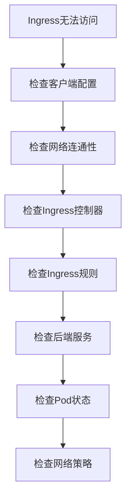

# 🔍 Kubernetes Ingress故障排查与监控实战

> 系统化的Kubernetes Ingress故障诊断方法和监控体系建设，涵盖常见问题识别、根因分析、解决方案实施等完整故障处理流程

## 📋 案例概述

本案例提供Kubernetes Ingress故障排查的系统方法论和监控体系建设指南，帮助运维团队快速定位和解决Ingress相关问题。

### 🔧 核心技能点

- **故障诊断方法**: 系统性排查流程和工具使用
- **监控体系建设**: 全方位指标收集和告警配置
- **性能分析**: 瓶颈识别和优化建议
- **根因分析**: 深层次问题定位技术

### 🎯 适用人群

- SRE工程师
- DevOps工程师
- 系统管理员
- 技术支持人员

---

## 🚀 快速开始

### 1. 环境准备

```bash
# 创建故障排查测试环境
kubectl create namespace ingress-troubleshooting

# 部署测试应用和服务
kubectl apply -f troubleshooting-test-apps.yaml -n ingress-troubleshooting
```

### 2. 基础诊断工具准备

```bash
# 安装诊断工具
kubectl apply -f diagnostic-tools.yaml -n ingress-troubleshooting
```

---

## 📚 故障排查方法论

### 1. 系统性排查流程

遵循"从外到内，从简单到复杂"的排查原则：

```
1. 现象确认 → 2. 范围界定 → 3. 假设验证 → 4. 根因定位 → 5. 解决方案 → 6. 验证修复
```

#### 排查流程图



### 2. 常见故障类型及解决方案

#### 2.1 Ingress规则不生效

**故障现象**: 404 Not Found或默认后端响应

**排查步骤**:

```bash
# 1. 检查Ingress状态
kubectl describe ingress <ingress-name> -n <namespace>

# 2. 检查控制器日志
kubectl logs -n ingress-nginx -l app.kubernetes.io/name=ingress-nginx

# 3. 验证规则语法
kubectl get ingress <ingress-name> -n <namespace> -o yaml

# 4. 检查控制器配置
kubectl get configmap nginx-configuration -n ingress-nginx -o yaml
```

#### 2.2 TLS证书问题

**故障现象**: SSL证书错误或HTTPS无法访问

**排查步骤**:

```bash
# 1. 检查证书状态
kubectl describe secret <tls-secret> -n <namespace>

# 2. 验证证书内容
kubectl get secret <tls-secret> -n <namespace> -o jsonpath='{.data.tls\.crt}' | base64 -d | openssl x509 -text

# 3. 检查证书有效期
echo | openssl s_client -connect <domain>:443 2>/dev/null | openssl x509 -noout -dates
```

#### 2.3 后端服务不可达

**故障现象**: 502 Bad Gateway或503 Service Unavailable

**排查步骤**:

```bash
# 1. 检查后端服务状态
kubectl get endpoints <service-name> -n <namespace>

# 2. 验证Pod健康状态
kubectl get pods -n <namespace> -l <selector-labels>

# 3. 测试服务连通性
kubectl run debug-pod --image=busybox --rm -it -n <namespace> -- wget -qO- http://<service-name>.<namespace>.svc.cluster.local
```

---

## 📊 监控体系建设

### 1. 核心监控指标

#### Ingress控制器指标

```yaml
# Prometheus监控配置
apiVersion: monitoring.coreos.com/v1
kind: ServiceMonitor
metadata:
  name: ingress-controller-monitor
  namespace: ingress-troubleshooting
spec:
  selector:
    matchLabels:
      app.kubernetes.io/name: ingress-nginx
  endpoints:
  - port: metrics
    interval: 30s
    path: /metrics
---
apiVersion: v1
kind: Service
metadata:
  name: ingress-nginx-metrics
  namespace: ingress-troubleshooting
  labels:
    app.kubernetes.io/name: ingress-nginx
  annotations:
    prometheus.io/scrape: "true"
    prometheus.io/port: "10254"
spec:
  selector:
    app.kubernetes.io/name: ingress-nginx
  ports:
    - name: metrics
      port: 10254
      targetPort: 10254
```

#### 关键监控指标定义

```promql
# Ingress控制器健康状态
nginx_ingress_controller_nginx_process_status

# 请求处理速率
rate(nginx_ingress_controller_requests_total[5m])

# 响应时间分布
histogram_quantile(0.95, rate(nginx_ingress_controller_request_duration_seconds_bucket[5m]))

# 错误率监控
rate(nginx_ingress_controller_requests_total{status=~"5.."}[5m]) / rate(nginx_ingress_controller_requests_total[5m])

# 连接数监控
nginx_ingress_controller_nginx_process_connections

# 证书到期预警
certmanager_certificate_expiration_timestamp_seconds - time() < 86400 * 14
```

### 2. 智能告警配置

```yaml
apiVersion: monitoring.coreos.com/v1
kind: PrometheusRule
metadata:
  name: ingress-alert-rules
  namespace: ingress-troubleshooting
spec:
  groups:
  - name: ingress.rules
    rules:
    - alert: IngressControllerDown
      expr: nginx_ingress_controller_nginx_process_status == 0
      for: 2m
      labels:
        severity: critical
      annotations:
        summary: "Ingress controller is down"
        description: "Ingress controller has been unavailable for more than 2 minutes"

    - alert: HighErrorRate
      expr: rate(nginx_ingress_controller_requests_total{status=~"5.."}[5m]) / rate(nginx_ingress_controller_requests_total[5m]) > 0.05
      for: 5m
      labels:
        severity: warning
      annotations:
        summary: "High error rate on ingress"
        description: "Error rate exceeded 5% threshold"

    - alert: HighLatency
      expr: histogram_quantile(0.95, rate(nginx_ingress_controller_request_duration_seconds_bucket[5m])) > 2
      for: 5m
      labels:
        severity: warning
      annotations:
        summary: "High latency detected"
        description: "95th percentile response time above 2 seconds"

    - alert: CertificateExpiringSoon
      expr: certmanager_certificate_expiration_timestamp_seconds - time() < 86400 * 7
      for: 10m
      labels:
        severity: warning
      annotations:
        summary: "Certificate expiring soon"
        description: "Certificate will expire in less than 7 days"
```

---

## 🔧 自动化故障处理

### 1. 自愈机制配置

```yaml
apiVersion: apps/v1
kind: Deployment
metadata:
  name: ingress-auto-healer
  namespace: ingress-troubleshooting
spec:
  replicas: 1
  selector:
    matchLabels:
      app: ingress-auto-healer
  template:
    metadata:
      labels:
        app: ingress-auto-healer
    spec:
      containers:
      - name: healer
        image: ingress-healer:latest
        env:
        - name: NAMESPACE
          value: "ingress-troubleshooting"
        - name: CHECK_INTERVAL
          value: "30"
        - name: MAX_RESTARTS
          value: "3"
```

### 2. 故障模拟和测试

```bash
#!/bin/bash
# ingress-fault-injection.sh

NAMESPACE="ingress-troubleshooting"

# 模拟Ingress故障
inject_ingress_fault() {
    local ingress_name=$1
    
    echo "Injecting fault for ingress: $ingress_name"
    
    # 修改Ingress配置制造故障
    kubectl patch ingress $ingress_name -n $NAMESPACE \
      -p '{"spec":{"rules":[{"host":"non-existent.example.com","http":{"paths":[{"path":"/","pathType":"Prefix","backend":{"service":{"name":"non-existent-service","port":{"number":80}}}}]}}]}}'
    
    # 等待故障生效
    sleep 10
    
    # 验证故障效果
    kubectl describe ingress $ingress_name -n $NAMESPACE
    
    # 恢复正常配置
    kubectl apply -f original-ingress.yaml -n $NAMESPACE
}

# 运行故障注入测试
inject_ingress_fault "test-ingress"
```

---

## 🧪 实践练习

### 练习1：故障模拟演练
故意配置错误的Ingress规则，然后按照标准流程进行故障排查和修复。

### 练习2：监控告警配置
配置完整的监控告警体系，确保各类故障都能及时发现和通知。

### 练习3：性能瓶颈分析
对存在性能问题的Ingress进行深度分析，找出根本原因并提出优化建议。

---

## 📋 清理资源

```bash
kubectl delete namespace ingress-troubleshooting
```

---

> **💡 提示**: 故障排查是一项需要经验和系统思维的技能，建议结合实际生产环境不断练习和完善排查方法。