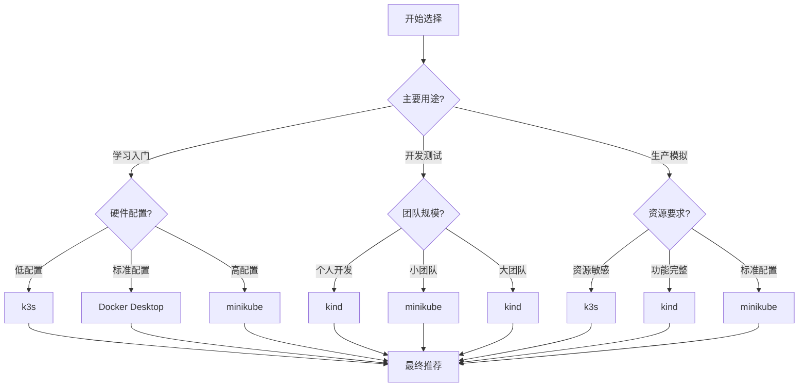

# 📊 Kubernetes本地部署工具对比选择指南

> 详细的工具对比分析和场景化选择建议，帮助你选择最适合的部署方案

## 🎯 选择决策框架

### 决策矩阵

| 考虑因素 | 权重 | minikube | kind | k3s | Docker Desktop |
|----------|------|----------|------|-----|----------------|
| 学习曲线 | 20% | ⭐⭐⭐⭐⭐ | ⭐⭐⭐⭐ | ⭐⭐⭐ | ⭐⭐⭐⭐⭐ |
| 功能完整性 | 15% | ⭐⭐⭐⭐ | ⭐⭐⭐⭐⭐ | ⭐⭐⭐ | ⭐⭐⭐⭐ |
| 性能表现 | 15% | ⭐⭐⭐ | ⭐⭐⭐⭐ | ⭐⭐⭐⭐⭐ | ⭐⭐ |
| 资源消耗 | 15% | ⭐⭐⭐ | ⭐⭐⭐ | ⭐⭐⭐⭐⭐ | ⭐ |
| 易用性 | 10% | ⭐⭐⭐⭐⭐ | ⭐⭐⭐⭐ | ⭐⭐⭐⭐ | ⭐⭐⭐⭐⭐ |
| 社区支持 | 10% | ⭐⭐⭐⭐⭐ | ⭐⭐⭐⭐⭐ | ⭐⭐⭐⭐ | ⭐⭐⭐⭐⭐ |
| 企业适用性 | 10% | ⭐⭐⭐⭐ | ⭐⭐⭐⭐⭐ | ⭐⭐⭐ | ⭐⭐⭐ |
| 成本考虑 | 5% | 免费 | 免费 | 免费 | 商业版付费 |

## 🔍 详细工具对比

### 1. 功能特性对比

#### 核心功能
| 功能特性 | minikube | kind | k3s | Docker Desktop |
|----------|----------|------|-----|----------------|
| 单节点集群 | ✅ | ✅ | ✅ | ✅ |
| 多节点集群 | ⚠️ (有限) | ✅ | ✅ | ❌ |
| 离线部署 | ✅ | ✅ | ✅ | ⚠️ |
| 镜像缓存 | ✅ | ✅ | ✅ | ✅ |
| 插件系统 | ✅ | ❌ | ⚠️ | ❌ |
| 仪表板 | 内置 | 需手动安装 | 需手动安装 | 简易版内置 |

#### 网络功能
| 网络特性 | minikube | kind | k3s | Docker Desktop |
|----------|----------|------|-----|----------------|
| LoadBalancer支持 | ✅ | ✅ | ✅ | ✅ |
| Ingress控制器 | 插件支持 | 需手动安装 | 需手动安装 | 需手动安装 |
| 网络策略 | ✅ | ✅ | ✅ | ⚠️ |
| 自定义CNI | ✅ | ✅ | ✅ | ⚠️ |
| 端口映射 | ✅ | ✅ | ✅ | ✅ |

#### 存储功能
| 存储特性 | minikube | kind | k3s | Docker Desktop |
|----------|----------|------|-----|----------------|
| 持久卷支持 | ✅ | ✅ | ✅ | ✅ |
| 动态存储供应 | ✅ | ✅ | ✅ | ✅ |
| 自定义存储类 | ✅ | ✅ | ✅ | ⚠️ |
| 本地存储 | ✅ | ✅ | ✅ | ✅ |
| 外部存储集成 | ⚠️ | ⚠️ | ⚠️ | ⚠️ |

### 2. 性能基准对比

#### 启动性能
```bash
# 启动时间对比（测试环境：MacBook Pro M1, 16GB RAM）
# minikube: 2-4分钟
# kind: 1-2分钟  
# k3s: 30-60秒
# Docker Desktop: 1-3分钟

# 首次Pod调度时间
# minikube: 30-60秒
# kind: 15-30秒
# k3s: 10-20秒
# Docker Desktop: 20-40秒
```

#### 资源消耗对比
| 资源指标 | minikube | kind | k3s | Docker Desktop |
|----------|----------|------|-----|----------------|
| 内存占用 | 2-4GB | 3-5GB | 1-2GB | 4-6GB |
| CPU占用 | 1-2核心 | 1-2核心 | 0.5-1核心 | 2-3核心 |
| 磁盘占用 | 2-4GB | 3-5GB | 1-2GB | 5-10GB |
| 启动后稳定CPU | 5-10% | 5-15% | 2-5% | 10-20% |

#### 稳定性表现
| 稳定性指标 | minikube | kind | k3s | Docker Desktop |
|------------|----------|------|-----|----------------|
| 长期运行稳定性 | ⭐⭐⭐⭐ | ⭐⭐⭐⭐⭐ | ⭐⭐⭐⭐⭐ | ⭐⭐⭐ |
| 资源泄漏情况 | 低 | 极低 | 极低 | 中等 |
| 重启恢复能力 | 强 | 强 | 强 | 一般 |
| 版本升级兼容性 | 好 | 优秀 | 良好 | 依赖Docker版本 |

### 3. 使用场景适配度

#### 学习和入门场景
```yaml
场景权重: 30%
推荐指数:
  minikube: ⭐⭐⭐⭐⭐
  kind: ⭐⭐⭐⭐
  k3s: ⭐⭐⭐⭐
  Docker Desktop: ⭐⭐⭐⭐⭐

推荐理由:
  minikube: 文档丰富，插件完善，最适合初学者
  Docker Desktop: 一键启用，零配置，最快上手
  k3s: 轻量级，启动快，资源友好
  kind: 接近生产环境，适合进阶学习
```

#### 开发测试场景
```yaml
场景权重: 25%
推荐指数:
  minikube: ⭐⭐⭐⭐
  kind: ⭐⭐⭐⭐⭐
  k3s: ⭐⭐⭐⭐
  Docker Desktop: ⭐⭐⭐

推荐理由:
  kind: 与CI/CD集成好，启动快速，多节点支持
  minikube: 插件丰富，调试方便，生态完善
  k3s: 轻量级，资源消耗少，适合笔记本环境
  Docker Desktop: 集成度高但资源消耗大
```

#### 生产模拟场景
```yaml
场景权重: 20%
推荐指数:
  minikube: ⭐⭐⭐
  kind: ⭐⭐⭐⭐⭐
  k3s: ⭐⭐⭐⭐
  Docker Desktop: ⭐⭐

推荐理由:
  kind: 最接近真实生产环境，支持多节点
  k3s: 轻量级生产环境，适合边缘计算场景
  minikube: 功能完整但性能有限
  Docker Desktop: 功能简化，不适合生产模拟
```

#### 资源受限场景
```yaml
场景权重: 15%
推荐指数:
  minikube: ⭐⭐⭐
  kind: ⭐⭐⭐
  k3s: ⭐⭐⭐⭐⭐
  Docker Desktop: ⭐⭐

推荐理由:
  k3s: 内存占用最小，启动最快，资源效率最高
  minikube: 相对轻量但仍有优化空间
  kind: 功能完整但资源消耗较大
  Docker Desktop: 资源消耗最大，不推荐
```

#### CI/CD集成场景
```yaml
场景权重: 10%
推荐指数:
  minikube: ⭐⭐⭐⭐
  kind: ⭐⭐⭐⭐⭐
  k3s: ⭐⭐⭐⭐
  Docker Desktop: ⭐⭐

推荐理由:
  kind: 天然基于Docker，与CI/CD流水线集成最佳
  minikube: 支持良好，但启动时间较长
  k3s: 轻量快速，但集成复杂度稍高
  Docker Desktop: 桌面应用，不适合服务器环境
```

## 🎯 场景化选择指南

### 1. 按用户角色选择

#### 初学者开发者
```bash
# 推荐方案：Docker Desktop → minikube
# 学习路径：
# 第1周：Docker Desktop快速体验
# 第2-4周：minikube深入学习
# 第5周+：根据需求选择其他工具

选择理由：
- Docker Desktop：零学习成本，快速上手
- minikube：功能完整，文档丰富，社区支持好
```

#### 专业开发者
```bash
# 推荐方案：kind → k3s
# 工作流程：
# 日常开发：kind（快速迭代）
# 资源受限：k3s（轻量级测试）
# 生产验证：kind多节点集群

选择理由：
- kind：启动快，与生产环境接近
- k3s：资源友好，适合持续集成
```

#### 系统管理员
```bash
# 推荐方案：k3s → kind
# 管理策略：
# 轻量级环境：k3s
# 复杂测试场景：kind
# 培训演示：minikube

选择理由：
- k3s：资源效率高，适合多环境部署
- kind：功能完整，适合复杂场景测试
```

### 2. 按项目需求选择

#### Web应用开发
```bash
# 推荐：kind
# 配置示例：
kind: Cluster
apiVersion: kind.x-k8s.io/v1alpha4
nodes:
- role: control-plane
  extraPortMappings:
  - containerPort: 30080
    hostPort: 80
    protocol: TCP
- role: worker
  replicas: 2

适用场景：
- 前端后端分离应用
- 微服务架构测试
- 容器化应用开发
```

#### 数据科学项目
```bash
# 推荐：k3s
# 配置示例：
# 轻量级部署，GPU支持友好
# 资源需求：CPU 2核，内存 4GB

适用场景：
- Jupyter Notebook环境
- 机器学习模型训练
- 数据处理管道
```

#### 移动开发
```bash
# 推荐：minikube
# 配置示例：
minikube start \
  --driver=docker \
  --memory=4096 \
  --cpus=2 \
  --addons=dashboard,registry

适用场景：
- API后端服务
- 移动应用后端测试
- 轻量级微服务
```

### 3. 按硬件配置选择

#### 入门级配置（8GB RAM, 双核CPU）
```bash
# 推荐：k3s
# 资源分配：
# k3s: 2GB RAM, 1核CPU
# 系统预留：2GB RAM, 1核CPU
# 应用空间：4GB RAM, 0核CPU

# 启动命令：
curl -sfL https://get.k3s.io | sh -s - --write-kubeconfig-mode 644
```

#### 标准配置（16GB RAM, 四核CPU）
```bash
# 推荐：kind 或 minikube
# kind配置：
kind create cluster --config - <<EOF
kind: Cluster
apiVersion: kind.x-k8s.io/v1alpha4
nodes:
- role: control-plane
- role: worker
  replicas: 1
EOF

# minikube配置：
minikube start --memory=8192 --cpus=4
```

#### 高性能配置（32GB+ RAM, 八核+CPU）
```bash
# 推荐：kind多节点 或 minikube高配
# kind多节点：
kind create cluster --config - <<EOF
kind: Cluster
apiVersion: kind.x-k8s.io/v1alpha4
nodes:
- role: control-plane
- role: worker
  replicas: 3
EOF

# minikube高配：
minikube start --memory=16384 --cpus=8 --disk-size=50g
```

## 📈 成本效益分析

### 1. 时间成本对比

| 操作 | minikube | kind | k3s | Docker Desktop |
|------|----------|------|-----|----------------|
| 初始安装 | 10分钟 | 5分钟 | 3分钟 | 20分钟 |
| 集群创建 | 3分钟 | 2分钟 | 1分钟 | 5分钟 |
| 应用部署 | 2分钟 | 1分钟 | 1分钟 | 3分钟 |
| 日常维护 | 5分钟/天 | 3分钟/天 | 2分钟/天 | 10分钟/天 |

### 2. 学习成本对比

```bash
# 学习曲线评估（1-5分，5分最简单）

基础知识要求:
  minikube: 3分 - 需要了解基本K8s概念
  kind: 4分 - Docker知识即可上手
  k3s: 4分 - 简化版K8s，易于理解
  Docker Desktop: 5分 - 完全零基础友好

进阶学习难度:
  minikube: 4分 - 插件丰富，功能深入
  kind: 3分 - 接近生产环境，学习价值高
  k3s: 3分 - 轻量级但功能完整
  Docker Desktop: 2分 - 功能受限，深入学习困难
```

### 3. 长期维护成本

| 维护维度 | minikube | kind | k3s | Docker Desktop |
|----------|----------|------|-----|----------------|
| 版本升级 | 简单 | 简单 | 简单 | 复杂 |
| 问题排查 | 文档丰富 | 社区活跃 | 文档完善 | 官方支持 |
| 资源优化 | 灵活 | 灵活 | 高效 | 有限 |
| 扩展能力 | 强 | 强 | 中等 | 弱 |

## 🎯 决策支持工具

### 1. 选择决策树



### 2. 快速选择表

| 你的需求 | 推荐工具 | 理由 |
|----------|----------|------|
| 快速体验K8s | Docker Desktop | 一键启用，零配置 |
| 系统学习K8s | minikube | 文档丰富，插件完善 |
| 日常开发测试 | kind | 启动快，接近生产 |
| 资源受限环境 | k3s | 轻量级，内存占用少 |
| CI/CD集成 | kind | 基于Docker，天然集成 |
| 多节点测试 | kind | 原生支持多节点集群 |
| 边缘计算场景 | k3s | 专为边缘设计 |
| 教学演示 | minikube | 功能完整，易于展示 |

### 3. 迁移路径建议

```bash
# 学习路径迁移：
# Docker Desktop → minikube → kind/k3s

# 企业环境迁移：
# Docker Desktop → kind → 生产K8s集群

# 资源优化迁移：
# minikube → k3s → kind（根据需求）
```

## 📊 综合评分卡

### 最终推荐评分（满分10分）

| 工具 | 学习场景 | 开发场景 | 生产场景 | 资源场景 | 综合得分 |
|------|----------|----------|----------|----------|----------|
| minikube | 9 | 7 | 6 | 5 | 6.8 |
| kind | 7 | 9 | 8 | 6 | 7.5 |
| k3s | 7 | 8 | 7 | 9 | 7.8 |
| Docker Desktop | 8 | 5 | 3 | 4 | 5.0 |

### 选择建议总结

**🏆 总体推荐排序**：
1. **kind** - 最均衡的选择，适合大多数场景
2. **k3s** - 资源效率最高，适合轻量级需求
3. **minikube** - 功能最完整，学习价值高
4. **Docker Desktop** - 入门最简单，但限制较多

**🎯 场景化最终建议**：
- **新手入门**：Docker Desktop（快速体验）→ minikube（深入学习）
- **日常开发**：kind（主力工具）+ k3s（资源受限时）
- **专业测试**：kind多节点集群
- **边缘部署**：k3s轻量级方案

---

> **💡 提示**: 没有完美的工具，选择最适合当前需求和环境的方案最为重要。建议根据实际使用情况灵活调整。

**更新时间**: 2026年2月6日  
**版本**: v1.0.0  
**维护状态**: ✅ 活跃维护中