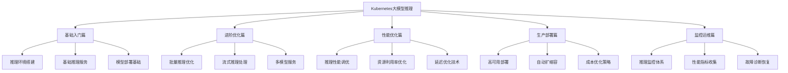
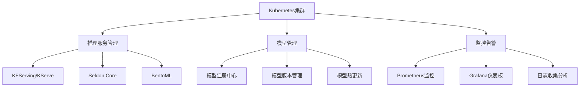

# Kubernetes大模型推理实战指南

## 1. 案例概述

本案例体系提供了Kubernetes大模型推理从入门到生产环境的完整实战指南，涵盖以下核心模块：

### 1.1 案例体系结构



### 1.2 学习路径

```
入门新手 → 进阶用户 → 专业工程师 → 生产专家
    ↓         ↓          ↓           ↓
基础推理   优化推理   性能调优    生产部署
```

### 1.3 适用人群

- **AI服务工程师**: 学习大模型推理在Kubernetes上的最佳实践
- **MLOps工程师**: 掌握模型服务化部署和运维管理
- **后端开发工程师**: 了解AI推理服务的技术实现
- **系统架构师**: 设计高性能的AI推理服务平台

## 2. 环境准备

### 2.1 基础环境要求

- Kubernetes集群 (v1.23+)
- GPU节点 (推荐NVIDIA T4/A10/A100，CUDA 11.8+)
- kubectl命令行工具
- Helm包管理工具
- NVIDIA GPU驱动和Container Toolkit

### 2.2 推荐硬件配置

| 场景 | CPU | 内存 | GPU | 存储 |
|------|-----|------|-----|------|
| 入门推理 | 8核 | 32GB | 1×T4 16GB | 500GB SSD |
| 批量推理 | 32核 | 128GB | 4×A10 24GB | 2TB NVMe |
| 生产服务 | 64核 | 256GB | 8×A100 80GB | 5TB 高性能 |

## 3. 案例目录

### 3.1 基础入门篇
- [inference-basics](./inference-basics/README.md) - 推理基础入门
- 推理环境搭建指南
- 基础推理服务部署
- 模型转换与优化基础

### 3.2 进阶优化篇
- [inference-advanced](./inference-advanced/README.md) - 推理进阶优化
- 批量推理优化技术
- 流式推理处理
- 多模型并发服务

### 3.3 性能优化篇
- [inference-performance](./inference-performance/README.md) - 推理性能优化
- 推理延迟优化
- 吞吐量提升策略
- 资源利用率优化

### 3.4 生产部署篇
- [inference-deployment](./inference-deployment/README.md) - 推理生产部署
- 高可用架构设计
- 自动扩缩容配置
- 成本优化方案

### 3.5 监控运维篇
- [inference-operations](./inference-operations/README.md) - 推理监控运维
- 推理服务监控体系
- 性能指标收集分析
- 故障诊断与恢复

## 4. 技术栈概览

### 4.1 核心技术组件



### 4.2 推理框架生态

- **TensorFlow Serving**: Google的TF模型服务框架
- **TorchServe**: PyTorch官方模型服务工具
- **ONNX Runtime**: 跨平台推理引擎
- **TensorRT**: NVIDIA高性能推理优化库
- **KFServing**: Kubernetes原生推理服务

## 5. 最佳实践总结

### 5.1 推理服务优化

1. **模型优化**
   - 使用TensorRT/ONNX优化模型
   - 模型量化(FP16/INT8)
   - 动态批处理技术
   - 模型缓存策略

2. **资源调度**
   - GPU资源共享和隔离
   - CPU/GPU混合调度
   - 内存优化管理
   - 网络带宽优化

3. **服务架构**
   - 负载均衡策略
   - 健康检查机制
   - 故障转移设计
   - 灰度发布流程

### 5.2 性能调优策略

1. **延迟优化**
   - 模型预热技术
   - 请求批处理
   - 异步处理机制
   - 缓存预加载

2. **吞吐量提升**
   - 并发请求处理
   - 连接池优化
   - 资源池化管理
   - 流水线处理

3. **成本控制**
   - Spot实例利用
   - 弹性伸缩策略
   - 资源配额管理
   - 使用率监控

## 6. 风险与注意事项

### 6.1 技术风险

⚠️ **模型加载失败**: 大模型加载可能导致内存不足
⚠️ **推理延迟过高**: 批量处理不当导致响应时间延长
⚠️ **资源争用**: 多模型共享GPU资源冲突
⚠️ **版本兼容**: 模型格式与推理引擎版本不匹配

### 6.2 运维风险

⚠️ **服务中断**: 硬件故障或网络问题导致服务不可用
⚠️ **性能下降**: 负载增加导致服务质量降低
⚠️ **安全漏洞**: 模型接口暴露或未授权访问
⚠️ **成本失控**: 资源使用不当导致费用激增

### 6.3 缓解措施

✅ **实施健康检查**: 定期验证服务可用性
✅ **建立监控告警**: 实时监控关键性能指标
✅ **制定备份策略**: 多副本部署和故障恢复
✅ **完善权限管理**: 细粒度的访问控制机制
✅ **成本预算控制**: 设置资源使用上限和预警

## 7. 学习建议

### 7.1 学习路径推荐

1. **第一阶段**(1-2周): 环境搭建 + 基础推理
2. **第二阶段**(2-3周): 服务优化 + 性能调优
3. **第三阶段**(1-2周): 生产部署 + 监控运维
4. **第四阶段**(持续): 架构优化 + 最佳实践

### 7.2 实践建议

🎯 **从简单开始**: 先部署小型模型验证流程
🎯 **逐步扩展**: 逐步增加模型复杂度和服务规模
🎯 **重视监控**: 建立完善的性能监控体系
🎯 **文档记录**: 详细记录配置参数和优化过程
🎯 **团队协作**: 建立标准化的服务管理流程

## 8. 相关资源

### 8.1 官方文档
- [Kubernetes官方文档](https://kubernetes.io/docs/)
- [KFServing文档](https://www.kubeflow.org/docs/components/serving/kfserving/)
- [TensorRT文档](https://docs.nvidia.com/deeplearning/tensorrt/)
- [TorchServe文档](https://pytorch.org/serve/)

### 8.2 开源项目
- [KFServing](https://github.com/kubeflow/kfserving)
- [Seldon Core](https://github.com/SeldonIO/seldon-core)
- [Triton Inference Server](https://github.com/triton-inference-server/server)
- [BentoML](https://github.com/bentoml/BentoML)

### 8.3 学习社区
- Kubernetes Slack社区
- Kubeflow Discuss论坛
- NVIDIA Developer社区
- MLOps社区

---
**💡 提示**: 大模型推理服务是一个复杂的工程问题，需要在性能、成本、可靠性之间找到平衡点。建议按模块逐步学习，并在实际项目中不断验证和完善。