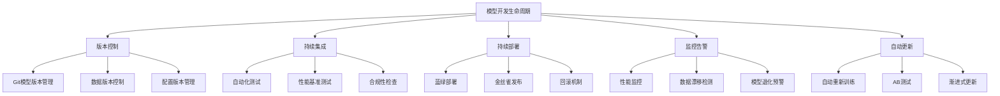

# ModelOps运维指南

## 1. ModelOps概述

ModelOps是机器学习模型的运营化管理框架，专注于模型的全生命周期管理，从开发、部署到监控、更新的完整流程。

### 1.1 核心理念



### 1.2 关键组件

```yaml
# modelops-components.yaml
apiVersion: v1
kind: Namespace
metadata:
  name: model-ops
  labels:
    purpose: "model-operations"
---
# 模型注册中心
apiVersion: apps/v1
kind: Deployment
metadata:
  name: model-registry
  namespace: model-ops
spec:
  replicas: 1
  selector:
    matchLabels:
      app: model-registry
  template:
    metadata:
      labels:
        app: model-registry
    spec:
      containers:
      - name: registry-server
        image: mlflow/mlflow:latest
        ports:
        - containerPort: 5000
        env:
        - name: MLFLOW_S3_ENDPOINT_URL
          value: "http://minio-service:9000"
        - name: AWS_ACCESS_KEY_ID
          valueFrom:
            secretKeyRef:
              name: minio-secret
              key: access-key
        - name: AWS_SECRET_ACCESS_KEY
          valueFrom:
            secretKeyRef:
              name: minio-secret
              key: secret-key
        volumeMounts:
        - name: mlflow-data
          mountPath: /mlflow
      volumes:
      - name: mlflow-data
        persistentVolumeClaim:
          claimName: mlflow-pvc
---
# 模型监控服务
apiVersion: apps/v1
kind: Deployment
metadata:
  name: model-monitoring
  namespace: model-ops
spec:
  replicas: 2
  selector:
    matchLabels:
      app: model-monitoring
  template:
    metadata:
      labels:
        app: model-monitoring
    spec:
      containers:
      - name: monitoring-agent
        image: model-monitoring-agent:latest
        ports:
        - containerPort: 8080
        env:
        - name: PROMETHEUS_ENDPOINT
          value: "http://prometheus-server:9090"
        - name: ALERTMANAGER_URL
          value: "http://alertmanager:9093"
        resources:
          requests:
            cpu: "500m"
            memory: "1Gi"
          limits:
            cpu: "1"
            memory: "2Gi"
```

## 2. CI/CD流水线配置

### 2.1 模型训练流水线

```yaml
# .github/workflows/model-training.yml
name: Model Training Pipeline

on:
  push:
    branches: [ main, develop ]
  pull_request:
    branches: [ main ]

jobs:
  model-training:
    runs-on: ubuntu-latest
    steps:
    - uses: actions/checkout@v3
    
    - name: Set up Python
      uses: actions/setup-python@v4
      with:
        python-version: '3.9'
    
    - name: Install dependencies
      run: |
        pip install -r requirements.txt
        pip install pytest pytest-cov
    
    - name: Run unit tests
      run: pytest tests/unit/ -v --cov=model_training
    
    - name: Data validation
      run: python scripts/validate_data.py
    
    - name: Model training
      run: |
        python train_model.py \
          --config configs/training_config.yaml \
          --output-dir ./artifacts
    
    - name: Model evaluation
      run: |
        python evaluate_model.py \
          --model-path ./artifacts/model.pkl \
          --test-data ./data/test.csv
    
    - name: Performance benchmark
      run: |
        python benchmark_model.py \
          --model-path ./artifacts/model.pkl
    
    - name: Upload artifacts
      uses: actions/upload-artifact@v3
      with:
        name: trained-model
        path: ./artifacts/
    
    - name: Register model
      if: github.ref == 'refs/heads/main'
      run: |
        python register_model.py \
          --model-path ./artifacts/model.pkl \
          --metrics-path ./artifacts/metrics.json
```

### 2.2 模型部署流水线

```yaml
# .github/workflows/model-deployment.yml
name: Model Deployment Pipeline

on:
  workflow_run:
    workflows: ["Model Training Pipeline"]
    types: [completed]
    branches: [main]

jobs:
  canary-deployment:
    if: ${{ github.event.workflow_run.conclusion == 'success' }}
    runs-on: ubuntu-latest
    steps:
    - name: Download trained model
      uses: actions/download-artifact@v3
      with:
        name: trained-model
    
    - name: Validate model
      run: |
        python scripts/validate_model.py \
          --model-path ./model.pkl \
          --threshold 0.85
    
    - name: Build Docker image
      run: |
        docker build -t model-service:${{ github.sha }} .
        docker tag model-service:${{ github.sha }} registry.company.com/model-service:latest
    
    - name: Push to registry
      run: |
        docker login registry.company.com -u ${{ secrets.REGISTRY_USERNAME }} -p ${{ secrets.REGISTRY_PASSWORD }}
        docker push registry.company.com/model-service:latest
    
    - name: Deploy to staging
      run: |
        helm upgrade --install model-staging \
          ./helm-charts/model-service \
          --namespace staging \
          --set image.tag=${{ github.sha }} \
          --set replicaCount=2
    
    - name: Run integration tests
      run: |
        python tests/integration/test_model_api.py \
          --endpoint http://model-staging.staging.svc.cluster.local
    
    - name: Canary deployment to production
      run: |
        # 部署金丝雀版本 (10%流量)
        helm upgrade model-production \
          ./helm-charts/model-service \
          --namespace production \
          --set canary.enabled=true \
          --set canary.weight=10 \
          --set image.tag=${{ github.sha }}

  progressive-rollout:
    needs: canary-deployment
    runs-on: ubuntu-latest
    steps:
    - name: Monitor canary performance
      run: |
        # 监控关键指标
        python scripts/monitor_canary.py \
          --duration 1h \
          --success-threshold 0.95
    
    - name: Gradual rollout
      if: success()
      run: |
        # 逐步增加流量比例
        for weight in 25 50 75 100; do
          helm upgrade model-production \
            ./helm-charts/model-service \
            --namespace production \
            --set canary.weight=$weight
          sleep 300  # 等待5分钟观察
        done
    
    - name: Final validation
      run: |
        python scripts/final_validation.py \
          --production-endpoint http://model-production.production.svc.cluster.local
    
    - name: Cleanup canary
      if: success()
      run: |
        helm upgrade model-production \
          ./helm-charts/model-service \
          --namespace production \
          --set canary.enabled=false
```

## 3. 模型版本管理

### 3.1 Git策略

```python
# model_version_control.py
import git
import yaml
import json
from typing import Dict, List, Optional
import hashlib
import os

class ModelVersionController:
    def __init__(self, repo_path: str):
        self.repo = git.Repo(repo_path)
        self.models_dir = os.path.join(repo_path, "models")
        
    def create_model_branch(self, model_name: str, version: str) -> str:
        """为模型创建分支"""
        branch_name = f"model/{model_name}/v{version}"
        
        # 创建新分支
        new_branch = self.repo.create_head(branch_name)
        new_branch.checkout()
        
        return branch_name
    
    def commit_model_changes(self, model_path: str, metadata: Dict, 
                           message: str) -> str:
        """提交模型变更"""
        # 添加模型文件
        self.repo.index.add([model_path])
        
        # 创建元数据文件
        metadata_path = f"{model_path}.metadata.json"
        with open(metadata_path, 'w') as f:
            json.dump(metadata, f, indent=2)
        
        self.repo.index.add([metadata_path])
        
        # 提交变更
        commit = self.repo.index.commit(message)
        return str(commit.hexsha)
    
    def tag_model_version(self, model_name: str, version: str, 
                         commit_hash: str) -> str:
        """为模型打标签"""
        tag_name = f"{model_name}/v{version}"
        tag = self.repo.create_tag(
            tag_name,
            ref=commit_hash,
            message=f"Release {model_name} version {version}"
        )
        return str(tag)
    
    def generate_model_checksum(self, model_path: str) -> str:
        """生成模型校验和"""
        hash_md5 = hashlib.md5()
        with open(model_path, "rb") as f:
            for chunk in iter(lambda: f.read(4096), b""):
                hash_md5.update(chunk)
        return hash_md5.hexdigest()

# 使用示例
def model_versioning_workflow():
    controller = ModelVersionController("./model-repo")
    
    # 模型训练完成后
    model_path = "./artifacts/fraud_detection_model.pkl"
    model_metadata = {
        "model_name": "fraud_detection",
        "version": "1.2.0",
        "algorithm": "RandomForest",
        "training_data": "transactions_2024_q1.csv",
        "performance_metrics": {
            "accuracy": 0.945,
            "precision": 0.892,
            "recall": 0.918,
            "f1_score": 0.905
        },
        "features": ["amount", "merchant_category", "time_of_day", "user_behavior"],
        "created_by": "ml-engineer",
        "created_at": "2024-01-15T10:30:00Z"
    }
    
    # 创建分支
    branch = controller.create_model_branch("fraud_detection", "1.2.0")
    
    # 提交模型
    commit_hash = controller.commit_model_changes(
        model_path, 
        model_metadata,
        "feat: update fraud detection model with Q1 2024 data"
    )
    
    # 打标签
    tag = controller.tag_model_version("fraud_detection", "1.2.0", commit_hash)
    
    # 生成校验和
    checksum = controller.generate_model_checksum(model_path)
    
    print(f"Model versioned successfully:")
    print(f"  Branch: {branch}")
    print(f"  Commit: {commit_hash}")
    print(f"  Tag: {tag}")
    print(f"  Checksum: {checksum}")
```

### 3.2 模型注册表

```python
# model_registry.py
import sqlite3
import json
import datetime
from typing import Dict, List, Optional
import uuid

class ModelRegistry:
    def __init__(self, db_path: str = "model_registry.db"):
        self.db_path = db_path
        self.init_database()
    
    def init_database(self):
        """初始化数据库"""
        conn = sqlite3.connect(self.db_path)
        cursor = conn.cursor()
        
        # 创建模型表
        cursor.execute('''
            CREATE TABLE IF NOT EXISTS models (
                id TEXT PRIMARY KEY,
                name TEXT NOT NULL,
                version TEXT NOT NULL,
                stage TEXT DEFAULT 'development',
                algorithm TEXT,
                performance_metrics TEXT,
                training_data TEXT,
                created_at TIMESTAMP DEFAULT CURRENT_TIMESTAMP,
                updated_at TIMESTAMP DEFAULT CURRENT_TIMESTAMP,
                UNIQUE(name, version)
            )
        ''')
        
        # 创建模型版本表
        cursor.execute('''
            CREATE TABLE IF NOT EXISTS model_versions (
                id TEXT PRIMARY KEY,
                model_id TEXT,
                version_number TEXT,
                artifact_uri TEXT,
                checksum TEXT,
                created_by TEXT,
                created_at TIMESTAMP DEFAULT CURRENT_TIMESTAMP,
                FOREIGN KEY (model_id) REFERENCES models (id)
            )
        ''')
        
        conn.commit()
        conn.close()
    
    def register_model(self, model_info: Dict) -> str:
        """注册新模型"""
        conn = sqlite3.connect(self.db_path)
        cursor = conn.cursor()
        
        model_id = str(uuid.uuid4())
        
        # 插入模型基本信息
        cursor.execute('''
            INSERT INTO models (id, name, version, algorithm, performance_metrics, training_data)
            VALUES (?, ?, ?, ?, ?, ?)
        ''', (
            model_id,
            model_info['name'],
            model_info['version'],
            model_info.get('algorithm'),
            json.dumps(model_info.get('performance_metrics', {})),
            model_info.get('training_data')
        ))
        
        # 插入版本信息
        version_id = str(uuid.uuid4())
        cursor.execute('''
            INSERT INTO model_versions (id, model_id, version_number, artifact_uri, checksum, created_by)
            VALUES (?, ?, ?, ?, ?, ?)
        ''', (
            version_id,
            model_id,
            model_info['version'],
            model_info.get('artifact_uri'),
            model_info.get('checksum'),
            model_info.get('created_by')
        ))
        
        conn.commit()
        conn.close()
        
        return model_id
    
    def transition_model_stage(self, model_name: str, version: str, new_stage: str):
        """转换模型阶段"""
        conn = sqlite3.connect(self.db_path)
        cursor = conn.cursor()
        
        cursor.execute('''
            UPDATE models 
            SET stage = ?, updated_at = CURRENT_TIMESTAMP
            WHERE name = ? AND version = ?
        ''', (new_stage, model_name, version))
        
        conn.commit()
        conn.close()
    
    def get_model_versions(self, model_name: str) -> List[Dict]:
        """获取模型所有版本"""
        conn = sqlite3.connect(self.db_path)
        cursor = conn.cursor()
        
        cursor.execute('''
            SELECT mv.*, m.stage, m.algorithm, m.performance_metrics
            FROM model_versions mv
            JOIN models m ON mv.model_id = m.id
            WHERE m.name = ?
            ORDER BY mv.created_at DESC
        ''', (model_name,))
        
        versions = []
        for row in cursor.fetchall():
            version_info = {
                'id': row[0],
                'model_id': row[1],
                'version': row[2],
                'artifact_uri': row[3],
                'checksum': row[4],
                'created_by': row[5],
                'created_at': row[6],
                'stage': row[8],
                'algorithm': row[9],
                'performance_metrics': json.loads(row[10]) if row[10] else {}
            }
            versions.append(version_info)
        
        conn.close()
        return versions
    
    def get_production_model(self, model_name: str) -> Optional[Dict]:
        """获取生产环境模型"""
        conn = sqlite3.connect(self.db_path)
        cursor = conn.cursor()
        
        cursor.execute('''
            SELECT mv.*, m.version as model_version
            FROM model_versions mv
            JOIN models m ON mv.model_id = m.id
            WHERE m.name = ? AND m.stage = 'production'
            ORDER BY mv.created_at DESC
            LIMIT 1
        ''', (model_name,))
        
        row = cursor.fetchone()
        if row:
            return {
                'id': row[0],
                'model_id': row[1],
                'version': row[7],  # model version
                'artifact_uri': row[3],
                'checksum': row[4],
                'created_at': row[6]
            }
        
        conn.close()
        return None

# 使用示例
def model_registry_example():
    registry = ModelRegistry()
    
    # 注册新模型
    model_info = {
        'name': 'customer_churn_prediction',
        'version': '2.1.0',
        'algorithm': 'XGBoost',
        'performance_metrics': {
            'accuracy': 0.876,
            'precision': 0.823,
            'recall': 0.798,
            'auc_roc': 0.912
        },
        'training_data': 'customer_data_2024.csv',
        'artifact_uri': 's3://model-artifacts/customer_churn/v2.1.0/model.pkl',
        'checksum': 'a1b2c3d4e5f6...',
        'created_by': 'data-scientist-001'
    }
    
    model_id = registry.register_model(model_info)
    print(f"Registered model with ID: {model_id}")
    
    # 转换到测试阶段
    registry.transition_model_stage('customer_churn_prediction', '2.1.0', 'testing')
    
    # 获取所有版本
    versions = registry.get_model_versions('customer_churn_prediction')
    for version in versions:
        print(f"Version {version['version']} - Stage: {version['stage']}")
    
    # 获取生产模型
    prod_model = registry.get_production_model('customer_churn_prediction')
    if prod_model:
        print(f"Production model: {prod_model['version']} at {prod_model['artifact_uri']}")
```

## 4. 监控和告警系统

### 4.1 模型性能监控

```python
# model_monitoring.py
import time
import json
import numpy as np
from typing import Dict, List, Optional
import redis
import prometheus_client
from prometheus_client import Counter, Histogram, Gauge

class ModelMonitor:
    def __init__(self, model_name: str, redis_host: str = 'localhost'):
        self.model_name = model_name
        self.redis_client = redis.Redis(host=redis_host, port=6379, db=0)
        
        # Prometheus指标
        self.prediction_counter = Counter(
            f'{model_name}_predictions_total',
            'Total number of predictions',
            ['model_version']
        )
        
        self.prediction_latency = Histogram(
            f'{model_name}_prediction_duration_seconds',
            'Prediction latency in seconds',
            ['model_version']
        )
        
        self.accuracy_score = Gauge(
            f'{model_name}_accuracy',
            'Model accuracy score',
            ['model_version']
        )
        
        self.data_drift_score = Gauge(
            f'{model_name}_data_drift',
            'Data drift detection score',
            ['feature_name']
        )
    
    def record_prediction(self, model_version: str, latency: float, 
                         input_data: Dict, prediction: Dict):
        """记录预测结果"""
        timestamp = int(time.time())
        
        # 记录Prometheus指标
        self.prediction_counter.labels(model_version=model_version).inc()
        self.prediction_latency.labels(model_version=model_version).observe(latency)
        
        # 存储预测记录到Redis
        prediction_record = {
            'timestamp': timestamp,
            'model_version': model_version,
            'latency': latency,
            'input': input_data,
            'prediction': prediction
        }
        
        # 使用时间序列键存储
        key = f"predictions:{self.model_name}:{model_version}:{timestamp}"
        self.redis_client.setex(key, 86400, json.dumps(prediction_record))  # 24小时过期
        
        # 维护最近预测的统计
        self._update_prediction_stats(model_version, prediction_record)
    
    def _update_prediction_stats(self, model_version: str, record: Dict):
        """更新预测统计信息"""
        stats_key = f"stats:{self.model_name}:{model_version}"
        
        # 获取现有统计
        stats = self.redis_client.get(stats_key)
        if stats:
            stats = json.loads(stats)
        else:
            stats = {
                'total_predictions': 0,
                'avg_latency': 0,
                'predictions_by_hour': {}
            }
        
        # 更新统计
        stats['total_predictions'] += 1
        current_avg = stats['avg_latency']
        stats['avg_latency'] = (
            (current_avg * (stats['total_predictions'] - 1) + record['latency']) / 
            stats['total_predictions']
        )
        
        # 按小时统计
        hour = time.strftime('%Y-%m-%d-%H', time.gmtime(record['timestamp']))
        if hour not in stats['predictions_by_hour']:
            stats['predictions_by_hour'][hour] = {'count': 0, 'total_latency': 0}
        
        stats['predictions_by_hour'][hour]['count'] += 1
        stats['predictions_by_hour'][hour]['total_latency'] += record['latency']
        
        # 保存更新后的统计
        self.redis_client.setex(stats_key, 3600, json.dumps(stats))  # 1小时过期
    
    def detect_data_drift(self, current_features: Dict, reference_features: Dict, 
                         threshold: float = 0.1) -> Dict:
        """检测数据漂移"""
        drift_results = {}
        
        for feature_name, current_value in current_features.items():
            if feature_name in reference_features:
                reference_value = reference_features[feature_name]
                
                # 计算漂移分数 (简化版本)
                if isinstance(current_value, (int, float)) and isinstance(reference_value, (int, float)):
                    drift_score = abs(current_value - reference_value) / (abs(reference_value) + 1e-8)
                else:
                    # 对于分类特征，使用相等性检查
                    drift_score = 0 if current_value == reference_value else 1
                
                drift_results[feature_name] = {
                    'drift_score': drift_score,
                    'is_drifted': drift_score > threshold,
                    'current_value': current_value,
                    'reference_value': reference_value
                }
                
                # 记录到Prometheus
                self.data_drift_score.labels(feature_name=feature_name).set(drift_score)
        
        return drift_results
    
    def get_model_performance(self, model_version: str, hours: int = 24) -> Dict:
        """获取模型性能指标"""
        end_time = int(time.time())
        start_time = end_time - (hours * 3600)
        
        # 从Redis获取预测记录
        predictions = []
        for timestamp in range(start_time, end_time, 3600):  # 每小时检查一次
            keys = self.redis_client.keys(f"predictions:{self.model_name}:{model_version}:{timestamp}*")
            for key in keys:
                record = json.loads(self.redis_client.get(key))
                predictions.append(record)
        
        if not predictions:
            return {'error': 'No prediction data available'}
        
        # 计算性能指标
        latencies = [p['latency'] for p in predictions]
        total_predictions = len(predictions)
        
        performance_metrics = {
            'total_predictions': total_predictions,
            'avg_latency': np.mean(latencies),
            'p95_latency': np.percentile(latencies, 95),
            'p99_latency': np.percentile(latencies, 99),
            'error_rate': len([p for p in predictions if 'error' in p]) / total_predictions,
            'time_window_hours': hours
        }
        
        return performance_metrics

# 告警系统
class ModelAlerting:
    def __init__(self, monitor: ModelMonitor):
        self.monitor = monitor
        self.alert_rules = self._load_alert_rules()
    
    def _load_alert_rules(self) -> Dict:
        """加载告警规则"""
        return {
            'high_latency': {
                'metric': 'avg_latency',
                'threshold': 2.0,  # 秒
                'comparison': 'greater_than',
                'severity': 'warning'
            },
            'data_drift': {
                'metric': 'data_drift_score',
                'threshold': 0.2,
                'comparison': 'greater_than',
                'severity': 'critical'
            },
            'low_accuracy': {
                'metric': 'accuracy',
                'threshold': 0.8,
                'comparison': 'less_than',
                'severity': 'warning'
            }
        }
    
    def check_alerts(self, model_version: str) -> List[Dict]:
        """检查告警条件"""
        alerts = []
        
        # 获取性能指标
        performance = self.monitor.get_model_performance(model_version)
        
        # 检查各项规则
        for rule_name, rule in self.alert_rules.items():
            metric_value = performance.get(rule['metric'])
            
            if metric_value is not None:
                should_alert = self._evaluate_rule(metric_value, rule)
                if should_alert:
                    alerts.append({
                        'rule': rule_name,
                        'severity': rule['severity'],
                        'current_value': metric_value,
                        'threshold': rule['threshold'],
                        'timestamp': int(time.time())
                    })
        
        return alerts
    
    def _evaluate_rule(self, value, rule) -> bool:
        """评估告警规则"""
        if rule['comparison'] == 'greater_than':
            return value > rule['threshold']
        elif rule['comparison'] == 'less_than':
            return value < rule['threshold']
        elif rule['comparison'] == 'equal':
            return value == rule['threshold']
        return False
    
    def send_alert(self, alert: Dict):
        """发送告警"""
        # 这里可以集成各种告警渠道
        print(f"ALERT [{alert['severity']}]: {alert['rule']}")
        print(f"  Current value: {alert['current_value']}")
        print(f"  Threshold: {alert['threshold']}")

# 使用示例
def monitoring_example():
    # 初始化监控器
    monitor = ModelMonitor('fraud_detection')
    alerter = ModelAlerting(monitor)
    
    # 模拟预测记录
    for i in range(100):
        import random
        latency = random.uniform(0.1, 3.0)
        input_data = {'amount': random.uniform(10, 1000), 'merchant': 'store_' + str(i % 10)}
        prediction = {'is_fraud': random.choice([True, False]), 'confidence': random.uniform(0.5, 0.99)}
        
        monitor.record_prediction('v1.0.0', latency, input_data, prediction)
        
        # 每10次预测检查一次告警
        if i % 10 == 0:
            alerts = alerter.check_alerts('v1.0.0')
            for alert in alerts:
                alerter.send_alert(alert)
        
        time.sleep(0.1)  # 模拟时间间隔
    
    # 获取性能报告
    performance = monitor.get_model_performance('v1.0.0', hours=1)
    print("Performance Report:", performance)
```

## 5. 自动化更新策略

### 5.1 模型重新训练触发器

```python
# automated_retraining.py
import schedule
import time
from typing import Dict, List, Optional
import pandas as pd
from datetime import datetime, timedelta

class RetrainingTrigger:
    def __init__(self):
        self.triggers = {
            'data_volume': self._check_data_volume,
            'performance_degradation': self._check_performance,
            'data_drift': self._check_data_drift,
            'scheduled': self._check_scheduled_trigger
        }
        self.trigger_history = []
    
    def _check_data_volume(self, config: Dict) -> bool:
        """检查数据量触发器"""
        # 获取新数据量
        new_data_count = self._get_new_data_count()
        threshold = config.get('data_volume_threshold', 10000)
        
        return new_data_count >= threshold
    
    def _check_performance(self, config: Dict) -> bool:
        """检查性能退化触发器"""
        # 获取当前模型性能
        current_performance = self._get_current_performance()
        baseline_performance = config.get('baseline_performance', 0.9)
        degradation_threshold = config.get('degradation_threshold', 0.05)
        
        return current_performance < (baseline_performance - degradation_threshold)
    
    def _check_data_drift(self, config: Dict) -> bool:
        """检查数据漂移触发器"""
        # 计算数据漂移分数
        drift_score = self._calculate_data_drift()
        drift_threshold = config.get('drift_threshold', 0.1)
        
        return drift_score > drift_threshold
    
    def _check_scheduled_trigger(self, config: Dict) -> bool:
        """检查定时触发器"""
        frequency = config.get('frequency', 'weekly')
        last_training = config.get('last_training_date')
        
        if not last_training:
            return True
            
        last_training_date = datetime.fromisoformat(last_training)
        now = datetime.now()
        
        if frequency == 'daily':
            return (now - last_training_date).days >= 1
        elif frequency == 'weekly':
            return (now - last_training_date).days >= 7
        elif frequency == 'monthly':
            return (now - last_training_date).days >= 30
            
        return False
    
    def evaluate_triggers(self, model_name: str, trigger_configs: Dict) -> List[str]:
        """评估所有触发器"""
        triggered_conditions = []
        
        for trigger_name, config in trigger_configs.items():
            if trigger_name in self.triggers:
                if self.triggers[trigger_name](config):
                    triggered_conditions.append(trigger_name)
                    self.trigger_history.append({
                        'model': model_name,
                        'trigger': trigger_name,
                        'timestamp': datetime.now().isoformat(),
                        'config': config
                    })
        
        return triggered_conditions

class AutomatedRetrainingPipeline:
    def __init__(self):
        self.trigger_system = RetrainingTrigger()
        self.pipeline_status = {}
    
    def setup_automated_pipeline(self, model_name: str, config: Dict):
        """设置自动化重新训练管道"""
        # 配置触发器
        trigger_configs = config.get('triggers', {})
        
        # 设置调度任务
        schedule.every().day.at("02:00").do(
            self._run_automated_retraining, 
            model_name, 
            trigger_configs
        )
        
        print(f"Automated retraining pipeline configured for {model_name}")
    
    def _run_automated_retraining(self, model_name: str, trigger_configs: Dict):
        """运行自动化重新训练"""
        print(f"Checking triggers for {model_name}...")
        
        # 评估触发器
        triggered_conditions = self.trigger_system.evaluate_triggers(
            model_name, trigger_configs
        )
        
        if triggered_conditions:
            print(f"Triggered conditions: {triggered_conditions}")
            
            # 执行重新训练流程
            retraining_job_id = self._execute_retraining(model_name)
            
            self.pipeline_status[model_name] = {
                'status': 'running',
                'job_id': retraining_job_id,
                'triggered_by': triggered_conditions,
                'started_at': datetime.now().isoformat()
            }
        else:
            print("No triggers activated")
    
    def _execute_retraining(self, model_name: str) -> str:
        """执行重新训练"""
        import uuid
        job_id = str(uuid.uuid4())
        
        # 这里应该调用实际的训练流程
        print(f"Starting retraining job {job_id} for {model_name}")
        
        # 模拟训练过程
        time.sleep(2)  # 模拟训练时间
        
        print(f"Retraining job {job_id} completed")
        return job_id

# 使用示例
def setup_automation_example():
    pipeline = AutomatedRetrainingPipeline()
    
    # 配置欺诈检测模型的自动化重新训练
    fraud_model_config = {
        'triggers': {
            'data_volume': {
                'data_volume_threshold': 5000
            },
            'performance_degradation': {
                'baseline_performance': 0.92,
                'degradation_threshold': 0.03
            },
            'data_drift': {
                'drift_threshold': 0.15
            },
            'scheduled': {
                'frequency': 'weekly',
                'last_training_date': '2024-01-01T00:00:00'
            }
        }
    }
    
    pipeline.setup_automated_pipeline('fraud_detection', fraud_model_config)
    
    # 运行调度器（在实际应用中会在后台持续运行）
    print("Starting automated retraining scheduler...")
    while True:
        schedule.run_pending()
        time.sleep(60)  # 每分钟检查一次

if __name__ == "__main__":
    setup_automation_example()
```

这个ModelOps运维指南提供了完整的模型运营化管理框架，涵盖了版本控制、CI/CD流水线、监控告警和自动化更新等核心要素，为企业级AI模型的生产化部署提供了系统化的解决方案。