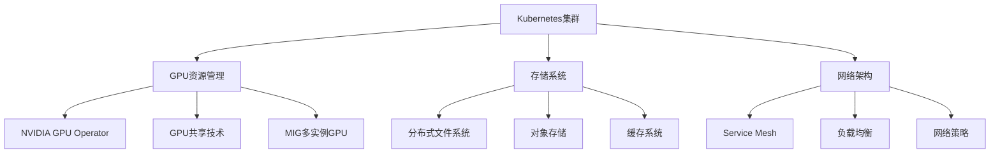

# Kubernetes大模型训练实战指南

## 1. 案例概述

本案例体系提供了Kubernetes大模型训练从入门到生产环境的完整实战指南，涵盖以下核心模块：

### 1.1 案例体系结构

- **基础入门篇**: 大模型训练基础概念、单机训练、环境搭建
- **进阶实战篇**: 分布式训练、多GPU训练、训练优化
- **微调优化篇**: 模型微调、参数高效微调(PEFT)、量化压缩
- **生产部署篇**: 生产环境配置、高可用部署、资源管理
- **监控运维篇**: 训练监控、性能调优、故障排查

### 1.2 学习路径

```
入门新手 → 进阶用户 → 专业工程师 → 生产专家
    ↓         ↓          ↓           ↓
基础训练   分布式训练   微调优化    生产部署
```

### 1.3 适用人群

- **AI/ML工程师**: 学习大模型训练在Kubernetes上的最佳实践
- **DevOps工程师**: 掌握AI基础设施的运维管理
- **数据科学家**: 了解大规模模型训练的技术细节
- **研究人员**: 构建高效的实验环境和训练流水线

## 2. 环境准备

### 2.1 基础环境要求

- Kubernetes集群 (v1.23+)
- GPU节点 (推荐NVIDIA A100/H100，CUDA 11.8+)
- kubectl命令行工具
- Helm包管理工具
- NVIDIA GPU驱动和Container Toolkit

### 2.2 推荐硬件配置

| 场景 | CPU | 内存 | GPU | 存储 |
|------|-----|------|-----|------|
| 入门训练 | 16核 | 64GB | 1×A100 80GB | 1TB SSD |
| 分布式训练 | 64核 | 256GB | 4×A100 80GB | 4TB NVMe |
| 生产环境 | 128核 | 512GB | 8×H100 80GB | 10TB 高性能 |

## 3. 案例目录

### 3.1 基础入门篇
- [model-training-basics](./model-training-basics/README.md) - 大模型训练基础入门
- [训练脚本示例](./model-training-basics/train-simple-example.py) - 可运行的CIFAR-10训练代码
- [Docker环境配置](./model-training-basics/Dockerfile) - 基础训练镜像
- [Kubernetes训练Job](./model-training-basics/k8s-training-job.yaml) - 完整的部署配置
- 单机训练环境搭建
- 基础训练脚本编写
- 训练数据准备与管理

### 3.2 进阶实战篇
- [distributed-training-advanced](./distributed-training-advanced/README.md) - 分布式训练进阶
- [DDP启动脚本](./distributed-training-advanced/ddp-launch-script.sh) - 多节点训练启动工具
- 多GPU并行训练
- 分布式训练框架(DDP、FSDP、DeepSpeed)
- 训练性能优化
- 通信效率调优

### 3.3 微调优化篇
- [model-finetuning-optimization](./model-finetuning-optimization/README.md) - 模型微调与优化
- 参数高效微调(LoRA、QLoRA)
- 模型量化与压缩
- 训练效率提升技巧

### 3.4 生产部署篇
- [production-deployment](./production-deployment/README.md) - 生产环境部署
- [成本优化指南](./production-deployment/cost-optimization-guide.md) - 完整的成本控制方案
- 高可用训练架构
- 资源调度与管理
- 成本优化策略
- 安全合规配置

### 3.5 监控运维篇
- [monitoring-operations](./monitoring-operations/README.md) - 监控与运维
- 训练过程监控
- 性能指标收集
- 故障诊断与恢复

## 4. 技术栈概览

### 4.1 核心技术组件



### 4.2 训练框架生态

- **PyTorch生态**: PyTorch + DeepSpeed + FSDP
- **TensorFlow生态**: TensorFlow + Horovod
- **优化工具**: Apex、Mixed Precision、Gradient Compression
- **调度框架**: Slurm、Kueue、Volcano

## 5. 最佳实践总结

### 5.1 训练效率优化

1. **硬件层面**
   - 使用最新GPU架构(H100 vs A100)
   - 优化GPU拓扑连接(NVLink、NVSwitch)
   - 合理配置CPU/GPU比例

2. **软件层面**
   - 采用混合精度训练(FP16/BF16)
   - 使用高效的分布式训练框架
   - 优化数据加载管道

3. **算法层面**
   - 梯度累积技术
   - 学习率预热与调度
   - 动量平滑技术

### 5.2 成本控制策略

1. **资源调度优化**
   - Spot实例/Ephemeral实例利用
   - 弹性伸缩策略
   - 资源配额管理

2. **训练优化**
   - 早停机制(Early Stopping)
   - 检查点优化
   - 分阶段训练

3. **存储优化**
   - 分层存储策略
   - 数据压缩技术
   - 缓存命中率优化

## 6. 风险与注意事项

### 6.1 技术风险

⚠️ **GPU资源争用**: 多用户环境下可能出现GPU资源竞争
⚠️ **网络瓶颈**: 分布式训练中网络带宽可能成为瓶颈
⚠️ **存储I/O**: 大规模数据读写可能导致存储性能下降
⚠️ **内存溢出**: 模型过大或批量尺寸不当导致OOM错误

### 6.2 运维风险

⚠️ **训练中断**: 硬件故障或网络问题导致训练中断
⚠️ **成本超支**: 资源使用不当导致成本急剧上升
⚠️ **安全漏洞**: 模型权重泄露或未经授权的访问
⚠️ **合规风险**: 训练数据涉及隐私或版权问题

### 6.3 缓解措施

✅ **实施资源隔离**: 使用命名空间和资源配额
✅ **建立监控告警**: 实时监控关键指标
✅ **制定备份策略**: 定期备份训练检查点
✅ **完善权限管理**: 细粒度的访问控制
✅ **成本预算控制**: 设置资源使用上限

## 7. 学习建议

### 7.1 学习路径推荐

1. **第一阶段**(1-2周): 环境搭建 + 基础训练
2. **第二阶段**(2-3周): 分布式训练 + 性能优化
3. **第三阶段**(1-2周): 微调技术 + 生产部署
4. **第四阶段**(持续): 监控运维 + 最佳实践

### 7.2 实践建议

🎯 **从小规模开始**: 先用小模型验证流程
🎯 **逐步扩展**: 逐步增加训练规模和复杂度
🎯 **重视监控**: 建立完善的监控体系
🎯 **文档记录**: 详细记录实验配置和结果
🎯 **团队协作**: 建立知识共享机制

## 8. 相关资源

### 8.1 官方文档
- [Kubernetes官方文档](https://kubernetes.io/docs/)
- [NVIDIA GPU Operator文档](https://docs.nvidia.com/datacenter/cloud-native/gpu-operator/latest/index.html)
- [PyTorch分布式训练](https://pytorch.org/tutorials/intermediate/ddp_tutorial.html)

### 8.2 开源项目
- [DeepSpeed](https://github.com/microsoft/DeepSpeed)
- [Hugging Face Transformers](https://github.com/huggingface/transformers)
- [Kubeflow](https://github.com/kubeflow/kubeflow)

### 8.3 学习社区
- Kubernetes Slack社区
- PyTorch Discuss论坛
- Hugging Face社区

---
**💡 提示**: 大模型训练是一个复杂的工程问题，需要理论知识与实践经验相结合。建议按模块逐步学习，并在实际项目中不断验证和完善。