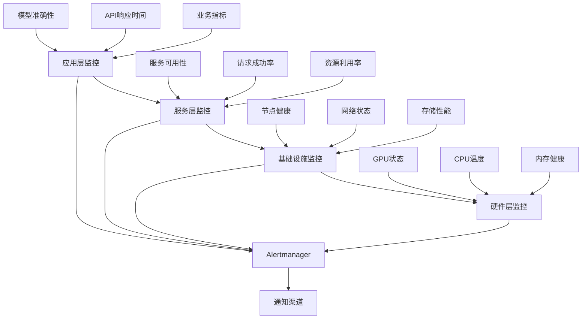

# 监控与运维

## 1. 案例概述

本案例详细介绍大模型训练和服务过程中的监控体系构建、运维实践和故障处理方法，帮助企业建立完善的可观测性平台和运维流程。

### 1.1 学习目标

- 构建全方位的监控指标体系
- 掌握日志收集和分析技术
- 学会性能调优和瓶颈诊断
- 掌握故障排查和恢复方法
- 建立标准化的运维流程

### 1.2 适用人群

- AI平台运维工程师
- SRE团队成员
- 对系统可观测性感兴趣的技术人员

## 2. 监控体系架构

### 2.1 监控层次结构



### 2.2 Prometheus监控配置

```yaml
# Prometheus配置
apiVersion: monitoring.coreos.com/v1
kind: Prometheus
metadata:
  name: model-monitoring
  namespace: monitoring
spec:
  serviceAccountName: prometheus
  serviceMonitorSelector:
    matchLabels:
      team: model-serving
  ruleSelector:
    matchLabels:
      team: model-serving
  resources:
    requests:
      memory: 400Mi
  enableAdminAPI: false
  retention: 30d
  storage:
    volumeClaimTemplate:
      spec:
        storageClassName: fast-ssd
        resources:
          requests:
            storage: 100Gi

---
# ServiceMonitor配置
apiVersion: monitoring.coreos.com/v1
kind: ServiceMonitor
metadata:
  name: model-serving-monitor
  namespace: monitoring
  labels:
    team: model-serving
spec:
  selector:
    matchLabels:
      app: model-serving
  endpoints:
  - port: metrics
    path: /metrics
    interval: 30s
    scrapeTimeout: 10s
    relabelings:
    - sourceLabels: [__meta_kubernetes_pod_name]
      targetLabel: instance
    - sourceLabels: [__meta_kubernetes_namespace]
      targetLabel: namespace
  - port: http
    path: /v2/metrics
    interval: 30s
    scrapeTimeout: 10s
```

## 3. 核心监控指标

### 3.1 训练过程监控

```python
# 训练监控指标收集器
import torch
import time
from prometheus_client import Counter, Gauge, Histogram, CollectorRegistry

class TrainingMetricsCollector:
    def __init__(self, registry=None):
        self.registry = registry or CollectorRegistry()
        self.setup_metrics()
    
    def setup_metrics(self):
        # 训练指标
        self.train_loss = Gauge('training_loss', 'Training loss', 
                               ['epoch', 'batch'], registry=self.registry)
        self.train_accuracy = Gauge('training_accuracy', 'Training accuracy',
                                   ['epoch', 'batch'], registry=self.registry)
        self.learning_rate = Gauge('learning_rate', 'Current learning rate',
                                  registry=self.registry)
        
        # 硬件指标
        self.gpu_utilization = Gauge('gpu_utilization_percent', 'GPU utilization %',
                                    ['gpu_id'], registry=self.registry)
        self.gpu_memory_used = Gauge('gpu_memory_used_bytes', 'GPU memory used',
                                    ['gpu_id'], registry=self.registry)
        self.gpu_temperature = Gauge('gpu_temperature_celsius', 'GPU temperature',
                                    ['gpu_id'], registry=self.registry)
        
        # 性能指标
        self.batch_processing_time = Histogram('batch_processing_seconds',
                                              'Batch processing time',
                                              buckets=[0.1, 0.5, 1.0, 2.0, 5.0],
                                              registry=self.registry)
        self.data_loading_time = Histogram('data_loading_seconds',
                                          'Data loading time',
                                          buckets=[0.01, 0.05, 0.1, 0.5, 1.0],
                                          registry=self.registry)
    
    def collect_training_metrics(self, epoch, batch, loss, accuracy, lr):
        """收集训练指标"""
        self.train_loss.labels(epoch=epoch, batch=batch).set(loss)
        self.train_accuracy.labels(epoch=epoch, batch=batch).set(accuracy)
        self.learning_rate.set(lr)
    
    def collect_hardware_metrics(self):
        """收集硬件指标"""
        if torch.cuda.is_available():
            for i in range(torch.cuda.device_count()):
                gpu_util = torch.cuda.utilization(i)
                gpu_mem_used = torch.cuda.memory_allocated(i)
                gpu_temp = self._get_gpu_temperature(i)
                
                self.gpu_utilization.labels(gpu_id=i).set(gpu_util)
                self.gpu_memory_used.labels(gpu_id=i).set(gpu_mem_used)
                self.gpu_temperature.labels(gpu_id=i).set(gpu_temp)
    
    def _get_gpu_temperature(self, gpu_id):
        """获取GPU温度（需要nvidia-ml-py3库）"""
        try:
            import pynvml
            pynvml.nvmlInit()
            handle = pynvml.nvmlDeviceGetHandleByIndex(gpu_id)
            temp = pynvml.nvmlDeviceGetTemperature(handle, pynvml.NVML_TEMPERATURE_GPU)
            return temp
        except:
            return 0

# 在训练循环中使用
def train_with_monitoring():
    collector = TrainingMetricsCollector()
    
    for epoch in range(num_epochs):
        for batch_idx, (data, target) in enumerate(train_loader):
            batch_start = time.time()
            
            # 数据加载时间
            data_load_time = time.time() - batch_start
            collector.data_loading_time.observe(data_load_time)
            
            # 训练步骤
            process_start = time.time()
            loss, accuracy = train_step(data, target)
            process_time = time.time() - process_start
            
            # 收集指标
            collector.collect_training_metrics(epoch, batch_idx, loss, accuracy, current_lr)
            collector.collect_hardware_metrics()
            collector.batch_processing_time.observe(process_time)
```

### 3.2 推理服务监控

```python
# 推理服务监控
from prometheus_client import Counter, Gauge, Histogram, Summary
import psutil
import threading

class InferenceMetricsCollector:
    def __init__(self):
        # 请求指标
        self.requests_total = Counter('inference_requests_total', 
                                     'Total inference requests',
                                     ['model_name', 'status'])
        self.request_duration = Histogram('inference_request_duration_seconds',
                                         'Request duration in seconds',
                                         ['model_name'],
                                         buckets=[0.1, 0.5, 1.0, 2.0, 5.0, 10.0])
        self.tokens_generated = Counter('inference_tokens_generated_total',
                                       'Total tokens generated',
                                       ['model_name'])
        
        # 系统指标
        self.cpu_usage = Gauge('inference_cpu_usage_percent', 'CPU usage percentage')
        self.memory_usage = Gauge('inference_memory_usage_bytes', 'Memory usage in bytes')
        self.active_connections = Gauge('inference_active_connections', 'Active connections')
        
        # 模型指标
        self.model_cache_hits = Counter('model_cache_hits_total', 'Model cache hits')
        self.model_cache_misses = Counter('model_cache_misses_total', 'Model cache misses')
        
        # 启动系统监控线程
        self.start_system_monitoring()
    
    def start_system_monitoring(self):
        """启动后台系统监控"""
        def monitor_system():
            while True:
                self.cpu_usage.set(psutil.cpu_percent())
                self.memory_usage.set(psutil.virtual_memory().used)
                time.sleep(5)
        
        monitor_thread = threading.Thread(target=monitor_system, daemon=True)
        monitor_thread.start()
    
    def record_request(self, model_name, duration, tokens=None, status='success'):
        """记录请求指标"""
        self.requests_total.labels(model_name=model_name, status=status).inc()
        self.request_duration.labels(model_name=model_name).observe(duration)
        
        if tokens:
            self.tokens_generated.labels(model_name=model_name).inc(tokens)
    
    def record_cache_hit(self, hit=True):
        """记录缓存命中情况"""
        if hit:
            self.model_cache_hits.inc()
        else:
            self.model_cache_misses.inc()

# FastAPI集成示例
from fastapi import FastAPI, Request
import time

app = FastAPI()
metrics_collector = InferenceMetricsCollector()

@app.middleware("http")
async def add_metrics_middleware(request: Request, call_next):
    start_time = time.time()
    
    response = await call_next(request)
    
    # 记录请求指标
    duration = time.time() - start_time
    model_name = request.path_params.get('model_name', 'unknown')
    status = 'success' if response.status_code < 400 else 'error'
    
    metrics_collector.record_request(model_name, duration, status=status)
    
    return response

@app.get("/v1/models/{model_name}/generate")
async def generate_text(model_name: str, prompt: str):
    # 推理逻辑
    start_time = time.time()
    result = model.generate(prompt)
    duration = time.time() - start_time
    
    # 记录token数量
    tokens = len(result.split())
    metrics_collector.record_request(model_name, duration, tokens=tokens)
    
    return {"result": result, "tokens": tokens}
```

## 4. 日志管理系统

### 4.1 结构化日志配置

```python
# 结构化日志系统
import logging
import json
from datetime import datetime
import traceback

class StructuredLogger:
    def __init__(self, service_name, log_level=logging.INFO):
        self.service_name = service_name
        self.logger = logging.getLogger(service_name)
        self.logger.setLevel(log_level)
        
        # 配置JSON格式化器
        handler = logging.StreamHandler()
        handler.setFormatter(JsonFormatter())
        self.logger.addHandler(handler)
    
    def info(self, message, **kwargs):
        self._log('INFO', message, **kwargs)
    
    def warning(self, message, **kwargs):
        self._log('WARNING', message, **kwargs)
    
    def error(self, message, exception=None, **kwargs):
        if exception:
            kwargs['exception'] = str(exception)
            kwargs['traceback'] = traceback.format_exc()
        self._log('ERROR', message, **kwargs)
    
    def _log(self, level, message, **kwargs):
        log_entry = {
            'timestamp': datetime.utcnow().isoformat(),
            'service': self.service_name,
            'level': level,
            'message': message,
            **kwargs
        }
        getattr(self.logger, level.lower())(json.dumps(log_entry))

class JsonFormatter(logging.Formatter):
    def format(self, record):
        return record.getMessage()

# 使用示例
logger = StructuredLogger('model-training')

def train_model():
    try:
        logger.info("Starting model training", 
                   model_name="llama3-70b",
                   batch_size=64,
                   learning_rate=0.001)
        
        # 训练逻辑
        for epoch in range(num_epochs):
            logger.info("Training epoch started",
                       epoch=epoch,
                       phase="training")
            
            # 训练步骤...
            loss = train_step()
            
            logger.info("Epoch completed",
                       epoch=epoch,
                       loss=loss,
                       accuracy=accuracy)
        
        logger.info("Training completed successfully")
        
    except Exception as e:
        logger.error("Training failed",
                    error_type=type(e).__name__,
                    exception=e)
        raise
```

### 4.2 ELK日志栈配置

```yaml
# Elasticsearch配置
apiVersion: elasticsearch.k8s.elastic.co/v1
kind: Elasticsearch
metadata:
  name: model-logs
  namespace: logging
spec:
  version: 8.11.0
  nodeSets:
  - name: default
    count: 3
    config:
      node.store.allow_mmap: false
    volumeClaimTemplates:
    - metadata:
        name: elasticsearch-data
      spec:
        accessModes:
        - ReadWriteOnce
        resources:
          requests:
            storage: 100Gi
        storageClassName: fast-ssd

---
# Logstash配置
apiVersion: v1
kind: ConfigMap
metadata:
  name: logstash-config
  namespace: logging
data:
  logstash.yml: |
    http.host: "0.0.0.0"
    xpack.monitoring.enabled: false
  pipeline.yml: |
    input {
      beats {
        port => 5044
      }
    }
    
    filter {
      json {
        source => "message"
      }
      
      # 添加Kubernetes元数据
      if [kubernetes] {
        mutate {
          add_field => {
            "pod_name" => "%{[kubernetes][pod][name]}"
            "namespace" => "%{[kubernetes][namespace]}"
            "container_name" => "%{[kubernetes][container][name]}"
          }
        }
      }
      
      # 解析时间戳
      date {
        match => [ "timestamp", "ISO8601" ]
        target => "@timestamp"
      }
    }
    
    output {
      elasticsearch {
        hosts => ["https://elasticsearch-es-http:9200"]
        ssl_certificate_verification => false
        user => "elastic"
        password => "${ELASTIC_PASSWORD}"
        index => "model-logs-%{+YYYY.MM.dd}"
      }
    }

---
# Kibana配置
apiVersion: kibana.k8s.elastic.co/v1
kind: Kibana
metadata:
  name: model-logs-kibana
  namespace: logging
spec:
  version: 8.11.0
  count: 1
  elasticsearchRef:
    name: model-logs
  config:
    server.publicBaseUrl: "https://kibana.company.com"
```

## 5. 性能调优与瓶颈诊断

### 5.1 性能分析工具

```python
# 性能分析装饰器
import functools
import time
import psutil
import threading
from collections import defaultdict

class PerformanceAnalyzer:
    def __init__(self):
        self.metrics = defaultdict(list)
        self.lock = threading.Lock()
        
    def profile(self, func_name=None):
        """性能分析装饰器"""
        def decorator(func):
            name = func_name or func.__name__
            
            @functools.wraps(func)
            def wrapper(*args, **kwargs):
                # 记录开始状态
                start_time = time.time()
                start_memory = psutil.Process().memory_info().rss
                
                # 执行函数
                result = func(*args, **kwargs)
                
                # 记录结束状态
                end_time = time.time()
                end_memory = psutil.Process().memory_info().rss
                
                # 记录指标
                with self.lock:
                    self.metrics[f"{name}_duration"].append(end_time - start_time)
                    self.metrics[f"{name}_memory_delta"].append(end_memory - start_memory)
                
                return result
            return wrapper
        return decorator
    
    def get_stats(self):
        """获取性能统计"""
        stats = {}
        with self.lock:
            for metric_name, values in self.metrics.items():
                if values:
                    stats[metric_name] = {
                        'count': len(values),
                        'avg': sum(values) / len(values),
                        'min': min(values),
                        'max': max(values),
                        'p50': sorted(values)[len(values)//2],
                        'p95': sorted(values)[int(len(values)*0.95)],
                        'p99': sorted(values)[int(len(values)*0.99)]
                    }
        return stats

# 使用示例
analyzer = PerformanceAnalyzer()

@analyzer.profile("data_loading")
def load_training_data():
    # 数据加载逻辑
    pass

@analyzer.profile("model_forward")
def model_forward(batch):
    # 前向传播逻辑
    pass

@analyzer.profile("backward_pass")
def backward_pass(loss):
    # 反向传播逻辑
    pass

# 训练循环中使用
def train_epoch():
    for batch in dataloader:
        data = load_training_data()
        output = model_forward(data)
        loss = compute_loss(output)
        backward_pass(loss)
    
    # 输出性能统计
    stats = analyzer.get_stats()
    print("Performance Stats:", json.dumps(stats, indent=2))
```

### 5.2 GPU性能监控

```python
# GPU性能监控工具
import pynvml
import threading
import time

class GPUMonitor:
    def __init__(self, interval=1.0):
        self.interval = interval
        self.metrics = defaultdict(list)
        self.running = False
        self.thread = None
        
        # 初始化NVML
        pynvml.nvmlInit()
        self.device_count = pynvml.nvmlDeviceGetCount()
    
    def start_monitoring(self):
        """开始GPU监控"""
        self.running = True
        self.thread = threading.Thread(target=self._monitor_loop)
        self.thread.daemon = True
        self.thread.start()
    
    def stop_monitoring(self):
        """停止GPU监控"""
        self.running = False
        if self.thread:
            self.thread.join()
        pynvml.nvmlShutdown()
    
    def _monitor_loop(self):
        """监控循环"""
        while self.running:
            try:
                for i in range(self.device_count):
                    handle = pynvml.nvmlDeviceGetHandleByIndex(i)
                    
                    # 获取利用率
                    util = pynvml.nvmlDeviceGetUtilizationRates(handle)
                    self.metrics[f'gpu_{i}_utilization'].append(util.gpu)
                    self.metrics[f'gpu_{i}_memory_utilization'].append(util.memory)
                    
                    # 获取内存信息
                    mem_info = pynvml.nvmlDeviceGetMemoryInfo(handle)
                    self.metrics[f'gpu_{i}_memory_used'].append(mem_info.used)
                    self.metrics[f'gpu_{i}_memory_free'].append(mem_info.free)
                    
                    # 获取温度
                    temp = pynvml.nvmlDeviceGetTemperature(handle, pynvml.NVML_TEMPERATURE_GPU)
                    self.metrics[f'gpu_{i}_temperature'].append(temp)
                    
                    # 获取功耗
                    power = pynvml.nvmlDeviceGetPowerUsage(handle) / 1000.0  # 转换为瓦特
                    self.metrics[f'gpu_{i}_power'].append(power)
                
                time.sleep(self.interval)
                
            except Exception as e:
                print(f"GPU monitoring error: {e}")
                time.sleep(self.interval)
    
    def get_current_metrics(self):
        """获取当前指标"""
        current_metrics = {}
        try:
            for i in range(self.device_count):
                handle = pynvml.nvmlDeviceGetHandleByIndex(i)
                
                util = pynvml.nvmlDeviceGetUtilizationRates(handle)
                mem_info = pynvml.nvmlDeviceGetMemoryInfo(handle)
                temp = pynvml.nvmlDeviceGetTemperature(handle, pynvml.NVML_TEMPERATURE_GPU)
                power = pynvml.nvmlDeviceGetPowerUsage(handle) / 1000.0
                
                current_metrics[f'gpu_{i}'] = {
                    'utilization': util.gpu,
                    'memory_utilization': util.memory,
                    'memory_used_mb': mem_info.used / 1024 / 1024,
                    'memory_free_mb': mem_info.free / 1024 / 1024,
                    'temperature_c': temp,
                    'power_w': power
                }
        except Exception as e:
            print(f"Error getting GPU metrics: {e}")
        
        return current_metrics

# 使用示例
def monitor_training():
    gpu_monitor = GPUMonitor(interval=2.0)
    gpu_monitor.start_monitoring()
    
    try:
        # 训练过程
        train_model()
        
        # 获取最终指标
        final_metrics = gpu_monitor.get_current_metrics()
        print("Final GPU Metrics:", json.dumps(final_metrics, indent=2))
        
    finally:
        gpu_monitor.stop_monitoring()
```

## 6. 故障排查与诊断

### 6.1 自动化诊断工具

```python
# 系统健康检查工具
import subprocess
import requests
import socket

class HealthChecker:
    def __init__(self, config):
        self.config = config
        self.results = {}
    
    def check_kubernetes_health(self):
        """检查Kubernetes集群健康"""
        checks = {}
        
        # 检查节点状态
        try:
            result = subprocess.run(['kubectl', 'get', 'nodes'], 
                                  capture_output=True, text=True)
            checks['nodes_healthy'] = 'Ready' in result.stdout
        except Exception as e:
            checks['nodes_healthy'] = False
            checks['nodes_error'] = str(e)
        
        # 检查Pod状态
        try:
            result = subprocess.run(['kubectl', 'get', 'pods', '-A'], 
                                  capture_output=True, text=True)
            checks['pods_running'] = 'Running' in result.stdout
            checks['pods_pending'] = result.stdout.count('Pending')
            checks['pods_failed'] = result.stdout.count('Failed')
        except Exception as e:
            checks['pods_check_error'] = str(e)
        
        self.results['kubernetes'] = checks
        return checks
    
    def check_gpu_health(self):
        """检查GPU健康状态"""
        checks = {}
        
        try:
            # 使用nvidia-smi检查
            result = subprocess.run(['nvidia-smi', '--query-gpu=index,name,temperature.gpu,utilization.gpu,memory.used,memory.total', '--format=csv'], 
                                  capture_output=True, text=True)
            
            if result.returncode == 0:
                lines = result.stdout.strip().split('\n')[1:]  # 跳过标题行
                for line in lines:
                    parts = line.split(', ')
                    if len(parts) == 6:
                        gpu_id, name, temp, util, mem_used, mem_total = parts
                        checks[f'gpu_{gpu_id}'] = {
                            'name': name,
                            'temperature': int(temp),
                            'utilization': int(util.rstrip('%')),
                            'memory_used_mb': int(mem_used.rstrip(' MiB')),
                            'memory_total_mb': int(mem_total.rstrip(' MiB')),
                            'healthy': int(temp) < 80 and int(util.rstrip('%')) < 100
                        }
        except Exception as e:
            checks['gpu_check_error'] = str(e)
        
        self.results['gpu'] = checks
        return checks
    
    def check_network_connectivity(self):
        """检查网络连通性"""
        checks = {}
        
        # 检查外部连接
        try:
            response = requests.get('https://google.com', timeout=5)
            checks['internet_connectivity'] = response.status_code == 200
        except Exception as e:
            checks['internet_connectivity'] = False
            checks['internet_error'] = str(e)
        
        # 检查内部服务
        services = self.config.get('internal_services', [])
        for service in services:
            try:
                sock = socket.socket(socket.AF_INET, socket.SOCK_STREAM)
                sock.settimeout(3)
                result = sock.connect_ex((service['host'], service['port']))
                checks[f"service_{service['name']}"] = result == 0
                sock.close()
            except Exception as e:
                checks[f"service_{service['name']}"] = False
                checks[f"service_{service['name']}_error"] = str(e)
        
        self.results['network'] = checks
        return checks
    
    def check_storage_health(self):
        """检查存储健康"""
        checks = {}
        
        try:
            # 检查磁盘空间
            result = subprocess.run(['df', '-h'], capture_output=True, text=True)
            lines = result.stdout.strip().split('\n')[1:]
            
            for line in lines:
                parts = line.split()
                if len(parts) >= 5:
                    filesystem, size, used, avail, use_percent, mount_point = parts[:6]
                    use_percent_num = int(use_percent.rstrip('%'))
                    checks[f'disk_{mount_point.replace("/", "_")}'] = {
                        'filesystem': filesystem,
                        'size': size,
                        'used': used,
                        'available': avail,
                        'use_percent': use_percent_num,
                        'healthy': use_percent_num < 90
                    }
        except Exception as e:
            checks['disk_check_error'] = str(e)
        
        self.results['storage'] = checks
        return checks
    
    def run_full_check(self):
        """运行完整健康检查"""
        print("Running comprehensive health check...")
        
        self.check_kubernetes_health()
        self.check_gpu_health()
        self.check_network_connectivity()
        self.check_storage_health()
        
        return self.generate_report()
    
    def generate_report(self):
        """生成健康报告"""
        report = {
            'timestamp': time.time(),
            'checks': self.results,
            'summary': self._generate_summary()
        }
        return report
    
    def _generate_summary(self):
        """生成摘要"""
        summary = {
            'kubernetes_healthy': all(self.results.get('kubernetes', {}).values()),
            'gpu_healthy': all(check.get('healthy', True) for check in self.results.get('gpu', {}).values()),
            'network_healthy': all(self.results.get('network', {}).values()),
            'storage_healthy': all(check.get('healthy', True) for check in self.results.get('storage', {}).values())
        }
        return summary

# 使用示例
def run_health_check():
    config = {
        'internal_services': [
            {'name': 'prometheus', 'host': 'prometheus.monitoring.svc.cluster.local', 'port': 9090},
            {'name': 'grafana', 'host': 'grafana.monitoring.svc.cluster.local', 'port': 3000}
        ]
    }
    
    checker = HealthChecker(config)
    report = checker.run_full_check()
    
    print(json.dumps(report, indent=2, default=str))
    
    # 检查是否有问题
    if not all(report['summary'].values()):
        print("⚠️  Health check found issues!")
        return False
    else:
        print("✅ All systems healthy!")
        return True
```

### 6.2 故障恢复自动化

```python
# 自动故障恢复系统
import time
import random

class AutoRecoverySystem:
    def __init__(self, health_checker, max_attempts=3):
        self.health_checker = health_checker
        self.max_attempts = max_attempts
        self.recovery_actions = []
    
    def register_recovery_action(self, condition, action, priority=1):
        """注册恢复动作"""
        self.recovery_actions.append({
            'condition': condition,
            'action': action,
            'priority': priority
        })
        # 按优先级排序
        self.recovery_actions.sort(key=lambda x: x['priority'], reverse=True)
    
    def run_recovery(self):
        """运行自动恢复"""
        print("Starting automatic recovery process...")
        
        for attempt in range(self.max_attempts):
            print(f"Recovery attempt {attempt + 1}/{self.max_attempts}")
            
            # 运行健康检查
            health_report = self.health_checker.run_full_check()
            
            # 检查是否需要恢复
            issues_found = False
            for action_config in self.recovery_actions:
                if action_config['condition'](health_report):
                    print(f"Executing recovery action: {action_config['action'].__name__}")
                    try:
                        action_config['action']()
                        issues_found = True
                    except Exception as e:
                        print(f"Recovery action failed: {e}")
            
            if not issues_found:
                print("No issues found, recovery complete!")
                return True
            
            # 等待一段时间再重试
            if attempt < self.max_attempts - 1:
                wait_time = random.uniform(30, 60)
                print(f"Waiting {wait_time:.1f} seconds before next attempt...")
                time.sleep(wait_time)
        
        print("Maximum recovery attempts reached!")
        return False

# 定义具体的恢复动作
def restart_failed_pods():
    """重启失败的Pods"""
    result = subprocess.run([
        'kubectl', 'delete', 'pods', 
        '--field-selector=status.phase=Failed',
        '-A'
    ], capture_output=True, text=True)
    print(f"Restarted failed pods: {result.stdout}")

def clear_disk_space():
    """清理磁盘空间"""
    # 清理临时文件
    subprocess.run(['find', '/tmp', '-type', 'f', '-mtime', '+7', '-delete'])
    # 清理日志文件
    subprocess.run(['find', '/var/log', '-name', '*.log', '-mtime', '+30', '-delete'])

def restart_gpu_drivers():
    """重启GPU驱动"""
    subprocess.run(['sudo', 'systemctl', 'restart', 'nvidia-persistenced'])
    time.sleep(5)
    subprocess.run(['sudo', 'nvidia-smi', '--reset-gpu-clocks'])

# 配置自动恢复系统
def setup_auto_recovery():
    health_checker = HealthChecker({})
    
    recovery_system = AutoRecoverySystem(health_checker)
    
    # 注册恢复条件和动作
    recovery_system.register_recovery_action(
        condition=lambda report: not report['summary']['kubernetes_healthy'],
        action=restart_failed_pods,
        priority=10
    )
    
    recovery_system.register_recovery_action(
        condition=lambda report: any(not check.get('healthy', True) 
                                   for check in report['checks'].get('storage', {}).values()),
        action=clear_disk_space,
        priority=5
    )
    
    recovery_system.register_recovery_action(
        condition=lambda report: any(check.get('temperature', 0) > 85 
                                   for check in report['checks'].get('gpu', {}).values()),
        action=restart_gpu_drivers,
        priority=8
    )
    
    return recovery_system

# 使用示例
def main():
    recovery_system = setup_auto_recovery()
    
    # 定期运行健康检查和恢复
    while True:
        try:
            # 运行健康检查
            is_healthy = run_health_check()
            
            if not is_healthy:
                print("Issues detected, starting recovery...")
                recovery_success = recovery_system.run_recovery()
                if not recovery_success:
                    print("❌ Recovery failed after maximum attempts!")
                    # 发送告警
                    send_alert("Automatic recovery failed")
            else:
                print("✅ System is healthy")
            
            # 等待下次检查
            time.sleep(300)  # 5分钟检查一次
            
        except KeyboardInterrupt:
            print("Stopping auto-recovery system...")
            break
        except Exception as e:
            print(f"Error in auto-recovery loop: {e}")
            time.sleep(60)
```

## 7. 运维自动化脚本

### 7.1 日常运维脚本

```bash
#!/bin/bash
# model_ops.sh - 大模型运维工具脚本

set -euo pipefail

# 配置
NAMESPACE="model-serving-prod"
LOG_DIR="/var/log/model-ops"
BACKUP_DIR="/backup/model-artifacts"

# 日志函数
log() {
    echo "[$(date '+%Y-%m-%d %H:%M:%S')] $*" | tee -a "${LOG_DIR}/ops.log"
}

# 健康检查
health_check() {
    log "Running health check..."
    
    # 检查Pod状态
    unhealthy_pods=$(kubectl get pods -n $NAMESPACE --no-headers | grep -v Running | wc -l)
    if [ $unhealthy_pods -gt 0 ]; then
        log "WARNING: Found $unhealthy_pods unhealthy pods"
        kubectl get pods -n $NAMESPACE | grep -v Running
    fi
    
    # 检查资源使用
    log "Checking resource usage..."
    kubectl top nodes
    kubectl top pods -n $NAMESPACE
    
    # 检查GPU状态
    log "Checking GPU status..."
    nvidia-smi --query-gpu=index,name,temperature.gpu,utilization.gpu,memory.used,memory.total --format=csv
    
    log "Health check completed"
}

# 备份操作
backup_models() {
    log "Starting model backup..."
    
    timestamp=$(date +%Y%m%d_%H%M%S)
    backup_path="${BACKUP_DIR}/models_${timestamp}"
    
    mkdir -p "$backup_path"
    
    # 备份模型文件
    kubectl exec -n $NAMESPACE deploy/model-serving -- tar czf - /models > "${backup_path}/models.tar.gz"
    
    # 备份配置
    kubectl get -n $NAMESPACE deploy,model-serving -o yaml > "${backup_path}/deployment.yaml"
    kubectl get -n $NAMESPACE svc,model-serving-service -o yaml > "${backup_path}/service.yaml"
    
    # 压缩备份
    tar czf "${backup_path}.tar.gz" -C "$BACKUP_DIR" "models_${timestamp}"
    rm -rf "$backup_path"
    
    log "Backup completed: ${backup_path}.tar.gz"
}

# 清理操作
cleanup_resources() {
    log "Cleaning up resources..."
    
    # 清理完成的Jobs
    kubectl delete jobs -n $NAMESPACE --field-selector=status.successful=1
    
    # 清理失败的Pods
    kubectl delete pods -n $NAMESPACE --field-selector=status.phase=Failed
    
    # 清理Evicted Pods
    kubectl delete pods -n $NAMESPACE --field-selector=status.phase=Evicted
    
    # 清理临时文件
    find /tmp -name "*.tmp" -mtime +1 -delete
    
    log "Cleanup completed"
}

# 扩容操作
scale_deployment() {
    local replicas=$1
    log "Scaling deployment to $replicas replicas..."
    
    kubectl scale deployment/model-serving -n $NAMESPACE --replicas=$replicas
    
    # 等待扩容完成
    kubectl rollout status deployment/model-serving -n $NAMESPACE --timeout=300s
    
    log "Scaling completed"
}

# 滚动更新
rolling_update() {
    local image_tag=$1
    log "Performing rolling update to $image_tag..."
    
    # 更新镜像
    kubectl set image deployment/model-serving \
        model-server=nvcr.io/nvidia/tritonserver:$image_tag -n $NAMESPACE
    
    # 监控更新进度
    kubectl rollout status deployment/model-serving -n $NAMESPACE --timeout=600s
    
    # 验证更新
    current_image=$(kubectl get deployment/model-serving -n $NAMESPACE -o jsonpath='{.spec.template.spec.containers[0].image}')
    if [[ $current_image == *"$image_tag"* ]]; then
        log "Rolling update successful"
    else
        log "ERROR: Rolling update failed"
        exit 1
    fi
}

# 主菜单
show_menu() {
    echo "=== Model Operations Menu ==="
    echo "1. Health Check"
    echo "2. Backup Models"
    echo "3. Cleanup Resources"
    echo "4. Scale Deployment"
    echo "5. Rolling Update"
    echo "6. Exit"
    echo "============================="
}

# 主程序
main() {
    mkdir -p "$LOG_DIR" "$BACKUP_DIR"
    
    while true; do
        show_menu
        read -p "Select option: " choice
        
        case $choice in
            1)
                health_check
                ;;
            2)
                backup_models
                ;;
            3)
                cleanup_resources
                ;;
            4)
                read -p "Enter number of replicas: " replicas
                scale_deployment $replicas
                ;;
            5)
                read -p "Enter new image tag: " image_tag
                rolling_update $image_tag
                ;;
            6)
                log "Exiting..."
                exit 0
                ;;
            *)
                echo "Invalid option"
                ;;
        esac
        
        echo ""
    done
}

# 运行主程序
if [[ "${BASH_SOURCE[0]}" == "${0}" ]]; then
    main "$@"
fi
```

## 8. 监控面板和告警

### 8.1 Grafana仪表板配置

```json
{
  "dashboard": {
    "id": null,
    "title": "Model Training & Serving Dashboard",
    "timezone": "browser",
    "schemaVersion": 36,
    "version": 1,
    "panels": [
      {
        "type": "graph",
        "title": "Training Loss Over Time",
        "datasource": "Prometheus",
        "targets": [
          {
            "expr": "training_loss",
            "legendFormat": "Epoch {{epoch}} Batch {{batch}}"
          }
        ],
        "gridPos": {"h": 8, "w": 12, "x": 0, "y": 0}
      },
      {
        "type": "graph",
        "title": "GPU Utilization",
        "datasource": "Prometheus",
        "targets": [
          {
            "expr": "gpu_utilization_percent",
            "legendFormat": "GPU {{gpu_id}}"
          }
        ],
        "gridPos": {"h": 8, "w": 12, "x": 12, "y": 0}
      },
      {
        "type": "stat",
        "title": "Current Training Accuracy",
        "datasource": "Prometheus",
        "targets": [
          {
            "expr": "training_accuracy",
            "instant": true
          }
        ],
        "gridPos": {"h": 4, "w": 6, "x": 0, "y": 8}
      },
      {
        "type": "gauge",
        "title": "GPU Temperature",
        "datasource": "Prometheus",
        "targets": [
          {
            "expr": "gpu_temperature_celsius",
            "legendFormat": "GPU {{gpu_id}}"
          }
        ],
        "gridPos": {"h": 4, "w": 6, "x": 6, "y": 8}
      },
      {
        "type": "heatmap",
        "title": "Request Latency Distribution",
        "datasource": "Prometheus",
        "targets": [
          {
            "expr": "rate(inference_request_duration_seconds_bucket[5m])"
          }
        ],
        "gridPos": {"h": 8, "w": 12, "x": 0, "y": 12}
      }
    ]
  }
}
```

### 8.2 告警规则配置

```yaml
# Alertmanager配置
apiVersion: monitoring.coreos.com/v1
kind: Alertmanager
metadata:
  name: model-alertmanager
  namespace: monitoring
spec:
  replicas: 3
  alertmanagerConfigSelector:
    matchLabels:
      alertmanagerConfig: model-serving

---
# 告警规则
apiVersion: monitoring.coreos.com/v1
kind: PrometheusRule
metadata:
  name: model-serving-alerts
  namespace: monitoring
  labels:
    team: model-serving
spec:
  groups:
  - name: model.training
    rules:
    - alert: TrainingLossTooHigh
      expr: training_loss > 10
      for: 5m
      labels:
        severity: warning
      annotations:
        summary: "Training loss is too high"
        description: "Training loss {{ $value }} exceeds threshold of 10"
    
    - alert: TrainingNotProgressing
      expr: deriv(training_loss[10m]) > -0.001
      for: 15m
      labels:
        severity: warning
      annotations:
        summary: "Training is not progressing"
        description: "Training loss derivative {{ $value }} indicates slow progress"
  
  - name: model.serving
    rules:
    - alert: HighLatency
      expr: histogram_quantile(0.95, rate(inference_request_duration_seconds_bucket[5m])) > 2
      for: 2m
      labels:
        severity: warning
      annotations:
        summary: "High inference latency"
        description: "95th percentile latency is {{ $value }} seconds"
    
    - alert: LowAccuracy
      expr: model_accuracy < 0.85
      for: 5m
      labels:
        severity: critical
      annotations:
        summary: "Model accuracy below threshold"
        description: "Current accuracy {{ $value }} is below 85%"
  
  - name: infrastructure
    rules:
    - alert: HighGPUMemoryUsage
      expr: gpu_memory_used_bytes / gpu_memory_total_bytes * 100 > 90
      for: 5m
      labels:
        severity: warning
      annotations:
        summary: "High GPU memory usage"
        description: "GPU memory usage {{ $value }}% exceeds 90%"
    
    - alert: HighGPUTemperature
      expr: gpu_temperature_celsius > 80
      for: 2m
      labels:
        severity: critical
      annotations:
        summary: "High GPU temperature"
        description: "GPU temperature {{ $value }}°C exceeds 80°C"
```

## 9. 最佳实践总结

### 9.1 监控体系建设原则

✅ **全面覆盖**
- 应用层、服务层、基础设施层全方位监控
- 关键业务指标和系统指标并重
- 实时监控和历史数据分析结合

✅ **智能告警**
- 多层级告警机制
- 智能告警抑制和分组
- 告警自动恢复确认

✅ **可视化友好**
- 直观的仪表板设计
- 多维度数据展示
- 自定义视图和钻取分析

### 9.2 运维自动化要点

✅ **标准化流程**
- 统一的操作手册和脚本
- 标准化的部署和回滚流程
- 规范化的变更管理

✅ **预防性维护**
- 定期健康检查
- 资源使用趋势分析
- 容量规划和预警

✅ **快速响应**
- 自动化故障检测和恢复
- 完善的应急预案
- 快速的问题定位工具

## 10. 总结

本案例全面介绍了大模型监控与运维的核心技术和实践方法，涵盖：

✅ 完整的监控体系架构  
✅ 核心指标收集和分析  
✅ 日志管理和分析系统  
✅ 性能调优和瓶颈诊断  
✅ 故障排查和自动恢复  
✅ 运维自动化工具链  

通过本案例的学习，您应该能够：
- 构建完善的可观测性平台
- 建立标准化的运维流程
- 实现智能化的故障检测和恢复
- 优化系统性能和资源使用
- 提升整体运维效率和系统稳定性

这完成了整个Kubernetes大模型训练实战案例体系的建设，从入门到生产环境形成了完整的学习和实践路径。