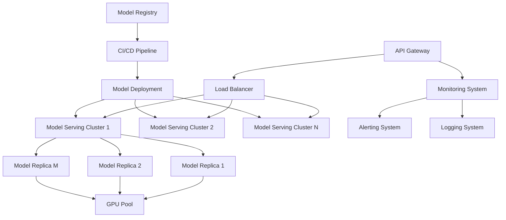

# 生产环境部署

## 1. 案例概述

本案例详细介绍大模型在生产环境中的部署架构、高可用配置、资源管理和成本优化策略，帮助企业构建稳定、高效、经济的大模型服务系统。

### 1.1 学习目标

- 掌握生产级大模型部署架构设计
- 学会高可用和容错机制实现
- 理解资源调度和成本优化策略
- 掌握模型服务化和API设计
- 学会生产环境监控和运维

### 1.2 适用人群

- 负责生产环境部署的工程师
- 系统架构师和技术负责人
- 对云原生AI平台感兴趣的技术人员

## 2. 生产部署架构设计

### 2.1 核心架构模式



### 2.2 高可用部署配置

```yaml
# 生产环境命名空间和资源配置
apiVersion: v1
kind: Namespace
metadata:
  name: model-serving-prod
  labels:
    environment: production
    purpose: model-serving
---
apiVersion: v1
kind: ResourceQuota
metadata:
  name: prod-resource-quota
  namespace: model-serving-prod
spec:
  hard:
    requests.cpu: "128"
    requests.memory: 1024Gi
    requests.nvidia.com/gpu: "32"
    limits.cpu: "256"
    limits.memory: 2048Gi
    limits.nvidia.com/gpu: "64"
    persistentvolumeclaims: "50"
    services.loadbalancers: "10"
---
# 网络策略配置
apiVersion: networking.k8s.io/v1
kind: NetworkPolicy
metadata:
  name: model-serving-network-policy
  namespace: model-serving-prod
spec:
  podSelector:
    matchLabels:
      app: model-serving
  policyTypes:
  - Ingress
  - Egress
  ingress:
  - from:
    - namespaceSelector:
        matchLabels:
          name: ingress-nginx
    ports:
    - protocol: TCP
      port: 8080
  egress:
  - to:
    - namespaceSelector:
        matchLabels:
          name: monitoring
    ports:
    - protocol: TCP
      port: 9090
```

### 2.3 模型服务Deployment

```yaml
# 高可用模型服务部署
apiVersion: apps/v1
kind: Deployment
metadata:
  name: llama3-serving-ha
  namespace: model-serving-prod
  labels:
    app: model-serving
    model: llama3
    version: v1.0.0
spec:
  replicas: 6
  strategy:
    type: RollingUpdate
    rollingUpdate:
      maxSurge: 1
      maxUnavailable: 0
  selector:
    matchLabels:
      app: model-serving
      model: llama3
  template:
    metadata:
      labels:
        app: model-serving
        model: llama3
        version: v1.0.0
        tier: production
    spec:
      affinity:
        # Pod反亲和性，确保分布在不同节点
        podAntiAffinity:
          preferredDuringSchedulingIgnoredDuringExecution:
          - weight: 100
            podAffinityTerm:
              labelSelector:
                matchExpressions:
                - key: app
                  operator: In
                  values:
                  - model-serving
              topologyKey: kubernetes.io/hostname
        # 节点亲和性，优先调度到GPU节点
        nodeAffinity:
          requiredDuringSchedulingIgnoredDuringExecution:
            nodeSelectorTerms:
            - matchExpressions:
              - key: nvidia.com/gpu.product
                operator: In
                values:
                - A100-SXM4-80GB
                - H100-SXM5-80GB
      containers:
      - name: model-server
        image: nvcr.io/nvidia/tritonserver:23.10-py3
        command: ["tritonserver"]
        args:
        - --model-repository=/models
        - --http-port=8000
        - --grpc-port=8001
        - --metrics-port=8002
        - --model-control-mode=explicit
        - --load-model=llama3-70b
        - --backend-config=python,allow-cpu-only=false
        ports:
        - containerPort: 8000
          name: http
        - containerPort: 8001
          name: grpc
        - containerPort: 8002
          name: metrics
        resources:
          requests:
            nvidia.com/gpu: "2"
            cpu: "16"
            memory: "128Gi"
          limits:
            nvidia.com/gpu: "2"
            cpu: "32"
            memory: "256Gi"
        volumeMounts:
        - name: model-storage
          mountPath: /models
        - name: cache-volume
          mountPath: /cache
        env:
        - name: MODEL_NAME
          value: "llama3-70b"
        - name: MAX_BATCH_SIZE
          value: "64"
        - name: ENABLE_DYNAMIC_BATCHING
          value: "true"
        - name: TRITON_ENABLE_METRICS
          value: "true"
        readinessProbe:
          httpGet:
            path: /v2/health/ready
            port: 8000
          initialDelaySeconds: 30
          periodSeconds: 10
          timeoutSeconds: 5
        livenessProbe:
          httpGet:
            path: /v2/health/live
            port: 8000
          initialDelaySeconds: 60
          periodSeconds: 30
          timeoutSeconds: 10
          failureThreshold: 3
        startupProbe:
          httpGet:
            path: /v2/health/ready
            port: 8000
          initialDelaySeconds: 10
          periodSeconds: 10
          timeoutSeconds: 5
          failureThreshold: 30
      volumes:
      - name: model-storage
        persistentVolumeClaim:
          claimName: model-storage-pvc
      - name: cache-volume
        emptyDir:
          medium: Memory
          sizeLimit: 32Gi
      tolerations:
      - key: "nvidia.com/gpu"
        operator: "Exists"
        effect: "NoSchedule"
```

## 3. 服务网格与流量管理

### 3.1 Istio服务网格配置

```yaml
# Istio Gateway配置
apiVersion: networking.istio.io/v1beta1
kind: Gateway
metadata:
  name: model-serving-gateway
  namespace: model-serving-prod
spec:
  selector:
    istio: ingressgateway
  servers:
  - port:
      number: 80
      name: http
      protocol: HTTP
    hosts:
    - "api.company.com"
  - port:
      number: 443
      name: https
      protocol: HTTPS
    tls:
      mode: SIMPLE
      credentialName: model-serving-tls
    hosts:
    - "api.company.com"

---
# VirtualService配置
apiVersion: networking.istio.io/v1beta1
kind: VirtualService
metadata:
  name: llama3-serving-vs
  namespace: model-serving-prod
spec:
  hosts:
  - "api.company.com"
  gateways:
  - model-serving-gateway
  http:
  - match:
    - uri:
        prefix: "/v1/models/llama3"
    route:
    - destination:
        host: llama3-serving-service
        port:
          number: 80
    retries:
      attempts: 3
      perTryTimeout: 30s
      retryOn: gateway-error,connect-failure,refused-stream
    timeout: 60s
    corsPolicy:
      allowOrigins:
      - exact: "https://app.company.com"
      allowMethods:
      - POST
      - GET
      allowHeaders:
      - "*"
      maxAge: "24h"

---
# DestinationRule配置
apiVersion: networking.istio.io/v1beta1
kind: DestinationRule
metadata:
  name: llama3-serving-dr
  namespace: model-serving-prod
spec:
  host: llama3-serving-service
  trafficPolicy:
    loadBalancer:
      simple: LEAST_REQUEST
    connectionPool:
      tcp:
        maxConnections: 100
      http:
        http1MaxPendingRequests: 1000
        maxRequestsPerConnection: 10
    outlierDetection:
      consecutive5xxErrors: 5
      interval: 30s
      baseEjectionTime: 30s
```

### 3.2 金丝雀发布配置

```yaml
# 金丝雀发布Deployment
apiVersion: apps/v1
kind: Deployment
metadata:
  name: llama3-serving-canary
  namespace: model-serving-prod
spec:
  replicas: 2
  selector:
    matchLabels:
      app: model-serving
      model: llama3
      version: v1.1.0-canary
  template:
    metadata:
      labels:
        app: model-serving
        model: llama3
        version: v1.1.0-canary
    spec:
      # 与主版本相同的配置...
      containers:
      - name: model-server
        image: nvcr.io/nvidia/tritonserver:23.10-py3
        env:
        - name: MODEL_VERSION
          value: "v1.1.0-canary"
        # 其他配置...

---
# 金丝雀流量分割
apiVersion: networking.istio.io/v1beta1
kind: VirtualService
metadata:
  name: llama3-canary-vs
  namespace: model-serving-prod
spec:
  hosts:
  - llama3-serving-service
  http:
  - match:
    - headers:
        x-canary:
          exact: "true"
    route:
    - destination:
        host: llama3-serving-service
        subset: canary
  - route:
    - destination:
        host: llama3-serving-service
        subset: stable
      weight: 95
    - destination:
        host: llama3-serving-service
        subset: canary
      weight: 5
```

## 4. 自动扩缩容与资源管理

### 4.1 HPA配置

```yaml
# 基于指标的自动扩缩容
apiVersion: autoscaling/v2
kind: HorizontalPodAutoscaler
metadata:
  name: llama3-serving-hpa
  namespace: model-serving-prod
spec:
  scaleTargetRef:
    apiVersion: apps/v1
    kind: Deployment
    name: llama3-serving-ha
  minReplicas: 3
  maxReplicas: 20
  metrics:
  - type: Resource
    resource:
      name: cpu
      target:
        type: Utilization
        averageUtilization: 70
  - type: Resource
    resource:
      name: memory
      target:
        type: Utilization
        averageUtilization: 80
  - type: Pods
    pods:
      metric:
        name: requests_per_second
      target:
        type: AverageValue
        averageValue: "100"
  - type: External
    external:
      metric:
        name: queue_length
      target:
        type: Value
        value: "50"
  behavior:
    scaleDown:
      stabilizationWindowSeconds: 300
      policies:
      - type: Percent
        value: 10
        periodSeconds: 60
    scaleUp:
      stabilizationWindowSeconds: 60
      policies:
      - type: Percent
        value: 50
        periodSeconds: 60
      - type: Pods
        value: 4
        periodSeconds: 60
      selectPolicy: Max
```

### 4.2 VPA配置

```yaml
# 垂直Pod自动扩缩容
apiVersion: autoscaling.k8s.io/v1
kind: VerticalPodAutoscaler
metadata:
  name: llama3-serving-vpa
  namespace: model-serving-prod
spec:
  targetRef:
    apiVersion: "apps/v1"
    kind: Deployment
    name: llama3-serving-ha
  updatePolicy:
    updateMode: "Auto"
  resourcePolicy:
    containerPolicies:
    - containerName: model-server
      minAllowed:
        cpu: "8"
        memory: "64Gi"
        nvidia.com/gpu: "1"
      maxAllowed:
        cpu: "64"
        memory: "512Gi"
        nvidia.com/gpu: "8"
      controlledResources: ["cpu", "memory"]
```

### 4.3 集群自动扩缩容

```yaml
# Cluster Autoscaler配置
apiVersion: apps/v1
kind: Deployment
metadata:
  name: cluster-autoscaler
  namespace: kube-system
spec:
  template:
    spec:
      containers:
      - image: k8s.gcr.io/autoscaling/cluster-autoscaler:v1.25.0
        name: cluster-autoscaler
        command:
        - ./cluster-autoscaler
        - --v=4
        - --stderrthreshold=info
        - --cloud-provider=aws
        - --skip-nodes-with-local-storage=false
        - --expander=least-waste
        - --node-group-auto-discovery=asg:tag=k8s.io/cluster-autoscaler/enabled,k8s.io/cluster-autoscaler/prod-cluster
        - --balance-similar-node-groups
        - --scale-down-utilization-threshold=0.5
        - --scale-down-unneeded-time=10m
        - --scale-down-delay-after-add=10m
        - --scale-down-delay-after-delete=0s
        - --scale-down-delay-after-failure=3m
        - --max-node-provision-time=15m
```

## 5. 成本优化策略

### 5.1 Spot实例利用

```yaml
# Spot实例节点组配置
apiVersion: eksctl.io/v1alpha5
kind: ClusterConfig
metadata:
  name: prod-cluster
  region: us-west-2
managedNodeGroups:
- name: spot-gpu-nodes
  instanceTypes: ["p3dn.24xlarge", "p4d.24xlarge"]
  spot: true
  desiredCapacity: 10
  minSize: 0
  maxSize: 50
  labels:
    node-type: spot-gpu
    nvidia.com/gpu: "present"
  taints:
    nvidia.com/gpu: "present:NoSchedule"
  tags:
    k8s.io/cluster-autoscaler/enabled: "true"
    k8s.io/cluster-autoscaler/prod-cluster: "owned"

---
# 工作负载容忍Spot实例中断
apiVersion: apps/v1
kind: Deployment
metadata:
  name: cost-optimized-training
spec:
  template:
    spec:
      tolerations:
      - key: "nvidia.com/gpu"
        operator: "Exists"
        effect: "NoSchedule"
      - key: "spot-instance"
        operator: "Equal"
        value: "true"
        effect: "NoSchedule"
      containers:
      - name: training-job
        # 可中断任务配置
        lifecycle:
          preStop:
            exec:
              command: ["/bin/sh", "-c", "sleep 30"]
```

### 5.2 资源配额和预算管理

```yaml
# 成本中心资源配额
apiVersion: v1
kind: ResourceQuota
metadata:
  name: team-a-budget
  namespace: model-serving-prod
spec:
  hard:
    requests.cpu: "64"
    requests.memory: 512Gi
    requests.nvidia.com/gpu: "16"
    limits.cpu: "128"
    limits.memory: 1024Gi
    limits.nvidia.com/gpu: "32"
    requests.storage: 10Ti
---
# 成本预算告警
apiVersion: monitoring.coreos.com/v1
kind: PrometheusRule
metadata:
  name: cost-budget-alerts
  namespace: monitoring
spec:
  groups:
  - name: cost.budget
    rules:
    - alert: MonthlyCostBudgetExceeded
      expr: sum(rate(container_cpu_usage_seconds_total[1h])) * 24 * 30 * 0.05 > 10000
      for: 1h
      labels:
        severity: warning
      annotations:
        summary: "Monthly cost budget exceeded"
        description: "Estimated monthly cost {{ $value }} exceeds budget of $10,000"
```

## 6. 安全与合规

### 6.1 网络安全配置

```yaml
# Pod安全策略
apiVersion: policy/v1beta1
kind: PodSecurityPolicy
metadata:
  name: model-serving-psp
spec:
  privileged: false
  allowPrivilegeEscalation: false
  requiredDropCapabilities:
  - ALL
  volumes:
  - configMap
  - emptyDir
  - projected
  - secret
  - downwardAPI
  - persistentVolumeClaim
  hostNetwork: false
  hostIPC: false
  hostPID: false
  runAsUser:
    rule: MustRunAsNonRoot
  seLinux:
    rule: RunAsAny
  supplementalGroups:
    rule: MustRunAs
    ranges:
    - min: 1
      max: 65535
  fsGroup:
    rule: MustRunAs
    ranges:
    - min: 1
      max: 65535
  readOnlyRootFilesystem: true

---
# 网络策略 - 严格访问控制
apiVersion: networking.k8s.io/v1
kind: NetworkPolicy
metadata:
  name: model-serving-security
  namespace: model-serving-prod
spec:
  podSelector:
    matchLabels:
      app: model-serving
  policyTypes:
  - Ingress
  - Egress
  ingress:
  - from:
    - namespaceSelector:
        matchLabels:
          name: ingress-nginx
    - podSelector:
        matchLabels:
          app: monitoring-agent
    ports:
    - protocol: TCP
      port: 8000
    - protocol: TCP
      port: 8001
  egress:
  - to:
    - namespaceSelector:
        matchLabels:
          name: kube-system
    ports:
    - protocol: TCP
      port: 53
    - protocol: UDP
      port: 53
  - to:
    - ipBlock:
        cidr: 10.0.0.0/8
```

### 6.2 密钥和证书管理

```yaml
# Vault集成配置
apiVersion: secrets.hashicorp.com/v1beta1
kind: VaultStaticSecret
metadata:
  name: model-api-keys
  namespace: model-serving-prod
spec:
  vaultAuthRef: vault-auth
  mount: kv
  type: kv-v2
  path: prod/model-serving/api-keys
  refreshAfter: 1h
  destination:
    create: true
    name: model-api-keys-secret

---
# TLS证书管理
apiVersion: cert-manager.io/v1
kind: Certificate
metadata:
  name: model-serving-cert
  namespace: model-serving-prod
spec:
  secretName: model-serving-tls
  duration: 2160h  # 90天
  renewBefore: 360h  # 15天提前续签
  subject:
    organizations:
    - Company Inc.
  commonName: api.company.com
  dnsNames:
  - api.company.com
  - "*.company.com"
  issuerRef:
    name: letsencrypt-prod
    kind: ClusterIssuer
```

## 7. 监控与告警

### 7.1 全面监控配置

```yaml
# Prometheus监控规则
apiVersion: monitoring.coreos.com/v1
kind: ServiceMonitor
metadata:
  name: model-serving-monitor
  namespace: monitoring
spec:
  selector:
    matchLabels:
      app: model-serving
  endpoints:
  - port: metrics
    path: /metrics
    interval: 30s
    scrapeTimeout: 10s
  - port: http
    path: /v2/metrics
    interval: 30s
    scrapeTimeout: 10s

---
# 自定义监控指标
apiVersion: monitoring.coreos.com/v1
kind: PrometheusRule
metadata:
  name: model-serving-rules
  namespace: monitoring
spec:
  groups:
  - name: model.serving.rules
    rules:
    - alert: HighLatency
      expr: histogram_quantile(0.95, rate(triton_model_inference_duration_ms_bucket[5m])) > 2000
      for: 2m
      labels:
        severity: warning
      annotations:
        summary: "High inference latency detected"
        description: "95th percentile latency is {{ $value }}ms"
    
    - alert: LowAccuracy
      expr: model_accuracy < 0.85
      for: 5m
      labels:
        severity: critical
      annotations:
        summary: "Model accuracy below threshold"
        description: "Current accuracy is {{ $value }}"
    
    - alert: HighGPUUtilization
      expr: avg(rate(DCGM_FI_DEV_GPU_UTIL[5m])) > 95
      for: 5m
      labels:
        severity: warning
      annotations:
        summary: "High GPU utilization"
        description: "Average GPU utilization is {{ $value }}%"
```

### 7.2 日志收集与分析

```yaml
# Fluentd日志收集配置
apiVersion: v1
kind: ConfigMap
metadata:
  name: fluentd-config
  namespace: logging
data:
  fluent.conf: |
    <source>
      @type tail
      path /var/log/containers/*model-serving*.log
      pos_file /var/log/fluentd-containers.log.pos
      tag kubernetes.*
      read_from_head true
      <parse>
        @type json
        time_format %Y-%m-%dT%H:%M:%S.%NZ
      </parse>
    </source>
    
    <filter kubernetes.**>
      @type kubernetes_metadata
    </filter>
    
    <match kubernetes.**>
      @type elasticsearch
      host elasticsearch.logging.svc.cluster.local
      port 9200
      logstash_format true
      logstash_prefix model-serving
      <buffer>
        @type file
        path /var/log/fluentd-buffers/kubernetes.system.buffer
        flush_mode interval
        retry_type exponential_backoff
        flush_thread_count 2
        flush_interval 5s
        retry_forever
        retry_max_interval 30
        chunk_limit_size 2M
        queue_limit_length 8
        overflow_action block
      </buffer>
    </match>
```

## 8. 灾备与恢复

### 8.1 多区域部署

```yaml
# 多区域部署配置
apiVersion: apps/v1
kind: Deployment
metadata:
  name: llama3-us-west
  namespace: model-serving-prod
spec:
  replicas: 3
  template:
    metadata:
      labels:
        app: model-serving
        region: us-west-2
    spec:
      # US West配置...

---
apiVersion: apps/v1
kind: Deployment
metadata:
  name: llama3-us-east
  namespace: model-serving-prod
spec:
  replicas: 3
  template:
    metadata:
      labels:
        app: model-serving
        region: us-east-1
    spec:
      # US East配置...

---
# 全局服务配置
apiVersion: v1
kind: Service
metadata:
  name: llama3-global-service
  namespace: model-serving-prod
spec:
  type: ExternalName
  externalName: api.company.com
```

### 8.2 数据备份策略

```yaml
# 定期备份Job
apiVersion: batch/v1
kind: CronJob
metadata:
  name: model-backup
  namespace: model-serving-prod
spec:
  schedule: "0 2 * * *"  # 每天凌晨2点
  jobTemplate:
    spec:
      template:
        spec:
          containers:
          - name: backup
            image: minio/mc:latest
            command:
            - /bin/sh
            - -c
            - |
              mc alias set minio $MINIO_ENDPOINT $MINIO_ACCESS_KEY $MINIO_SECRET_KEY
              mc cp -r /models minio/backups/models-$(date +%Y%m%d-%H%M%S)
            volumeMounts:
            - name: model-volume
              mountPath: /models
            env:
            - name: MINIO_ENDPOINT
              valueFrom:
                secretKeyRef:
                  name: minio-secret
                  key: endpoint
            - name: MINIO_ACCESS_KEY
              valueFrom:
                secretKeyRef:
                  name: minio-secret
                  key: access-key
            - name: MINIO_SECRET_KEY
              valueFrom:
                secretKeyRef:
                  name: minio-secret
                  key: secret-key
          volumes:
          - name: model-volume
            persistentVolumeClaim:
              claimName: model-storage-pvc
          restartPolicy: OnFailure
```

## 9. CI/CD与版本管理

### 9.1 模型版本管理

```yaml
# ArgoCD应用配置
apiVersion: argoproj.io/v1alpha1
kind: Application
metadata:
  name: model-serving-app
  namespace: argocd
spec:
  project: model-serving
  source:
    repoURL: https://github.com/company/model-serving.git
    targetRevision: HEAD
    path: kubernetes/manifests
    helm:
      valueFiles:
      - values-prod.yaml
      parameters:
      - name: image.tag
        value: v1.0.0-{{SHA}}
      - name: model.version
        value: v2023.12.01
  destination:
    server: https://kubernetes.default.svc
    namespace: model-serving-prod
  syncPolicy:
    automated:
      prune: true
      selfHeal: true
    syncOptions:
    - CreateNamespace=true
    - ApplyOutOfSyncOnly=true
```

### 9.2 蓝绿部署流水线

```yaml
# Tekton流水线配置
apiVersion: tekton.dev/v1beta1
kind: Pipeline
metadata:
  name: model-deployment-pipeline
  namespace: cicd
spec:
  params:
  - name: model-version
    type: string
  - name: git-revision
    type: string
  tasks:
  - name: test-model
    taskRef:
      name: model-testing-task
    params:
    - name: model-version
      value: $(params.model-version)
      
  - name: build-image
    taskRef:
      name: kaniko-build-task
    runAfter:
    - test-model
    params:
    - name: image-url
      value: registry.company.com/model-serving:$(params.model-version)
      
  - name: deploy-blue
    taskRef:
      name: kubectl-deploy-task
    runAfter:
    - build-image
    params:
    - name: deployment-name
      value: model-serving-blue
    - name: image-tag
      value: $(params.model-version)
      
  - name: smoke-test
    taskRef:
      name: smoke-testing-task
    runAfter:
    - deploy-blue
      
  - name: promote-green
    taskRef:
      name: blue-green-promote-task
    runAfter:
    - smoke-test
    when:
    - input: "$(tasks.smoke-test.status)"
      operator: in
      values: ["Succeeded"]
```

## 10. 性能基准测试

### 10.1 基准测试框架

```python
# 性能基准测试工具
import time
import asyncio
import statistics
from typing import Dict, List
import requests

class PerformanceBenchmark:
    def __init__(self, endpoint: str, model_name: str):
        self.endpoint = endpoint
        self.model_name = model_name
        self.results = []
    
    async def send_request(self, prompt: str) -> Dict:
        """发送单个请求"""
        start_time = time.time()
        
        payload = {
            "model": self.model_name,
            "prompt": prompt,
            "max_tokens": 100,
            "temperature": 0.7
        }
        
        try:
            response = requests.post(
                f"{self.endpoint}/v1/completions",
                json=payload,
                timeout=30
            )
            response.raise_for_status()
            
            latency = (time.time() - start_time) * 1000  # ms
            tokens_generated = len(response.json()['choices'][0]['text'].split())
            
            return {
                'latency_ms': latency,
                'tokens': tokens_generated,
                'throughput_tps': tokens_generated / (latency / 1000),
                'success': True,
                'status_code': response.status_code
            }
        except Exception as e:
            return {
                'latency_ms': (time.time() - start_time) * 1000,
                'tokens': 0,
                'throughput_tps': 0,
                'success': False,
                'error': str(e)
            }
    
    async def run_concurrent_test(self, 
                                num_requests: int, 
                                concurrency: int,
                                test_prompts: List[str]) -> Dict:
        """并发性能测试"""
        semaphore = asyncio.Semaphore(concurrency)
        
        async def bounded_request(prompt: str):
            async with semaphore:
                return await self.send_request(prompt)
        
        # 创建测试任务
        tasks = []
        for i in range(num_requests):
            prompt = test_prompts[i % len(test_prompts)]
            tasks.append(bounded_request(prompt))
        
        # 执行并发测试
        start_time = time.time()
        results = await asyncio.gather(*tasks, return_exceptions=True)
        total_time = time.time() - start_time
        
        # 分析结果
        successful_results = [r for r in results if isinstance(r, dict) and r.get('success')]
        failed_requests = len(results) - len(successful_results)
        
        if successful_results:
            latencies = [r['latency_ms'] for r in successful_results]
            throughputs = [r['throughput_tps'] for r in successful_results]
            
            return {
                'total_requests': num_requests,
                'successful_requests': len(successful_results),
                'failed_requests': failed_requests,
                'failure_rate': failed_requests / num_requests * 100,
                'total_time_seconds': total_time,
                'requests_per_second': num_requests / total_time,
                'latency_stats': {
                    'min': min(latencies),
                    'max': max(latencies),
                    'mean': statistics.mean(latencies),
                    'median': statistics.median(latencies),
                    'p95': statistics.quantiles(latencies, n=20)[18],
                    'p99': statistics.quantiles(latencies, n=100)[98]
                },
                'throughput_stats': {
                    'min': min(throughputs),
                    'max': max(throughputs),
                    'mean': statistics.mean(throughputs)
                }
            }
        else:
            return {
                'total_requests': num_requests,
                'successful_requests': 0,
                'failed_requests': num_requests,
                'failure_rate': 100.0,
                'error': 'All requests failed'
            }

# 使用示例
async def run_benchmark():
    benchmark = PerformanceBenchmark(
        endpoint="http://model-serving-service:8000",
        model_name="llama3-70b"
    )
    
    test_prompts = [
        "Explain quantum computing in simple terms",
        "Write a Python function to sort an array",
        "Describe the process of photosynthesis",
        "Translate 'Hello World' to French",
        "Summarize the plot of Hamlet"
    ]
    
    # 不同负载下的测试
    test_scenarios = [
        {'requests': 100, 'concurrency': 10},
        {'requests': 500, 'concurrency': 50},
        {'requests': 1000, 'concurrency': 100}
    ]
    
    results = {}
    for scenario in test_scenarios:
        print(f"Running test: {scenario}")
        result = await benchmark.run_concurrent_test(
            scenario['requests'], 
            scenario['concurrency'], 
            test_prompts
        )
        results[f"{scenario['requests']}req_{scenario['concurrency']}conc"] = result
        print(f"Result: {result}")
    
    return results
```

## 11. 最佳实践总结

### 11.1 部署架构原则

✅ **高可用性**
- 多副本部署，最小3个副本
- 跨可用区分布
- 健康检查和自动重启

✅ **可扩展性**
- 水平Pod自动扩缩容
- 集群自动扩缩容
- 无状态服务设计

✅ **安全性**
- 网络策略隔离
- TLS加密通信
- 密钥安全管理

### 11.2 运维管理要点

✅ **监控告警**
- 关键指标全覆盖
- 多层级告警机制
- 自动化故障恢复

✅ **成本控制**
- 资源配额管理
- Spot实例利用
- 定期成本审计

✅ **变更管理**
- 蓝绿/金丝雀发布
- 自动化测试验证
- 回滚机制完善

## 12. 总结

本案例全面介绍了大模型生产环境部署的核心技术和最佳实践，涵盖：

✅ 高可用架构设计  
✅ 服务网格与流量管理  
✅ 自动扩缩容与资源优化  
✅ 成本控制策略  
✅ 安全合规配置  
✅ 监控运维体系  
✅ 灾备恢复机制  
✅ CI/CD流水线  

通过本案例的学习，您应该能够：
- 设计和实现生产级的大模型部署架构
- 建立完善的监控和告警体系
- 优化资源使用和控制成本
- 确保系统的高可用性和安全性
- 建立标准化的运维流程

下一步建议学习监控与运维案例，深入了解生产环境的日常运维和故障处理。