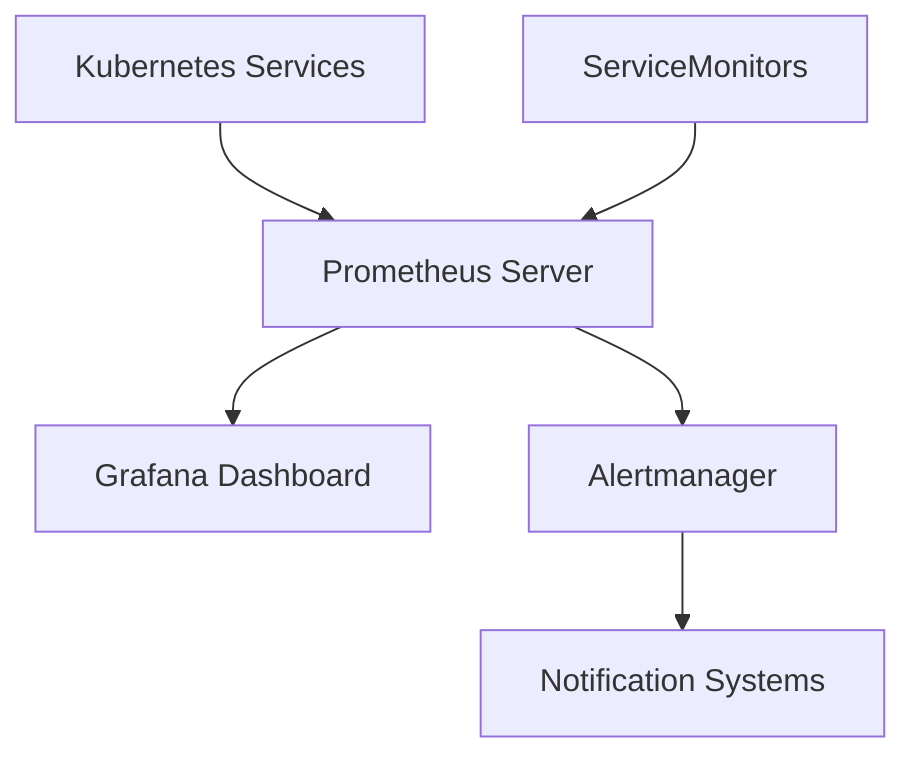

# Prometheus 监控系统演示

## 🎯 概述

Prometheus是云原生生态系统中的核心监控和告警工具包。本演示展示了如何在Kubernetes环境中部署和配置Prometheus监控系统，包括服务发现、指标收集和告警管理。

## 🏗️ 组件架构

### 核心功能
- **主要用途**: Kubernetes集群和应用监控
- **技术栈**: Prometheus + Grafana + Alertmanager
- **部署方式**: Helm Chart或Operator部署

### 组件拓扑


## 🚀 部署指南

### 前置条件
```bash
# 系统要求
- Kubernetes 1.20+
- Helm 3.0+
- 持久化存储支持

# 添加Prometheus Helm仓库
helm repo add prometheus-community https://prometheus-community.github.io/helm-charts
helm repo update
```

### 标准部署
```bash
# 创建监控命名空间
kubectl create namespace monitoring

# 部署Prometheus Stack
helm install prometheus prometheus-community/kube-prometheus-stack \
  --namespace monitoring \
  --set grafana.adminPassword=admin123

# 验证部署
kubectl get pods -n monitoring
```

## 📁 配置文件

### Prometheus配置
```yaml
prometheus:
  prometheusSpec:
    serviceMonitorSelector: {}
    ruleSelector: {}
    retention: 30d
    storageSpec:
      volumeClaimTemplate:
        spec:
          storageClassName: fast-ssd
          resources:
            requests:
              storage: 50Gi
```

### ServiceMonitor配置
```yaml
apiVersion: monitoring.coreos.com/v1
kind: ServiceMonitor
metadata:
  name: my-app-monitor
  namespace: monitoring
spec:
  selector:
    matchLabels:
      app: my-application
  endpoints:
  - port: metrics
    interval: 30s
    path: /metrics
```

### 告警规则
```yaml
apiVersion: monitoring.coreos.com/v1
kind: PrometheusRule
metadata:
  name: app-alerts
  namespace: monitoring
spec:
  groups:
  - name: app.rules
    rules:
    - alert: HighRequestLatency
      expr: job:request_latency_seconds:mean5m{job="myapp"} > 0.5
      for: 10m
      labels:
        severity: page
      annotations:
        summary: High request latency
```

## 🔧 核心功能演示

### 功能1: 指标收集配置
```bash
# 创建应用监控配置
kubectl apply -f app-service-monitor.yaml

# 验证指标收集
kubectl port-forward -n monitoring svc/prometheus-operated 9090:9090
# 访问 http://localhost:9090 查看指标
```

### 功能2: 告警规则测试
```bash
# 应用告警规则
kubectl apply -f alert-rules.yaml

# 测试告警触发
kubectl run test-pod --image=nginx --restart=Never
kubectl delete pod test-pod
```

## 📊 监控与日志

### 指标查询示例
```promql
# CPU使用率
rate(container_cpu_usage_seconds_total[5m])

# 内存使用量
container_memory_usage_bytes

# HTTP请求延迟
histogram_quantile(0.95, rate(http_request_duration_seconds_bucket[5m]))

# Pod重启次数
kube_pod_container_status_restarts_total
```

### 日志查看
```bash
# 查看Prometheus日志
kubectl logs -n monitoring sts/prometheus-prometheus-kube-prometheus-prometheus -c prometheus

# 查看Grafana日志
kubectl logs -n monitoring deploy/prometheus-grafana
```

## 🔍 故障排除

### 常见问题
1. **问题**: 指标无法收集
   - **检查**: `kubectl get servicemonitors -n monitoring`
   - **解决方案**: 验证ServiceMonitor标签选择器和服务端点

2. **问题**: 存储卷挂载失败
   - **检查**: `kubectl describe pvc -n monitoring`
   - **解决方案**: 确认StorageClass存在且配置正确

### 健康检查
```bash
# 检查Prometheus状态
kubectl exec -n monitoring sts/prometheus-prometheus-kube-prometheus-prometheus \
  -- wget -qO- http://localhost:9090/-/healthy

# 检查告警状态
kubectl exec -n monitoring sts/prometheus-prometheus-kube-prometheus-prometheus \
  -- wget -qO- http://localhost:9090/api/v1/alerts
```

## 🧪 测试验证

### 监控测试脚本
```bash
#!/bin/bash
# test-prometheus.sh

echo "Testing Prometheus monitoring setup..."

# 检查Prometheus是否运行
if kubectl get pods -n monitoring -l app.kubernetes.io/name=prometheus | grep Running; then
    echo "✓ Prometheus is running"
else
    echo "✗ Prometheus is not running"
    exit 1
fi

# 测试指标收集
sleep 30
METRICS=$(kubectl exec -n monitoring sts/prometheus-prometheus-kube-prometheus-prometheus \
  -- wget -qO- "http://localhost:9090/api/v1/query?query=up" | jq '.data.result | length')

if [ "$METRICS" -gt 0 ]; then
    echo "✓ Metrics collection working ($METRICS targets)"
else
    echo "✗ No metrics being collected"
fi
```

### 性能基准测试
```bash
# 测试查询性能
kubectl exec -n monitoring sts/prometheus-prometheus-kube-prometheus-prometheus \
  -- promtool query instant 'count(up)' --timeout=30s
```

## 📈 最佳实践

### 资源配置优化
```yaml
resources:
  requests:
    memory: "2Gi"
    cpu: "1"
  limits:
    memory: "4Gi"
    cpu: "2"

# 启用压缩和分片
prometheus:
  prometheusSpec:
    enableFeatures:
    - remote-write-receiver
    shards: 3
```

### 安全配置
```yaml
securityContext:
  runAsNonRoot: true
  runAsUser: 1000
  fsGroup: 2000

# 网络策略
networkPolicy:
  enabled: true
  ingress:
  - from:
    - namespaceSelector:
        matchLabels:
          name: monitoring
```

## 🚀 升级维护

### 版本升级
```bash
# 检查新版本
helm search repo prometheus-community/kube-prometheus-stack

# 执行升级
helm upgrade prometheus prometheus-community/kube-prometheus-stack \
  --namespace monitoring \
  --version 45.6.0 \
  --reuse-values
```

### 数据备份
```bash
# 备份Prometheus数据
kubectl exec -n monitoring sts/prometheus-prometheus-kube-prometheus-prometheus \
  -- tar -czf /tmp/prometheus-backup.tar.gz /prometheus

# 备份配置
kubectl get -n monitoring -o yaml prometheus,prometheusrule,servicemonitor > backup.yaml
```

## 📚 相关资源

### 官方文档
- [Prometheus官方文档](https://prometheus.io/docs/)
- [kube-prometheus项目](https://github.com/prometheus-operator/kube-prometheus)

### 社区资源
- Prometheus社区论坛
- Kubernetes监控最佳实践指南

## 🤝 贡献指南

欢迎提交Issue和Pull Request！

### 贡献流程
1. Fork项目仓库
2. 创建功能分支
3. 提交代码更改
4. 编写测试用例
5. 发起Pull Request

## 📄 许可证

本项目采用 Apache 2.0 许可证

---
*最后更新: 2026年2月3日*