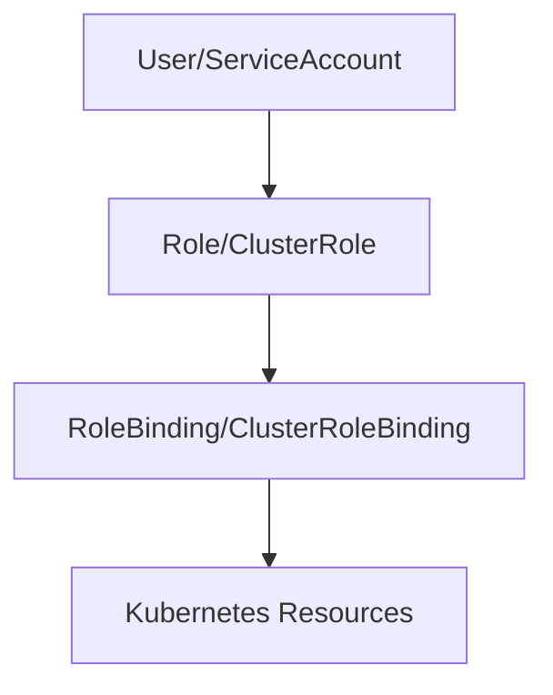

# RBAC 权限管理演示

## 🎯 概述

RBAC (Role-Based Access Control) 是Kubernetes中基于角色的访问控制机制，用于管理用户和服务账户对集群资源的访问权限。本演示展示了如何配置和管理RBAC策略。

## 🏗️ 组件架构

### 核心功能
- **主要用途**: Kubernetes集群访问控制和权限管理
- **技术栈**: Kubernetes RBAC API
- **部署方式**: YAML资源配置

### 组件关系


## 🚀 部署指南

### 前置条件
```bash
# 系统要求
- Kubernetes 1.20+
- kubectl CLI工具
- 启用RBAC授权模式

# 验证RBAC状态
kubectl api-versions | grep rbac
```

### 基础RBAC配置
```bash
# 创建命名空间
kubectl create namespace demo-rbac

# 应用RBAC配置
kubectl apply -f rbac-config.yaml
```

## 📁 配置文件

### Role配置示例
```yaml
apiVersion: rbac.authorization.k8s.io/v1
kind: Role
metadata:
  namespace: demo-rbac
  name: pod-reader
rules:
- apiGroups: [""]
  resources: ["pods"]
  verbs: ["get", "watch", "list"]
- apiGroups: [""]
  resources: ["pods/log"]
  verbs: ["get"]
```

### RoleBinding配置
```yaml
apiVersion: rbac.authorization.k8s.io/v1
kind: RoleBinding
metadata:
  name: read-pods
  namespace: demo-rbac
subjects:
- kind: User
  name: jane
  apiGroup: rbac.authorization.k8s.io
roleRef:
  kind: Role
  name: pod-reader
  apiGroup: rbac.authorization.k8s.io
```

### ServiceAccount配置
```yaml
apiVersion: v1
kind: ServiceAccount
metadata:
  name: demo-sa
  namespace: demo-rbac
```

## 🔧 核心功能演示

### 功能1: 创建只读用户
```bash
# 创建只读Role
kubectl create role reader --verb=get,list,watch --resource=pods,services -n demo-rbac

# 绑定用户到Role
kubectl create rolebinding reader-binding --role=reader --user=john -n demo-rbac

# 验证权限
kubectl auth can-i get pods --as=john -n demo-rbac
```

### 功能2: 创建管理员权限
```bash
# 创建ClusterRole
kubectl create clusterrole admin-role --verb="*" --resource="*"

# 绑定到ServiceAccount
kubectl create clusterrolebinding sa-admin --clusterrole=admin-role --serviceaccount=demo-rbac:demo-sa

# 测试权限
kubectl auth can-i "*" "*" --as=system:serviceaccount:demo-rbac:demo-sa
```

## 📊 监控与日志

### 权限审计
```bash
# 查看RBAC相关事件
kubectl get events --field-selector involvedObject.kind=Role,involvedObject.kind=RoleBinding

# 审计日志查询
kubectl logs -n kube-system -l component=kube-apiserver | grep RBAC
```

### 权限验证工具
```bash
# 检查用户权限
kubectl auth can-i list pods --namespace=demo-rbac --as=jane

# 查看用户拥有的权限
kubectl auth can-i --list --as=jane
```

## 🔍 故障排除

### 常见问题
1. **问题**: 用户无权访问资源
   - **检查**: `kubectl auth can-i get pods --as=username`
   - **解决方案**: 验证RoleBinding配置，确认用户和服务账户映射

2. **问题**: ServiceAccount权限不足
   - **检查**: `kubectl describe serviceaccount demo-sa -n demo-rbac`
   - **解决方案**: 检查对应的RoleBinding和ClusterRoleBinding

### 调试命令
```bash
# 查看所有Roles
kubectl get roles --all-namespaces

# 查看RoleBinding详情
kubectl describe rolebinding read-pods -n demo-rbac

# 测试API访问
kubectl get pods --as=system:serviceaccount:demo-rbac:demo-sa -n demo-rbac
```

## 🧪 测试验证

### 权限测试脚本
```bash
#!/bin/bash
# test-rbac.sh

echo "Testing RBAC permissions..."

# 测试只读用户
echo "Testing reader user..."
if kubectl auth can-i list pods --as=john -n demo-rbac; then
    echo "✓ Reader user has pod list permission"
else
    echo "✗ Reader user lacks pod list permission"
fi

# 测试写权限
echo "Testing writer permissions..."
if kubectl auth can-i create pods --as=jane -n demo-rbac; then
    echo "✓ Writer user has pod create permission"
else
    echo "✗ Writer user lacks pod create permission"
fi
```

### 自动化测试
```bash
# 运行完整测试套件
./test-suite.sh

# 性能压力测试
./stress-test-rbac.sh
```

## 📈 最佳实践

### 最小权限原则
```yaml
# 遵循最小权限原则的Role配置
apiVersion: rbac.authorization.k8s.io/v1
kind: Role
metadata:
  name: minimal-access
rules:
- apiGroups: [""]
  resources: ["pods"]
  verbs: ["get", "list"]  # 仅允许读取，不允许修改
- apiGroups: [""]
  resources: ["pods/exec"]
  verbs: ["create"]       # 仅允许执行命令
```

### 命名规范
```bash
# 推荐的命名约定
roles/
├── namespace-reader.yaml      # 命名空间级别只读权限
├── namespace-writer.yaml      # 命名空间级别写权限
└── cluster-admin.yaml         # 集群管理员权限
```

## 🚀 升级维护

### 权限审计脚本
```bash
#!/bin/bash
# audit-rbac.sh

echo "Auditing RBAC configuration..."

# 检查过度宽松的权限
kubectl get clusterroles -o json | jq '.items[] | select(.rules[].verbs[] == "*")'

# 检查未使用的RoleBindings
kubectl get rolebindings --all-namespaces -o json | jq '.items[] | select(.subjects == null)'
```

### 定期维护
```bash
# 定期清理未使用的RBAC资源
./cleanup-unused-rbac.sh

# 权限审查报告
./generate-rbac-report.sh
```

## 📚 相关资源

### 官方文档
- [Kubernetes RBAC官方文档](https://kubernetes.io/docs/reference/access-authn-authz/rbac/)
- [RBAC最佳实践](https://kubernetes.io/docs/concepts/security/rbac-good-practices/)

### 社区资源
- Kubernetes RBAC GitHub仓库
- RBAC安全配置指南

## 🤝 贡献指南

欢迎提交Issue和Pull Request！

### 贡献流程
1. Fork项目仓库
2. 创建功能分支
3. 提交代码更改
4. 编写测试用例
5. 发起Pull Request

## 📄 许可证

本项目采用 Apache 2.0 许可证

---
*最后更新: 2026年2月3日*