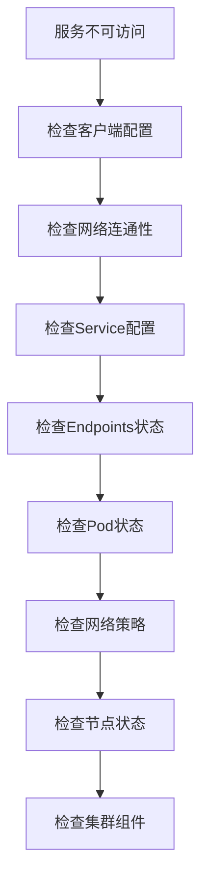

# 🔍 Kubernetes Service故障排查与监控实战

> 系统化的Kubernetes Service故障诊断方法和监控体系建设，涵盖常见问题识别、根因分析、解决方案实施等完整故障处理流程

## 📋 案例概述

本案例提供Kubernetes Service故障排查的系统方法论和监控体系建设指南，帮助运维团队快速定位和解决Service相关问题。

### 🔧 核心技能点

- **故障诊断方法**: 系统性排查流程和工具使用
- **监控体系建设**: 全方位指标收集和告警配置
- **性能分析**: 瓶颈识别和优化建议
- **根因分析**: 深层次问题定位技术
- **自动化运维**: 故障自愈和预防机制

### 🎯 适用人群

- SRE工程师
- DevOps工程师
- 系统管理员
- 技术支持人员

---

## 🚀 快速开始

### 1. 环境准备

```bash
# 创建故障排查测试环境
kubectl create namespace service-troubleshooting

# 部署测试应用和服务
kubectl apply -f troubleshooting-test-app.yaml -n service-troubleshooting
kubectl apply -f problematic-services.yaml -n service-troubleshooting

# 验证初始状态
kubectl get pods,services,endpoints -n service-troubleshooting
```

### 2. 基础诊断工具准备

```bash
# 安装诊断工具
kubectl apply -f diagnostic-tools.yaml -n service-troubleshooting

# 验证工具可用性
kubectl get pods -n service-troubleshooting -l app=diagnostic-tools
```

---

## 📚 故障排查方法论

### 1. 系统性排查流程

遵循"从外到内，从简单到复杂"的排查原则：

```
1. 现象确认 → 2. 范围界定 → 3. 假设验证 → 4. 根因定位 → 5. 解决方案 → 6. 验证修复
```

#### 排查流程图



### 2. 常见故障类型及解决方案

#### 2.1 Service无法访问

**故障现象**: `curl: (7) Failed to connect to service`

**排查步骤**:

```bash
# 1. 检查Service基本信息
kubectl get service <service-name> -n <namespace> -o wide

# 2. 检查Service详细配置
kubectl describe service <service-name> -n <namespace>

# 3. 检查Endpoints状态
kubectl get endpoints <service-name> -n <namespace>

# 4. 检查Pod选择器匹配
kubectl get pods -n <namespace> -l <selector-labels>

# 5. 测试端口连通性
kubectl run debug-pod --image=busybox --rm -it -n <namespace> -- \
  telnet <service-ip> <port>
```

**常见原因及解决方案**:

```yaml
# 原因1: Selector不匹配
apiVersion: v1
kind: Service
metadata:
  name: mismatched-service
  namespace: service-troubleshooting
spec:
  selector:
    app: wrong-label  # 实际Pod标签是 app: correct-app
  ports:
    - protocol: TCP
      port: 80
      targetPort: 8080

# 解决方案: 修正Selector标签
apiVersion: v1
kind: Service
metadata:
  name: fixed-service
  namespace: service-troubleshooting
spec:
  selector:
    app: correct-app  # 与Pod标签匹配
  ports:
    - protocol: TCP
      port: 80
      targetPort: 8080
```

#### 2.2 DNS解析失败

**故障现象**: `Could not resolve host: service-name`

**排查步骤**:

```bash
# 1. 测试DNS解析
kubectl run dns-test --image=busybox --rm -it -n service-troubleshooting -- \
  nslookup <service-name>.<namespace>.svc.cluster.local

# 2. 检查CoreDNS状态
kubectl get pods -n kube-system -l k8s-app=kube-dns

# 3. 验证DNS配置
kubectl get cm coredns -n kube-system -o yaml

# 4. 测试集群DNS
kubectl run dns-debug --image=busybox --rm -it -n service-troubleshooting -- \
  cat /etc/resolv.conf
```

#### 2.3 网络策略阻止访问

**故障现象**: 连接被拒绝或超时

**排查步骤**:

```bash
# 1. 检查网络策略
kubectl get networkpolicies -n service-troubleshooting

# 2. 详细查看策略配置
kubectl describe networkpolicy <policy-name> -n service-troubleshooting

# 3. 测试网络连通性
kubectl run network-test --image=nicolaka/netshoot --rm -it -n service-troubleshooting -- \
  bash

# 在容器内执行网络诊断
# tcpdump -i any host <pod-ip>
# iptables -L -n -v
```

### 3. 高级故障诊断技术

#### 3.1 网络层面诊断

```bash
# 使用netshoot工具进行深度网络分析
apiVersion: apps/v1
kind: Deployment
metadata:
  name: network-diagnostic
  namespace: service-troubleshooting
spec:
  replicas: 1
  selector:
    matchLabels:
      app: network-diagnostic
  template:
    metadata:
      labels:
        app: network-diagnostic
    spec:
      containers:
      - name: netshoot
        image: nicolaka/netshoot
        command: ["/bin/bash"]
        args: ["-c", "while true; do sleep 30; done"]
        securityContext:
          capabilities:
            add: ["NET_ADMIN", "SYS_PTRACE"]
```

**网络诊断命令**:

```bash
# 捕获网络流量
tcpdump -i any -nn host <service-ip> and port <service-port>

# 检查iptables规则
iptables-save | grep <service-name>

# 分析连接跟踪
conntrack -L | grep <service-ip>

# 检查路由表
ip route get <service-ip>
```

#### 3.2 性能瓶颈分析

```bash
# 监控关键性能指标
kubectl top pods -n service-troubleshooting
kubectl top nodes

# 分析资源使用趋势
kubectl get events -n service-troubleshooting --sort-by='.lastTimestamp'

# 检查Pod资源限制
kubectl describe pod <pod-name> -n service-troubleshooting | grep -A 10 "Limits"
```

---

## 📊 监控体系建设

### 1. 核心监控指标

#### Service健康指标

```yaml
# Prometheus监控配置
apiVersion: monitoring.coreos.com/v1
kind: ServiceMonitor
metadata:
  name: service-health-monitor
  namespace: service-troubleshooting
spec:
  selector:
    matchLabels:
      app: monitoring-exporter
  endpoints:
  - port: metrics
    interval: 30s
    path: /metrics
---
apiVersion: v1
kind: Service
metadata:
  name: monitoring-exporter
  namespace: service-troubleshooting
  labels:
    app: monitoring-exporter
  annotations:
    prometheus.io/scrape: "true"
    prometheus.io/port: "8080"
spec:
  selector:
    app: troubleshooting-app
  ports:
    - name: metrics
      port: 8080
      targetPort: 8080
```

#### 关键监控指标定义

```promql
# Service可用性指标
up{job="service-monitor"}

# 请求成功率
rate(http_requests_total{status!~"5.."}[5m]) / rate(http_requests_total[5m])

# 响应时间分布
histogram_quantile(0.95, rate(http_request_duration_seconds_bucket[5m]))

# 连接数监控
kube_service_status_load_balancer_ingress

# Endpoint健康状态
kube_endpoint_address_available

# 错误率监控
rate(http_requests_total{status=~"5.."}[5m])
```

### 2. 智能告警配置

```yaml
# Alertmanager告警规则
apiVersion: monitoring.coreos.com/v1
kind: PrometheusRule
metadata:
  name: service-alert-rules
  namespace: service-troubleshooting
spec:
  groups:
  - name: service.rules
    rules:
    # Service不可用告警
    - alert: ServiceDown
      expr: up{job="service-monitor"} == 0
      for: 2m
      labels:
        severity: critical
        team: sre
      annotations:
        summary: "Service {{ $labels.service }} is down"
        description: "Service has been unavailable for more than 2 minutes"

    # 高错误率告警
    - alert: HighErrorRate
      expr: rate(http_requests_total{status=~"5.."}[5m]) > 0.05
      for: 5m
      labels:
        severity: warning
        team: sre
      annotations:
        summary: "High error rate on {{ $labels.service }}"
        description: "Error rate exceeded 5% threshold"

    # 高延迟告警
    - alert: HighLatency
      expr: histogram_quantile(0.95, rate(http_request_duration_seconds_bucket[5m])) > 2
      for: 5m
      labels:
        severity: warning
        team: sre
      annotations:
        summary: "High latency detected"
        description: "95th percentile response time above 2 seconds"

    # 连接数异常告警
    - alert: ConnectionAnomaly
      expr: rate(tcp_connections_total[5m]) > 1000
      for: 3m
      labels:
        severity: info
        team: sre
      annotations:
        summary: "Unusual connection rate"
        description: "Connection rate spike detected"
```

### 3. 可视化监控面板

```json
{
  "dashboard": {
    "title": "Service Health Overview",
    "panels": [
      {
        "title": "Service Availability",
        "type": "graph",
        "targets": [
          "up{job=\"service-monitor\"}"
        ]
      },
      {
        "title": "Request Rate",
        "type": "graph",
        "targets": [
          "rate(http_requests_total[5m])"
        ]
      },
      {
        "title": "Error Rate",
        "type": "graph",
        "targets": [
          "rate(http_requests_total{status=~\"5..\"}[5m])"
        ]
      },
      {
        "title": "Response Time (95th percentile)",
        "type": "graph",
        "targets": [
          "histogram_quantile(0.95, rate(http_request_duration_seconds_bucket[5m]))"
        ]
      }
    ]
  }
}
```

---

## 🔧 自动化故障处理

### 1. 自愈机制配置

```yaml
apiVersion: apps/v1
kind: Deployment
metadata:
  name: self-healing-controller
  namespace: service-troubleshooting
spec:
  replicas: 1
  selector:
    matchLabels:
      app: self-healing-controller
  template:
    metadata:
      labels:
        app: self-healing-controller
    spec:
      containers:
      - name: controller
        image: self-healing-controller:latest
        env:
        - name: NAMESPACE
          value: "service-troubleshooting"
        - name: CHECK_INTERVAL
          value: "30"
        - name: MAX_RESTARTS
          value: "3"
        - name: ALERTMANAGER_URL
          value: "http://alertmanager:9093"
```

### 2. 故障模拟和测试

```bash
#!/bin/bash
# fault-injection-test.sh

NAMESPACE="service-troubleshooting"

# 模拟Service故障
inject_service_fault() {
    local service_name=$1
    
    echo "Injecting fault for service: $service_name"
    
    # 修改Service配置制造故障
    kubectl patch service $service_name -n $NAMESPACE \
      -p '{"spec":{"selector":{"app":"non-existent"}}}'
    
    # 等待故障生效
    sleep 10
    
    # 验证故障效果
    kubectl get endpoints $service_name -n $NAMESPACE
    
    # 恢复正常配置
    kubectl patch service $service_name -n $NAMESPACE \
      -p '{"spec":{"selector":{"app":"troubleshooting-app"}}}'
}

# 运行故障注入测试
inject_service_fault "problematic-service"
```

---

## 📋 故障处理标准流程

### 1. 故障响应SOP

```
故障发生 → 确认影响范围 → 启动应急响应 → 根因分析 → 实施修复 → 验证恢复 → 复盘改进
```

### 2. 故障记录模板

```markdown
## 故障报告

**故障时间**: 2026-01-30 10:30:00 UTC
**影响范围**: Production services in namespace service-troubleshooting
**故障等级**: P2 - High
**报告人**: SRE Team

### 故障现象
- Service user-service became unreachable
- Error rate increased to 15%
- Response time spiked to 5 seconds

### 排查过程
1. 10:30 - 确认故障现象
2. 10:32 - 检查Service配置 ✓
3. 10:35 - 检查Endpoints状态 ✗ (0 endpoints)
4. 10:38 - 检查Pod状态 ✓ (3/3 Running)
5. 10:40 - 发现标签选择器不匹配
6. 10:42 - 修正Service配置
7. 10:45 - 验证服务恢复正常

### 根因分析
Service selector标签与Pod标签不匹配，导致Endpoints为空

### 解决方案
修正Service配置中的selector标签

### 预防措施
- 实施配置审查流程
- 增加自动化测试
- 完善监控告警
```

---

## 🧪 实践练习

### 练习1：故障模拟演练
故意配置错误的Service，然后按照标准流程进行故障排查和修复。

### 练习2：监控告警配置
配置完整的监控告警体系，确保各类故障都能及时发现和通知。

### 练习3：性能瓶颈分析
对存在性能问题的Service进行深度分析，找出根本原因并提出优化建议。

### 练习4：自动化故障处理
实现简单的故障自愈机制，当检测到特定故障时自动执行修复操作。

---

## 📋 清理资源

```bash
# 删除故障排查环境
kubectl delete namespace service-troubleshooting

# 清理相关资源
kubectl delete servicemonitor --all -n service-troubleshooting
kubectl delete prometheusrule --all -n service-troubleshooting
kubectl delete networkpolicy --all -n service-troubleshooting
```

---

> **💡 提示**: 故障排查是一项需要经验和系统思维的技能，建议结合实际生产环境不断练习和完善排查方法。