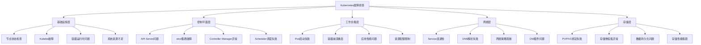

# Kubernetes故障排查综合指南

## 1. 故障排查体系概述

本指南提供系统化的Kubernetes故障排查方法论，涵盖从基础组件到高级场景的完整排查流程。

### 1.1 故障排查思维导图



### 1.2 标准化排查流程

```python
# kubernetes_troubleshooting_framework.py
import subprocess
import json
import time
from typing import Dict, List, Optional, Tuple
from dataclasses import dataclass
from enum import Enum

class TroubleshootingLayer(Enum):
    """故障排查层级"""
    INFRASTRUCTURE = "infrastructure"
    CONTROL_PLANE = "control_plane"
    WORKLOAD = "workload"
    NETWORK = "network"
    STORAGE = "storage"

class IssueSeverity(Enum):
    """问题严重程度"""
    CRITICAL = "critical"
    HIGH = "high"
    MEDIUM = "medium"
    LOW = "low"

@dataclass
class DiagnosticResult:
    """诊断结果"""
    layer: TroubleshootingLayer
    issue_type: str
    severity: IssueSeverity
    description: str
    affected_resources: List[str]
    diagnostic_commands: List[str]
    remediation_steps: List[str]
    verification_commands: List[str]

class KubernetesTroubleshooter:
    """Kubernetes故障排查器"""
    
    def __init__(self):
        self.diagnostic_results = []
        self.cluster_info = {}
        
    def collect_cluster_info(self) -> Dict:
        """收集集群基础信息"""
        info = {}
        
        # 获取集群版本
        try:
            version_output = subprocess.check_output(
                ["kubectl", "version", "--short"], 
                text=True, timeout=30
            )
            info['version'] = version_output.strip()
        except Exception as e:
            info['version_error'] = str(e)
        
        # 获取节点状态
        try:
            nodes_output = subprocess.check_output(
                ["kubectl", "get", "nodes", "-o", "wide"], 
                text=True, timeout=30
            )
            info['nodes'] = nodes_output.strip()
        except Exception as e:
            info['nodes_error'] = str(e)
        
        # 获取命名空间列表
        try:
            namespaces_output = subprocess.check_output(
                ["kubectl", "get", "namespaces"], 
                text=True, timeout=30
            )
            info['namespaces'] = namespaces_output.strip()
        except Exception as e:
            info['namespaces_error'] = str(e)
        
        self.cluster_info = info
        return info
    
    def diagnose_infrastructure_layer(self) -> List[DiagnosticResult]:
        """诊断基础设施层问题"""
        results = []
        
        # 检查节点状态
        node_issues = self._check_node_status()
        if node_issues:
            results.extend(node_issues)
        
        # 检查Kubelet状态
        kubelet_issues = self._check_kubelet_status()
        if kubelet_issues:
            results.extend(kubelet_issues)
        
        # 检查系统资源
        resource_issues = self._check_system_resources()
        if resource_issues:
            results.extend(resource_issues)
        
        return results
    
    def _check_node_status(self) -> List[DiagnosticResult]:
        """检查节点状态"""
        issues = []
        
        try:
            # 获取节点详细信息
            nodes_json = subprocess.check_output(
                ["kubectl", "get", "nodes", "-o", "json"], 
                text=True, timeout=30
            )
            nodes_data = json.loads(nodes_json)
            
            for node in nodes_data.get('items', []):
                node_name = node['metadata']['name']
                conditions = node['status'].get('conditions', [])
                
                # 检查Ready状态
                ready_condition = next(
                    (c for c in conditions if c['type'] == 'Ready'), 
                    None
                )
                
                if not ready_condition or ready_condition['status'] != 'True':
                    issues.append(DiagnosticResult(
                        layer=TroubleshootingLayer.INFRASTRUCTURE,
                        issue_type="node_not_ready",
                        severity=IssueSeverity.HIGH,
                        description=f"Node {node_name} is not Ready",
                        affected_resources=[node_name],
                        diagnostic_commands=[
                            f"kubectl describe node {node_name}",
                            f"kubectl get events --field-selector involvedObject.name={node_name}"
                        ],
                        remediation_steps=[
                            "Check kubelet logs on the node",
                            "Verify node network connectivity",
                            "Check node resource availability"
                        ],
                        verification_commands=[
                            f"kubectl get node {node_name} -o wide"
                        ]
                    ))
                
                # 检查内存压力
                memory_pressure = next(
                    (c for c in conditions if c['type'] == 'MemoryPressure'), 
                    None
                )
                if memory_pressure and memory_pressure['status'] == 'True':
                    issues.append(DiagnosticResult(
                        layer=TroubleshootingLayer.INFRASTRUCTURE,
                        issue_type="memory_pressure",
                        severity=IssueSeverity.MEDIUM,
                        description=f"Node {node_name} experiencing memory pressure",
                        affected_resources=[node_name],
                        diagnostic_commands=[
                            f"kubectl describe node {node_name}",
                            "free -h",
                            "top -b -n1 | head -20"
                        ],
                        remediation_steps=[
                            "Identify memory-intensive pods",
                            "Consider node scaling or pod eviction",
                            "Optimize application memory usage"
                        ],
                        verification_commands=[
                            f"kubectl top node {node_name}"
                        ]
                    ))
        
        except Exception as e:
            issues.append(DiagnosticResult(
                layer=TroubleshootingLayer.INFRASTRUCTURE,
                issue_type="diagnostic_failure",
                severity=IssueSeverity.LOW,
                description=f"Failed to check node status: {str(e)}",
                affected_resources=[],
                diagnostic_commands=["kubectl get nodes"],
                remediation_steps=["Ensure kubectl is properly configured"],
                verification_commands=[]
            ))
        
        return issues
    
    def _check_kubelet_status(self) -> List[DiagnosticResult]:
        """检查Kubelet状态"""
        issues = []
        
        try:
            # 检查Kubelet进程
            kubelet_check = subprocess.run(
                ["systemctl", "is-active", "kubelet"],
                capture_output=True, text=True, timeout=30
            )
            
            if kubelet_check.returncode != 0:
                issues.append(DiagnosticResult(
                    layer=TroubleshootingLayer.INFRASTRUCTURE,
                    issue_type="kubelet_down",
                    severity=IssueSeverity.CRITICAL,
                    description="Kubelet service is not running",
                    affected_resources=["kubelet"],
                    diagnostic_commands=[
                        "systemctl status kubelet",
                        "journalctl -u kubelet -n 50"
                    ],
                    remediation_steps=[
                        "Restart kubelet service: systemctl restart kubelet",
                        "Check kubelet configuration files",
                        "Verify kubelet certificates validity"
                    ],
                    verification_commands=[
                        "systemctl is-active kubelet"
                    ]
                ))
        
        except Exception as e:
            issues.append(DiagnosticResult(
                layer=TroubleshootingLayer.INFRASTRUCTURE,
                issue_type="kubelet_check_failed",
                severity=IssueSeverity.LOW,
                description=f"Failed to check kubelet status: {str(e)}",
                affected_resources=[],
                diagnostic_commands=["systemctl status kubelet"],
                remediation_steps=["Check system permissions"],
                verification_commands=[]
            ))
        
        return issues
    
    def _check_system_resources(self) -> List[DiagnosticResult]:
        """检查系统资源"""
        issues = []
        
        try:
            # 检查磁盘使用率
            df_output = subprocess.check_output(
                ["df", "-h"], text=True, timeout=30
            )
            
            # 简单的磁盘使用率检查（超过85%报警）
            lines = df_output.strip().split('\n')[1:]  # 跳过标题行
            for line in lines:
                parts = line.split()
                if len(parts) >= 5:
                    usage_str = parts[4].rstrip('%')
                    filesystem = parts[0]
                    try:
                        usage_percent = int(usage_str)
                        if usage_percent > 85:
                            issues.append(DiagnosticResult(
                                layer=TroubleshootingLayer.INFRASTRUCTURE,
                                issue_type="disk_space_low",
                                severity=IssueSeverity.HIGH if usage_percent > 95 else IssueSeverity.MEDIUM,
                                description=f"Disk {filesystem} usage is {usage_percent}%",
                                affected_resources=[filesystem],
                                diagnostic_commands=[
                                    f"df -h {filesystem}",
                                    "du -sh /* 2>/dev/null | sort -hr | head -10"
                                ],
                                remediation_steps=[
                                    "Clean up unused files and logs",
                                    "Remove old container images",
                                    "Consider expanding disk space"
                                ],
                                verification_commands=[
                                    "df -h"
                                ]
                            ))
                    except ValueError:
                        continue
        
        except Exception as e:
            issues.append(DiagnosticResult(
                layer=TroubleshootingLayer.INFRASTRUCTURE,
                issue_type="resource_check_failed",
                severity=IssueSeverity.LOW,
                description=f"Failed to check system resources: {str(e)}",
                affected_resources=[],
                diagnostic_commands=["df -h", "free -h"],
                remediation_steps=["Manual resource inspection required"],
                verification_commands=[]
            ))
        
        return issues
    
    def diagnose_control_plane_layer(self) -> List[DiagnosticResult]:
        """诊断控制平面层问题"""
        results = []
        
        # 检查API Server
        api_issues = self._check_api_server()
        if api_issues:
            results.extend(api_issues)
        
        # 检查etcd集群
        etcd_issues = self._check_etcd_cluster()
        if etcd_issues:
            results.extend(etcd_issues)
        
        return results
    
    def _check_api_server(self) -> List[DiagnosticResult]:
        """检查API Server"""
        issues = []
        
        try:
            # 检查API Server健康状态
            health_check = subprocess.run(
                ["kubectl", "get", "--raw", "/healthz"],
                capture_output=True, text=True, timeout=30
            )
            
            if health_check.returncode != 0 or health_check.stdout.strip() != "ok":
                issues.append(DiagnosticResult(
                    layer=TroubleshootingLayer.CONTROL_PLANE,
                    issue_type="api_server_unhealthy",
                    severity=IssueSeverity.CRITICAL,
                    description="API Server health check failed",
                    affected_resources=["api-server"],
                    diagnostic_commands=[
                        "kubectl get componentstatuses",
                        "kubectl get pods -n kube-system | grep apiserver"
                    ],
                    remediation_steps=[
                        "Check API Server pod logs",
                        "Verify API Server certificates",
                        "Review API Server configuration"
                    ],
                    verification_commands=[
                        "kubectl get --raw /healthz"
                    ]
                ))
        
        except Exception as e:
            issues.append(DiagnosticResult(
                layer=TroubleshootingLayer.CONTROL_PLANE,
                issue_type="api_server_check_failed",
                severity=IssueSeverity.HIGH,
                description=f"Failed to check API Server: {str(e)}",
                affected_resources=[],
                diagnostic_commands=["kubectl cluster-info"],
                remediation_steps=["Verify kubectl configuration"],
                verification_commands=[]
            ))
        
        return issues
    
    def _check_etcd_cluster(self) -> List[DiagnosticResult]:
        """检查etcd集群"""
        issues = []
        
        try:
            # 检查etcd pod状态
            etcd_pods = subprocess.check_output(
                ["kubectl", "get", "pods", "-n", "kube-system", "-l", "component=etcd"],
                text=True, timeout=30
            )
            
            if "Running" not in etcd_pods:
                issues.append(DiagnosticResult(
                    layer=TroubleshootingLayer.CONTROL_PLANE,
                    issue_type="etcd_unhealthy",
                    severity=IssueSeverity.CRITICAL,
                    description="etcd pods are not running properly",
                    affected_resources=["etcd"],
                    diagnostic_commands=[
                        "kubectl get pods -n kube-system -l component=etcd",
                        "kubectl logs -n kube-system -l component=etcd --tail=50"
                    ],
                    remediation_steps=[
                        "Check etcd pod logs for errors",
                        "Verify etcd certificates",
                        "Review etcd cluster member status"
                    ],
                    verification_commands=[
                        "kubectl get pods -n kube-system -l component=etcd"
                    ]
                ))
        
        except Exception as e:
            issues.append(DiagnosticResult(
                layer=TroubleshootingLayer.CONTROL_PLANE,
                issue_type="etcd_check_failed",
                severity=IssueSeverity.HIGH,
                description=f"Failed to check etcd cluster: {str(e)}",
                affected_resources=[],
                diagnostic_commands=["kubectl get pods -n kube-system"],
                remediation_steps=["Manual etcd inspection required"],
                verification_commands=[]
            ))
        
        return issues
    
    def run_comprehensive_diagnosis(self) -> Dict:
        """运行综合诊断"""
        print("🚀 Starting comprehensive Kubernetes diagnosis...")
        
        # 收集集群信息
        print("📋 Collecting cluster information...")
        cluster_info = self.collect_cluster_info()
        
        # 按层级进行诊断
        print("🔍 Diagnosing infrastructure layer...")
        infra_issues = self.diagnose_infrastructure_layer()
        
        print("🔍 Diagnosing control plane layer...")
        control_plane_issues = self.diagnose_control_plane_layer()
        
        # 合并所有诊断结果
        all_issues = infra_issues + control_plane_issues
        self.diagnostic_results = all_issues
        
        # 生成诊断报告
        report = self._generate_diagnostic_report(cluster_info, all_issues)
        
        return report
    
    def _generate_diagnostic_report(self, cluster_info: Dict, issues: List[DiagnosticResult]) -> Dict:
        """生成诊断报告"""
        # 按严重程度分类
        critical_issues = [issue for issue in issues if issue.severity == IssueSeverity.CRITICAL]
        high_issues = [issue for issue in issues if issue.severity == IssueSeverity.HIGH]
        medium_issues = [issue for issue in issues if issue.severity == IssueSeverity.MEDIUM]
        low_issues = [issue for issue in issues if issue.severity == IssueSeverity.LOW]
        
        # 按层级分类
        issues_by_layer = {}
        for issue in issues:
            layer_name = issue.layer.value
            if layer_name not in issues_by_layer:
                issues_by_layer[layer_name] = []
            issues_by_layer[layer_name].append(issue)
        
        report = {
            "timestamp": time.strftime('%Y-%m-%d %H:%M:%S'),
            "cluster_info": cluster_info,
            "summary": {
                "total_issues": len(issues),
                "critical": len(critical_issues),
                "high": len(high_issues),
                "medium": len(medium_issues),
                "low": len(low_issues)
            },
            "issues_by_severity": {
                "critical": [self._serialize_issue(issue) for issue in critical_issues],
                "high": [self._serialize_issue(issue) for issue in high_issues],
                "medium": [self._serialize_issue(issue) for issue in medium_issues],
                "low": [self._serialize_issue(issue) for issue in low_issues]
            },
            "issues_by_layer": {
                layer: [self._serialize_issue(issue) for issue in layer_issues]
                for layer, layer_issues in issues_by_layer.items()
            },
            "recommendations": self._generate_recommendations(issues)
        }
        
        return report
    
    def _serialize_issue(self, issue: DiagnosticResult) -> Dict:
        """序列化诊断结果"""
        return {
            "layer": issue.layer.value,
            "issue_type": issue.issue_type,
            "severity": issue.severity.value,
            "description": issue.description,
            "affected_resources": issue.affected_resources,
            "diagnostic_commands": issue.diagnostic_commands,
            "remediation_steps": issue.remediation_steps,
            "verification_commands": issue.verification_commands
        }
    
    def _generate_recommendations(self, issues: List[DiagnosticResult]) -> List[str]:
        """生成修复建议"""
        recommendations = []
        
        # 基于发现的问题生成针对性建议
        if any(issue.layer == TroubleshootingLayer.INFRASTRUCTURE for issue in issues):
            recommendations.append("🔧 优先解决基础设施层问题，确保节点和Kubelet正常运行")
        
        if any(issue.layer == TroubleshootingLayer.CONTROL_PLANE for issue in issues):
            recommendations.append("⚙️  控制平面问题需要立即关注，可能影响整个集群稳定性")
        
        # 添加通用建议
        recommendations.extend([
            "📊 建立完善的监控告警体系",
            "📝 制定标准的故障排查流程",
            "📚 定期进行故障演练和培训",
            "🔄 建立自动化的故障恢复机制"
        ])
        
        return recommendations

# 使用示例
def main():
    troubleshooter = KubernetesTroubleshooter()
    
    # 运行综合诊断
    report = troubleshooter.run_comprehensive_diagnosis()
    
    # 输出诊断报告
    print("\n" + "="*60)
    print("📋 KUBERNETES DIAGNOSTIC REPORT")
    print("="*60)
    
    print(f"\n⏰ Timestamp: {report['timestamp']}")
    print(f"📊 Summary: {report['summary']['total_issues']} issues found")
    print(f"  Critical: {report['summary']['critical']}")
    print(f"  High: {report['summary']['high']}")
    print(f"  Medium: {report['summary']['medium']}")
    print(f"  Low: {report['summary']['low']}")
    
    # 显示按严重程度分类的问题
    for severity in ['critical', 'high', 'medium', 'low']:
        issues = report['issues_by_severity'][severity]
        if issues:
            print(f"\n🔴 {severity.upper()} Issues ({len(issues)}):")
            for i, issue in enumerate(issues, 1):
                print(f"  {i}. [{issue['layer']}] {issue['description']}")
                print(f"     Resources: {', '.join(issue['affected_resources'])}")
    
    # 显示修复建议
    print(f"\n💡 Recommendations:")
    for i, rec in enumerate(report['recommendations'], 1):
        print(f"  {i}. {rec}")

if __name__ == "__main__":
    main()
```

## 2. 常见故障场景及解决方案

### 2.1 Pod相关故障

```yaml
# pod-troubleshooting-cheatsheet.yaml
apiVersion: v1
kind: ConfigMap
metadata:
  name: pod-troubleshooting-guide
  namespace: default
data:
  common-pod-issues: |
    # Pod常见问题排查清单
    
    ## 1. Pod处于Pending状态
    ### 诊断命令:
    kubectl describe pod <pod-name>
    kubectl get events --field-selector involvedObject.name=<pod-name>
    
    ### 常见原因:
    - 资源配额不足
    - 节点选择器不匹配
    - 持久化存储绑定失败
    - 镜像拉取失败
    
    ### 解决方案:
    ```yaml
    # 调整资源请求
    resources:
      requests:
        cpu: "100m"
        memory: "128Mi"
      limits:
        cpu: "500m"
        memory: "512Mi"
    ```
    
    ## 2. Pod不断重启
    ### 诊断命令:
    kubectl logs <pod-name> --previous
    kubectl describe pod <pod-name>
    
    ### 常见原因:
    - 应用启动失败
    - 健康检查失败
    - 资源限制过低
    - 配置错误
    
    ### 解决方案:
    ```yaml
    # 调整健康检查配置
    livenessProbe:
      httpGet:
        path: /health
        port: 8080
      initialDelaySeconds: 60
      periodSeconds: 10
      timeoutSeconds: 5
      failureThreshold: 3
    ```
    
    ## 3. Pod CrashLoopBackOff
    ### 诊断命令:
    kubectl logs <pod-name> --previous
    kubectl exec -it <pod-name> -- /bin/sh
    
    ### 常见原因:
    - 应用代码错误
    - 依赖服务不可用
    - 环境变量配置错误
    - 权限不足
    
    ### 解决方案:
    ```yaml
    # 添加调试配置
    env:
    - name: DEBUG
      value: "true"
    - name: LOG_LEVEL
      value: "debug"
    ```

  debugging-tools: |
    # 实用调试工具集合
    
    ## 1. 临时调试容器
    kubectl debug <pod-name> -it --image=busybox --target=<container-name>
    
    ## 2. 端口转发调试
    kubectl port-forward <pod-name> 8080:8080
    
    ## 3. 资源使用情况
    kubectl top pod <pod-name>
    kubectl top node
    
    ## 4. 网络连通性测试
    kubectl exec -it <pod-name> -- ping google.com
    kubectl exec -it <pod-name> -- nslookup kubernetes.default
    
    ## 5. 文件系统检查
    kubectl exec -it <pod-name> -- df -h
    kubectl exec -it <pod-name> -- du -sh /app/logs/

# 故障排查脚本集合
# troubleshooting-scripts.sh
#!/bin/bash

# Pod故障快速诊断脚本
diagnose_pod() {
    local pod_name=$1
    local namespace=${2:-default}
    
    echo "🔍 Diagnosing pod: $pod_name in namespace: $namespace"
    echo "==========================================="
    
    # 1. 基本状态检查
    echo "1. Pod status:"
    kubectl get pod "$pod_name" -n "$namespace" -o wide
    
    # 2. 详细描述
    echo -e "\n2. Pod description:"
    kubectl describe pod "$pod_name" -n "$namespace"
    
    # 3. 相关事件
    echo -e "\n3. Recent events:"
    kubectl get events -n "$namespace" --field-selector involvedObject.name="$pod_name" --sort-by='.lastTimestamp'
    
    # 4. 容器日志
    echo -e "\n4. Container logs:"
    kubectl logs "$pod_name" -n "$namespace" --tail=50
    
    # 5. 上一次容器日志（如果重启过）
    echo -e "\n5. Previous container logs (if available):"
    kubectl logs "$pod_name" -n "$namespace" --previous --tail=50 2>/dev/null || echo "No previous logs available"
    
    # 6. 资源使用情况
    echo -e "\n6. Resource usage:"
    kubectl top pod "$pod_name" -n "$namespace" 2>/dev/null || echo "Metrics server not available"
}

# 节点故障诊断脚本
diagnose_node() {
    local node_name=$1
    
    echo "🔍 Diagnosing node: $node_name"
    echo "================================"
    
    # 1. 节点基本状态
    echo "1. Node status:"
    kubectl get node "$node_name" -o wide
    
    # 2. 节点详细信息
    echo -e "\n2. Node details:"
    kubectl describe node "$node_name"
    
    # 3. 节点上的Pods
    echo -e "\n3. Pods on this node:"
    kubectl get pods -A -o wide --field-selector spec.nodeName="$node_name"
    
    # 4. 节点资源使用
    echo -e "\n4. Node resource usage:"
    kubectl top node "$node_name" 2>/dev/null || echo "Metrics server not available"
}

# 网络故障诊断脚本
diagnose_network() {
    echo "🔍 Network diagnostics"
    echo "======================"
    
    # 1. DNS解析测试
    echo "1. DNS resolution test:"
    kubectl run -it --rm debug-pod --image=busybox --restart=Never -- sh -c "nslookup kubernetes.default"
    
    # 2. 服务连通性测试
    echo -e "\n2. Service connectivity test:"
    kubectl run -it --rm debug-pod --image=busybox --restart=Never -- sh -c "wget -qO- http://kubernetes.default"
    
    # 3. 网络策略检查
    echo -e "\n3. Network policies:"
    kubectl get networkpolicies -A
    
    # 4. CoreDNS状态
    echo -e "\n4. CoreDNS status:"
    kubectl get pods -n kube-system -l k8s-app=kube-dns
}

# 使用示例
echo "Kubernetes Troubleshooting Toolkit"
echo "=================================="
echo "Usage:"
echo "  diagnose_pod <pod-name> [namespace]"
echo "  diagnose_node <node-name>"
echo "  diagnose_network"
```

## 3. 监控告警配置

### 3.1 Prometheus告警规则

```yaml
# kubernetes-alerts.yaml
apiVersion: monitoring.coreos.com/v1
kind: PrometheusRule
metadata:
  name: kubernetes-troubleshooting-alerts
  namespace: monitoring
spec:
  groups:
  - name: kubernetes.node
    rules:
    - alert: NodeNotReady
      expr: kube_node_status_condition{condition="Ready",status="true"} == 0
      for: 5m
      labels:
        severity: critical
      annotations:
        summary: "Node {{ $labels.node }} is not ready"
        description: "Node has been unready for more than 5 minutes"
    
    - alert: NodeMemoryPressure
      expr: kube_node_status_condition{condition="MemoryPressure",status="true"} == 1
      for: 2m
      labels:
        severity: warning
      annotations:
        summary: "Node {{ $labels.node }} has memory pressure"
        description: "Node is experiencing memory pressure"
    
    - alert: NodeDiskPressure
      expr: kube_node_status_condition{condition="DiskPressure",status="true"} == 1
      for: 2m
      labels:
        severity: warning
      annotations:
        summary: "Node {{ $labels.node }} has disk pressure"
        description: "Node is experiencing disk pressure"
  
  - name: kubernetes.pod
    rules:
    - alert: PodCrashLooping
      expr: rate(kube_pod_container_status_restarts_total[5m]) > 0.1
      for: 10m
      labels:
        severity: warning
      annotations:
        summary: "Pod {{ $labels.pod }} is crash looping"
        description: "Pod is restarting more than 6 times per hour"
    
    - alert: PodPending
      expr: kube_pod_status_phase{phase="Pending"} == 1
      for: 10m
      labels:
        severity: warning
      annotations:
        summary: "Pod {{ $labels.pod }} is stuck in Pending"
        description: "Pod has been pending for more than 10 minutes"
    
    - alert: PodNotReady
      expr: kube_pod_status_ready{condition="true"} == 0
      for: 5m
      labels:
        severity: warning
      annotations:
        summary: "Pod {{ $labels.pod }} is not ready"
        description: "Pod has been not ready for more than 5 minutes"
  
  - name: kubernetes.controlplane
    rules:
    - alert: APIServerDown
      expr: up{job="apiserver"} == 0
      for: 2m
      labels:
        severity: critical
      annotations:
        summary: "API Server is down"
        description: "Kubernetes API Server is unreachable"
    
    - alert: EtcdUnavailable
      expr: up{job="etcd"} == 0
      for: 2m
      labels:
        severity: critical
      annotations:
        summary: "etcd is unavailable"
        description: "etcd cluster is not responding"
    
    - alert: SchedulerDown
      expr: up{job="scheduler"} == 0
      for: 2m
      labels:
        severity: critical
      annotations:
        summary: "Scheduler is down"
        description: "Kubernetes scheduler is not running"
```

### 3.2 Grafana故障排查仪表板

```json
{
  "dashboard": {
    "id": null,
    "title": "Kubernetes Troubleshooting Dashboard",
    "timezone": "browser",
    "panels": [
      {
        "type": "stat",
        "title": "Cluster Health Overview",
        "gridPos": {"h": 6, "w": 8, "x": 0, "y": 0},
        "targets": [
          {
            "expr": "sum(kube_node_status_condition{condition=\"Ready\",status=\"true\"})",
            "legendFormat": "Ready Nodes"
          },
          {
            "expr": "count(kube_pod_status_phase{phase=\"Running\"})",
            "legendFormat": "Running Pods"
          },
          {
            "expr": "sum(up{job=\"apiserver\"})",
            "legendFormat": "API Servers Up"
          }
        ]
      },
      {
        "type": "graph",
        "title": "Node Resource Usage",
        "gridPos": {"h": 8, "w": 12, "x": 0, "y": 6},
        "targets": [
          {
            "expr": "100 - (avg(rate(node_cpu_seconds_total{mode=\"idle\"}[5m])) * 100)",
            "legendFormat": "CPU Usage %"
          },
          {
            "expr": "(node_memory_MemTotal_bytes - node_memory_MemAvailable_bytes) / node_memory_MemTotal_bytes * 100",
            "legendFormat": "Memory Usage %"
          }
        ]
      },
      {
        "type": "table",
        "title": "Recent Pod Issues",
        "gridPos": {"h": 8, "w": 12, "x": 0, "y": 14},
        "targets": [
          {
            "expr": "kube_pod_container_status_restarts_total > 0",
            "format": "table"
          }
        ]
      }
    ]
  }
}
```

这个综合故障排查指南提供了系统化的问题诊断方法、实用的排查工具和监控告警配置，帮助运维人员快速定位和解决Kubernetes集群中的各种问题。